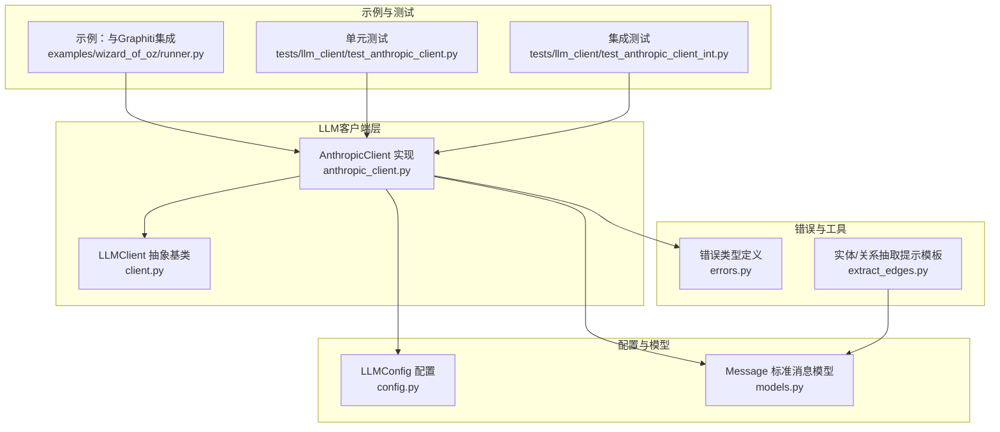
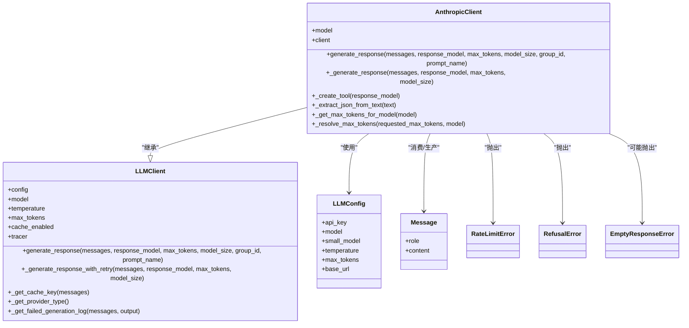
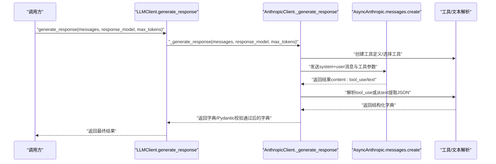
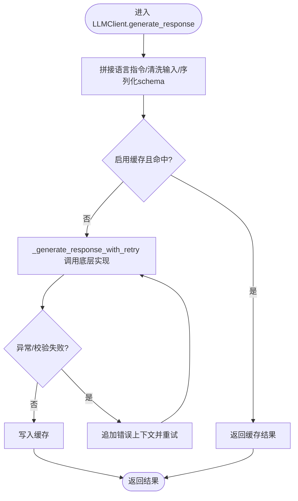
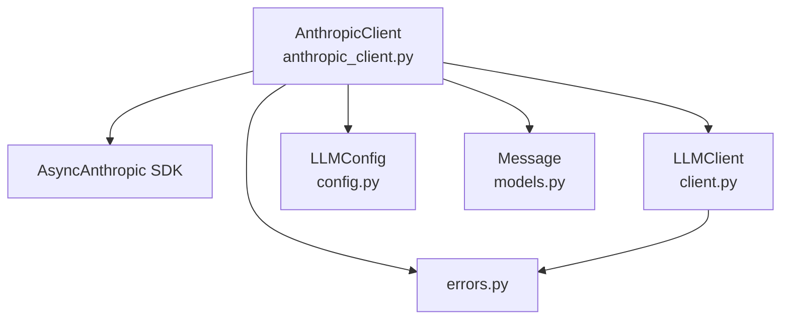

# Anthropic集成

<cite>
**本文引用的文件**
- [anthropic_client.py](file://graphiti_core/llm_client/anthropic_client.py)
- [client.py](file://graphiti_core/llm_client/client.py)
- [config.py](file://graphiti_core/llm_client/config.py)
- [errors.py](file://graphiti_core/llm_client/errors.py)
- [models.py](file://graphiti_core/prompts/models.py)
- [extract_edges.py](file://graphiti_core/prompts/extract_edges.py)
- [runner.py](file://examples/wizard_of_oz/runner.py)
- [test_anthropic_client.py](file://tests/llm_client/test_anthropic_client.py)
- [test_anthropic_client_int.py](file://tests/llm_client/test_anthropic_client_int.py)
</cite>

## 目录
1. [简介](#简介)
2. [项目结构](#项目结构)
3. [核心组件](#核心组件)
4. [架构总览](#架构总览)
5. [详细组件分析](#详细组件分析)
6. [依赖关系分析](#依赖关系分析)
7. [性能考量](#性能考量)
8. [故障排查指南](#故障排查指南)
9. [结论](#结论)
10. [附录](#附录)

## 简介
本文件面向希望在Graphiti框架中集成并使用Anthropic Claude模型的开发者，系统性地说明AnthropicClient的实现细节、配置方法、模型支持范围、消息格式转换与响应解析、错误处理与重试策略，并结合知识图谱构建流程给出高精度实体识别与关系抽取的实践建议。同时，文档还讨论了成本考量与模型选择建议，帮助在长上下文与复杂推理任务中做出合理决策。

## 项目结构
与Anthropic集成直接相关的代码位于graphiti_core/llm_client子模块，核心文件包括：
- AnthropicClient实现：graphiti_core/llm_client/anthropic_client.py
- LLMClient抽象基类与通用能力：graphiti_core/llm_client/client.py
- 配置对象与默认参数：graphiti_core/llm_client/config.py
- 错误类型定义：graphiti_core/llm_client/errors.py
- 标准消息模型：graphiti_core/prompts/models.py
- 知识图谱提示模板（用于实体/关系抽取）：graphiti_core/prompts/extract_edges.py
- 使用示例（与Graphiti集成）：examples/wizard_of_oz/runner.py
- 单元测试与集成测试：tests/llm_client/test_anthropic_client.py、tests/llm_client/test_anthropic_client_int.py

图表来源
- [anthropic_client.py](file://graphiti_core/llm_client/anthropic_client.py#L103-L150)
- [client.py](file://graphiti_core/llm_client/client.py#L66-L121)
- [config.py](file://graphiti_core/llm_client/config.py#L23-L69)
- [models.py](file://graphiti_core/prompts/models.py#L23-L33)
- [errors.py](file://graphiti_core/llm_client/errors.py#L18-L40)
- [extract_edges.py](file://graphiti_core/prompts/extract_edges.py#L25-L137)
- [runner.py](file://examples/wizard_of_oz/runner.py#L60-L62)
- [test_anthropic_client.py](file://tests/llm_client/test_anthropic_client.py#L64-L101)
- [test_anthropic_client_int.py](file://tests/llm_client/test_anthropic_client_int.py#L27-L32)

章节来源
- [anthropic_client.py](file://graphiti_core/llm_client/anthropic_client.py#L103-L150)
- [client.py](file://graphiti_core/llm_client/client.py#L66-L121)
- [config.py](file://graphiti_core/llm_client/config.py#L23-L69)
- [models.py](file://graphiti_core/prompts/models.py#L23-L33)
- [errors.py](file://graphiti_core/llm_client/errors.py#L18-L40)
- [extract_edges.py](file://graphiti_core/prompts/extract_edges.py#L25-L137)
- [runner.py](file://examples/wizard_of_oz/runner.py#L60-L62)
- [test_anthropic_client.py](file://tests/llm_client/test_anthropic_client.py#L64-L101)
- [test_anthropic_client_int.py](file://tests/llm_client/test_anthropic_client_int.py#L27-L32)

## 核心组件
- AnthropicClient：基于AsyncAnthropic的消息接口封装，统一调用Anthropic API，负责消息格式转换、工具调用、响应解析与错误处理。
- LLMClient：抽象基类，提供统一的生成流程、缓存、追踪、输入清洗、多轮重试策略等通用能力。
- LLMConfig：集中管理API密钥、模型名、温度、最大输出token等配置项。
- Message：标准消息结构，贯穿整个LLM交互链路。
- 错误类型：RateLimitError、RefusalError、EmptyResponseError，分别对应限流、内容拒绝与空响应等场景。
- 提示模板：extract_edges.py中的Edge/ExtractedEdges等Pydantic模型与提示函数，为知识图谱构建提供结构化输出指导。

章节来源
- [anthropic_client.py](file://graphiti_core/llm_client/anthropic_client.py#L103-L150)
- [client.py](file://graphiti_core/llm_client/client.py#L66-L121)
- [config.py](file://graphiti_core/llm_client/config.py#L23-L69)
- [models.py](file://graphiti_core/prompts/models.py#L23-L33)
- [errors.py](file://graphiti_core/llm_client/errors.py#L18-L40)
- [extract_edges.py](file://graphiti_core/prompts/extract_edges.py#L25-L137)

## 架构总览
下图展示了AnthropicClient在整体架构中的位置以及与LLMClient、配置、消息模型及错误类型的交互关系。

图表来源
- [anthropic_client.py](file://graphiti_core/llm_client/anthropic_client.py#L103-L150)
- [client.py](file://graphiti_core/llm_client/client.py#L66-L121)
- [config.py](file://graphiti_core/llm_client/config.py#L23-L69)
- [models.py](file://graphiti_core/prompts/models.py#L23-L33)
- [errors.py](file://graphiti_core/llm_client/errors.py#L18-L40)

## 详细组件分析

### AnthropicClient实现要点
- 初始化与配置
  - 若未传入配置，会从环境变量读取API密钥；若未指定模型，则使用默认模型。
  - 默认模型为Claude Haiku 4.5系列最新版本，确保在大多数场景下具备较好的性价比与速度。
  - 支持传入自定义AsyncAnthropic实例，便于测试或复用连接。
- 消息格式转换
  - 输入messages列表首条作为system消息，其余作为user消息，转换为Anthropic的MessageParam格式。
  - 通过工具调用（tool use）强制结构化输出，优先从tool_use中提取参数字典；若无工具调用则尝试从text中提取JSON。
- 响应解析
  - 工具调用成功时返回工具参数字典；否则尝试从文本中提取JSON对象；均失败则抛出异常。
  - 当response_model存在时，先按工具/文本提取得到的字典进行Pydantic校验，校验失败将触发重试。
- 错误处理与重试
  - 对429（速率限制）与内容政策拒绝（RefusalError）进行特殊处理，不参与自动重试，避免浪费额度与无效请求。
  - 其他异常（含校验失败）采用最多两次重试，重试时将上次错误信息作为额外上下文追加到用户消息中，提升模型修正能力。
- Token上限与模型选择
  - 不同模型的最大输出token上限不同，实现中维护映射表；若未命中映射，默认上限为8192。
  - 优先使用模型级上限，其次实例级配置，最后显式参数，形成清晰的优先级顺序。

图表来源
- [anthropic_client.py](file://graphiti_core/llm_client/anthropic_client.py#L254-L332)
- [client.py](file://graphiti_core/llm_client/client.py#L149-L214)

章节来源
- [anthropic_client.py](file://graphiti_core/llm_client/anthropic_client.py#L122-L149)
- [anthropic_client.py](file://graphiti_core/llm_client/anthropic_client.py#L177-L214)
- [anthropic_client.py](file://graphiti_core/llm_client/anthropic_client.py#L215-L253)
- [anthropic_client.py](file://graphiti_core/llm_client/anthropic_client.py#L254-L332)
- [anthropic_client.py](file://graphiti_core/llm_client/anthropic_client.py#L333-L430)

### LLMClient通用能力
- 统一入口：generate_response负责拼接提示、语言指令、输入清洗、缓存、追踪与重试。
- 缓存：可选磁盘缓存，命中后直接返回，未命中再调用底层实现。
- 追踪：通过span记录provider、模型尺寸、最大token、是否启用缓存等属性。
- 多轮重试：对服务器错误与限流错误进行指数退避重试，最多四次；对验证错误进行专用的“错误上下文”重试。

图表来源
- [client.py](file://graphiti_core/llm_client/client.py#L149-L214)

章节来源
- [client.py](file://graphiti_core/llm_client/client.py#L66-L121)
- [client.py](file://graphiti_core/llm_client/client.py#L149-L214)

### 配置与模型支持
- API密钥：可通过LLMConfig.api_key或环境变量ANTHROPIC_API_KEY注入。
- 默认模型：当未指定模型时，默认使用Claude Haiku 4.5 latest。
- 支持模型：实现中列举了Claude 4.5、3.7、3.5、3、2系列的多个版本名称，覆盖不同上下文长度与能力。
- 上限映射：针对各模型的最大输出token进行映射，未命中时回退至默认值。

章节来源
- [anthropic_client.py](file://graphiti_core/llm_client/anthropic_client.py#L49-L101)
- [anthropic_client.py](file://graphiti_core/llm_client/anthropic_client.py#L122-L149)
- [config.py](file://graphiti_core/llm_client/config.py#L23-L69)

### 消息格式转换与响应解析
- 消息转换：首条Message作为system，其余转为Anthropic的MessageParam列表。
- 工具调用：优先使用工具参数输出，若无工具调用则尝试从text中提取JSON。
- 结构化输出：当提供response_model时，先按工具/文本提取得到的字典进行Pydantic校验，失败则重试。

章节来源
- [anthropic_client.py](file://graphiti_core/llm_client/anthropic_client.py#L277-L315)
- [anthropic_client.py](file://graphiti_core/llm_client/anthropic_client.py#L288-L305)
- [client.py](file://graphiti_core/llm_client/client.py#L161-L168)

### 错误处理与重试策略
- 速率限制与内容拒绝：捕获429与拒绝错误，抛出RateLimitError与RefusalError，不参与自动重试。
- 校验失败与一般异常：最多两次重试，重试时将错误原因作为额外上下文追加到用户消息中，提升模型修正概率。
- 服务器错误：对5xx与HTTP状态错误进行指数退避重试，最多四次。

章节来源
- [anthropic_client.py](file://graphiti_core/llm_client/anthropic_client.py#L321-L332)
- [anthropic_client.py](file://graphiti_core/llm_client/anthropic_client.py#L372-L429)
- [client.py](file://graphiti_core/llm_client/client.py#L57-L64)
- [client.py](file://graphiti_core/llm_client/client.py#L110-L121)

### 在知识图谱构建流程中的应用
- 实体识别与关系抽取：结合extract_edges.py中的Edge/ExtractedEdges等提示与模型，可指导LLM从文本中抽取实体与关系。
- 与Graphiti集成：示例runner.py展示了如何将AnthropicClient注入Graphiti，完成大规模文本的批量摄入与知识图谱构建。
- 建议流程
  - 使用LLMClient.generate_response统一入口，自动注入语言指令与缓存。
  - 对抽取任务提供明确的response_model（如Edge/ExtractedEdges），确保结构化输出。
  - 对长上下文与复杂推理，优先选择Claude 3.5/3.7系列或4.5系列模型，以获得更高的token上限与更强的推理能力。

章节来源
- [extract_edges.py](file://graphiti_core/prompts/extract_edges.py#L25-L137)
- [runner.py](file://examples/wizard_of_oz/runner.py#L60-L62)

## 依赖关系分析
- AnthropicClient依赖于AsyncAnthropic SDK，通过messages.create接口发起请求。
- 与LLMClient解耦：通过继承LLMClient获得统一的生成流程、缓存与追踪能力。
- 与Pydantic强绑定：通过BaseModel进行结构化输出与校验。
- 与错误类型协作：对特定错误进行特殊处理，避免无效重试。

图表来源
- [anthropic_client.py](file://graphiti_core/llm_client/anthropic_client.py#L103-L150)
- [client.py](file://graphiti_core/llm_client/client.py#L66-L121)
- [config.py](file://graphiti_core/llm_client/config.py#L23-L69)
- [models.py](file://graphiti_core/prompts/models.py#L23-L33)
- [errors.py](file://graphiti_core/llm_client/errors.py#L18-L40)

章节来源
- [anthropic_client.py](file://graphiti_core/llm_client/anthropic_client.py#L103-L150)
- [client.py](file://graphiti_core/llm_client/client.py#L66-L121)
- [errors.py](file://graphiti_core/llm_client/errors.py#L18-L40)

## 性能考量
- Token上限与成本
  - 不同模型的最大输出token上限不同，Claude 4.5系列可达65536，Claude 3.7系列为65536，Claude 3.5系列为8192，Claude 3/2系列为4096。
  - 在长上下文任务中，优先选择更高上限的模型可减少分段与多次调用次数，从而降低总体成本。
- 温度与确定性
  - 默认温度较低，适合抽取与推理任务；如需创意性输出，可适当提高温度，但会增加不确定性与token消耗。
- 缓存与重试
  - 启用缓存可显著降低重复请求的成本；对服务器错误与限流错误采用指数退避重试，避免瞬时峰值导致的失败。
- 模型选择建议
  - 实体识别与关系抽取：Claude 3.5/3.7系列在长上下文与复杂推理上表现稳定，适合高精度任务。
  - 快速响应与低成本：Claude Haiku 4.5系列默认模型适合轻量任务与快速迭代。
  - 高上限需求：Claude 4.5系列适合超长上下文与复杂推理，但需关注成本预算。

章节来源
- [anthropic_client.py](file://graphiti_core/llm_client/anthropic_client.py#L70-L101)
- [anthropic_client.py](file://graphiti_core/llm_client/anthropic_client.py#L215-L253)
- [client.py](file://graphiti_core/llm_client/client.py#L110-L121)

## 故障排查指南
- 速率限制（429）
  - 表现：抛出RateLimitError，不参与自动重试。
  - 处理：降低并发、调整配额或等待冷却；必要时切换到低负载时段。
- 内容拒绝（RefusalError）
  - 表现：Anthropic返回拒绝响应，抛出RefusalError。
  - 处理：检查提示内容是否涉及敏感话题或违反政策；优化提示词与上下文。
- 校验失败（ValidationError）
  - 表现：response_model校验失败，触发最多两次重试。
  - 处理：根据错误上下文调整提示词与schema，确保输出字段完整且符合约束。
- 一般异常
  - 表现：其他异常（如网络问题）最多重试两次。
  - 处理：检查网络连通性、API密钥有效性与模型可用性；必要时开启日志定位问题。
- 集成测试参考
  - 单元测试覆盖初始化、工具创建、JSON提取、重试行为与错误处理。
  - 集成测试演示如何在真实环境中使用AnthropicClient进行简单结构化输出。

章节来源
- [anthropic_client.py](file://graphiti_core/llm_client/anthropic_client.py#L321-L332)
- [anthropic_client.py](file://graphiti_core/llm_client/anthropic_client.py#L372-L429)
- [test_anthropic_client.py](file://tests/llm_client/test_anthropic_client.py#L102-L253)
- [test_anthropic_client_int.py](file://tests/llm_client/test_anthropic_client_int.py#L33-L86)

## 结论
AnthropicClient在Graphiti中提供了与LLMClient一致的使用体验，通过工具调用与结构化输出保障了抽取任务的稳定性与可扩展性。其对429与内容拒绝的特殊处理避免了无效重试，配合缓存与指数退避重试策略，能够在长上下文与复杂推理场景中取得高精度的结果。结合extract_edges等提示模板与Graphiti的批量摄入流程，可高效完成知识图谱构建中的实体识别与关系抽取任务。

## 附录

### 配置与安装
- 安装Anthropic SDK依赖（可选功能）：graphiti-core[anthropic]
- 设置环境变量：ANTHROPIC_API_KEY
- 使用示例：在Graphiti中注入AnthropicClient，参考examples/wizard_of_oz/runner.py

章节来源
- [anthropic_client.py](file://graphiti_core/llm_client/anthropic_client.py#L31-L44)
- [runner.py](file://examples/wizard_of_oz/runner.py#L60-L62)