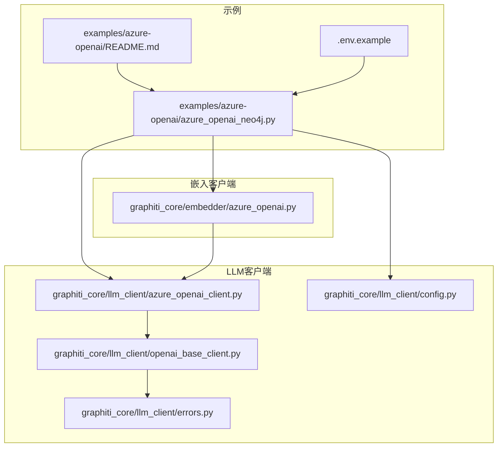
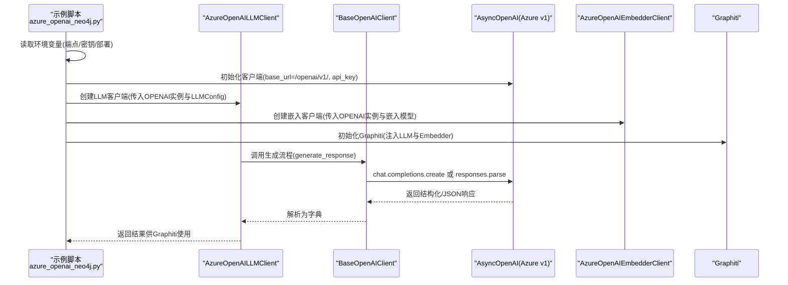
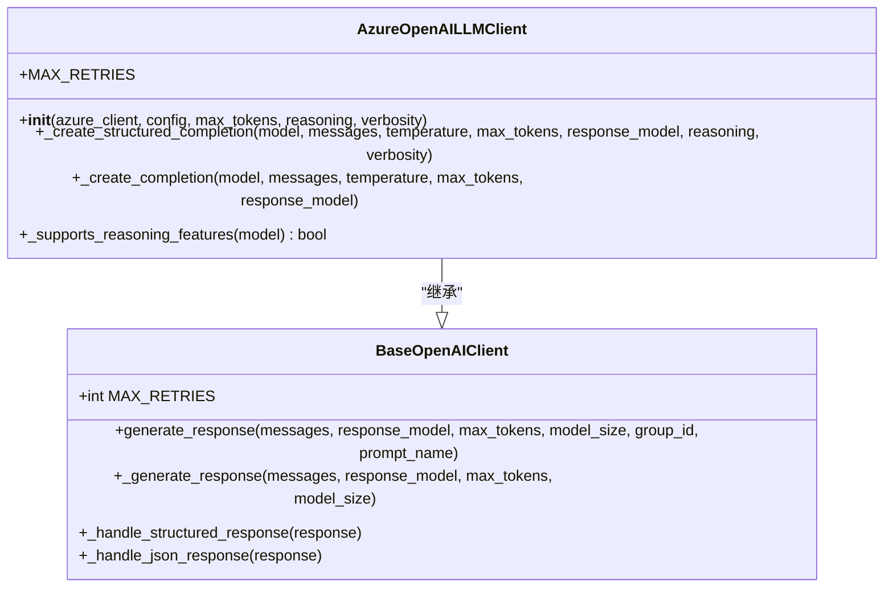
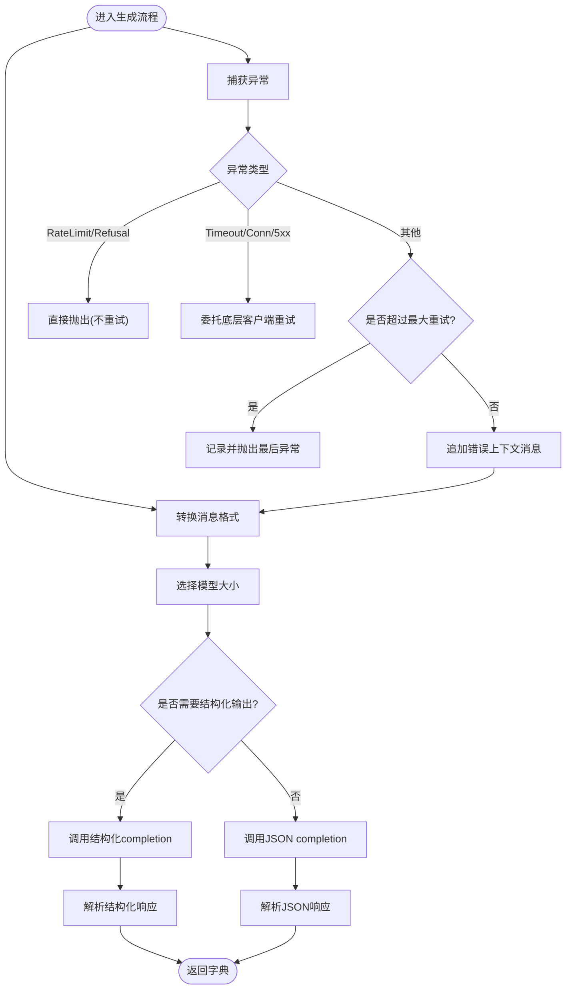
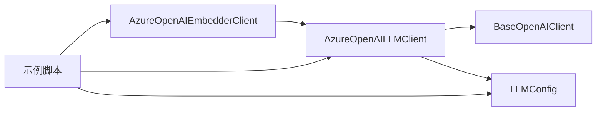

# Azure OpenAI集成

<cite>
**本文引用的文件**
- [graphiti_core/llm_client/azure_openai_client.py](file://graphiti_core/llm_client/azure_openai_client.py)
- [graphiti_core/llm_client/openai_base_client.py](file://graphiti_core/llm_client/openai_base_client.py)
- [graphiti_core/llm_client/config.py](file://graphiti_core/llm_client/config.py)
- [graphiti_core/embedder/azure_openai.py](file://graphiti_core/embedder/azure_openai.py)
- [examples/azure-openai/azure_openai_neo4j.py](file://examples/azure-openai/azure_openai_neo4j.py)
- [examples/azure-openai/README.md](file://examples/azure-openai/README.md)
- [examples/azure-openai/.env.example](file://examples/azure-openai/.env.example)
- [tests/llm_client/test_azure_openai_client.py](file://tests/llm_client/test_azure_openai_client.py)
- [README.md](file://README.md)
- [graphiti_core/llm_client/errors.py](file://graphiti_core/llm_client/errors.py)
</cite>

## 目录
1. [简介](#简介)
2. [项目结构](#项目结构)
3. [核心组件](#核心组件)
4. [架构总览](#架构总览)
5. [详细组件分析](#详细组件分析)
6. [依赖关系分析](#依赖关系分析)
7. [性能考量](#性能考量)
8. [故障排查指南](#故障排查指南)
9. [结论](#结论)
10. [附录](#附录)

## 简介
本文件面向企业级应用，系统化阐述如何在Graphiti中集成Azure OpenAI，重点覆盖以下方面：
- 使用Azure OpenAI服务端点、API密钥与部署名称进行认证与初始化
- 兼容Azure v1 API端点的方式与注意事项
- 对Azure特有能力的支持：推理选项（reasoning effort）与响应详细程度（verbosity）
- 错误处理与重试策略，以及与Azure特有的错误码的关系
- 在企业场景下构建安全、合规的知识图谱的实践建议（私有网络、数据加密、审计日志等）

## 项目结构
围绕Azure OpenAI集成的相关模块主要分布在以下位置：
- LLM客户端：graphiti_core/llm_client/azure_openai_client.py
- 基类与通用逻辑：graphiti_core/llm_client/openai_base_client.py
- 配置对象：graphiti_core/llm_client/config.py
- 嵌入客户端：graphiti_core/embedder/azure_openai.py
- 示例与环境变量：examples/azure-openai/*
- 单元测试：tests/llm_client/test_azure_openai_client.py
- 根README中的Azure OpenAI快速开始说明

图表来源
- [examples/azure-openai/azure_openai_neo4j.py](file://examples/azure-openai/azure_openai_neo4j.py#L1-L226)
- [examples/azure-openai/README.md](file://examples/azure-openai/README.md#L1-L155)
- [examples/azure-openai/.env.example](file://examples/azure-openai/.env.example#L1-L11)
- [graphiti_core/llm_client/azure_openai_client.py](file://graphiti_core/llm_client/azure_openai_client.py#L1-L116)
- [graphiti_core/llm_client/openai_base_client.py](file://graphiti_core/llm_client/openai_base_client.py#L1-L262)
- [graphiti_core/llm_client/config.py](file://graphiti_core/llm_client/config.py#L1-L69)
- [graphiti_core/embedder/azure_openai.py](file://graphiti_core/embedder/azure_openai.py#L1-L72)
- [graphiti_core/llm_client/errors.py](file://graphiti_core/llm_client/errors.py#L1-L40)

章节来源
- [examples/azure-openai/azure_openai_neo4j.py](file://examples/azure-openai/azure_openai_neo4j.py#L1-L226)
- [examples/azure-openai/README.md](file://examples/azure-openai/README.md#L1-L155)
- [examples/azure-openai/.env.example](file://examples/azure-openai/.env.example#L1-L11)
- [graphiti_core/llm_client/azure_openai_client.py](file://graphiti_core/llm_client/azure_openai_client.py#L1-L116)
- [graphiti_core/llm_client/openai_base_client.py](file://graphiti_core/llm_client/openai_base_client.py#L1-L262)
- [graphiti_core/llm_client/config.py](file://graphiti_core/llm_client/config.py#L1-L69)
- [graphiti_core/embedder/azure_openai.py](file://graphiti_core/embedder/azure_openai.py#L1-L72)
- [graphiti_core/llm_client/errors.py](file://graphiti_core/llm_client/errors.py#L1-L40)

## 核心组件
- AzureOpenAILLMClient：封装Azure OpenAI的LLM客户端，支持通过标准AsyncOpenAI客户端兼容Azure v1 API端点；提供结构化输出与JSON输出两种路径，并根据模型是否支持推理能力动态传递reasoning与verbosity参数。
- BaseOpenAIClient：OpenAI兼容客户端基类，统一消息格式转换、模型选择、响应解析、错误处理与重试逻辑。
- LLMConfig：LLM配置对象，承载API密钥、模型名、基础URL、温度、最大token等参数。
- AzureOpenAIEmbedderClient：封装Azure OpenAI嵌入客户端，支持单条与批量向量生成。
- 示例脚本与README：演示如何使用AsyncOpenAI以Azure v1端点连接Azure OpenAI，并与Graphiti结合进行知识图谱构建。

章节来源
- [graphiti_core/llm_client/azure_openai_client.py](file://graphiti_core/llm_client/azure_openai_client.py#L1-L116)
- [graphiti_core/llm_client/openai_base_client.py](file://graphiti_core/llm_client/openai_base_client.py#L1-L262)
- [graphiti_core/llm_client/config.py](file://graphiti_core/llm_client/config.py#L1-L69)
- [graphiti_core/embedder/azure_openai.py](file://graphiti_core/embedder/azure_openai.py#L1-L72)
- [examples/azure-openai/azure_openai_neo4j.py](file://examples/azure-openai/azure_openai_neo4j.py#L1-L226)
- [examples/azure-openai/README.md](file://examples/azure-openai/README.md#L1-L155)

## 架构总览
下图展示了从示例到Azure OpenAI v1端点，再到Graphiti知识图谱的整体调用链路与职责分工。

图表来源
- [examples/azure-openai/azure_openai_neo4j.py](file://examples/azure-openai/azure_openai_neo4j.py#L1-L226)
- [graphiti_core/llm_client/azure_openai_client.py](file://graphiti_core/llm_client/azure_openai_client.py#L1-L116)
- [graphiti_core/llm_client/openai_base_client.py](file://graphiti_core/llm_client/openai_base_client.py#L1-L262)

## 详细组件分析

### AzureOpenAILLMClient 组件分析
- 支持两种调用路径：
  - 结构化输出：通过responses.parse接口，按需传递reasoning与verbosity参数。
  - JSON输出：通过chat.completions.create接口，response_format设为json_object。
- 推理能力识别：仅当模型前缀匹配特定推理模型时，才允许传入reasoning与verbosity，并且会移除temperature以满足推理模型要求。
- 与AsyncOpenAI/Azure客户端的兼容性：示例通过AsyncOpenAI并指定Azure v1端点base_url实现兼容。

图表来源
- [graphiti_core/llm_client/azure_openai_client.py](file://graphiti_core/llm_client/azure_openai_client.py#L1-L116)
- [graphiti_core/llm_client/openai_base_client.py](file://graphiti_core/llm_client/openai_base_client.py#L1-L262)

章节来源
- [graphiti_core/llm_client/azure_openai_client.py](file://graphiti_core/llm_client/azure_openai_client.py#L1-L116)
- [tests/llm_client/test_azure_openai_client.py](file://tests/llm_client/test_azure_openai_client.py#L1-L110)

### BaseOpenAIClient 通用流程与错误处理
- 消息格式转换：将内部Message对象转换为OpenAI ChatCompletionMessageParam列表。
- 模型选择：根据ModelSize返回对应模型名（默认小模型与大模型）。
- 响应解析：
  - 结构化输出：从response.output_text解析JSON；若存在refusal则抛出RefusalError。
  - JSON输出：从choices[0].message.content解析JSON。
- 错误处理与重试：
  - RateLimitError与RefusalError不重试。
  - 连接超时、连接错误、内部服务器错误由底层OpenAI客户端处理。
  - 其他异常在达到最大重试次数后抛出，并记录上下文信息。

图表来源
- [graphiti_core/llm_client/openai_base_client.py](file://graphiti_core/llm_client/openai_base_client.py#L1-L262)
- [graphiti_core/llm_client/errors.py](file://graphiti_core/llm_client/errors.py#L1-L40)

章节来源
- [graphiti_core/llm_client/openai_base_client.py](file://graphiti_core/llm_client/openai_base_client.py#L1-L262)
- [graphiti_core/llm_client/errors.py](file://graphiti_core/llm_client/errors.py#L1-L40)

### AzureOpenAIEmbedderClient 组件分析
- 输入处理：支持字符串、字符串列表或任意类型（转为字符串列表）。
- 输出处理：返回第一条向量或批量向量列表。
- 异常处理：统一记录错误并向上抛出。

章节来源
- [graphiti_core/embedder/azure_openai.py](file://graphiti_core/embedder/azure_openai.py#L1-L72)

### 示例与环境变量
- 示例脚本展示了如何：
  - 通过AsyncOpenAI并设置base_url为Azure v1端点，完成认证与初始化。
  - 将Azure部署名称分别用于LLM与嵌入模型。
  - 与Graphiti结合进行知识图谱的添加、搜索与重排。
- .env.example提供了关键环境变量的占位符，包括Neo4j连接参数与Azure OpenAI端点、密钥、部署名称。

章节来源
- [examples/azure-openai/azure_openai_neo4j.py](file://examples/azure-openai/azure_openai_neo4j.py#L1-L226)
- [examples/azure-openai/README.md](file://examples/azure-openai/README.md#L1-L155)
- [examples/azure-openai/.env.example](file://examples/azure-openai/.env.example#L1-L11)

## 依赖关系分析
- AzureOpenAILLMClient依赖BaseOpenAIClient提供的通用生成流程与错误处理。
- 示例脚本同时依赖AzureOpenAIEmbedderClient与LLM客户端，共同驱动Graphiti。
- LLMConfig为客户端提供统一的配置入口，包含API密钥、模型名、基础URL、温度与最大token等。

图表来源
- [graphiti_core/llm_client/azure_openai_client.py](file://graphiti_core/llm_client/azure_openai_client.py#L1-L116)
- [graphiti_core/llm_client/openai_base_client.py](file://graphiti_core/llm_client/openai_base_client.py#L1-L262)
- [graphiti_core/llm_client/config.py](file://graphiti_core/llm_client/config.py#L1-L69)
- [graphiti_core/embedder/azure_openai.py](file://graphiti_core/embedder/azure_openai.py#L1-L72)
- [examples/azure-openai/azure_openai_neo4j.py](file://examples/azure-openai/azure_openai_neo4j.py#L1-L226)

章节来源
- [graphiti_core/llm_client/azure_openai_client.py](file://graphiti_core/llm_client/azure_openai_client.py#L1-L116)
- [graphiti_core/llm_client/openai_base_client.py](file://graphiti_core/llm_client/openai_base_client.py#L1-L262)
- [graphiti_core/llm_client/config.py](file://graphiti_core/llm_client/config.py#L1-L69)
- [graphiti_core/embedder/azure_openai.py](file://graphiti_core/embedder/azure_openai.py#L1-L72)
- [examples/azure-openai/azure_openai_neo4j.py](file://examples/azure-openai/azure_openai_neo4j.py#L1-L226)

## 性能考量
- 默认最大重试次数为2，适用于一般场景；对于高并发或受限带宽环境，可结合示例README中关于并发与限流的建议进行调优。
- Azure v1端点兼容AsyncOpenAI客户端，便于统一管理；但实际吞吐与延迟取决于Azure订阅配额与网络质量。
- 建议在生产中开启适当的日志级别以便定位问题，并结合Graphiti的追踪能力进行端到端观测。

[本节为通用指导，无需列出具体文件来源]

## 故障排查指南
- 认证与端点
  - 确认AZURE_OPENAI_ENDPOINT以“.openai.azure.com”结尾，并正确设置AZURE_OPENAI_API_KEY。
  - 若使用v1端点，请确保base_url形如“https://your-resource-name.openai.azure.com/openai/v1/”。
- 模型部署
  - AZURE_OPENAI_DEPLOYMENT与AZURE_OPENAI_EMBEDDING_DEPLOYMENT必须与Azure控制台中的部署名称一致。
- 错误码与异常
  - RateLimitError与RefusalError不会自动重试，需根据业务策略处理。
  - 连接超时、连接错误、内部服务器错误由底层OpenAI客户端处理；可在应用层适当增加超时或退避策略。
  - 其他异常会在达到最大重试次数后抛出，建议检查输入格式与响应schema一致性。
- 日志与追踪
  - 示例脚本使用标准logging模块；建议在生产中配置更详细的日志级别与输出目标。
  - 可结合Graphiti的追踪能力（span属性中包含provider、模型大小、max_tokens等）进行问题定位。

章节来源
- [examples/azure-openai/README.md](file://examples/azure-openai/README.md#L120-L155)
- [graphiti_core/llm_client/openai_base_client.py](file://graphiti_core/llm_client/openai_base_client.py#L1-L262)
- [graphiti_core/llm_client/errors.py](file://graphiti_core/llm_client/errors.py#L1-L40)

## 结论
- Graphiti通过AzureOpenAILLMClient与AzureOpenAIEmbedderClient实现了对Azure OpenAI的完整支持，既可通过AsyncOpenAI兼容Azure v1端点，又能在推理模型上启用reasoning与verbosity等高级特性。
- BaseOpenAIClient提供了统一的错误处理与重试机制，有助于在不稳定网络或限流环境下保持稳定性。
- 示例脚本与README为快速落地提供了清晰路径；结合企业级关注点（私有网络、数据加密、审计日志），可在生产环境中进一步完善安全与合规体系。

[本节为总结性内容，无需列出具体文件来源]

## 附录

### Azure OpenAI v1端点兼容与认证要点
- 使用AsyncOpenAI并设置base_url为Azure v1端点，即可复用标准OpenAI客户端接口。
- LLMConfig中的model与small_model分别对应Azure部署名称；嵌入模型同样通过部署名称指定。
- 示例脚本展示了完整的初始化与Graphiti集成流程。

章节来源
- [examples/azure-openai/README.md](file://examples/azure-openai/README.md#L80-L115)
- [examples/azure-openai/azure_openai_neo4j.py](file://examples/azure-openai/azure_openai_neo4j.py#L70-L110)
- [graphiti_core/llm_client/config.py](file://graphiti_core/llm_client/config.py#L1-L69)

### 推理选项与响应详细程度配置
- 当模型前缀匹配推理模型时，AzureOpenAILLMClient会：
  - 移除temperature以满足推理模型要求；
  - 传递reasoning.effort与text.verbosity参数；
- 测试用例验证了推理字段在受支持模型上的转发行为，以及在不受支持模型上被剥离的行为。

章节来源
- [graphiti_core/llm_client/azure_openai_client.py](file://graphiti_core/llm_client/azure_openai_client.py#L56-L116)
- [tests/llm_client/test_azure_openai_client.py](file://tests/llm_client/test_azure_openai_client.py#L46-L110)

### 企业级安全与合规建议（基于仓库能力的实践）
- 私有网络与访问控制
  - 通过将AsyncOpenAI的base_url指向Azure v1端点，可在企业内网或私有DNS解析下完成访问；确保防火墙放行相应端口。
- 数据加密
  - 建议在传输层启用TLS（AsyncOpenAI默认HTTPS），并在应用侧对敏感日志进行脱敏处理。
- 审计与可观测性
  - 使用标准logging模块记录关键操作；结合Graphiti的追踪span属性（provider、模型大小、max_tokens等）进行审计。
- 合规与最小权限
  - 严格管理AZURE_OPENAI_API_KEY与部署名称，遵循最小权限原则；在CI/CD中使用机密管理工具存储凭据。

[本节为通用指导，无需列出具体文件来源]