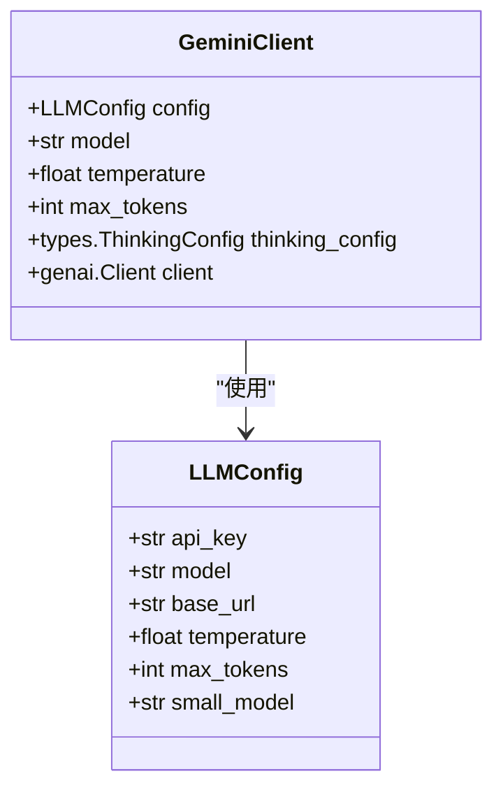
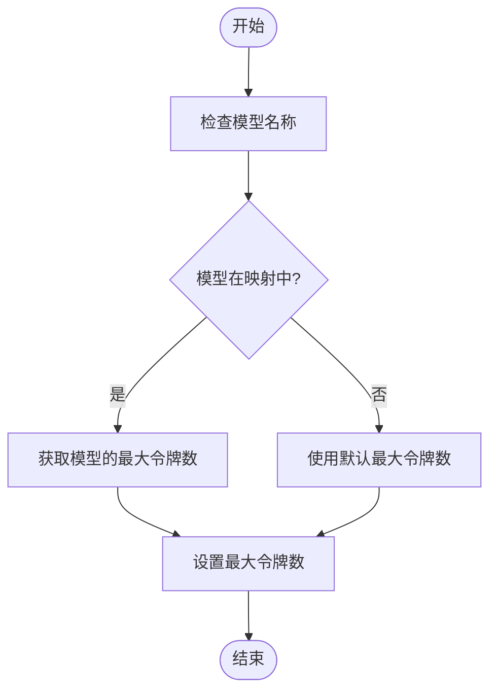
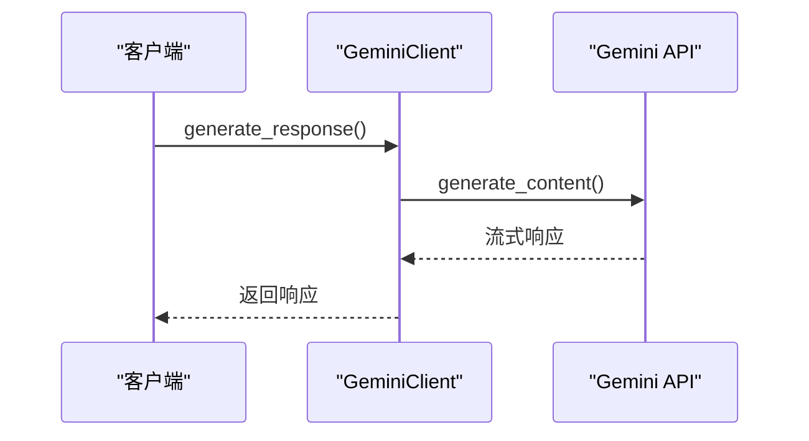
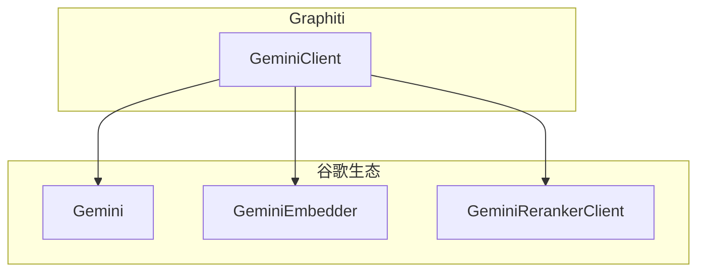
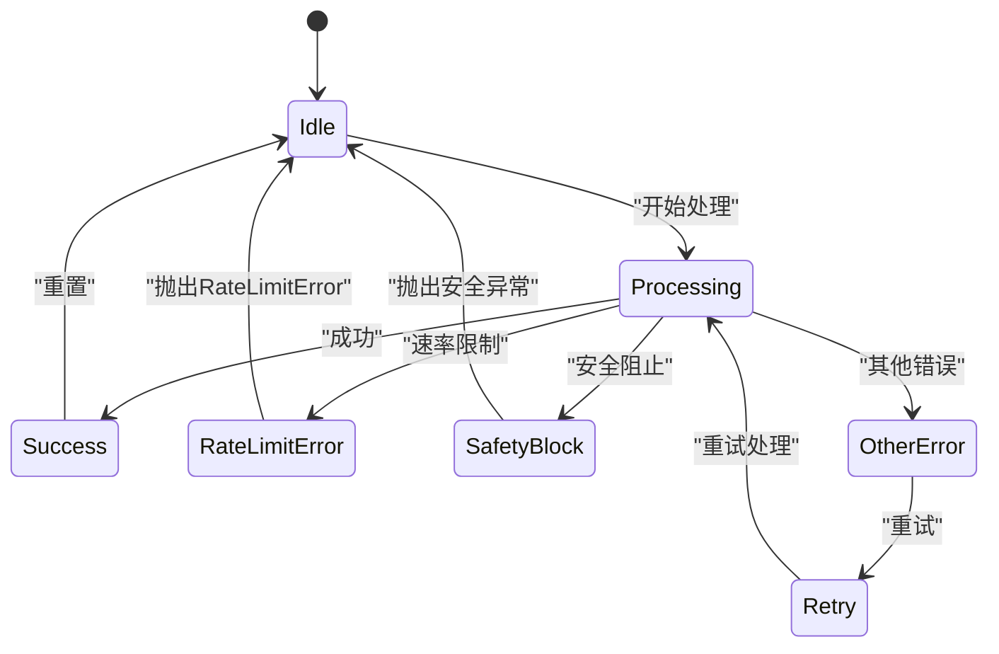

# Gemini集成

<cite>
**本文档中引用的文件**   
- [gemini_client.py](file://graphiti_core/llm_client/gemini_client.py)
- [config.py](file://graphiti_core/llm_client/config.py)
- [errors.py](file://graphiti_core/llm_client/errors.py)
- [gemini.py](file://graphiti_core/embedder/gemini.py)
- [gemini_reranker_client.py](file://graphiti_core/cross_encoder/gemini_reranker_client.py)
- [client.py](file://graphiti_core/llm_client/client.py)
- [models.py](file://graphiti_core/prompts/models.py)
</cite>

## 目录
1. [简介](#简介)
2. [Gemini客户端配置与认证](#gemini客户端配置与认证)
3. [模型配置与参数](#模型配置与参数)
4. [异步调用与流式响应](#异步调用与流式响应)
5. [多语言处理与谷歌生态集成](#多语言处理与谷歌生态集成)
6. [在Graphiti中的实践案例](#在graphiti中的实践案例)
7. [错误处理机制](#错误处理机制)
8. [性能调优建议](#性能调优建议)

## 简介
Gemini集成文档深入讲解了如何在Graphiti框架中配置和使用GeminiClient。文档涵盖了通过Google API密钥或服务账户凭证进行认证的方法，详细说明了Gemini模型（如gemini-pro）的配置及相关参数。同时，文档解释了其异步调用机制和对流式响应的支持，以及在多语言处理和谷歌生态集成方面的优势。此外，还提供了在Graphiti中利用Gemini进行跨语言实体提取和内容理解的实践案例，详细说明了其特有的错误类型（如配额超限）及其处理方式，并包含性能调优建议，例如如何管理并发请求以避免配额耗尽。

**Section sources**
- [gemini_client.py](file://graphiti_core/llm_client/gemini_client.py#L1-L447)

## Gemini客户端配置与认证
GeminiClient的配置与认证主要通过LLMConfig类实现，支持使用Google API密钥或服务账户凭证进行认证。在初始化GeminiClient时，可以通过LLMConfig对象传递API密钥、模型名称、基础URL等参数。如果未提供配置，则使用默认值。此外，GeminiClient还支持使用thinking_config参数进行高级配置，仅适用于支持thinking功能的模型（如gemini-2.5+）。

**Diagram sources **
- [config.py](file://graphiti_core/llm_client/config.py#L18-L69)
- [gemini_client.py](file://graphiti_core/llm_client/gemini_client.py#L69-L447)

**Section sources**
- [gemini_client.py](file://graphiti_core/llm_client/gemini_client.py#L92-L124)
- [config.py](file://graphiti_core/llm_client/config.py#L37-L69)

## 模型配置与参数
GeminiClient支持多种Gemini模型的配置，包括gemini-2.5-pro、gemini-2.5-flash、gemini-2.5-flash-lite等。每种模型都有其特定的最大输出令牌数，这些值存储在GEMINI_MODEL_MAX_TOKENS字典中。当未指定max_tokens参数时，系统会根据模型名称从该字典中查找相应的最大令牌数。此外，GeminiClient还支持通过thinking_config参数进行高级配置，以优化模型的推理过程。

**Diagram sources **
- [gemini_client.py](file://graphiti_core/llm_client/gemini_client.py#L50-L67)
- [gemini_client.py](file://graphiti_core/llm_client/gemini_client.py#L168-L198)

**Section sources**
- [gemini_client.py](file://graphiti_core/llm_client/gemini_client.py#L50-L67)
- [gemini_client.py](file://graphiti_core/llm_client/gemini_client.py#L168-L198)

## 异步调用与流式响应
GeminiClient支持异步调用和流式响应，这使得在处理大量数据时能够更高效地利用资源。通过使用async/await语法，可以实现非阻塞的API调用，从而提高应用程序的响应速度。此外，GeminiClient还支持流式响应，允许客户端在接收到部分响应后立即开始处理，而无需等待整个响应完成。

**Diagram sources **
- [gemini_client.py](file://graphiti_core/llm_client/gemini_client.py#L233-L352)
- [gemini_client.py](file://graphiti_core/llm_client/gemini_client.py#L353-L446)

**Section sources**
- [gemini_client.py](file://graphiti_core/llm_client/gemini_client.py#L233-L446)

## 多语言处理与谷歌生态集成
GeminiClient在多语言处理方面表现出色，能够自动识别和处理多种语言的输入。此外，它还与谷歌生态紧密集成，可以轻松访问和利用谷歌提供的各种服务和资源。例如，通过使用GeminiEmbedder，可以将文本转换为高维向量，以便进行语义搜索和相似度计算。同时，GeminiRerankerClient可以对搜索结果进行重新排序，以提高相关性。

**Diagram sources **
- [gemini.py](file://graphiti_core/embedder/gemini.py#L1-L184)
- [gemini_reranker_client.py](file://graphiti_core/cross_encoder/gemini_reranker_client.py#L1-L162)

**Section sources**
- [gemini.py](file://graphiti_core/embedder/gemini.py#L1-L184)
- [gemini_reranker_client.py](file://graphiti_core/cross_encoder/gemini_reranker_client.py#L1-L162)

## 在Graphiti中的实践案例
在Graphiti中，GeminiClient被广泛用于跨语言实体提取和内容理解。例如，在处理多语言文档时，可以通过GeminiClient提取关键实体并将其转换为统一的格式，以便进行进一步的分析和处理。此外，GeminiClient还可以用于生成高质量的摘要和翻译，从而提高信息的可读性和可用性。

**Section sources**
- [gemini_client.py](file://graphiti_core/llm_client/gemini_client.py#L377-L379)
- [client.py](file://graphiti_core/llm_client/client.py#L169-L170)

## 错误处理机制
GeminiClient具有完善的错误处理机制，能够有效应对各种异常情况。例如，当API调用超过速率限制时，会抛出RateLimitError异常；当内容被安全过滤器阻止时，会抛出相应的异常。此外，GeminiClient还支持重试机制，可以在遇到临时性错误时自动重试，从而提高系统的稳定性和可靠性。

**Diagram sources **
- [errors.py](file://graphiti_core/llm_client/errors.py#L18-L40)
- [gemini_client.py](file://graphiti_core/llm_client/gemini_client.py#L340-L348)

**Section sources**
- [errors.py](file://graphiti_core/llm_client/errors.py#L18-L40)
- [gemini_client.py](file://graphiti_core/llm_client/gemini_client.py#L340-L348)

## 性能调优建议
为了优化GeminiClient的性能，建议采取以下措施：首先，合理管理并发请求，避免因过多的并发请求导致配额耗尽；其次，根据实际需求选择合适的模型和参数，以平衡性能和成本；最后，利用缓存机制减少重复的API调用，从而提高响应速度和降低资源消耗。

**Section sources**
- [gemini_client.py](file://graphiti_core/llm_client/gemini_client.py#L110-L124)
- [client.py](file://graphiti_core/llm_client/client.py#L80-L83)