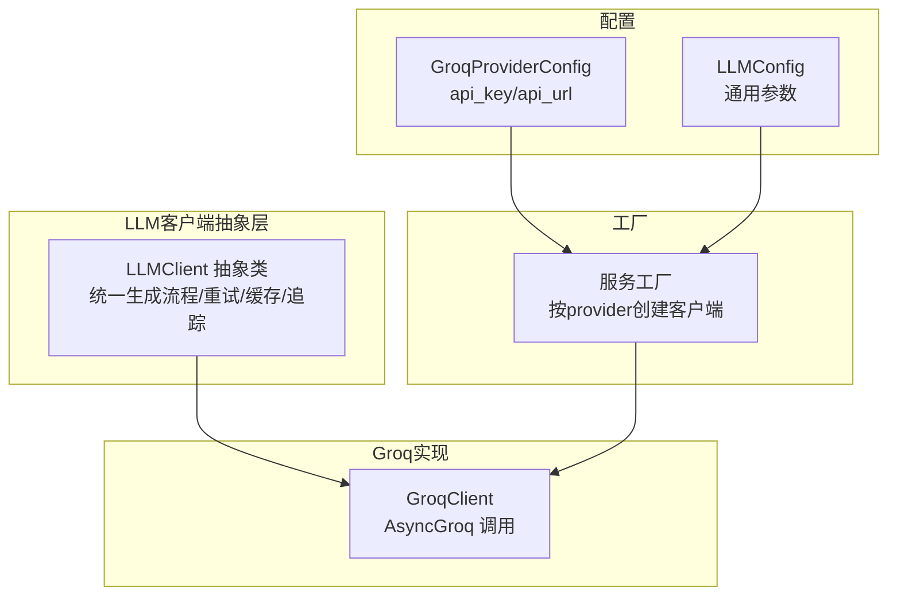
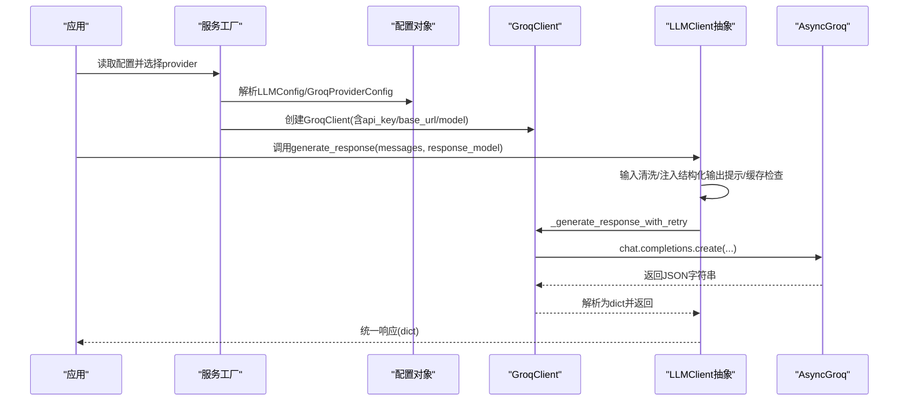
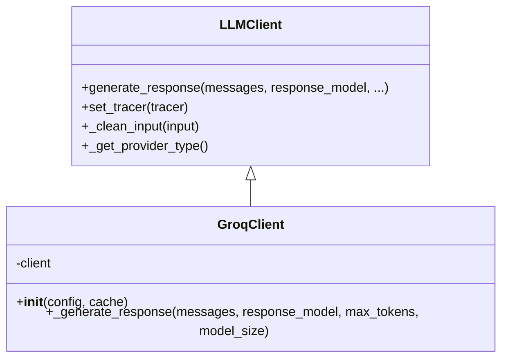
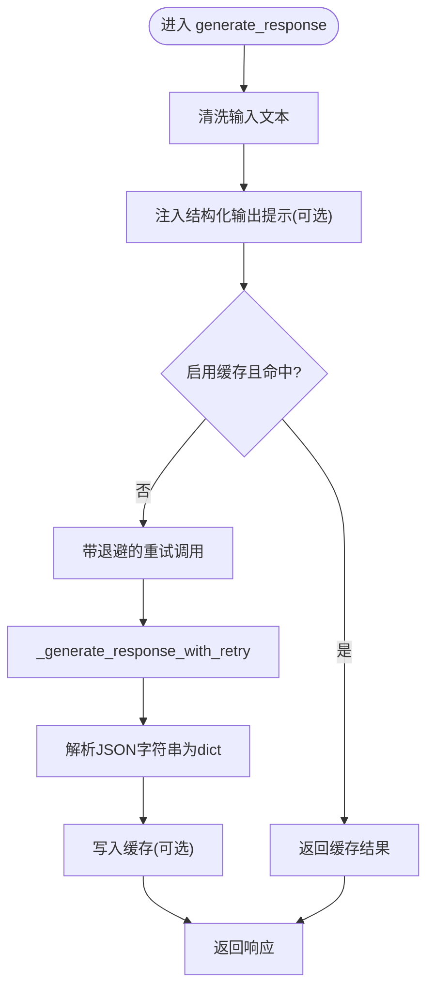
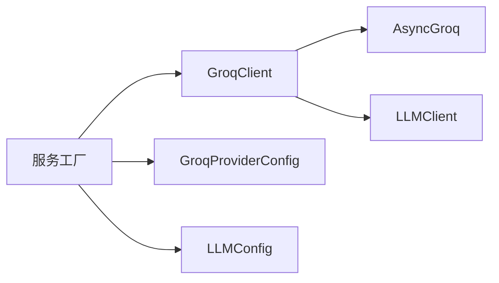

# Groq集成

<cite>
**本文引用的文件**
- [graphiti_core/llm_client/groq_client.py](file://graphiti_core/llm_client/groq_client.py)
- [graphiti_core/llm_client/client.py](file://graphiti_core/llm_client/client.py)
- [graphiti_core/llm_client/config.py](file://graphiti_core/llm_client/config.py)
- [mcp_server/src/config/schema.py](file://mcp_server/src/config/schema.py)
- [mcp_server/src/services/factories.py](file://mcp_server/src/services/factories.py)
- [graphiti_core/graphiti.py](file://graphiti_core/graphiti.py)
- [README.md](file://README.md)
</cite>

## 目录
1. [简介](#简介)
2. [项目结构](#项目结构)
3. [核心组件](#核心组件)
4. [架构总览](#架构总览)
5. [详细组件分析](#详细组件分析)
6. [依赖关系分析](#依赖关系分析)
7. [性能考量](#性能考量)
8. [故障排查指南](#故障排查指南)
9. [结论](#结论)
10. [附录](#附录)

## 简介
本文件面向希望在Graphiti中集成Groq的开发者，系统性介绍GroqClient的高性能特性与适配过程，涵盖以下要点：
- 如何配置Groq API密钥与基础URL
- 利用Groq的低延迟能力进行推理（结合LLMClient统一接口）
- 支持的模型族（如Llama系列、Mixtral等）在Graphiti中的使用建议
- 在实时知识图谱更新场景下，如何通过结构化输出与缓存提升响应速度
- 与标准LLMClient接口的适配流程与请求/响应格式转换
- 在需要快速响应的代理应用中集成Groq的实践建议
- 成本效益与高吞吐量场景的最佳实践（批处理、连接池、重试与缓存）

## 项目结构
Graphiti将LLM客户端抽象为统一接口，GroqClient作为其中一种具体实现，通过工厂模式在运行时按配置选择。关键位置如下：
- LLMClient抽象层：定义通用生成流程、重试、缓存、追踪与输入清洗
- GroqClient：基于AsyncGroq实现异步聊天补全调用
- 配置层：LLMConfig与GroqProviderConfig分别用于通用与Groq特定配置
- 工厂层：根据配置动态创建GroqClient实例

图表来源
- [graphiti_core/llm_client/client.py](file://graphiti_core/llm_client/client.py#L66-L243)
- [graphiti_core/llm_client/groq_client.py](file://graphiti_core/llm_client/groq_client.py#L48-L86)
- [mcp_server/src/config/schema.py](file://mcp_server/src/config/schema.py#L115-L156)
- [mcp_server/src/services/factories.py](file://mcp_server/src/services/factories.py#L225-L248)

章节来源
- [graphiti_core/llm_client/client.py](file://graphiti_core/llm_client/client.py#L66-L243)
- [graphiti_core/llm_client/groq_client.py](file://graphiti_core/llm_client/groq_client.py#L48-L86)
- [mcp_server/src/config/schema.py](file://mcp_server/src/config/schema.py#L115-L156)
- [mcp_server/src/services/factories.py](file://mcp_server/src/services/factories.py#L225-L248)

## 核心组件
- LLMClient：提供统一的生成流程，包含输入清洗、结构化输出提示注入、缓存命中、重试机制、追踪埋点与错误分类。
- GroqClient：继承LLMClient，使用AsyncGroq执行聊天补全；默认模型与最大token数可配置；对速率限制错误进行捕获与上抛。
- LLMConfig：通用LLM配置，包含api_key、model、temperature、max_tokens等。
- GroqProviderConfig：Groq专用配置，包含api_key与api_url，默认指向Groq OpenAI兼容端点。
- 工厂：根据provider选择GroqClient并注入配置。

章节来源
- [graphiti_core/llm_client/client.py](file://graphiti_core/llm_client/client.py#L66-L243)
- [graphiti_core/llm_client/groq_client.py](file://graphiti_core/llm_client/groq_client.py#L48-L86)
- [graphiti_core/llm_client/config.py](file://graphiti_core/llm_client/config.py#L23-L69)
- [mcp_server/src/config/schema.py](file://mcp_server/src/config/schema.py#L115-L156)
- [mcp_server/src/services/factories.py](file://mcp_server/src/services/factories.py#L225-L248)

## 架构总览
下图展示从配置到客户端调用的完整链路，以及GroqClient在统一LLMClient体系中的位置。

图表来源
- [mcp_server/src/services/factories.py](file://mcp_server/src/services/factories.py#L225-L248)
- [graphiti_core/llm_client/client.py](file://graphiti_core/llm_client/client.py#L121-L214)
- [graphiti_core/llm_client/groq_client.py](file://graphiti_core/llm_client/groq_client.py#L56-L86)

## 详细组件分析

### GroqClient实现与高性能特性
- 异步调用：使用AsyncGroq进行异步聊天补全，降低I/O阻塞，适合高并发场景。
- 默认模型与token上限：提供合理的默认值，便于开箱即用。
- 结构化输出：通过response_format强制返回JSON字符串，再由客户端解析为dict，确保下游处理一致性。
- 错误处理：捕获速率限制错误并转换为统一的RateLimitError，便于上层重试策略。
- 低延迟优化：结合LLMClient的重试与缓存，减少重复请求与网络往返。

图表来源
- [graphiti_core/llm_client/client.py](file://graphiti_core/llm_client/client.py#L66-L243)
- [graphiti_core/llm_client/groq_client.py](file://graphiti_core/llm_client/groq_client.py#L48-L86)

章节来源
- [graphiti_core/llm_client/groq_client.py](file://graphiti_core/llm_client/groq_client.py#L48-L86)

### LLMClient统一接口与适配流程
- 输入清洗：移除无效Unicode与控制字符，保留换行、制表符等必要字符，提升稳定性。
- 结构化输出提示：当传入Pydantic模型schema时，自动追加JSON格式约束提示，增强输出一致性。
- 缓存：基于消息内容与模型名生成MD5键，命中则直接返回，显著降低重复请求成本。
- 重试：对服务器错误与速率限制进行指数退避重试，提高鲁棒性。
- 追踪：记录provider类型、模型尺寸、max_tokens、缓存命中等属性，便于性能分析。

图表来源
- [graphiti_core/llm_client/client.py](file://graphiti_core/llm_client/client.py#L121-L214)

章节来源
- [graphiti_core/llm_client/client.py](file://graphiti_core/llm_client/client.py#L88-L110)
- [graphiti_core/llm_client/client.py](file://graphiti_core/llm_client/client.py#L161-L170)
- [graphiti_core/llm_client/client.py](file://graphiti_core/llm_client/client.py#L188-L213)

### 配置与安装
- 安装：可通过额外依赖安装Groq支持，以便导入AsyncGroq。
- API密钥：在GroqProviderConfig中设置api_key；工厂会校验并注入到GroqClient。
- 基础URL：GroqProviderConfig提供api_url，默认指向Groq OpenAI兼容端点。
- 模型选择：可在LLMConfig中指定model；GroqClient优先使用配置中的model，否则采用默认模型。

章节来源
- [README.md](file://README.md#L147-L150)
- [mcp_server/src/config/schema.py](file://mcp_server/src/config/schema.py#L115-L156)
- [mcp_server/src/services/factories.py](file://mcp_server/src/services/factories.py#L225-L248)
- [graphiti_core/llm_client/groq_client.py](file://graphiti_core/llm_client/groq_client.py#L48-L57)

### 请求/响应格式转换
- 请求：将内部Message列表转换为Groq所需的ChatCompletionMessageParam数组，仅保留user/system角色与内容。
- 响应：Groq返回JSON字符串，GroqClient将其解析为dict，与LLMClient统一返回格式一致。
- 结构化输出：当传入response_model时，会在最后一条消息中追加JSON schema提示，确保输出符合预期结构。

章节来源
- [graphiti_core/llm_client/groq_client.py](file://graphiti_core/llm_client/groq_client.py#L65-L80)
- [graphiti_core/llm_client/client.py](file://graphiti_core/llm_client/client.py#L161-L168)

### 实时知识图谱更新场景的优势
- 低延迟推理：异步调用与缓存结合，适合高频小请求的代理应用。
- 结构化输出：保证抽取结果可直接用于知识图谱实体/关系建模，减少后处理成本。
- 多语言提取指令：自动注入多语言提取提示，有助于跨语种知识图谱构建的一致性。
- 可观测性：通过追踪埋点与失败日志，便于定位性能瓶颈与异常。

章节来源
- [graphiti_core/llm_client/client.py](file://graphiti_core/llm_client/client.py#L37-L52)
- [graphiti_core/llm_client/client.py](file://graphiti_core/llm_client/client.py#L170-L171)
- [graphiti_core/llm_client/client.py](file://graphiti_core/llm_client/client.py#L215-L243)

## 依赖关系分析
- GroqClient依赖AsyncGroq与Groq类型定义；若缺失依赖，会抛出ImportError提示安装graphiti-core[groq]。
- 工厂层根据provider选择GroqClient并注入api_key与api_url；同时校验配置完整性。
- LLMClient提供统一的生成流程，GroqClient只需实现异步生成方法即可复用所有通用能力。

图表来源
- [graphiti_core/llm_client/groq_client.py](file://graphiti_core/llm_client/groq_client.py#L22-L34)
- [mcp_server/src/services/factories.py](file://mcp_server/src/services/factories.py#L225-L248)
- [mcp_server/src/config/schema.py](file://mcp_server/src/config/schema.py#L115-L156)

章节来源
- [graphiti_core/llm_client/groq_client.py](file://graphiti_core/llm_client/groq_client.py#L22-L34)
- [mcp_server/src/services/factories.py](file://mcp_server/src/services/factories.py#L225-L248)

## 性能考量
- 异步I/O：使用AsyncGroq避免阻塞事件循环，适合高并发代理应用。
- 缓存命中：对相同messages+model组合进行缓存，显著降低重复请求与网络开销。
- 重试退避：对5xx与速率限制错误进行指数退避重试，提升稳定性与吞吐。
- 最大token与温度：合理设置max_tokens与temperature，平衡质量与延迟。
- 连接池与并发：建议在应用侧复用GroqClient实例，避免频繁创建连接；对高并发场景可考虑连接池与限流策略（由外部框架或部署环境负责）。

章节来源
- [graphiti_core/llm_client/client.py](file://graphiti_core/llm_client/client.py#L110-L120)
- [graphiti_core/llm_client/client.py](file://graphiti_core/llm_client/client.py#L188-L213)
- [graphiti_core/llm_client/groq_client.py](file://graphiti_core/llm_client/groq_client.py#L56-L86)

## 故障排查指南
- 依赖缺失：若未安装Groq相关依赖，初始化时会抛出ImportError，提示安装graphiti-core[groq]。
- 速率限制：GroqClient捕获速率限制错误并转换为RateLimitError，上层可据此调整重试策略。
- 输入异常：若Groq返回非JSON字符串，解析阶段可能失败；建议检查上游消息构造与结构化输出提示是否正确注入。
- 日志与追踪：使用LLMClient提供的失败日志函数记录输入与原始输出，便于定位问题。

章节来源
- [graphiti_core/llm_client/groq_client.py](file://graphiti_core/llm_client/groq_client.py#L22-L34)
- [graphiti_core/llm_client/groq_client.py](file://graphiti_core/llm_client/groq_client.py#L80-L86)
- [graphiti_core/llm_client/client.py](file://graphiti_core/llm_client/client.py#L229-L243)

## 结论
GroqClient通过统一的LLMClient接口无缝接入Graphiti生态，具备异步I/O、结构化输出、缓存与重试等高性能特性。配合Groq的低延迟推理能力，非常适合在实时知识图谱更新与代理应用中实现快速响应。通过合理的配置与最佳实践（缓存、重试、连接池），可在保证质量的同时最大化吞吐与成本效益。

## 附录

### 快速开始：在代理应用中集成Groq
- 步骤概览
  - 准备配置：在GroqProviderConfig中设置api_key与api_url；在LLMConfig中指定model与temperature/max_tokens。
  - 工厂创建：通过服务工厂按provider创建GroqClient实例。
  - 调用生成：使用LLMClient.generate_response传入messages与可选response_model，获得结构化dict结果。
  - 缓存与重试：默认启用缓存与重试，减少重复请求与网络抖动影响。
- 关键路径参考
  - 配置对象：[GroqProviderConfig](file://mcp_server/src/config/schema.py#L115-L156)
  - 工厂创建：[服务工厂](file://mcp_server/src/services/factories.py#L225-L248)
  - 生成流程：[LLMClient.generate_response](file://graphiti_core/llm_client/client.py#L149-L214)
  - Groq调用：[GroqClient._generate_response](file://graphiti_core/llm_client/groq_client.py#L58-L86)

章节来源
- [mcp_server/src/config/schema.py](file://mcp_server/src/config/schema.py#L115-L156)
- [mcp_server/src/services/factories.py](file://mcp_server/src/services/factories.py#L225-L248)
- [graphiti_core/llm_client/client.py](file://graphiti_core/llm_client/client.py#L149-L214)
- [graphiti_core/llm_client/groq_client.py](file://graphiti_core/llm_client/groq_client.py#L58-L86)

### 模型与成本效益建议
- 模型族：仓库中默认模型为“llama-3.1-70b-versatile”，适用于复杂任务；可根据需求选择更小模型以降低成本。
- 成本优化：优先使用缓存与较小模型处理简单查询；对高频热点数据启用缓存；在高并发场景结合连接池与限流。
- 适用场景：实时知识图谱更新、代理问答、实体抽取与关系抽取等对延迟敏感的任务。

章节来源
- [graphiti_core/llm_client/groq_client.py](file://graphiti_core/llm_client/groq_client.py#L44-L57)
- [graphiti_core/llm_client/client.py](file://graphiti_core/llm_client/client.py#L188-L213)