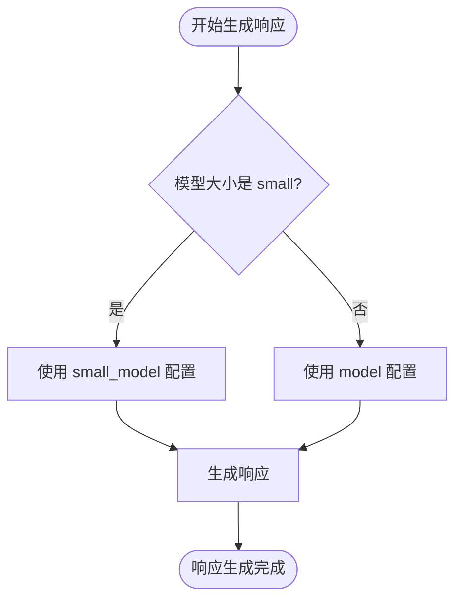
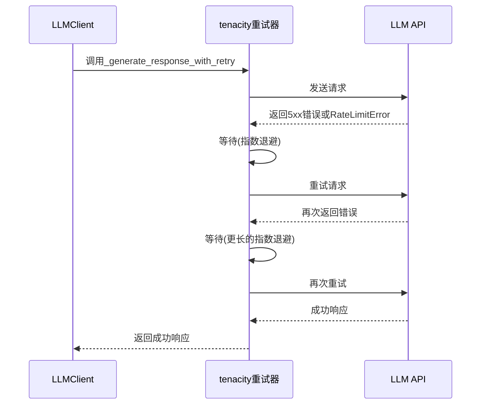

# LLM配置管理

<cite>
**本文档引用的文件**   
- [config.py](file://graphiti_core/llm_client/config.py)
- [errors.py](file://graphiti_core/llm_client/errors.py)
- [client.py](file://graphiti_core/llm_client/client.py)
- [openai_base_client.py](file://graphiti_core/llm_client/openai_base_client.py)
- [openai_client.py](file://graphiti_core/llm_client/openai_client.py)
- [azure_openai_client.py](file://graphiti_core/llm_client/azure_openai_client.py)
- [azure_openai_neo4j.py](file://examples/azure-openai/azure_openai_neo4j.py)
- [test_client.py](file://tests/llm_client/test_client.py)
- [test_errors.py](file://tests/llm_client/test_errors.py)
</cite>

## 目录
1. [简介](#简介)
2. [LLM配置类设计](#llm配置类设计)
3. [核心配置参数详解](#核心配置参数详解)
4. [配置方法与运行时调整](#配置方法与运行时调整)
5. [错误处理与重试机制](#错误处理与重试机制)
6. [配置示例与最佳实践](#配置示例与最佳实践)
7. [结论](#结论)

## 简介
本文档全面解析Graphiti项目中LLM（大语言模型）的配置管理系统。系统通过`LLMConfig`类提供统一的配置接口，支持多种LLM提供商（如OpenAI、Azure OpenAI等），并实现了灵活的配置选项、强大的错误处理和重试机制。文档将深入探讨配置项的设计、默认值、最佳实践以及如何通过环境变量或代码进行灵活配置。

## LLM配置类设计


**图示来源**
- [config.py](file://graphiti_core/llm_client/config.py#L28-L69)
- [client.py](file://graphiti_core/llm_client/client.py#L66-L243)
- [openai_base_client.py](file://graphiti_core/llm_client/openai_base_client.py#L40-L262)
- [openai_client.py](file://graphiti_core/llm_client/openai_client.py#L27-L116)
- [azure_openai_client.py](file://graphiti_core/llm_client/azure_openai_client.py#L30-L116)

**本节来源**
- [config.py](file://graphiti_core/llm_client/config.py#L1-L69)
- [client.py](file://graphiti_core/llm_client/client.py#L66-L243)

## 核心配置参数详解

`LLMConfig`类是整个LLM配置系统的核心，它封装了与LLM API交互所需的所有必要参数。以下是其关键配置项的详细说明：

### model
- **描述**: 指定用于生成响应的主要LLM模型名称。
- **默认值**: `gpt-5-mini` (在`openai_base_client.py`中定义)
- **适用场景**: 适用于处理复杂、需要高推理能力的任务，如深度分析、复杂推理和长篇内容生成。

### small_model
- **描述**: 指定用于生成简单提示响应的LLM模型名称。
- **默认值**: `gpt-5-nano` (在`openai_base_client.py`中定义)
- **适用场景**: 适用于处理简单、直接的查询，可以显著降低成本和延迟，如快速事实查找或简单分类。

### temperature
- **描述**: 控制模型输出的随机性。值越高，输出越随机和创造性；值越低，输出越确定和保守。
- **默认值**: `1.0` (在`config.py`中定义)
- **最佳实践**: 
  - **提取任务**: 使用较低值（如0.0-0.3）以确保结果的一致性和可预测性。
  - **创意生成**: 使用较高值（如0.7-1.0）以鼓励多样性和创造性。
  - **摘要任务**: 使用中等值（如0.5）以在准确性和流畅性之间取得平衡。

### max_tokens
- **描述**: 指定模型生成响应时的最大令牌数。
- **默认值**: `8192` (在`config.py`中定义)
- **适用场景**: 
  - **长篇内容生成**: 设置较高的值以允许生成详细内容。
  - **简短响应**: 设置较低的值以控制成本和响应长度。
  - **API限制**: 确保此值不超过所选模型的最大上下文长度。

**本节来源**
- [config.py](file://graphiti_core/llm_client/config.py#L19-L69)
- [openai_base_client.py](file://graphiti_core/llm_client/openai_base_client.py#L34-L35)

## 配置方法与运行时调整

系统支持多种配置方式，允许在运行时灵活调整LLM参数。

### 通过代码直接配置
可以直接在代码中实例化`LLMConfig`对象并传入所需参数：

```python
from graphiti_core.llm_client.config import LLMConfig

config = LLMConfig(
    api_key="your-api-key",
    model="gpt-4-turbo",
    temperature=0.7,
    max_tokens=4096,
    small_model="gpt-3.5-turbo"
)
```

### 通过环境变量配置
在示例代码中，系统通过`.env`文件和`os.environ.get()`方法从环境变量中读取配置，这是一种安全且灵活的配置方式：

```python
# 从环境变量获取配置
azure_endpoint = os.environ.get('AZURE_OPENAI_ENDPOINT')
azure_api_key = os.environ.get('AZURE_OPENAI_API_KEY')
azure_deployment = os.environ.get('AZURE_OPENAI_DEPLOYMENT', 'gpt-4.1')

# 使用环境变量创建配置
llm_client = AzureOpenAILLMClient(
    azure_client=azure_client,
    config=LLMConfig(model=azure_deployment, small_model=azure_deployment),
)
```

### 运行时模型选择
系统通过`ModelSize`枚举和`_get_model_for_size`方法实现了运行时的模型动态选择：



**图示来源**
- [openai_base_client.py](file://graphiti_core/llm_client/openai_base_client.py#L109-L115)
- [azure_openai_neo4j.py](file://examples/azure-openai/azure_openai_neo4j.py#L86-L87)

**本节来源**
- [azure_openai_neo4j.py](file://examples/azure-openai/azure_openai_neo4j.py#L56-L59)
- [openai_base_client.py](file://graphiti_core/llm_client/openai_base_client.py#L109-L115)

## 错误处理与重试机制

系统实现了健壮的错误处理和重试机制，确保在面对API错误时的稳定性和可靠性。

### 自定义异常
`errors.py`文件中定义了针对LLM交互的特定异常：


- **RateLimitError**: 当API调用超出速率限制时抛出。系统会捕获此异常并可能触发重试逻辑。
- **RefusalError**: 当LLM拒绝生成响应（例如，由于内容策略）时抛出。此类错误通常不会重试。
- **EmptyResponseError**: 当LLM返回空响应时抛出。系统可能会尝试重新生成响应。

### 重试机制
`client.py`中的`_generate_response_with_retry`方法使用`tenacity`库实现了指数退避重试策略：



重试逻辑的关键特性：
- **重试条件**: 仅对服务器错误（5xx状态码）和`RateLimitError`进行重试。
- **退避策略**: 使用`wait_random_exponential`实现指数退避，避免对API造成过大压力。
- **最大重试次数**: 限制为4次，防止无限重试。

**图示来源**
- [errors.py](file://graphiti_core/llm_client/errors.py#L18-L40)
- [client.py](file://graphiti_core/llm_client/client.py#L110-L120)

**本节来源**
- [errors.py](file://graphiti_core/llm_client/errors.py#L18-L40)
- [client.py](file://graphiti_core/llm_client/client.py#L57-L120)

## 配置示例与最佳实践

以下是一个完整的配置示例，展示了如何为不同任务设置最优的LLM参数组合：

```python
from graphiti_core.llm_client.config import LLMConfig, ModelSize
from graphiti_core.llm_client.azure_openai_client import AzureOpenAILLMClient
from graphiti_core.llm_client.client import LLMClient

# 1. 提取任务配置 - 强调准确性和一致性
extraction_config = LLMConfig(
    model="gpt-4-turbo",      # 使用高性能模型确保准确性
    temperature=0.1,          # 极低温度，确保输出可预测
    max_tokens=2048,          # 足够的长度以包含所有提取的信息
    small_model="gpt-3.5-turbo" # 简单任务使用低成本模型
)

# 2. 摘要任务配置 - 平衡简洁性和信息完整性
summary_config = LLMConfig(
    model="gpt-4-turbo",
    temperature=0.5,          # 中等温度，允许一定的创造性
    max_tokens=1024,          # 限制输出长度，保持摘要简洁
    small_model="gpt-3.5-turbo"
)

# 3. 推理任务配置 - 鼓励探索性和创造性
reasoning_config = LLMConfig(
    model="gpt-4-turbo",
    temperature=0.8,          # 高温度，鼓励多样化的想法
    max_tokens=4096,          # 允许生成详细的推理过程
    small_model="gpt-3.5-turbo"
)

# 创建LLM客户端
llm_client = AzureOpenAILLMClient(
    azure_client=azure_client,
    config=extraction_config  # 可根据任务动态切换配置
)

# 使用示例：为提取任务生成响应
async def extract_entities(messages):
    return await llm_client.generate_response(
        messages=messages,
        max_tokens=extraction_config.max_tokens,
        model_size=ModelSize.medium  # 明确指定使用主模型
    )
```

**最佳实践总结**:
1. **安全性**: 敏感信息（如API密钥）应通过环境变量配置，避免硬编码。
2. **灵活性**: 利用`LLMConfig`的默认值，仅在需要时覆盖特定参数。
3. **成本效益**: 对于简单任务，积极使用`small_model`来降低成本。
4. **可观测性**: 通过`tracer`集成，监控LLM调用的性能和错误。
5. **健壮性**: 依赖内置的重试机制处理临时性API故障。

**本节来源**
- [azure_openai_neo4j.py](file://examples/azure-openai/azure_openai_neo4j.py#L84-L87)
- [openai_base_client.py](file://graphiti_core/llm_client/openai_base_client.py#L34-L35)
- [config.py](file://graphiti_core/llm_client/config.py#L19-L21)

## 结论
Graphiti的LLM配置管理系统通过`LLMConfig`类提供了清晰、灵活且强大的配置接口。系统不仅支持基本的模型和参数配置，还通过环境变量集成、运行时模型选择、自定义错误处理和智能重试机制，构建了一个生产就绪的LLM交互框架。通过遵循本文档中的最佳实践，开发者可以为不同的应用场景（提取、摘要、推理）配置最优的LLM参数组合，从而在准确性、成本和性能之间取得最佳平衡。