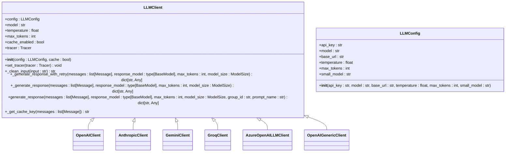
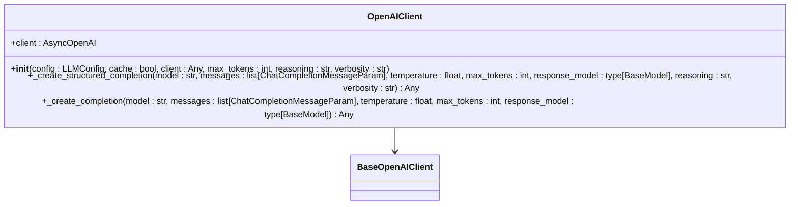
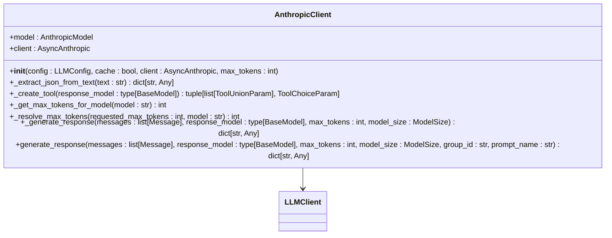
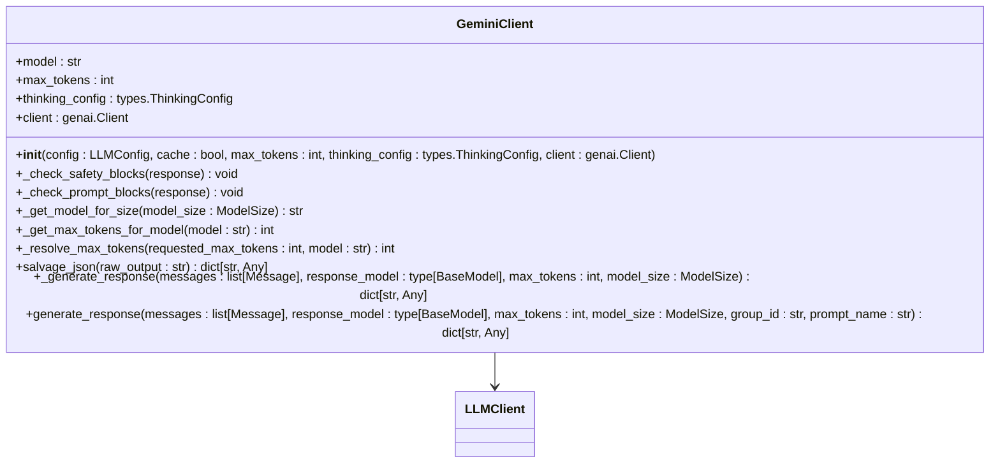
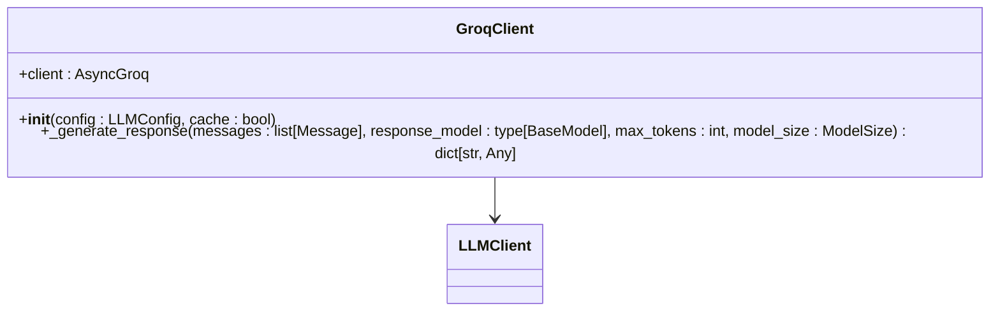
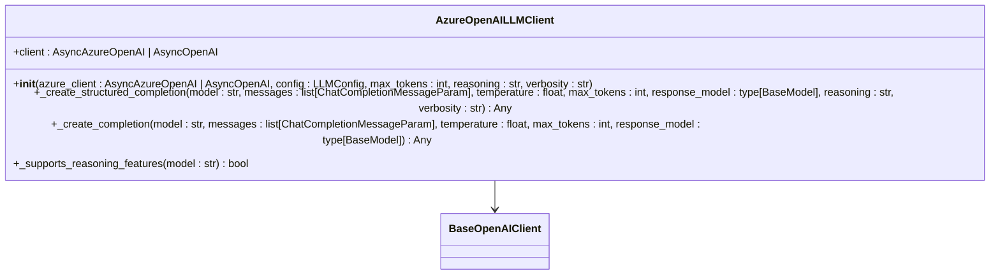
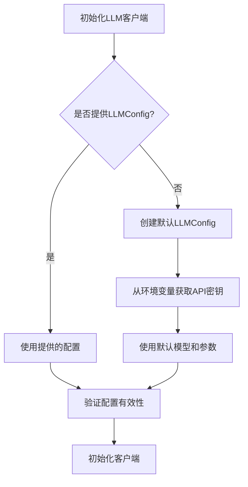
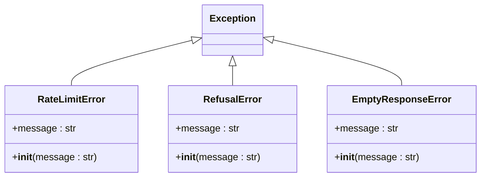
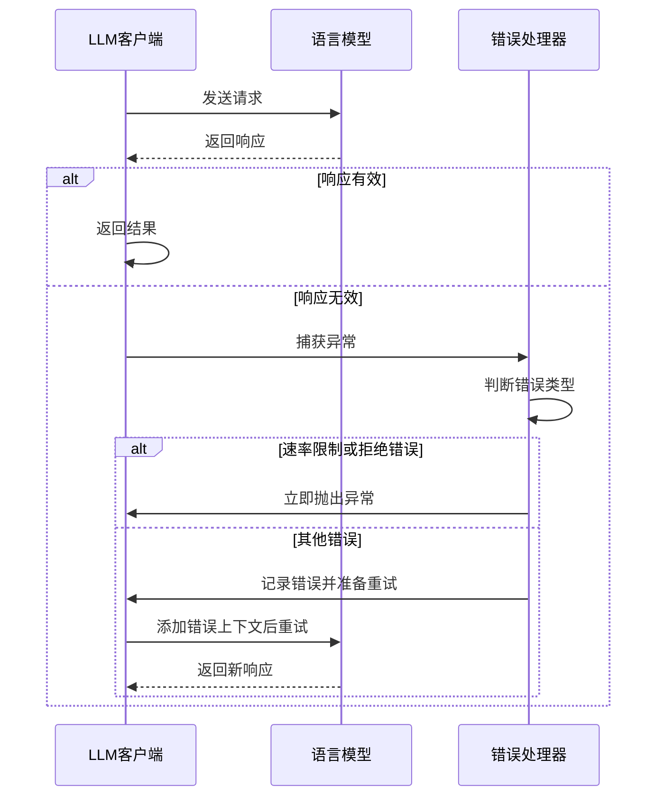
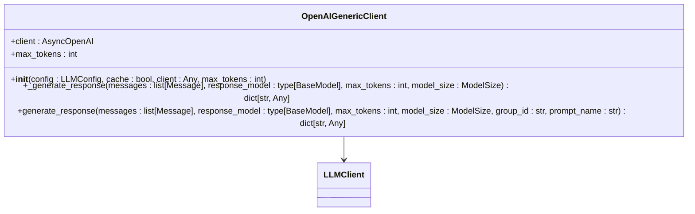

# LLM集成

<cite>
**本文档中引用的文件**  
- [client.py](file://graphiti_core/llm_client/client.py)
- [openai_client.py](file://graphiti_core/llm_client/openai_client.py)
- [anthropic_client.py](file://graphiti_core/llm_client/anthropic_client.py)
- [gemini_client.py](file://graphiti_core/llm_client/gemini_client.py)
- [groq_client.py](file://graphiti_core/llm_client/groq_client.py)
- [azure_openai_client.py](file://graphiti_core/llm_client/azure_openai_client.py)
- [openai_generic_client.py](file://graphiti_core/llm_client/openai_generic_client.py)
- [config.py](file://graphiti_core/llm_client/config.py)
- [openai_base_client.py](file://graphiti_core/llm_client/openai_base_client.py)
- [errors.py](file://graphiti_core/llm_client/errors.py)
- [test_client.py](file://tests/llm_client/test_client.py)
- [azure_openai_neo4j.py](file://examples/azure-openai/azure_openai_neo4j.py)
</cite>

## 目录
1. [简介](#简介)
2. [LLM客户端抽象层设计](#llm客户端抽象层设计)
3. [各LLM提供商客户端实现](#各llm提供商客户端实现)
4. [认证配置与请求参数](#认证配置与请求参数)
5. [错误处理与重试机制](#错误处理与重试机制)
6. [成本控制与性能优化](#成本控制与性能优化)
7. [自定义LLM端点扩展](#自定义llm端点扩展)
8. [最佳实践与使用示例](#最佳实践与使用示例)

## 简介

LLM集成文档全面覆盖对OpenAI、Anthropic、Gemini、Groq和Azure OpenAI的支持。文档详细解释了LLMClient抽象层的设计如何实现多提供商的无缝切换，以及各客户端的认证配置、请求参数和响应处理机制。同时，文档描述了错误处理与重试机制（Tenacity集成），并提供了成本控制、速率限制规避和响应质量优化的实用技巧。

**Section sources**
- [client.py](file://graphiti_core/llm_client/client.py#L1-L243)
- [config.py](file://graphiti_core/llm_client/config.py#L1-L69)

## LLM客户端抽象层设计

LLMClient抽象层通过定义统一的接口和基类，实现了多提供商的无缝切换。核心设计包括：

- **抽象基类LLMClient**：定义了所有LLM客户端必须实现的接口，包括`_generate_response`方法
- **配置管理**：通过LLMConfig类统一管理API密钥、模型、基础URL、温度和最大令牌数等配置
- **缓存机制**：支持通过DiskCache实现响应缓存，提高性能并减少API调用
- **追踪集成**：内置对OpenTelemetry的追踪支持，便于监控和调试



**Diagram sources**
- [client.py](file://graphiti_core/llm_client/client.py#L66-L243)
- [config.py](file://graphiti_core/llm_client/config.py#L28-L69)

**Section sources**
- [client.py](file://graphiti_core/llm_client/client.py#L66-L243)
- [config.py](file://graphiti_core/llm_client/config.py#L28-L69)

## 各LLM提供商客户端实现

### OpenAI客户端

OpenAIClient实现了与OpenAI API的集成，支持最新的结构化输出功能。它通过OpenAI的beta parse API实现结构化响应生成。



**Diagram sources**
- [openai_client.py](file://graphiti_core/llm_client/openai_client.py#L27-L116)
- [openai_base_client.py](file://graphiti_core/llm_client/openai_base_client.py#L40-L262)

### Anthropic客户端

AnthropicClient通过工具调用（tool use）机制实现结构化输出，支持Claude系列模型的最新功能。



**Diagram sources**
- [anthropic_client.py](file://graphiti_core/llm_client/anthropic_client.py#L103-L430)

### Gemini客户端

GeminiClient利用Google的genai库与Gemini API交互，支持结构化输出和思考配置。



**Diagram sources**
- [gemini_client.py](file://graphiti_core/llm_client/gemini_client.py#L69-L447)

### Groq客户端

GroqClient提供与Groq API的集成，支持Llama 3等高性能模型。



**Diagram sources**
- [groq_client.py](file://graphiti_core/llm_client/groq_client.py#L48-L86)

### Azure OpenAI客户端

AzureOpenAILLMClient专门用于与Azure OpenAI服务集成，支持Azure特有的API端点和部署配置。



**Diagram sources**
- [azure_openai_client.py](file://graphiti_core/llm_client/azure_openai_client.py#L30-L116)
- [openai_base_client.py](file://graphiti_core/llm_client/openai_base_client.py#L40-L262)

**Section sources**
- [openai_client.py](file://graphiti_core/llm_client/openai_client.py#L27-L116)
- [anthropic_client.py](file://graphiti_core/llm_client/anthropic_client.py#L103-L430)
- [gemini_client.py](file://graphiti_core/llm_client/gemini_client.py#L69-L447)
- [groq_client.py](file://graphiti_core/llm_client/groq_client.py#L48-L86)
- [azure_openai_client.py](file://graphiti_core/llm_client/azure_openai_client.py#L30-L116)

## 认证配置与请求参数

### 认证配置

各LLM客户端通过LLMConfig类统一管理认证配置：

- **API密钥**：通过`api_key`参数配置，也可从环境变量自动获取
- **基础URL**：通过`base_url`参数配置，支持自定义端点
- **模型选择**：通过`model`参数指定具体模型



**Diagram sources**
- [client.py](file://graphiti_core/llm_client/client.py#L66-L243)
- [config.py](file://graphiti_core/llm_client/config.py#L37-L69)

### 请求参数

#### 模型参数
- **模型**：通过`model`参数指定，支持不同提供商的模型
- **温度**：通过`temperature`参数控制输出的随机性
- **最大令牌数**：通过`max_tokens`参数限制响应长度

#### 上下文长度管理
各客户端实现了智能的上下文长度管理：

- **动态解析**：根据模型能力动态解析最大输出令牌数
- **优先级规则**：遵循参数优先级（显式参数 > 实例设置 > 模型限制 > 默认值）
- **模型特定限制**：内置各模型的最大令牌数映射

```python
# 示例：模型最大令牌数映射
ANTHROPIC_MODEL_MAX_TOKENS = {
    'claude-sonnet-4-5-latest': 65536,
    'claude-haiku-4-5-latest': 65536,
    'claude-3-5-haiku-latest': 8192,
    # ... 其他模型
}
```

**Section sources**
- [config.py](file://graphiti_core/llm_client/config.py#L19-L69)
- [anthropic_client.py](file://graphiti_core/llm_client/anthropic_client.py#L75-L97)
- [gemini_client.py](file://graphiti_core/llm_client/gemini_client.py#L50-L63)

## 错误处理与重试机制

### 错误类型

系统定义了多种错误类型以处理不同的异常情况：



**Diagram sources**
- [errors.py](file://graphiti_core/llm_client/errors.py#L18-L40)

### 重试策略

系统实现了智能的重试机制，不同错误类型有不同的处理策略：

- **速率限制错误**：立即失败，不进行重试
- **拒绝错误**：立即失败，不进行重试
- **其他错误**：最多重试2次，每次重试都会向LLM提供详细的错误上下文



**Diagram sources**
- [client.py](file://graphiti_core/llm_client/client.py#L110-L120)
- [anthropic_client.py](file://graphiti_core/llm_client/anthropic_client.py#L372-L430)
- [gemini_client.py](file://graphiti_core/llm_client/gemini_client.py#L391-L447)

### Tenacity集成

系统使用Tenacity库实现指数退避重试策略：

```python
@retry(
    stop=stop_after_attempt(4),
    wait=wait_random_exponential(multiplier=10, min=5, max=120),
    retry=retry_if_exception(is_server_or_retry_error),
    after=lambda retry_state: logger.warning(
        f'重试 {retry_state.fn.__name__ if retry_state.fn else "函数"} 在 {retry_state.attempt_number} 次尝试后...'
    ) if retry_state.attempt_number > 1 else None,
    reraise=True,
)
async def _generate_response_with_retry(...):
    # 实现细节
```

**Section sources**
- [client.py](file://graphiti_core/llm_client/client.py#L110-L120)
- [errors.py](file://graphiti_core/llm_client/errors.py#L18-L40)

## 成本控制与性能优化

### 缓存机制

系统支持响应缓存以减少API调用和成本：

- **缓存启用**：通过`cache=True`参数启用
- **缓存目录**：默认使用`./llm_cache`目录
- **缓存键生成**：基于消息内容和模型生成唯一缓存键

```python
def _get_cache_key(self, messages: list[Message]) -> str:
    message_str = json.dumps([m.model_dump() for m in messages], sort_keys=True)
    key_str = f'{self.model}:{message_str}'
    return hashlib.md5(key_str.encode()).hexdigest()
```

### 输入清理

系统自动清理输入文本中的无效字符：

- **无效Unicode**：移除无效的Unicode字符
- **零宽度字符**：移除零宽度空格等不可见字符
- **控制字符**：移除除换行符、回车符和制表符外的控制字符

```python
def _clean_input(self, input: str) -> str:
    # 清理无效Unicode
    cleaned = input.encode('utf-8', errors='ignore').decode('utf-8')
    
    # 移除零宽度字符
    zero_width = '\u200b\u200c\u200d\ufeff\u2060'
    for char in zero_width:
        cleaned = cleaned.replace(char, '')
    
    # 移除控制字符
    cleaned = ''.join(char for char in cleaned if ord(char) >= 32 or char in '\n\r\t')
    
    return cleaned
```

### 响应质量优化

系统提供了多种机制来优化响应质量：

- **多语言提取指令**：自动添加语言提取指令
- **JSON恢复**：尝试从截断的输出中恢复JSON
- **安全检查**：检查Gemini的安全过滤器阻止

**Section sources**
- [client.py](file://graphiti_core/llm_client/client.py#L88-L108)
- [gemini_client.py](file://graphiti_core/llm_client/gemini_client.py#L200-L232)

## 自定义LLM端点扩展

### OpenAIGenericClient

OpenAIGenericClient支持自定义OpenAI兼容的端点，特别适用于本地模型部署：



**Diagram sources**
- [openai_generic_client.py](file://graphiti_core/llm_client/openai_generic_client.py#L37-L215)

### 使用示例

```python
# 配置自定义端点
config = LLMConfig(
    api_key="your-api-key",
    base_url="http://localhost:8080/v1",  # 自定义端点
    model="llama-3-8b"
)

# 创建客户端
client = OpenAIGenericClient(config=config, max_tokens=16384)
```

**Section sources**
- [openai_generic_client.py](file://graphiti_core/llm_client/openai_generic_client.py#L37-L215)

## 最佳实践与使用示例

### Azure OpenAI集成示例

```python
# 初始化Azure OpenAI客户端
azure_client = AsyncOpenAI(
    base_url=f'{azure_endpoint}/openai/v1/',
    api_key=azure_api_key,
)

# 创建LLM和嵌入客户端
llm_client = AzureOpenAILLMClient(
    azure_client=azure_client,
    config=LLMConfig(model=azure_deployment, small_model=azure_deployment),
)
embedder_client = AzureOpenAIEmbedderClient(
    azure_client=azure_client, model=azure_embedding_deployment
)

# 初始化Graphiti
graphiti = Graphiti(
    neo4j_uri,
    neo4j_user,
    neo4j_password,
    llm_client=llm_client,
    embedder=embedder_client,
)
```

### 错误处理最佳实践

- **速率限制**：立即失败，避免不必要的重试
- **内容拒绝**：立即失败，重试不会改变结果
- **连接错误**：让底层客户端处理重试
- **解析错误**：提供详细的错误上下文给LLM

### 性能优化建议

1. **启用缓存**：对于重复的请求，启用缓存可以显著降低成本
2. **合理设置温度**：根据用例调整温度参数
3. **优化上下文长度**：根据实际需要设置最大令牌数
4. **使用合适的模型**：根据任务复杂度选择small或medium模型

**Section sources**
- [azure_openai_neo4j.py](file://examples/azure-openai/azure_openai_neo4j.py#L68-L226)
- [test_client.py](file://tests/llm_client/test_client.py#L21-L58)