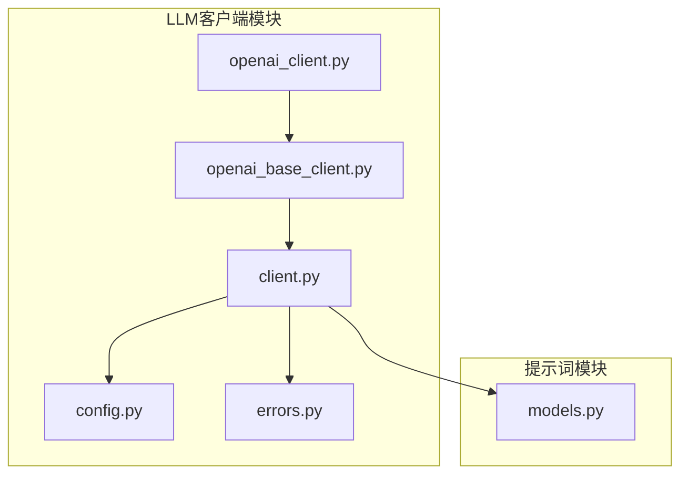
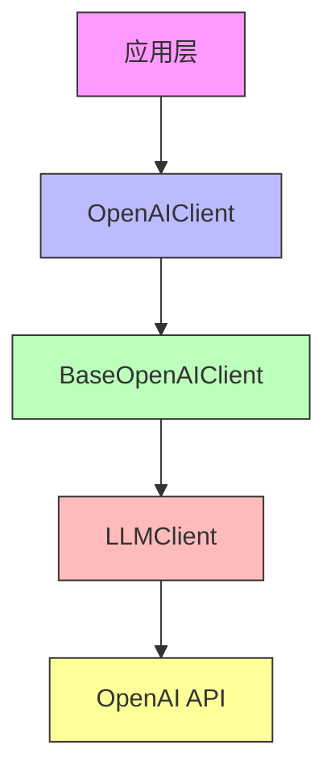
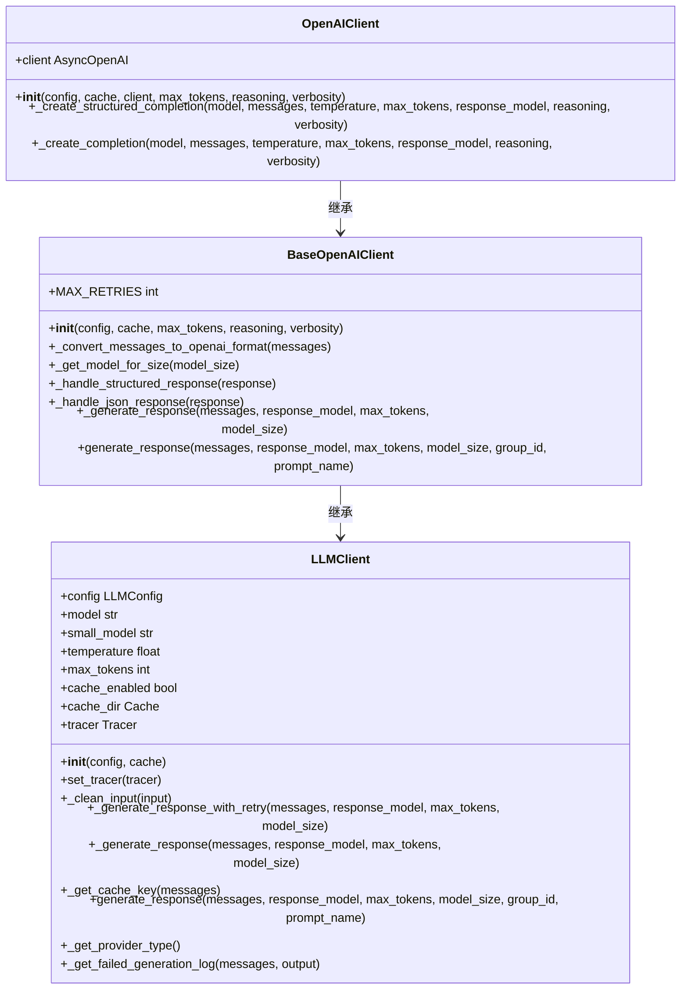
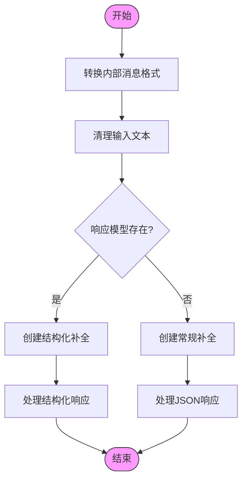
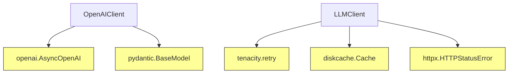
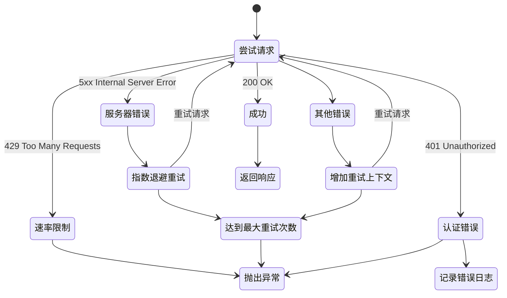

# OpenAI集成

<cite>
**本文档中引用的文件**
- [openai_client.py](file://graphiti_core/llm_client/openai_client.py)
- [openai_base_client.py](file://graphiti_core/llm_client/openai_base_client.py)
- [client.py](file://graphiti_core/llm_client/client.py)
- [config.py](file://graphiti_core/llm_client/config.py)
- [errors.py](file://graphiti_core/llm_client/errors.py)
- [models.py](file://graphiti_core/prompts/models.py)
</cite>

## 目录
1. [简介](#简介)
2. [项目结构](#项目结构)
3. [核心组件](#核心组件)
4. [架构概述](#架构概述)
5. [详细组件分析](#详细组件分析)
6. [依赖分析](#依赖分析)
7. [性能考虑](#性能考虑)
8. [故障排除指南](#故障排除指南)
9. [结论](#结论)

## 简介
本文档详细说明了Graphiti项目中OpenAI客户端的实现和配置。文档涵盖了通过OpenAI API密钥进行认证、配置模型参数（如gpt-4、gpt-3.5-turbo）、温度、最大token数等。描述了其作为LLMClient抽象的实现，如何处理结构化输出（Pydantic模型解析）、重试机制（Tenacity）和缓存策略。提供了在Graphiti核心流程中调用OpenAI进行实体提取、关系生成和文本摘要的实际代码示例。说明了错误处理流程，包括速率限制（RateLimitError）和服务器错误的自动重试。涵盖了性能优化建议，如合理设置temperature以平衡创造性与确定性。

## 项目结构
Graphiti项目的OpenAI集成主要位于`graphiti_core/llm_client`目录下，该目录包含了与语言模型客户端相关的所有核心实现。主要组件包括OpenAIClient的具体实现、基础客户端类、配置管理、错误处理以及通用LLM客户端抽象。

**图示来源**
- [openai_client.py](file://graphiti_core/llm_client/openai_client.py)
- [openai_base_client.py](file://graphiti_core/llm_client/openai_base_client.py)
- [client.py](file://graphiti_core/llm_client/client.py)
- [config.py](file://graphiti_core/llm_client/config.py)
- [errors.py](file://graphiti_core/llm_client/errors.py)
- [models.py](file://graphiti_core/prompts/models.py)

## 核心组件
OpenAI集成的核心组件包括OpenAIClient类，它是与OpenAI API交互的主要接口。该类继承自BaseOpenAIClient，提供了OpenAI特定的实现来创建补全。LLMClient是所有语言模型客户端的抽象基类，定义了通用接口。LLMConfig类封装了与LLM API交互所需的参数，如API密钥、模型名称和基础URL。

**节来源**
- [openai_client.py](file://graphiti_core/llm_client/openai_client.py#L27-L115)
- [client.py](file://graphiti_core/llm_client/client.py#L66-L243)
- [config.py](file://graphiti_core/llm_client/config.py#L28-L68)

## 架构概述
OpenAI集成采用分层架构设计，从上到下分别为：应用层、客户端实现层、基础客户端层和抽象层。这种设计模式实现了代码复用并允许不同OpenAI兼容API的实现差异。

**图示来源**
- [openai_client.py](file://graphiti_core/llm_client/openai_client.py)
- [openai_base_client.py](file://graphiti_core/llm_client/openai_base_client.py)
- [client.py](file://graphiti_core/llm_client/client.py)

## 详细组件分析
### OpenAIClient分析
OpenAIClient是与OpenAI语言模型交互的客户端类。它扩展了BaseOpenAIClient并提供了OpenAI特定的实现来创建补全。客户端使用AsyncOpenAI库与OpenAI API进行异步通信。

#### 类结构

**图示来源**
- [openai_client.py](file://graphiti_core/llm_client/openai_client.py#L27-L115)
- [openai_base_client.py](file://graphiti_core/llm_client/openai_base_client.py#L40-L261)
- [client.py](file://graphiti_core/llm_client/client.py#L66-L243)

#### 消息处理流程

**图示来源**
- [openai_base_client.py](file://graphiti_core/llm_client/openai_base_client.py#L132-L163)

## 依赖分析
OpenAI客户端的实现依赖于多个外部库和内部模块。主要外部依赖包括openai库用于API通信，pydantic用于数据验证和序列化，tenacity用于重试机制，diskcache用于响应缓存。

**图示来源**
- [openai_client.py](file://graphiti_core/llm_client/openai_client.py#L19-L21)
- [client.py](file://graphiti_core/llm_client/client.py#L23-L26)
- [openai_base_client.py](file://graphiti_core/llm_client/openai_base_client.py#L23-L25)

## 性能考虑
在使用OpenAI集成时，需要考虑多个性能因素。首先，合理设置temperature参数以平衡创造性与确定性：较低的温度值（接近0）会产生更确定性和一致性的输出，而较高的温度值会产生更多样化和创造性的输出。其次，max_tokens参数应根据预期响应大小进行设置，避免不必要的资源消耗。对于推理模型（如gpt-5系列），temperature参数不被支持。

## 故障排除指南
### 错误处理流程
OpenAI集成实现了全面的错误处理机制。当遇到速率限制错误（RateLimitError）时，系统会立即抛出异常而不进行重试。对于服务器错误（5xx状态码）、API超时和连接错误，系统会使用tenacity库的指数退避策略进行自动重试。

**节来源**
- [errors.py](file://graphiti_core/llm_client/errors.py#L18-L40)
- [client.py](file://graphiti_core/llm_client/client.py#L57-L63)
- [openai_base_client.py](file://graphiti_core/llm_client/openai_base_client.py#L164-L182)

## 结论
Graphiti的OpenAI集成提供了一个健壮、可扩展的接口来与OpenAI语言模型进行交互。通过分层架构设计，实现了代码复用和关注点分离。集成支持结构化输出、自动重试、缓存和全面的错误处理，使其成为构建基于LLM应用的可靠基础。开发者可以通过配置LLMConfig对象来轻松定制模型参数、认证信息和行为特征，同时利用内置的性能优化和故障排除功能。