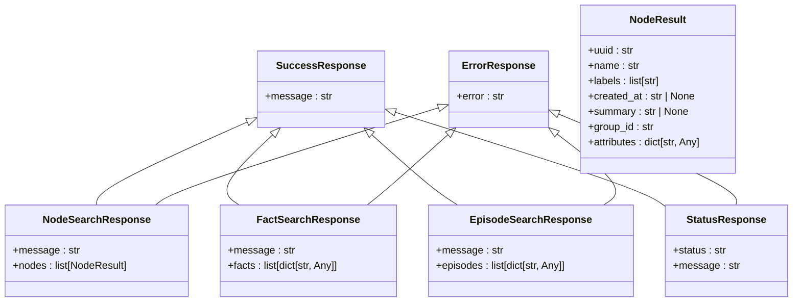
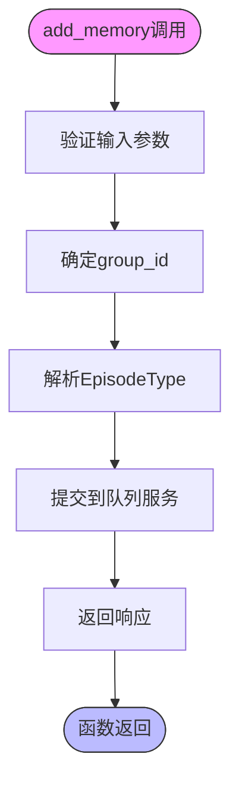
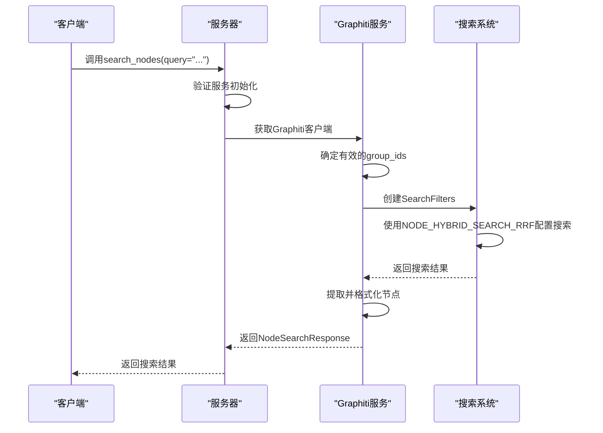
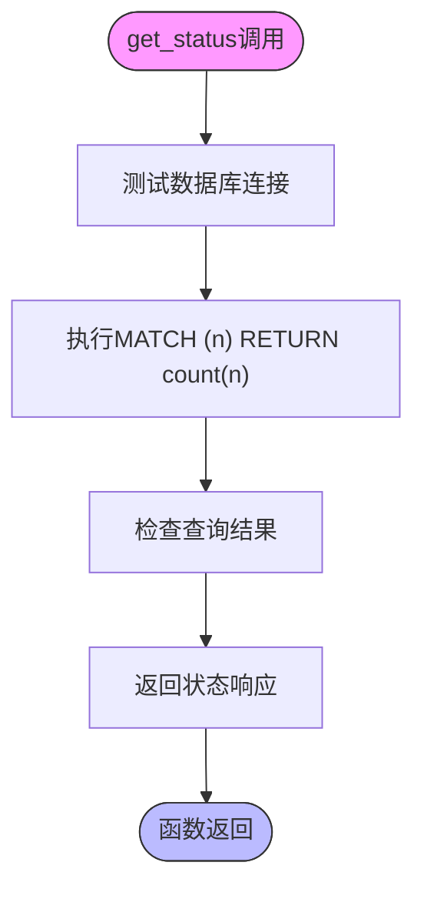
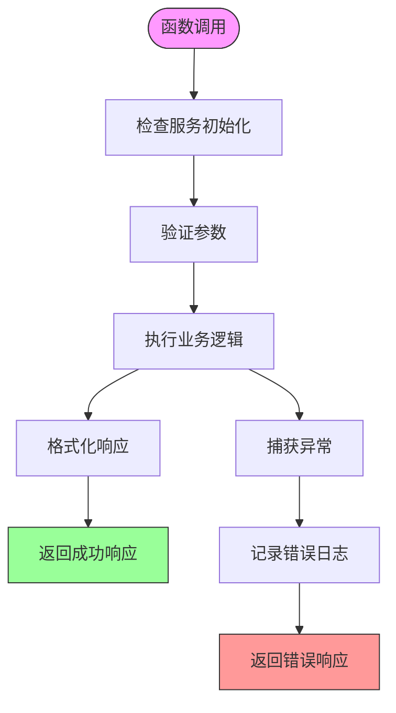

# API接口与工具函数

<cite>
**本文档中引用的文件**   
- [graphiti_mcp_server.py](file://mcp_server/src/graphiti_mcp_server.py)
- [response_types.py](file://mcp_server/src/models/response_types.py)
- [schema.py](file://mcp_server/src/config/schema.py)
- [queue_service.py](file://mcp_server/src/services/queue_service.py)
- [formatting.py](file://mcp_server/src/utils/formatting.py)
- [graphiti.py](file://graphiti_core/graphiti.py)
- [nodes.py](file://graphiti_core/nodes.py)
- [edges.py](file://graphiti_core/edges.py)
- [decorators.py](file://graphiti_core/decorators.py)
</cite>

## 目录
1. [简介](#简介)
2. [核心工具函数](#核心工具函数)
3. [请求与响应结构](#请求与响应结构)
4. [工具函数详解](#工具函数详解)
5. [使用场景与最佳实践](#使用场景与最佳实践)
6. [错误处理策略](#错误处理策略)
7. [配置与初始化](#配置与初始化)

## 简介

Graphiti MCP服务器提供了一套完整的API接口，用于管理基于知识图谱的记忆服务。该系统通过Model Context Protocol (MCP)协议暴露其核心功能，允许AI代理与知识图谱进行交互。服务器支持多种数据库后端（FalkorDB和Neo4j）和LLM提供商（OpenAI、Anthropic等），并提供了丰富的工具函数来管理记忆数据。

核心功能包括添加记忆片段（episodes）、搜索节点和事实、管理图谱数据等。所有工具函数都通过`@mcp.tool()`装饰器暴露，并支持异步处理和并发控制。系统使用`group_id`来组织和隔离不同的知识域，确保数据的逻辑分离。

**文档来源**
- [graphiti_mcp_server.py](file://mcp_server/src/graphiti_mcp_server.py#L1-L100)
- [README.md](file://mcp_server/README.md#L1-L100)

## 核心工具函数

MCP服务器暴露了多个核心工具函数，用于管理知识图谱中的数据。这些函数通过JSON-RPC协议调用，支持异步处理和并发控制。主要工具函数包括：

- `add_memory`: 添加记忆片段到知识图谱
- `search_nodes`: 搜索图谱中的节点
- `search_memory_facts`: 搜索图谱中的事实（边）
- `delete_entity_edge`: 删除实体边
- `delete_episode`: 删除记忆片段
- `get_entity_edge`: 获取实体边
- `get_episodes`: 获取记忆片段
- `clear_graph`: 清除图谱数据
- `get_status`: 获取服务器状态

这些工具函数通过`@mcp.tool()`装饰器注册，并在`graphiti_mcp_server.py`文件中定义。每个函数都有详细的参数定义和错误处理机制，确保系统的稳定性和可靠性。

**文档来源**
- [graphiti_mcp_server.py](file://mcp_server/src/graphiti_mcp_server.py#L321-L754)

## 请求与响应结构

### 响应类型定义

服务器使用Pydantic的`TypedDict`来定义响应结构，确保类型安全和一致性。主要响应类型包括：



**图表来源**
- [response_types.py](file://mcp_server/src/models/response_types.py#L8-L44)

### 请求参数约束

所有工具函数的参数都经过严格的类型检查和约束验证。例如，`add_memory`函数的`source`参数必须是`text`、`json`或`message`之一，`max_nodes`参数必须是正整数。这些约束在函数定义中通过类型注解和运行时检查来实现。

**文档来源**
- [graphiti_mcp_server.py](file://mcp_server/src/graphiti_mcp_server.py#L322-L754)
- [response_types.py](file://mcp_server/src/models/response_types.py#L8-L44)

## 工具函数详解

### add_memory

`add_memory`函数用于将记忆片段添加到知识图谱中。该函数返回后立即开始后台处理，确保非阻塞操作。

**参数定义**
- `name` (str): 记忆片段的名称
- `episode_body` (str): 记忆内容，当`source='json'`时必须是正确转义的JSON字符串
- `group_id` (str, optional): 图谱的唯一ID，默认使用CLI或生成的ID
- `source` (str, optional): 源类型，必须是以下之一：
  - `text`: 纯文本内容（默认）
  - `json`: 结构化数据
  - `message`: 对话式内容
- `source_description` (str, optional): 源描述
- `uuid` (str, optional): 记忆片段的UUID

**业务逻辑**
1. 使用提供的`group_id`或配置中的默认值
2. 将`source`参数转换为`EpisodeType`枚举
3. 将任务提交到队列服务进行异步处理
4. 返回成功或错误响应



**图表来源**
- [graphiti_mcp_server.py](file://mcp_server/src/graphiti_mcp_server.py#L321-L405)
- [queue_service.py](file://mcp_server/src/services/queue_service.py#L101-L153)

### search_nodes

`search_nodes`函数用于在知识图谱中搜索节点。

**参数定义**
- `query` (str): 搜索查询
- `group_ids` (list[str], optional): 用于过滤结果的group ID列表
- `max_nodes` (int, optional): 返回的最大节点数（默认：10）
- `entity_types` (list[str], optional): 用于过滤的实体类型名称列表

**业务逻辑**
1. 使用提供的`group_ids`或配置中的默认值
2. 创建搜索过滤器
3. 使用混合搜索配置执行搜索
4. 格式化结果并返回



**图表来源**
- [graphiti_mcp_server.py](file://mcp_server/src/graphiti_mcp_server.py#L407-L485)

### search_memory_facts

`search_memory_facts`函数用于搜索知识图谱中的相关事实。

**参数定义**
- `query` (str): 搜索查询
- `group_ids` (list[str], optional): 用于过滤结果的group ID列表
- `max_facts` (int, optional): 返回的最大事实数（默认：10）
- `center_node_uuid` (str, optional): 用于围绕搜索的节点UUID

**业务逻辑**
1. 验证`max_facts`参数为正整数
2. 使用提供的`group_ids`或配置中的默认值
3. 调用`client.search`方法执行搜索
4. 格式化结果并返回

**图表来源**
- [graphiti_mcp_server.py](file://mcp_server/src/graphiti_mcp_server.py#L487-L539)

### delete_entity_edge

`delete_entity_edge`函数用于从知识图谱中删除实体边。

**参数定义**
- `uuid` (str): 要删除的实体边的UUID

**业务逻辑**
1. 通过UUID获取实体边
2. 使用`delete`方法删除边
3. 返回成功或错误响应

**图表来源**
- [graphiti_mcp_server.py](file://mcp_server/src/graphiti_mcp_server.py#L541-L565)
- [edges.py](file://graphiti_core/edges.py#L45-L84)

### delete_episode

`delete_episode`函数用于从知识图谱中删除记忆片段。

**参数定义**
- `uuid` (str): 要删除的记忆片段的UUID

**业务逻辑**
1. 通过UUID获取记忆节点
2. 使用`delete`方法删除节点
3. 返回成功或错误响应

**图表来源**
- [graphiti_mcp_server.py](file://mcp_server/src/graphiti_mcp_server.py#L567-L591)
- [nodes.py](file://graphiti_core/nodes.py#L97-L151)

### get_entity_edge

`get_entity_edge`函数用于通过UUID从知识图谱中获取实体边。

**参数定义**
- `uuid` (str): 要检索的实体边的UUID

**业务逻辑**
1. 通过`EntityEdge.get_by_uuid`方法获取实体边
2. 使用`format_fact_result`函数序列化边
3. 返回结果或错误响应

**图表来源**
- [graphiti_mcp_server.py](file://mcp_server/src/graphiti_mcp_server.py#L593-L617)
- [formatting.py](file://mcp_server/src/utils/formatting.py#L32-L51)

### get_episodes

`get_episodes`函数用于从知识图谱中获取记忆片段。

**参数定义**
- `group_ids` (list[str], optional): 用于过滤结果的group ID列表
- `max_episodes` (int, optional): 返回的最大记忆片段数（默认：10）

**业务逻辑**
1. 使用提供的`group_ids`或配置中的默认值
2. 通过`EpisodicNode.get_by_group_ids`方法获取记忆片段
3. 格式化结果并返回

**图表来源**
- [graphiti_mcp_server.py](file://mcp_server/src/graphiti_mcp_server.py#L620-L685)
- [nodes.py](file://graphiti_core/nodes.py#L87-L200)

### clear_graph

`clear_graph`函数用于清除指定group ID的知识图谱数据。

**参数定义**
- `group_ids` (list[str], optional): 要清除的group ID列表。如果未提供，则清除默认group。

**业务逻辑**
1. 使用提供的`group_ids`或配置中的默认值
2. 验证至少指定了一个group ID
3. 调用`clear_data`函数清除数据
4. 返回成功或错误响应

**图表来源**
- [graphiti_mcp_server.py](file://mcp_server/src/graphiti_mcp_server.py#L688-L720)
- [graphiti.py](file://graphiti_core/graphiti.py#L89-L92)

### get_status

`get_status`函数用于获取Graphiti MCP服务器和数据库连接的状态。

**业务逻辑**
1. 测试数据库连接，执行简单查询
2. 返回状态响应，包含连接信息
3. 如果连接失败，返回错误状态



**图表来源**
- [graphiti_mcp_server.py](file://mcp_server/src/graphiti_mcp_server.py#L723-L753)

## 使用场景与最佳实践

### add_memory的异步处理

`add_memory`函数的异步处理特性使其非常适合处理大量记忆片段。系统使用`QueueService`来管理按`group_id`分组的顺序处理队列，避免竞争条件。

**最佳实践**
- 为相关数据使用相同的`group_id`
- 对于JSON数据，确保内容是正确转义的JSON字符串
- 使用描述性名称和详细内容以提高搜索质量

### search_nodes的混合检索机制

`search_nodes`使用混合搜索机制，结合了语义搜索和基于规则的搜索。系统使用`NODE_HYBRID_SEARCH_RRF`配置来执行搜索，确保结果的相关性和准确性。

**最佳实践**
- 使用具体查询以获得更相关的结果
- 考虑按`group_id`过滤以缩小搜索范围
- 利用实体类型过滤来提高搜索精度

### clear_graph的分组清理功能

`clear_graph`函数支持按`group_id`清理数据，允许精细控制数据清除操作。

**最佳实践**
- 在测试环境中使用`clear_graph`来重置状态
- 生产环境中谨慎使用，避免意外数据丢失
- 清理前确认`group_id`的正确性

**文档来源**
- [graphiti_mcp_server.py](file://mcp_server/src/graphiti_mcp_server.py#L321-L754)
- [queue_service.py](file://mcp_server/src/services/queue_service.py#L12-L153)

## 错误处理策略

### 统一错误响应

所有工具函数都返回统一的`ErrorResponse`结构，包含错误消息。系统在捕获异常时记录错误日志，并返回用户友好的错误消息。

```python
class ErrorResponse(TypedDict):
    error: str
```

### 异常处理模式

每个工具函数都使用类似的异常处理模式：



### 具体错误处理

- `add_memory`: 处理队列提交错误
- `search_nodes`: 处理搜索执行错误
- `search_memory_facts`: 验证`max_facts`参数
- `delete_entity_edge`: 处理边删除错误
- `clear_graph`: 验证`group_ids`参数

**图表来源**
- [graphiti_mcp_server.py](file://mcp_server/src/graphiti_mcp_server.py#L321-L754)

## 配置与初始化

### 配置系统

服务器使用Pydantic Settings进行配置管理，支持YAML文件、环境变量和命令行参数。配置优先级为：命令行参数 > 环境变量 > YAML文件 > 默认值。

**主要配置项**
- `server`: 服务器配置（传输、主机、端口）
- `llm`: LLM配置（提供商、模型）
- `embedder`: 嵌入配置（提供商、模型）
- `database`: 数据库配置（提供商）
- `graphiti`: Graphiti特定配置（group_id、用户ID）

### 并发控制

系统通过`SEMAPHORE_LIMIT`环境变量控制并发操作。此设置决定了可以同时处理多少个记忆片段。每个记忆片段处理涉及多个LLM调用，因此实际的并发LLM请求数会更高。

**调优指南**
- OpenAI Tier 1 (免费): 3 RPM → `SEMAPHORE_LIMIT=1-2`
- OpenAI Tier 2: 60 RPM → `SEMAPHORE_LIMIT=5-8`
- OpenAI Tier 3: 500 RPM → `SEMAPHORE_LIMIT=10-15`
- Anthropic (默认): 50 RPM → `SEMAPHORE_LIMIT=5-8`

**文档来源**
- [schema.py](file://mcp_server/src/config/schema.py#L76-L292)
- [graphiti_mcp_server.py](file://mcp_server/src/graphiti_mcp_server.py#L48-L75)