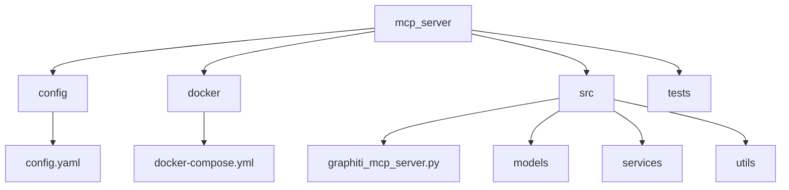
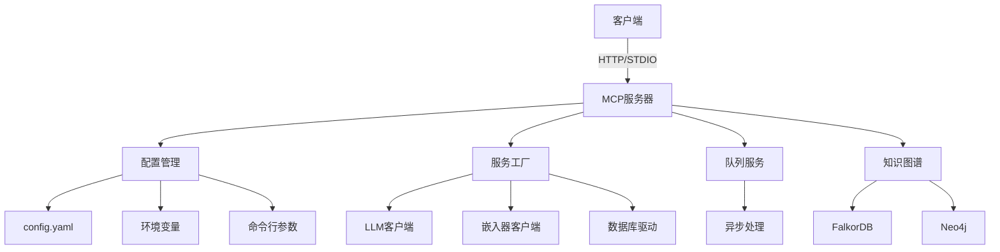
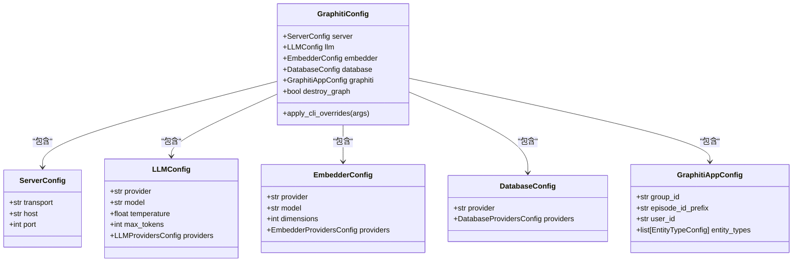
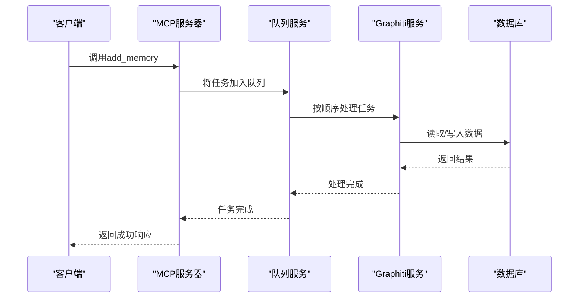
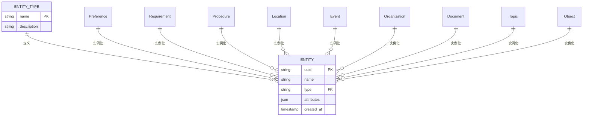

# MCP服务器

<cite>
**本文档中引用的文件**   
- [main.py](file://mcp_server/main.py)
- [graphiti_mcp_server.py](file://mcp_server/src/graphiti_mcp_server.py)
- [config.yaml](file://mcp_server/config/config.yaml)
- [docker-compose.yml](file://mcp_server/docker/docker-compose.yml)
- [entity_types.py](file://mcp_server/src/models/entity_types.py)
- [response_types.py](file://mcp_server/src/models/response_types.py)
- [schema.py](file://mcp_server/src/config/schema.py)
- [factories.py](file://mcp_server/src/services/factories.py)
- [queue_service.py](file://mcp_server/src/services/queue_service.py)
- [formatting.py](file://mcp_server/src/utils/formatting.py)
</cite>

## 目录
1. [简介](#简介)
2. [项目结构](#项目结构)
3. [核心组件](#核心组件)
4. [架构概述](#架构概述)
5. [详细组件分析](#详细组件分析)
6. [依赖分析](#依赖分析)
7. [性能考虑](#性能考虑)
8. [故障排除指南](#故障排除指南)
9. [结论](#结论)

## 简介
MCP（Model Context Protocol）服务器是Graphiti框架的一个实验性实现，旨在为AI代理提供一个标准化的接口来管理上下文。该服务器通过MCP协议暴露Graphiti的核心功能，使AI助手能够与知识图谱能力进行交互。它支持动态数据（如用户交互、企业数据和外部信息）的持续集成，将信息转化为丰富连接的知识网络。服务器支持多种数据格式，包括结构化JSON数据，并通过分组ID组织信息，允许维护独立的知识域。

## 项目结构
MCP服务器的项目结构清晰，主要组件位于`mcp_server`目录下。该结构支持模块化配置和部署。



**图源**
- [config.yaml](file://mcp_server/config/config.yaml)
- [docker-compose.yml](file://mcp_server/docker/docker-compose.yml)

**节源**
- [config.yaml](file://mcp_server/config/config.yaml)
- [docker-compose.yml](file://mcp_server/docker/docker-compose.yml)

## 核心组件
MCP服务器的核心组件包括配置管理、模型服务、工具实现和队列服务。服务器使用`config.yaml`文件、环境变量或命令行参数进行配置，其中命令行参数优先级最高。`graphiti_mcp_server.py`是主入口点，负责初始化服务和处理MCP工具调用。`queue_service.py`确保同一组ID的事件按顺序处理，避免竞争条件。

**节源**
- [graphiti_mcp_server.py](file://mcp_server/src/graphiti_mcp_server.py)
- [queue_service.py](file://mcp_server/src/services/queue_service.py)

## 架构概述
MCP服务器采用模块化架构，基于Python实现，通过FastMCP库暴露MCP协议。服务器支持HTTP和stdio传输协议，默认使用HTTP。它通过工厂模式创建LLM、嵌入器和数据库驱动实例，支持多种后端，包括FalkorDB（默认）和Neo4j。服务器使用异步处理和信号量限制来管理并发，防止LLM提供商的速率限制错误。



**图源**
- [graphiti_mcp_server.py](file://mcp_server/src/graphiti_mcp_server.py)
- [factories.py](file://mcp_server/src/services/factories.py)

## 详细组件分析

### 配置管理分析
配置管理是MCP服务器的核心，它通过`schema.py`中的Pydantic模型定义配置结构，并支持YAML文件、环境变量和命令行参数的多层配置。

#### 配置模型


**图源**
- [schema.py](file://mcp_server/src/config/schema.py)

### 工具实现分析
MCP服务器通过`@mcp.tool()`装饰器实现了一系列工具，这些工具允许AI代理与知识图谱进行交互。

#### 工具调用流程


**图源**
- [graphiti_mcp_server.py](file://mcp_server/src/graphiti_mcp_server.py)
- [queue_service.py](file://mcp_server/src/services/queue_service.py)

### 实体类型分析
实体类型用于结构化知识提取，服务器内置了多种实体类型，如偏好、需求、程序等，这些类型在`entity_types.py`中定义。

#### 实体类型关系


**图源**
- [entity_types.py](file://mcp_server/src/models/entity_types.py)

**节源**
- [entity_types.py](file://mcp_server/src/models/entity_types.py)

## 依赖分析
MCP服务器依赖于多个外部库和组件，这些依赖关系通过`pyproject.toml`文件管理。

```mermaid
graph TD
A[MCP服务器] --> B[mcp>=1.9.4]
A --> C[openai>=1.91.0]
A --> D[graphiti-core[falkordb]>=0.23.1]
A --> E[pydantic-settings>=2.0.0]
A --> F[pyyaml>=6.0]
A --> G[typing-extensions>=4.0.0]
D --> H[FalkorDB]
D --> I[Neo4j]
C --> J[OpenAI API]
B --> K[FastMCP]
```

**图源**
- [pyproject.toml](file://mcp_server/pyproject.toml)

**节源**
- [pyproject.toml](file://mcp_server/pyproject.toml)

## 性能考虑
MCP服务器的性能受LLM提供商的速率限制影响，通过`SEMAPHORE_LIMIT`环境变量控制并发。默认值为10，适用于OpenAI Tier 3和中等级别的Anthropic。用户应根据其LLM提供商的层级调整此值，以避免429速率限制错误或未充分利用API配额。

## 故障排除指南
常见问题包括数据库连接错误和LLM速率限制错误。对于数据库连接错误，请确保FalkorDB或Neo4j正在运行。对于速率限制错误，请降低`SEMAPHORE_LIMIT`值。服务器日志提供了详细的错误信息，帮助诊断问题。

**节源**
- [graphiti_mcp_server.py](file://mcp_server/src/graphiti_mcp_server.py)

## 结论
MCP服务器为AI代理提供了一个强大的上下文管理服务，通过标准化的MCP协议与知识图谱进行交互。其模块化架构、灵活的配置选项和对多种后端的支持使其适用于各种应用场景。通过适当的配置和调优，可以实现高性能和可靠的上下文管理。