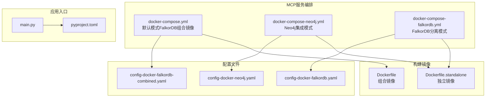
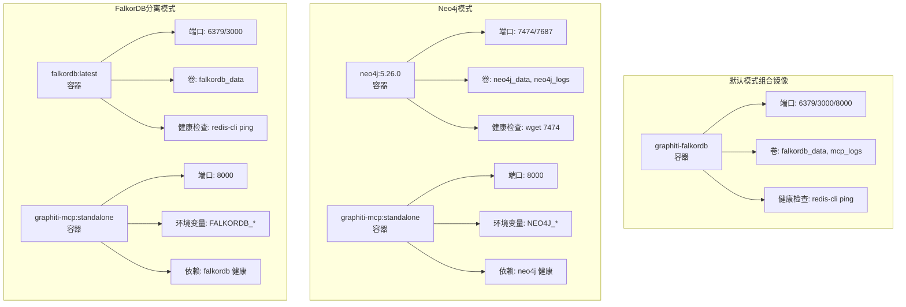
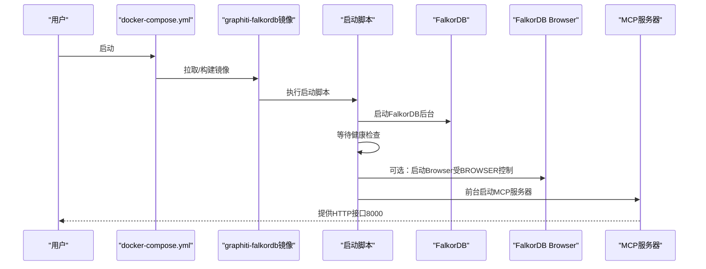
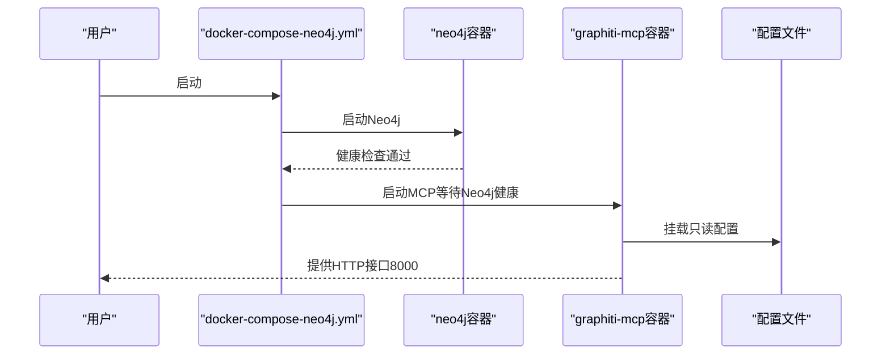
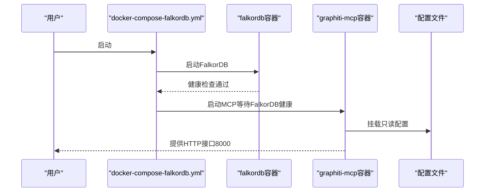
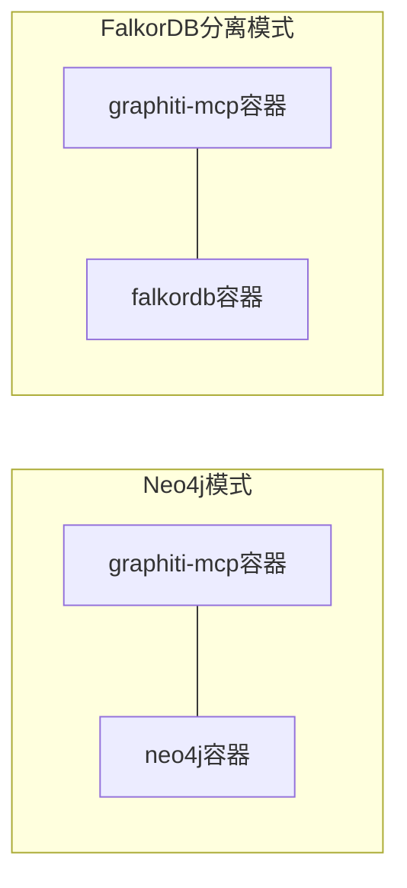

# Docker Compose编排

<cite>
**本文引用的文件**
- [docker-compose.yml](file://mcp_server/docker/docker-compose.yml)
- [docker-compose-neo4j.yml](file://mcp_server/docker/docker-compose-neo4j.yml)
- [docker-compose-falkordb.yml](file://mcp_server/docker/docker-compose-falkordb.yml)
- [config-docker-neo4j.yaml](file://mcp_server/config/config-docker-neo4j.yaml)
- [config-docker-falkordb.yaml](file://mcp_server/config/config-docker-falkordb.yaml)
- [config-docker-falkordb-combined.yaml](file://mcp_server/config/config-docker-falkordb-combined.yaml)
- [README.md](file://mcp_server/docker/README.md)
- [README-falkordb-combined.md](file://mcp_server/docker/README-falkordb-combined.md)
- [Dockerfile](file://mcp_server/docker/Dockerfile)
- [Dockerfile.standalone](file://mcp_server/docker/Dockerfile.standalone)
- [main.py](file://mcp_server/main.py)
- [pyproject.toml](file://mcp_server/pyproject.toml)
</cite>

## 目录
1. [简介](#简介)
2. [项目结构](#项目结构)
3. [核心组件](#核心组件)
4. [架构总览](#架构总览)
5. [详细组件分析](#详细组件分析)
6. [依赖关系分析](#依赖关系分析)
7. [性能考虑](#性能考虑)
8. [故障排查指南](#故障排查指南)
9. [结论](#结论)
10. [附录](#附录)

## 简介
本文件系统性解析MCP服务器在Docker Compose中的编排配置，覆盖以下要点：
- 三种部署模式的差异与适用场景：默认模式（FalkorDB组合镜像）、Neo4j集成模式、FalkorDB分离模式
- 容器间网络、环境变量注入、数据卷挂载与端口映射
- 服务依赖关系、启动顺序控制与健康检查
- 实际部署步骤与常见问题处理

## 项目结构
围绕MCP服务器的Docker编排，关键文件分布如下：
- 编排文件：位于 mcp_server/docker/ 下的 docker-compose*.yml
- 配置文件：位于 mcp_server/config/ 下的 config-docker-*.yaml
- 构建脚本：位于 mcp_server/docker/ 下的 Dockerfile 与 Dockerfile.standalone
- 入口程序：mcp_server/main.py
- 依赖声明：mcp_server/pyproject.toml

图表来源
- [docker-compose.yml](file://mcp_server/docker/docker-compose.yml#L1-L45)
- [docker-compose-neo4j.yml](file://mcp_server/docker/docker-compose-neo4j.yml#L1-L56)
- [docker-compose-falkordb.yml](file://mcp_server/docker/docker-compose-falkordb.yml#L1-L51)
- [config-docker-neo4j.yaml](file://mcp_server/config/config-docker-neo4j.yaml#L1-L103)
- [config-docker-falkordb.yaml](file://mcp_server/config/config-docker-falkordb.yaml#L1-L101)
- [config-docker-falkordb-combined.yaml](file://mcp_server/config/config-docker-falkordb-combined.yaml#L1-L102)
- [Dockerfile](file://mcp_server/docker/Dockerfile#L1-L138)
- [Dockerfile.standalone](file://mcp_server/docker/Dockerfile.standalone#L1-L82)
- [main.py](file://mcp_server/main.py#L1-L27)
- [pyproject.toml](file://mcp_server/pyproject.toml#L1-L77)

章节来源
- [docker-compose.yml](file://mcp_server/docker/docker-compose.yml#L1-L45)
- [docker-compose-neo4j.yml](file://mcp_server/docker/docker-compose-neo4j.yml#L1-L56)
- [docker-compose-falkordb.yml](file://mcp_server/docker/docker-compose-falkordb.yml#L1-L51)
- [README.md](file://mcp_server/docker/README.md#L1-L264)

## 核心组件
- 默认模式（FalkorDB组合镜像）
  - 单容器内同时运行 FalkorDB（Redis模块）与 MCP 服务器
  - 通过内置启动脚本管理两个子进程，并提供健康检查
  - 端口：6379（FalkorDB/Redis）、3000（FalkorDB Web UI）、8000（MCP HTTP）
  - 数据卷：falkordb_data（持久化）、mcp_logs（日志）
- Neo4j集成模式
  - 两个独立容器：neo4j 与 graphiti-mcp
  - graphiti-mcp 以 standalone 镜像运行，连接外部 Neo4j
  - 端口：7474（Neo4j Web）、7687（Neo4j Bolt）、8000（MCP HTTP）
  - 数据卷：neo4j_data、neo4j_logs
- FalkorDB分离模式
  - 两个独立容器：falkordb 与 graphiti-mcp
  - graphiti-mcp 以 standalone 镜像运行，连接外部 FalkorDB
  - 端口：6379（FalkorDB/Redis）、3000（FalkorDB Web UI）、8000（MCP HTTP）
  - 数据卷：falkordb_data

章节来源
- [docker-compose.yml](file://mcp_server/docker/docker-compose.yml#L1-L45)
- [docker-compose-neo4j.yml](file://mcp_server/docker/docker-compose-neo4j.yml#L1-L56)
- [docker-compose-falkordb.yml](file://mcp_server/docker/docker-compose-falkordb.yml#L1-L51)
- [README.md](file://mcp_server/docker/README.md#L30-L160)

## 架构总览
三种模式的架构差异与适用场景：
- 默认模式（组合镜像）
  - 优点：部署简单、本地通信低延迟、统一日志输出
  - 适用：开发与单节点演示
- Neo4j模式
  - 优点：数据库独立可扩展、企业特性可用（如并行运行）
  - 适用：需要Neo4j生态或企业级能力
- FalkorDB分离模式
  - 优点：数据库与应用解耦、便于独立扩展
  - 适用：生产环境或已有 FalkorDB 基础设施

图表来源
- [docker-compose.yml](file://mcp_server/docker/docker-compose.yml#L1-L45)
- [docker-compose-neo4j.yml](file://mcp_server/docker/docker-compose-neo4j.yml#L1-L56)
- [docker-compose-falkordb.yml](file://mcp_server/docker/docker-compose-falkordb.yml#L1-L51)

## 详细组件分析

### 默认模式（FalkorDB组合镜像）
- 镜像与构建
  - 使用 mcp_server/docker/Dockerfile 构建组合镜像，包含 FalkorDB 与 MCP 服务器
  - 启动脚本负责先启动 FalkorDB（后台），再启动 FalkorDB Browser（可选），最后前台启动 MCP 服务器
- 网络与端口
  - 6379：FalkorDB/Redis
  - 3000：FalkorDB Web UI（可通过环境变量禁用）
  - 8000：MCP 服务器 HTTP
- 环境变量注入
  - FALKORDB_PASSWORD、BROWSER、FALKORDB_URI、FALKORDB_DATABASE、GRAPHITI_GROUP_ID、SEMAPHORE_LIMIT、CONFIG_PATH、PATH
- 数据卷
  - falkordb_data：FalkorDB 持久化目录
  - mcp_logs：MCP 与 FalkorDB Browser 日志
- 健康检查
  - redis-cli -p 6379 ping
- 启动顺序
  - 组合镜像内部通过启动脚本顺序执行，无需外部依赖声明

图表来源
- [docker-compose.yml](file://mcp_server/docker/docker-compose.yml#L1-L45)
- [Dockerfile](file://mcp_server/docker/Dockerfile#L69-L113)

章节来源
- [docker-compose.yml](file://mcp_server/docker/docker-compose.yml#L1-L45)
- [Dockerfile](file://mcp_server/docker/Dockerfile#L1-L138)
- [README.md](file://mcp_server/docker/README.md#L30-L81)

### Neo4j集成模式
- 镜像与构建
  - graphiti-mcp 使用 mcp_server/docker/Dockerfile.standalone 构建，连接外部 Neo4j
- 网络与端口
  - 7474：Neo4j Web UI
  - 7687：Neo4j Bolt
  - 8000：MCP 服务器 HTTP
- 环境变量注入
  - NEO4J_URI、NEO4J_USER、NEO4J_PASSWORD、NEO4J_DATABASE、USE_PARALLEL_RUNTIME、GRAPHITI_GROUP_ID、SEMAPHORE_LIMIT、CONFIG_PATH、PATH
- 数据卷
  - neo4j_data、neo4j_logs
- 健康检查与依赖
  - graphiti-mcp 通过 depends_on: condition: service_healthy 等待 Neo4j 就绪
- 配置文件挂载
  - 将 mcp_server/config/config-docker-neo4j.yaml 以只读方式挂载到容器内的 /app/mcp/config/config.yaml

图表来源
- [docker-compose-neo4j.yml](file://mcp_server/docker/docker-compose-neo4j.yml#L1-L56)
- [config-docker-neo4j.yaml](file://mcp_server/config/config-docker-neo4j.yaml#L1-L103)

章节来源
- [docker-compose-neo4j.yml](file://mcp_server/docker/docker-compose-neo4j.yml#L1-L56)
- [config-docker-neo4j.yaml](file://mcp_server/config/config-docker-neo4j.yaml#L1-L103)
- [README.md](file://mcp_server/docker/README.md#L82-L141)

### FalkorDB分离模式
- 镜像与构建
  - graphiti-mcp 使用 mcp_server/docker/Dockerfile.standalone 构建，连接外部 FalkorDB
- 网络与端口
  - 6379：FalkorDB/Redis
  - 3000：FalkorDB Web UI
  - 8000：MCP 服务器 HTTP
- 环境变量注入
  - FALKORDB_URI、FALKORDB_PASSWORD、FALKORDB_DATABASE、GRAPHITI_GROUP_ID、SEMAPHORE_LIMIT、CONFIG_PATH、PATH
- 数据卷
  - falkordb_data
- 健康检查与依赖
  - graphiti-mcp 通过 depends_on: condition: service_healthy 等待 FalkorDB 就绪
- 配置文件挂载
  - 将 mcp_server/config/config-docker-falkordb.yaml 以只读方式挂载到容器内的 /app/mcp/config/config.yaml

图表来源
- [docker-compose-falkordb.yml](file://mcp_server/docker/docker-compose-falkordb.yml#L1-L51)
- [config-docker-falkordb.yaml](file://mcp_server/config/config-docker-falkordb.yaml#L1-L101)

章节来源
- [docker-compose-falkordb.yml](file://mcp_server/docker/docker-compose-falkordb.yml#L1-L51)
- [config-docker-falkordb.yaml](file://mcp_server/config/config-docker-falkordb.yaml#L1-L101)
- [README.md](file://mcp_server/docker/README.md#L30-L81)

### 组合镜像与独立镜像的差异
- 组合镜像（默认模式）
  - 内置启动脚本，统一管理 FalkorDB 与 MCP 服务器生命周期
  - 端口暴露：6379/3000/8000；健康检查针对 FalkorDB
- 独立镜像（Neo4j/FalkorDB分离模式）
  - 仅运行 MCP 服务器，通过环境变量连接外部数据库
  - 端口暴露：8000；健康检查针对 MCP 服务器
- 配置文件路径
  - 组合镜像：/app/mcp/config/config.yaml（已预置为组合配置）
  - 独立镜像：通过卷挂载指定具体数据库配置

章节来源
- [Dockerfile](file://mcp_server/docker/Dockerfile#L1-L138)
- [Dockerfile.standalone](file://mcp_server/docker/Dockerfile.standalone#L1-L82)
- [config-docker-falkordb-combined.yaml](file://mcp_server/config/config-docker-falkordb-combined.yaml#L1-L102)
- [config-docker-neo4j.yaml](file://mcp_server/config/config-docker-neo4j.yaml#L1-L103)
- [config-docker-falkordb.yaml](file://mcp_server/config/config-docker-falkordb.yaml#L1-L101)

## 依赖关系分析
- 服务依赖
  - Neo4j模式与 FalkorDB分离模式均通过 depends_on: condition: service_healthy 控制启动顺序
- 运行时依赖
  - MCP 服务器通过 CONFIG_PATH 指向配置文件，配置文件中定义数据库驱动与连接参数
  - 环境变量用于注入敏感信息与运行参数（如并发限制、分组ID等）

图表来源
- [docker-compose-neo4j.yml](file://mcp_server/docker/docker-compose-neo4j.yml#L30-L36)
- [docker-compose-falkordb.yml](file://mcp_server/docker/docker-compose-falkordb.yml#L30-L33)

章节来源
- [docker-compose-neo4j.yml](file://mcp_server/docker/docker-compose-neo4j.yml#L30-L36)
- [docker-compose-falkordb.yml](file://mcp_server/docker/docker-compose-falkordb.yml#L30-L33)

## 性能考虑
- 并发与限流
  - SEMAPHORE_LIMIT 控制处理并发度，建议根据CPU/内存资源调整
- 资源限制
  - 可在 docker-compose 中添加 deploy.resources 限制 CPU 与内存
- 数据库选择
  - Neo4j 模式支持企业特性（如并行运行），需按需启用
- 端口与网络
  - 默认端口可能冲突，应根据宿主机情况调整映射

章节来源
- [docker-compose.yml](file://mcp_server/docker/docker-compose.yml#L16-L25)
- [docker-compose-neo4j.yml](file://mcp_server/docker/docker-compose-neo4j.yml#L37-L46)
- [docker-compose-falkordb.yml](file://mcp_server/docker/docker-compose-falkordb.yml#L34-L41)
- [README.md](file://mcp_server/docker/README.md#L240-L258)

## 故障排查指南
- 端口冲突
  - 修改 docker-compose 中的端口映射，避免与宿主机占用冲突
- 容器无法启动
  - 查看对应容器日志，确认 .env 文件存在且包含有效 API 密钥
- 数据库连接问题
  - FalkorDB：使用 redis-cli ping 测试连通性；检查健康检查与日志
  - Neo4j：等待健康检查通过（约30秒以上）；核对凭据与URI
- 数据未持久化
  - 确认命名卷已创建；正确关闭而非删除卷；必要时备份/恢复卷
- 性能问题
  - 调整 SEMAPHORE_LIMIT；监控容器资源；Neo4j 模式可提升堆内存与页面缓存

章节来源
- [README.md](file://mcp_server/docker/README.md#L161-L239)

## 结论
- 默认模式适合快速上手与开发联调，组合镜像简化了部署与调试
- Neo4j模式适合需要企业级能力与生态兼容的场景
- FalkorDB分离模式适合已有基础设施或需要独立扩展的生产环境
- 三种模式均通过环境变量与配置文件实现灵活注入，结合健康检查与依赖声明保障启动顺序与稳定性

## 附录
- 快速开始
  - 默认模式：在 mcp_server 目录下执行 docker compose up
  - Neo4j模式：docker compose -f docker-compose-neo4j.yml up
  - FalkorDB分离模式：docker compose -f docker-compose-falkordb.yml up
- 关键环境变量
  - 默认模式：FALKORDB_PASSWORD、BROWSER、FALKORDB_URI、FALKORDB_DATABASE、GRAPHITI_GROUP_ID、SEMAPHORE_LIMIT、CONFIG_PATH
  - Neo4j模式：NEO4J_URI、NEO4J_USER、NEO4J_PASSWORD、NEO4J_DATABASE、USE_PARALLEL_RUNTIME
  - FalkorDB分离模式：FALKORDB_URI、FALKORDB_PASSWORD、FALKORDB_DATABASE
- 配置文件位置
  - 组合镜像：/app/mcp/config/config.yaml
  - 独立镜像：/app/mcp/config/config.yaml（由卷挂载）

章节来源
- [README.md](file://mcp_server/docker/README.md#L1-L264)
- [docker-compose.yml](file://mcp_server/docker/docker-compose.yml#L1-L45)
- [docker-compose-neo4j.yml](file://mcp_server/docker/docker-compose-neo4j.yml#L1-L56)
- [docker-compose-falkordb.yml](file://mcp_server/docker/docker-compose-falkordb.yml#L1-L51)
- [config-docker-neo4j.yaml](file://mcp_server/config/config-docker-neo4j.yaml#L1-L103)
- [config-docker-falkordb.yaml](file://mcp_server/config/config-docker-falkordb.yaml#L1-L101)
- [config-docker-falkordb-combined.yaml](file://mcp_server/config/config-docker-falkordb-combined.yaml#L1-L102)