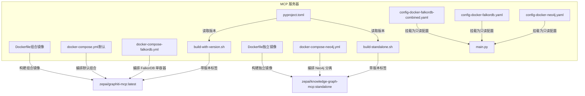
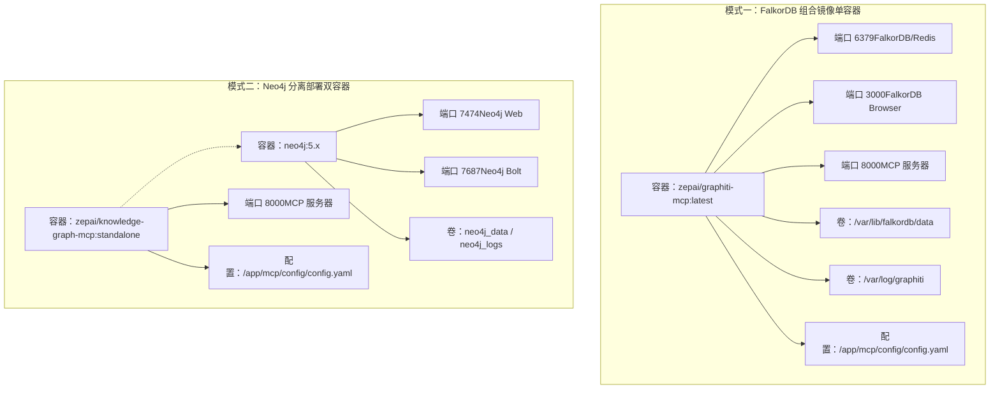
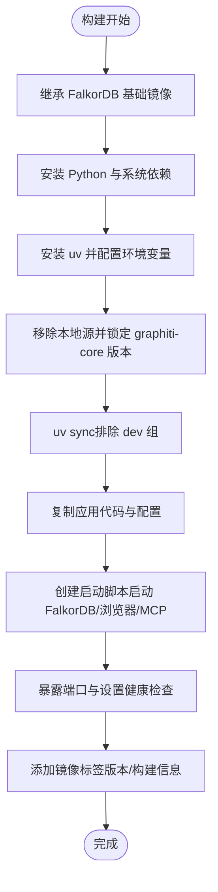
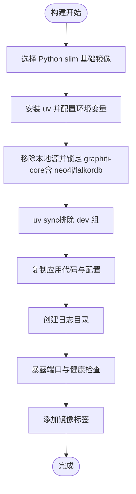
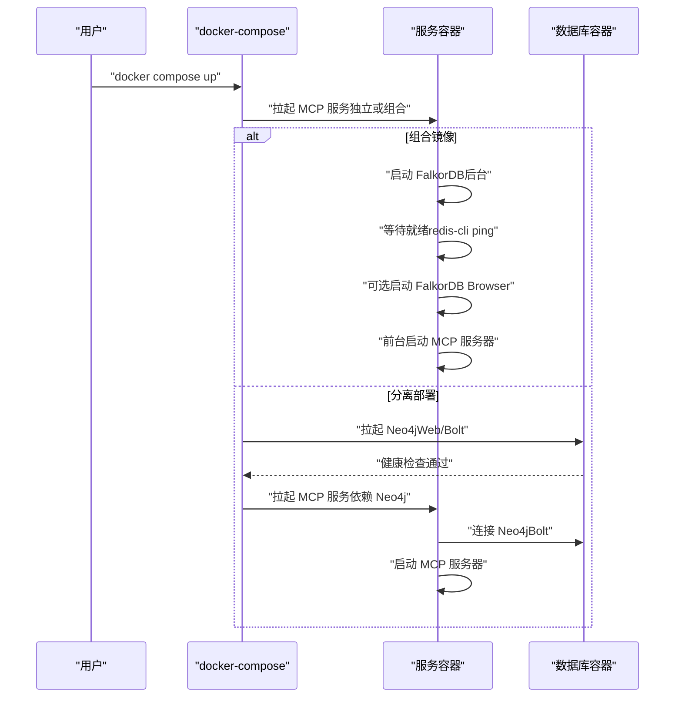
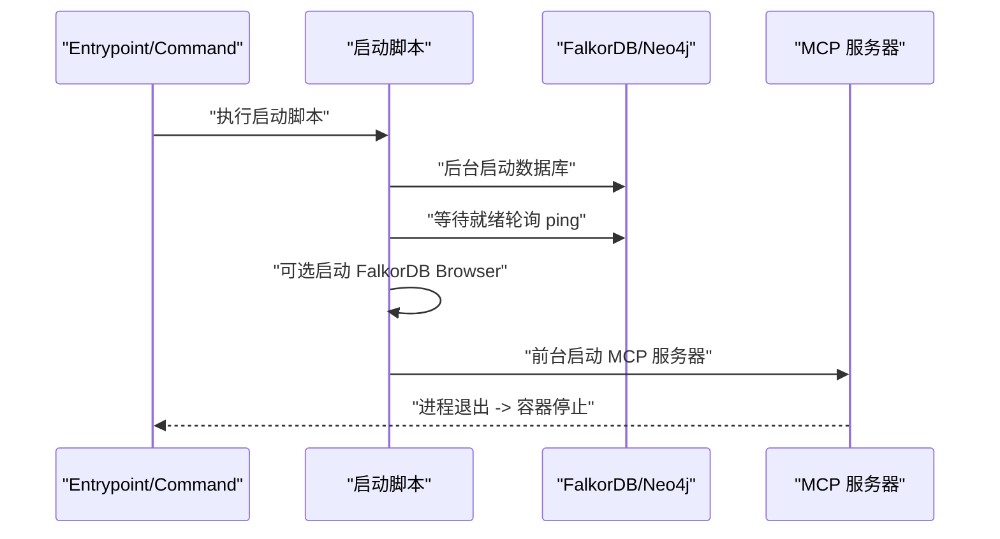
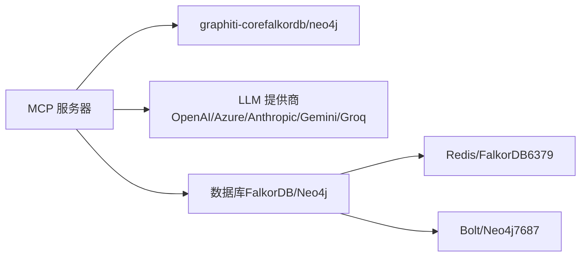

# Docker容器化部署

<cite>
**本文引用的文件**
- [Dockerfile（组合镜像）](file://mcp_server/docker/Dockerfile)
- [Dockerfile（独立镜像）](file://mcp_server/docker/Dockerfile.standalone)
- [docker-compose.yml（默认）](file://mcp_server/docker/docker-compose.yml)
- [docker-compose-falkordb.yml](file://mcp_server/docker/docker-compose-falkordb.yml)
- [docker-compose-neo4j.yml](file://mcp_server/docker/docker-compose-neo4j.yml)
- [build-with-version.sh](file://mcp_server/docker/build-with-version.sh)
- [build-standalone.sh](file://mcp_server/docker/build-standalone.sh)
- [config-docker-falkordb-combined.yaml](file://mcp_server/config/config-docker-falkordb-combined.yaml)
- [config-docker-falkordb.yaml](file://mcp_server/config/config-docker-falkordb.yaml)
- [config-docker-neo4j.yaml](file://mcp_server/config/config-docker-neo4j.yaml)
- [pyproject.toml（MCP服务）](file://mcp_server/pyproject.toml)
- [main.py（入口）](file://mcp_server/main.py)
- [README.md（Docker部署总览）](file://mcp_server/docker/README.md)
- [README-falkordb-combined.md](file://mcp_server/docker/README-falkordb-combined.md)
</cite>

## 目录
1. [简介](#简介)
2. [项目结构](#项目结构)
3. [核心组件](#核心组件)
4. [架构总览](#架构总览)
5. [详细组件分析](#详细组件分析)
6. [依赖关系分析](#依赖关系分析)
7. [性能与资源考虑](#性能与资源考虑)
8. [故障排查指南](#故障排查指南)
9. [结论](#结论)
10. [附录](#附录)

## 简介
本文件系统性说明 Graphiti 的 MCP 服务器在 Docker 环境中的容器化部署流程，重点覆盖：
- 多阶段构建策略：FalkorDB 基础镜像集成、Python 依赖安装、uv 包管理器配置、启动脚本创建
- docker-compose 编排：服务定义、环境变量注入、卷挂载、端口映射
- 两种部署模式：FalkorDB 组合镜像（单容器）与 Neo4j 分离部署（双容器）
- 构建参数使用：GRAPHITI_CORE_VERSION、MCP_SERVER_VERSION
- 定制化构建：build-standalone.sh 脚本
- 健康检查与容器生命周期管理

## 项目结构
围绕 MCP 服务器的 Docker 部署，关键目录与文件如下：
- mcp_server/docker：Dockerfile、docker-compose 编排、构建脚本与说明文档
- mcp_server/config：数据库配置模板（FalkorDB/Neo4j）
- mcp_server/main.py：应用入口
- mcp_server/pyproject.toml：MCP 服务版本与依赖声明

图表来源
- [Dockerfile（组合镜像）](file://mcp_server/docker/Dockerfile#L1-L138)
- [Dockerfile（独立镜像）](file://mcp_server/docker/Dockerfile.standalone#L1-L82)
- [docker-compose.yml（默认）](file://mcp_server/docker/docker-compose.yml#L1-L45)
- [docker-compose-falkordb.yml](file://mcp_server/docker/docker-compose-falkordb.yml#L1-L51)
- [docker-compose-neo4j.yml](file://mcp_server/docker/docker-compose-neo4j.yml#L1-L56)
- [build-with-version.sh](file://mcp_server/docker/build-with-version.sh#L1-L44)
- [build-standalone.sh](file://mcp_server/docker/build-standalone.sh#L1-L51)
- [config-docker-falkordb-combined.yaml](file://mcp_server/config/config-docker-falkordb-combined.yaml#L1-L102)
- [config-docker-falkordb.yaml](file://mcp_server/config/config-docker-falkordb.yaml#L1-L101)
- [config-docker-neo4j.yaml](file://mcp_server/config/config-docker-neo4j.yaml#L1-L103)
- [main.py（入口）](file://mcp_server/main.py#L1-L27)
- [pyproject.toml（MCP服务）](file://mcp_server/pyproject.toml#L1-L77)

章节来源
- [Dockerfile（组合镜像）](file://mcp_server/docker/Dockerfile#L1-L138)
- [Dockerfile（独立镜像）](file://mcp_server/docker/Dockerfile.standalone#L1-L82)
- [docker-compose.yml（默认）](file://mcp_server/docker/docker-compose.yml#L1-L45)
- [docker-compose-falkordb.yml](file://mcp_server/docker/docker-compose-falkordb.yml#L1-L51)
- [docker-compose-neo4j.yml](file://mcp_server/docker/docker-compose-neo4j.yml#L1-L56)
- [build-with-version.sh](file://mcp_server/docker/build-with-version.sh#L1-L44)
- [build-standalone.sh](file://mcp_server/docker/build-standalone.sh#L1-L51)
- [config-docker-falkordb-combined.yaml](file://mcp_server/config/config-docker-falkordb-combined.yaml#L1-L102)
- [config-docker-falkordb.yaml](file://mcp_server/config/config-docker-falkordb.yaml#L1-L101)
- [config-docker-neo4j.yaml](file://mcp_server/config/config-docker-neo4j.yaml#L1-L103)
- [main.py（入口）](file://mcp_server/main.py#L1-L27)
- [pyproject.toml（MCP服务）](file://mcp_server/pyproject.toml#L1-L77)

## 核心组件
- 组合镜像 Dockerfile：基于官方 FalkorDB 镜像扩展，安装 Python 与 uv，配置 graphiti-core 版本，复制应用代码与配置，创建启动脚本，暴露端口并设置健康检查
- 独立镜像 Dockerfile：从 Python slim 镜像开始，安装 uv，同时启用 graphiti-core 的 neo4j 与 falkordb 可选依赖，构建 MCP 服务镜像
- docker-compose 编排：默认组合镜像、FalkorDB 单容器编排、Neo4j 分离编排；均支持环境变量注入、卷挂载与端口映射
- 构建脚本：build-with-version.sh 与 build-standalone.sh 自动查询最新 graphiti-core 版本并生成多标签镜像
- 配置文件：针对 FalkorDB 与 Neo4j 的专用配置模板，挂载到容器内作为只读配置

章节来源
- [Dockerfile（组合镜像）](file://mcp_server/docker/Dockerfile#L1-L138)
- [Dockerfile（独立镜像）](file://mcp_server/docker/Dockerfile.standalone#L1-L82)
- [docker-compose.yml（默认）](file://mcp_server/docker/docker-compose.yml#L1-L45)
- [docker-compose-falkordb.yml](file://mcp_server/docker/docker-compose-falkordb.yml#L1-L51)
- [docker-compose-neo4j.yml](file://mcp_server/docker/docker-compose-neo4j.yml#L1-L56)
- [build-with-version.sh](file://mcp_server/docker/build-with-version.sh#L1-L44)
- [build-standalone.sh](file://mcp_server/docker/build-standalone.sh#L1-L51)
- [config-docker-falkordb-combined.yaml](file://mcp_server/config/config-docker-falkordb-combined.yaml#L1-L102)
- [config-docker-falkordb.yaml](file://mcp_server/config/config-docker-falkordb.yaml#L1-L101)
- [config-docker-neo4j.yaml](file://mcp_server/config/config-docker-neo4j.yaml#L1-L103)

## 架构总览
下图展示两种部署模式的容器架构与交互关系。

图表来源
- [docker-compose.yml（默认）](file://mcp_server/docker/docker-compose.yml#L1-L45)
- [docker-compose-falkordb.yml](file://mcp_server/docker/docker-compose-falkordb.yml#L1-L51)
- [docker-compose-neo4j.yml](file://mcp_server/docker/docker-compose-neo4j.yml#L1-L56)
- [config-docker-falkordb-combined.yaml](file://mcp_server/config/config-docker-falkordb-combined.yaml#L1-L102)
- [config-docker-neo4j.yaml](file://mcp_server/config/config-docker-neo4j.yaml#L1-L103)

## 详细组件分析

### 组合镜像 Dockerfile（FalkorDB + MCP）
- 基础镜像与系统依赖：基于官方 FalkorDB 镜像，安装 Python 与常用工具
- uv 包管理器：下载安装脚本并加入 PATH，设置 UV_COMPILE_BYTECODE、UV_LINK_MODE、UV_PYTHON_DOWNLOADS 等优化参数
- 依赖安装：移除本地路径源，按构建参数替换 graphiti-core 版本，生成锁文件后使用缓存 mount 安装生产依赖
- 应用与配置：复制 main.py、src、config；默认使用组合配置（localhost 连接）
- 启动脚本：后台启动 FalkorDB，等待就绪，可选启动 FalkorDB Browser，前台启动 MCP 服务器
- 标签与暴露：添加镜像元数据标签，暴露 6379/3000/8000 端口
- 健康检查：对 6379 端口执行 redis-cli ping

图表来源
- [Dockerfile（组合镜像）](file://mcp_server/docker/Dockerfile#L1-L138)

章节来源
- [Dockerfile（组合镜像）](file://mcp_server/docker/Dockerfile#L1-L138)

### 独立镜像 Dockerfile（Standalone）
- 基础镜像：从 Python slim 镜像开始
- uv 配置：同上
- 依赖安装：移除本地源，启用 graphiti-core 的 neo4j 与 falkordb 可选依赖，锁定并安装
- 应用与日志：复制应用代码，创建日志目录
- 标签与暴露：添加镜像元数据标签，暴露 MCP 服务器端口
- 健康检查：访问本地健康端点

图表来源
- [Dockerfile（独立镜像）](file://mcp_server/docker/Dockerfile.standalone#L1-L82)

章节来源
- [Dockerfile（独立镜像）](file://mcp_server/docker/Dockerfile.standalone#L1-L82)

### docker-compose 编排配置
- 默认组合镜像编排：构建组合镜像，注入环境变量（如 FalkorDB 密码、浏览器开关、MCP 配置路径等），挂载数据与日志卷，映射 6379/3000/8000 端口，设置健康检查
- FalkorDB 单容器编排：分别定义 falkordb 与 graphiti-mcp 两个服务，graphiti-mcp 依赖 falkordb 健康后再启动，挂载对应配置文件，暴露 MCP 端口
- Neo4j 分离编排：定义 neo4j 服务（Web/Bolt 端口、认证、内存与卷），graphiti-mcp 服务连接 neo4j，挂载 Neo4j 配置文件

图表来源
- [docker-compose.yml（默认）](file://mcp_server/docker/docker-compose.yml#L1-L45)
- [docker-compose-falkordb.yml](file://mcp_server/docker/docker-compose-falkordb.yml#L1-L51)
- [docker-compose-neo4j.yml](file://mcp_server/docker/docker-compose-neo4j.yml#L1-L56)

章节来源
- [docker-compose.yml（默认）](file://mcp_server/docker/docker-compose.yml#L1-L45)
- [docker-compose-falkordb.yml](file://mcp_server/docker/docker-compose-falkordb.yml#L1-L51)
- [docker-compose-neo4j.yml](file://mcp_server/docker/docker-compose-neo4j.yml#L1-L56)

### 配置文件与环境变量
- 组合镜像配置：默认使用组合配置，数据库连接指向 localhost（同一容器内）
- 分离部署配置：分别提供 FalkorDB 与 Neo4j 的配置模板，数据库连接使用服务名与默认端口
- 关键环境变量：
  - 通用：OPENAI_API_KEY、GRAPHITI_GROUP_ID、SEMAPHORE_LIMIT、CONFIG_PATH
  - 数据库：FALKORDB_URI/FALKORDB_PASSWORD/FALKORDB_DATABASE 或 NEO4J_URI/NEO4J_USER/NEO4J_PASSWORD/NEO4J_DATABASE
  - 组合镜像特有：BROWSER（是否启用 FalkorDB Browser）

章节来源
- [config-docker-falkordb-combined.yaml](file://mcp_server/config/config-docker-falkordb-combined.yaml#L1-L102)
- [config-docker-falkordb.yaml](file://mcp_server/config/config-docker-falkordb.yaml#L1-L101)
- [config-docker-neo4j.yaml](file://mcp_server/config/config-docker-neo4j.yaml#L1-L103)
- [docker-compose.yml（默认）](file://mcp_server/docker/docker-compose.yml#L1-L45)
- [docker-compose-falkordb.yml](file://mcp_server/docker/docker-compose-falkordb.yml#L1-L51)
- [docker-compose-neo4j.yml](file://mcp_server/docker/docker-compose-neo4j.yml#L1-L56)

### 构建参数与脚本
- 构建参数：
  - GRAPHITI_CORE_VERSION：graphiti-core 版本（默认值见 Dockerfile）
  - MCP_SERVER_VERSION：MCP 服务器版本（默认值见 Dockerfile）
  - BUILD_DATE/VCS_REF：构建时间与提交哈希（用于镜像标签与元数据）
- 自动化脚本：
  - build-with-version.sh：查询 graphiti-core 最新版本，生成多标签镜像（含版本号与 latest）
  - build-standalone.sh：查询 graphiti-core 最新版本，构建独立镜像并打多标签

章节来源
- [Dockerfile（组合镜像）](file://mcp_server/docker/Dockerfile#L1-L138)
- [Dockerfile（独立镜像）](file://mcp_server/docker/Dockerfile.standalone#L1-L82)
- [build-with-version.sh](file://mcp_server/docker/build-with-version.sh#L1-L44)
- [build-standalone.sh](file://mcp_server/docker/build-standalone.sh#L1-L51)
- [pyproject.toml（MCP服务）](file://mcp_server/pyproject.toml#L1-L77)

### 启动脚本与容器生命周期
- 组合镜像启动脚本：后台启动 FalkorDB，轮询等待就绪，可选启动 FalkorDB Browser，最后前台启动 MCP 服务器；容器以 MCP 服务器进程为主进程，退出即容器停止
- 独立镜像：直接以 uv 运行 main.py 作为主进程
- 健康检查：
  - 组合镜像：对 6379 端口执行 redis-cli ping
  - 独立镜像：对 8000 端口执行健康检查
- 生命周期：容器启动时先初始化数据库与配置，再启动 MCP 服务；停止时优雅关闭 MCP 服务器，数据库持久化由卷保障

图表来源
- [Dockerfile（组合镜像）](file://mcp_server/docker/Dockerfile#L69-L113)
- [Dockerfile（独立镜像）](file://mcp_server/docker/Dockerfile.standalone#L73-L82)
- [docker-compose.yml（默认）](file://mcp_server/docker/docker-compose.yml#L33-L39)
- [docker-compose-neo4j.yml](file://mcp_server/docker/docker-compose-neo4j.yml#L15-L21)

章节来源
- [Dockerfile（组合镜像）](file://mcp_server/docker/Dockerfile#L69-L113)
- [Dockerfile（独立镜像）](file://mcp_server/docker/Dockerfile.standalone#L73-L82)
- [docker-compose.yml（默认）](file://mcp_server/docker/docker-compose.yml#L33-L39)
- [docker-compose-neo4j.yml](file://mcp_server/docker/docker-compose-neo4j.yml#L15-L21)

## 依赖关系分析
- 组件耦合：
  - 组合镜像：MCP 服务器与 FalkorDB 在同一容器内，通过 localhost 通信，耦合度高但延迟低
  - 独立镜像：MCP 服务器与数据库（Neo4j/FalkorDB）通过网络通信，解耦度高，便于横向扩展
- 外部依赖：
  - graphiti-core：通过 uv 按版本锁定安装，支持 falkordb 与 neo4j 双驱动
  - LLM 提供商：OpenAI/Azure OpenAI/Anthropic/Gemini/Groq 等，通过配置文件注入密钥
- 潜在循环依赖：无直接循环，容器间通过服务名与端口通信

图表来源
- [pyproject.toml（MCP服务）](file://mcp_server/pyproject.toml#L1-L77)
- [config-docker-falkordb-combined.yaml](file://mcp_server/config/config-docker-falkordb-combined.yaml#L1-L102)
- [config-docker-neo4j.yaml](file://mcp_server/config/config-docker-neo4j.yaml#L1-L103)

章节来源
- [pyproject.toml（MCP服务）](file://mcp_server/pyproject.toml#L1-L77)
- [config-docker-falkordb-combined.yaml](file://mcp_server/config/config-docker-falkordb-combined.yaml#L1-L102)
- [config-docker-neo4j.yaml](file://mcp_server/config/config-docker-neo4j.yaml#L1-L103)

## 性能与资源考虑
- uv 优化：启用字节码编译与拷贝链接模式，减少运行时开销
- 依赖缓存：使用 uv cache mount，提升重复构建速度
- 资源限制：可在 docker-compose 中为服务添加资源限制与 CPU/内存配额
- 日志与监控：组合镜像统一输出日志，便于集中采集；独立镜像建议外部日志收集

[本节为通用指导，不直接分析具体文件]

## 故障排查指南
- 端口冲突：修改 docker-compose 中的端口映射；确认宿主机端口未被占用
- 容器无法启动：查看容器日志，确认 MCP 服务器与数据库均已就绪
- 数据不持久化：确认卷已正确挂载并存在；避免使用 -v 删除卷
- 连接问题：
  - 组合镜像：使用 redis-cli ping 检查 FalkorDB
  - Neo4j：等待健康检查通过后再连接，核对用户名/密码与数据库名
- 性能问题：调整并发限制（SEMAPHORE_LIMIT）、增加资源配额、检查数据库内存与索引

章节来源
- [README.md（Docker部署总览）](file://mcp_server/docker/README.md#L161-L264)
- [README-falkordb-combined.md](file://mcp_server/docker/README-falkordb-combined.md#L148-L263)
- [docker-compose.yml（默认）](file://mcp_server/docker/docker-compose.yml#L33-L39)
- [docker-compose-neo4j.yml](file://mcp_server/docker/docker-compose-neo4j.yml#L15-L21)

## 结论
- 组合镜像适合开发与单节点场景，简化部署与降低网络延迟
- 独立镜像适合生产与多实例场景，便于水平扩展与资源隔离
- 通过构建脚本与构建参数，可灵活控制 graphiti-core 与 MCP 服务器版本
- 健康检查与启动脚本确保服务有序启动与可观测性

[本节为总结性内容，不直接分析具体文件]

## 附录
- 快速开始示例（命令行路径）
  - 组合镜像：参见 [README.md（Docker部署总览）](file://mcp_server/docker/README.md#L7-L13)
  - Neo4j 分离：参见 [README.md（Docker部署总览）](file://mcp_server/docker/README.md#L11-L13)
- 环境变量参考
  - 通用：参见 [docker-compose.yml（默认）](file://mcp_server/docker/docker-compose.yml#L15-L26)
  - FalkorDB：参见 [config-docker-falkordb.yaml](file://mcp_server/config/config-docker-falkordb.yaml#L70-L78)
  - Neo4j：参见 [config-docker-neo4j.yaml](file://mcp_server/config/config-docker-neo4j.yaml#L69-L79)
- 入口与版本
  - 入口：参见 [main.py（入口）](file://mcp_server/main.py#L1-L27)
  - 版本：参见 [pyproject.toml（MCP服务）](file://mcp_server/pyproject.toml#L1-L77)