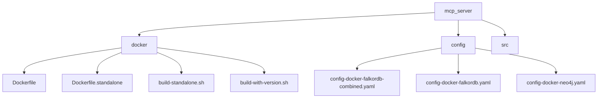
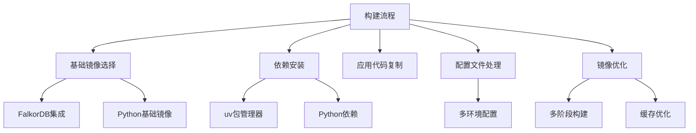
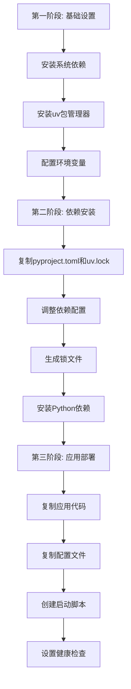
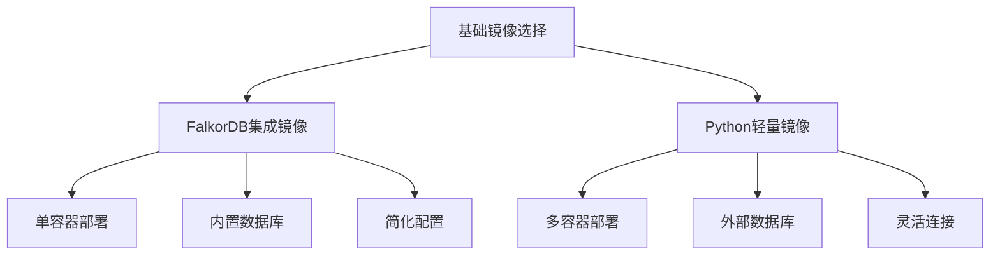
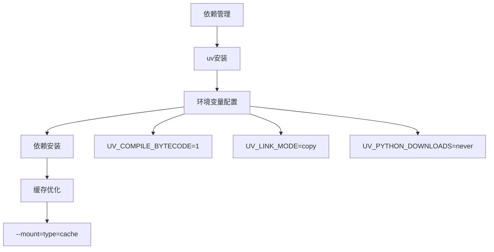
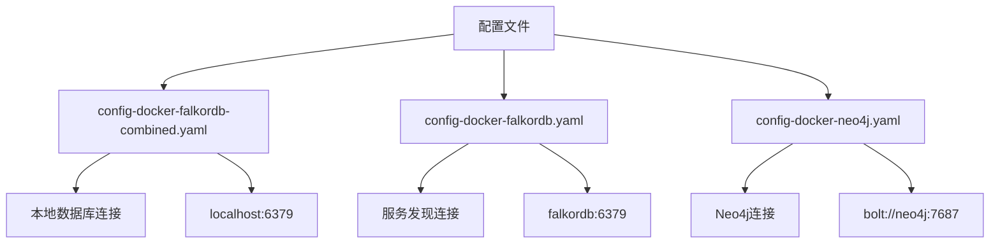
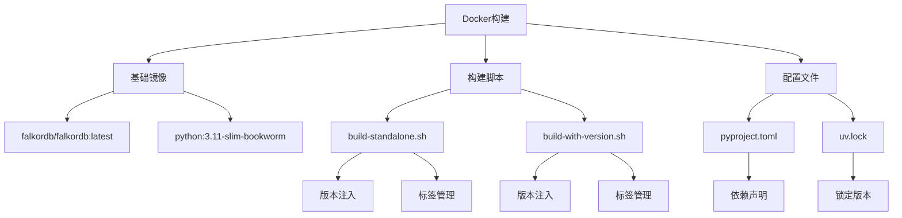
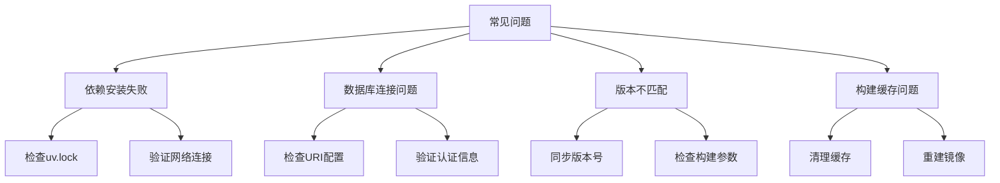

# Docker镜像构建

<cite>
**本文档中引用的文件**
- [Dockerfile](file://mcp_server/docker/Dockerfile)
- [Dockerfile.standalone](file://mcp_server/docker/Dockerfile.standalone)
- [build-standalone.sh](file://mcp_server/docker/build-standalone.sh)
- [build-with-version.sh](file://mcp_server/docker/build-with-version.sh)
- [pyproject.toml](file://mcp_server/pyproject.toml)
- [config-docker-falkordb-combined.yaml](file://mcp_server/config/config-docker-falkordb-combined.yaml)
- [config-docker-falkordb.yaml](file://mcp_server/config/config-docker-falkordb.yaml)
- [config-docker-neo4j.yaml](file://mcp_server/config/config-docker-neo4j.yaml)
- [docker-compose.yml](file://mcp_server/docker/docker-compose.yml)
- [main.py](file://mcp_server/main.py)
</cite>

## 目录
1. [简介](#简介)
2. [项目结构](#项目结构)
3. [核心组件](#核心组件)
4. [架构概述](#架构概述)
5. [详细组件分析](#详细组件分析)
6. [依赖分析](#依赖分析)
7. [性能考虑](#性能考虑)
8. [故障排除指南](#故障排除指南)
9. [结论](#结论)

## 简介
本文档详细说明了MCP服务器Docker镜像的构建流程。重点解释了Dockerfile中多阶段构建的设计原理，包括基础镜像选择（FalkorDB集成）、Python依赖安装（使用uv包管理器）、静态资源处理和最终镜像优化。对比了Dockerfile与Dockerfile.standalone的差异及其适用场景。深入分析了build-standalone.sh和build-with-version.sh构建脚本的功能，涵盖版本参数注入、构建上下文配置和缓存优化策略。提供了自定义构建的实践示例，包括如何设置GRAPHITI_CORE_VERSION和MCP_SERVER_VERSION构建参数。

## 项目结构

**图示来源**
- [Dockerfile](file://mcp_server/docker/Dockerfile)
- [Dockerfile.standalone](file://mcp_server/docker/Dockerfile.standalone)
- [config-docker-falkordb-combined.yaml](file://mcp_server/config/config-docker-falkordb-combined.yaml)
- [config-docker-falkordb.yaml](file://mcp_server/config/config-docker-falkordb.yaml)
- [config-docker-neo4j.yaml](file://mcp_server/config/config-docker-neo4j.yaml)

**章节来源**
- [Dockerfile](file://mcp_server/docker/Dockerfile)
- [Dockerfile.standalone](file://mcp_server/docker/Dockerfile.standalone)
- [config-docker-falkordb-combined.yaml](file://mcp_server/config/config-docker-falkordb-combined.yaml)
- [config-docker-falkordb.yaml](file://mcp_server/config/config-docker-falkordb.yaml)
- [config-docker-neo4j.yaml](file://mcp_server/config/config-docker-neo4j.yaml)

## 核心组件

MCP服务器Docker镜像构建系统包含多个核心组件，包括主Dockerfile、独立Dockerfile、构建脚本和配置文件。这些组件共同实现了灵活的镜像构建流程，支持不同的部署场景和数据库后端。

**章节来源**
- [Dockerfile](file://mcp_server/docker/Dockerfile)
- [Dockerfile.standalone](file://mcp_server/docker/Dockerfile.standalone)
- [build-standalone.sh](file://mcp_server/docker/build-standalone.sh)
- [build-with-version.sh](file://mcp_server/docker/build-with-version.sh)

## 架构概述

**图示来源**
- [Dockerfile](file://mcp_server/docker/Dockerfile)
- [Dockerfile.standalone](file://mcp_server/docker/Dockerfile.standalone)
- [pyproject.toml](file://mcp_server/pyproject.toml)

**章节来源**
- [Dockerfile](file://mcp_server/docker/Dockerfile)
- [Dockerfile.standalone](file://mcp_server/docker/Dockerfile.standalone)
- [pyproject.toml](file://mcp_server/pyproject.toml)

## 详细组件分析

### 多阶段构建设计

MCP服务器采用多阶段构建策略，通过不同的Dockerfile实现特定的部署需求。主Dockerfile基于FalkorDB镜像构建，创建一个包含图数据库和MCP服务器的集成镜像，而Dockerfile.standalone则基于Python基础镜像，创建仅包含MCP服务器的独立镜像。

#### 多阶段构建流程

**图示来源**
- [Dockerfile](file://mcp_server/docker/Dockerfile)
- [Dockerfile.standalone](file://mcp_server/docker/Dockerfile.standalone)

**章节来源**
- [Dockerfile](file://mcp_server/docker/Dockerfile)
- [Dockerfile.standalone](file://mcp_server/docker/Dockerfile.standalone)

### 基础镜像选择

构建流程中采用了两种不同的基础镜像策略。主Dockerfile使用`falkordb/falkordb:latest`作为基础镜像，实现了FalkorDB图数据库与MCP服务器的深度集成。这种设计允许在单个容器中运行完整的知识图谱解决方案，简化了部署流程。

独立Dockerfile则使用`python:3.11-slim-bookworm`作为基础镜像，创建了一个轻量级的运行环境，适用于连接外部数据库的场景。

**图示来源**
- [Dockerfile](file://mcp_server/docker/Dockerfile)
- [Dockerfile.standalone](file://mcp_server/docker/Dockerfile.standalone)

**章节来源**
- [Dockerfile](file://mcp_server/docker/Dockerfile)
- [Dockerfile.standalone](file://mcp_server/docker/Dockerfile.standalone)

### Python依赖管理

构建流程使用uv包管理器进行Python依赖安装，这是一种现代化的Python包管理工具，提供了比传统pip更快的依赖解析和安装速度。通过配置特定的环境变量，优化了Docker环境下的依赖管理性能。

**图示来源**
- [Dockerfile](file://mcp_server/docker/Dockerfile)
- [Dockerfile.standalone](file://mcp_server/docker/Dockerfile.standalone)
- [pyproject.toml](file://mcp_server/pyproject.toml)

**章节来源**
- [Dockerfile](file://mcp_server/docker/Dockerfile)
- [Dockerfile.standalone](file://mcp_server/docker/Dockerfile.standalone)
- [pyproject.toml](file://mcp_server/pyproject.toml)

### 配置文件处理

构建系统提供了多种配置文件以适应不同的部署场景。`config-docker-falkordb-combined.yaml`用于集成镜像，配置本地数据库连接；`config-docker-falkordb.yaml`用于分离部署，连接独立的FalkorDB服务；`config-docker-neo4j.yaml`则支持Neo4j数据库后端。

**图示来源**
- [config-docker-falkbordb-combined.yaml](file://mcp_server/config/config-docker-falkordb-combined.yaml)
- [config-docker-falkordb.yaml](file://mcp_server/config/config-docker-falkordb.yaml)
- [config-docker-neo4j.yaml](file://mcp_server/config/config-docker-neo4j.yaml)

**章节来源**
- [config-docker-falkordb-combined.yaml](file://mcp_server/config/config-docker-falkordb-combined.yaml)
- [config-docker-falkordb.yaml](file://mcp_server/config/config-docker-falkordb.yaml)
- [config-docker-neo4j.yaml](file://mcp_server/config/config-docker-neo4j.yaml)

## 依赖分析

**图示来源**
- [Dockerfile](file://mcp_server/docker/Dockerfile)
- [Dockerfile.standalone](file://mcp_server/docker/Dockerfile.standalone)
- [build-standalone.sh](file://mcp_server/docker/build-standalone.sh)
- [build-with-version.sh](file://mcp_server/docker/build-with-version.sh)
- [pyproject.toml](file://mcp_server/pyproject.toml)
- [uv.lock](file://mcp_server/uv.lock)

**章节来源**
- [Dockerfile](file://mcp_server/docker/Dockerfile)
- [Dockerfile.standalone](file://mcp_server/docker/Dockerfile.standalone)
- [build-standalone.sh](file://mcp_server/docker/build-standalone.sh)
- [build-with-version.sh](file://mcp_server/docker/build-with-version.sh)
- [pyproject.toml](file://mcp_server/pyproject.toml)

## 性能考虑

构建流程通过多种方式优化了镜像性能和构建效率。使用uv包管理器的编译字节码功能减少了运行时开销，链接模式设置为copy避免了符号链接问题，禁用Python下载确保了构建的可重复性。Docker构建缓存机制显著加快了重复构建的速度。

**章节来源**
- [Dockerfile](file://mcp_server/docker/Dockerfile)
- [Dockerfile.standalone](file://mcp_server/docker/Dockerfile.standalone)

## 故障排除指南

**图示来源**
- [Dockerfile](file://mcp_server/docker/Dockerfile)
- [Dockerfile.standalone](file://mcp_server/docker/Dockerfile.standalone)
- [config-docker-falkordb-combined.yaml](file://mcp_server/config/config-docker-falkordb-combined.yaml)
- [config-docker-falkordb.yaml](file://mcp_server/config/config-docker-falkordb.yaml)
- [config-docker-neo4j.yaml](file://mcp_server/config/config-docker-neo4j.yaml)

**章节来源**
- [Dockerfile](file://mcp_server/docker/Dockerfile)
- [Dockerfile.standalone](file://mcp_server/docker/Dockerfile.standalone)
- [config-docker-falkordb-combined.yaml](file://mcp_server/config/config-docker-falkordb-combined.yaml)
- [config-docker-falkordb.yaml](file://mcp_server/config/config-docker-falkordb.yaml)
- [config-docker-neo4j.yaml](file://mcp_server/config/config-docker-neo4j.yaml)

## 结论

MCP服务器的Docker镜像构建系统设计精良，通过多阶段构建、现代化的依赖管理工具和灵活的配置选项，实现了高效、可靠的镜像构建流程。两种Dockerfile设计满足了不同的部署需求，从集成式单容器部署到分离式微服务架构。构建脚本自动化了版本管理和标签创建，确保了构建过程的一致性和可追溯性。整体架构体现了现代容器化应用的最佳实践，为知识图谱应用的部署提供了坚实的基础。