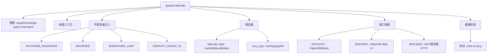
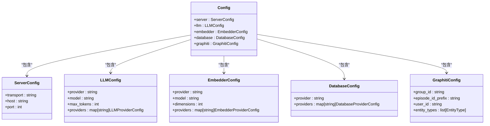
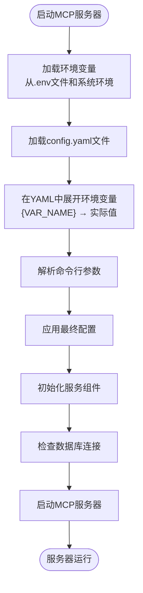
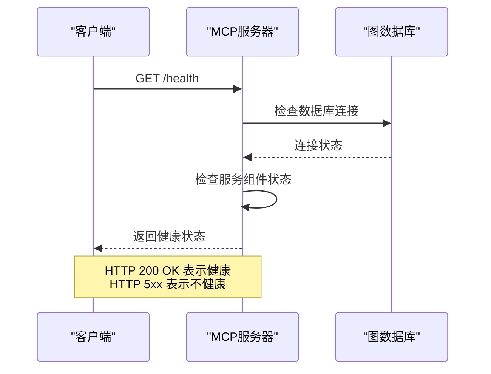
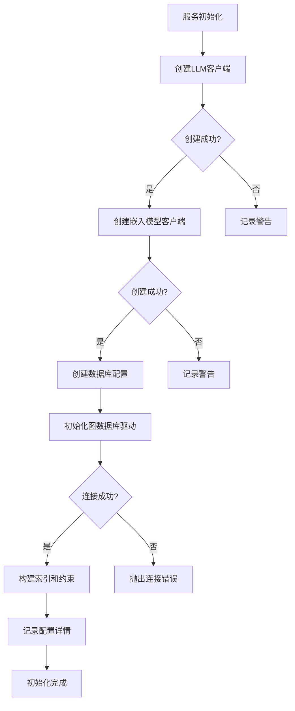
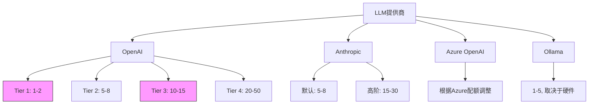

# 容器化配置管理

<cite>
**本文档引用的文件**  
- [mcp_server/.env.example](file://mcp_server/.env.example)
- [mcp_server/docker/docker-compose.yml](file://mcp_server/docker/docker-compose.yml)
- [mcp_server/config/config.yaml](file://mcp_server/config/config.yaml)
- [mcp_server/README.md](file://mcp_server/README.md)
- [mcp_server/docker/README-falkordb-combined.md](file://mcp_server/docker/README-falkordb-combined.md)
- [mcp_server/main.py](file://mcp_server/main.py)
- [mcp_server/config/config-docker-falkordb.yaml](file://mcp_server/config/config-docker-falkordb.yaml)
- [mcp_server/docker/docker-compose-falkordb.yml](file://mcp_server/docker/docker-compose-falkordb.yml)
- [mcp_server/src/graphiti_mcp_server.py](file://mcp_server/src/graphiti_mcp_server.py)
</cite>

## 目录
1. [简介](#简介)
2. [环境变量配置体系](#环境变量配置体系)
3. [Docker Compose配置管理](#docker-compose配置管理)
4. [YAML配置文件机制](#yaml配置文件机制)
5. [配置优先级与覆盖规则](#配置优先级与覆盖规则)
6. [健康检查实现原理](#健康检查实现原理)
7. [容器生命周期管理](#容器生命周期管理)
8. [部署场景最佳实践](#部署场景最佳实践)
9. [结论](#结论)

## 简介
本文档系统阐述了MCP服务器容器化部署的配置管理体系。通过分析.env文件、docker-compose配置和config.yaml文件，详细说明了如何在容器环境中管理运行时配置。文档涵盖了LLM提供商设置、图数据库连接参数、日志级别等关键配置项的注入机制，解释了配置加载的优先级规则，并提供了不同部署场景下的最佳实践。

**Section sources**
- [mcp_server/README.md](file://mcp_server/README.md#L1-L684)

## 环境变量配置体系
MCP服务器采用多层级环境变量配置体系，通过.env文件和环境变量注入实现灵活的运行时配置。核心配置项包括LLM提供商认证、图数据库连接参数和并发控制等。

### LLM提供商配置
系统支持多种LLM提供商，通过环境变量注入认证信息：
- **OpenAI**: `OPENAI_API_KEY` 用于认证
- **Anthropic**: `ANTHROPIC_API_KEY` 用于Claude模型
- **Gemini**: `GOOGLE_API_KEY` 用于Gemini模型
- **Groq**: `GROQ_API_KEY` 用于Groq模型
- **Azure OpenAI**: `AZURE_OPENAI_API_KEY` 和 `AZURE_OPENAI_ENDPOINT` 用于Azure服务

### 图数据库连接配置
支持多种图数据库后端，通过环境变量配置连接参数：
- **FalkorDB**: `FALKORDB_URI` (默认: redis://localhost:6379), `FALKORDB_PASSWORD`, `FALKORDB_DATABASE`
- **Neo4j**: `NEO4J_URI` (默认: bolt://localhost:7687), `NEO4J_USER`, `NEO4J_PASSWORD`

### 运行时参数配置
关键运行时参数通过环境变量控制：
- `SEMAPHORE_LIMIT`: 控制并发处理的限制，默认值为10
- `GRAPHITI_GROUP_ID`: 为图数据设置命名空间，默认为"main"
- `BROWSER`: 启用FalkorDB浏览器UI（默认: "1"）

**Section sources**
- [mcp_server/.env.example](file://mcp_server/.env.example#L1-L50)
- [mcp_server/README.md](file://mcp_server/README.md#L222-L241)

## Docker Compose配置管理
Docker Compose是MCP服务器推荐的部署方式，通过docker-compose.yml文件定义服务配置和依赖关系。

### 默认组合容器配置
默认的docker-compose.yml文件定义了FalkorDB和MCP服务器的组合容器：



**Diagram sources**
- [mcp_server/docker/docker-compose.yml](file://mcp_server/docker/docker-compose.yml#L1-L45)

### 多场景Compose配置
系统提供多种Docker Compose配置文件以适应不同部署需求：
- `docker-compose.yml`: 默认配置，包含FalkorDB和MCP服务器的组合容器
- `docker-compose-neo4j.yml`: 使用Neo4j作为图数据库的配置
- `docker-compose-falkordb.yml`: FalkorDB与MCP服务器分离的容器配置
- `docker-compose-falkordb-combined.yml`: 专为组合镜像优化的配置

**Section sources**
- [mcp_server/docker/docker-compose.yml](file://mcp_server/docker/docker-compose.yml#L1-L45)
- [mcp_server/docker/docker-compose-falkb.yml](file://mcp_server/docker/docker-compose-falkordb.yml#L1-L51)

## YAML配置文件机制
config.yaml文件是MCP服务器的核心配置文件，采用YAML格式定义系统各项配置，并支持环境变量扩展。

### 配置文件结构
配置文件包含多个主要部分，每个部分对应不同的系统功能：



**Diagram sources**
- [mcp_server/config/config.yaml](file://mcp_server/config/config.yaml#L1-L111)

### 环境变量扩展
配置文件支持环境变量扩展语法，允许在配置中引用环境变量：
- `${VAR_NAME}`: 引用环境变量VAR_NAME的值
- `${VAR_NAME:default_value}`: 引用环境变量VAR_NAME的值，如果未设置则使用默认值

这种机制实现了配置的灵活性，允许通过环境变量覆盖YAML文件中的默认值。

**Section sources**
- [mcp_server/config/config.yaml](file://mcp_server/config/config.yaml#L2-L3)
- [mcp_server/README.md](file://mcp_server/README.md#L224-L225)

## 配置优先级与覆盖规则
MCP服务器采用多层次配置体系，不同配置源具有不同的优先级，形成明确的覆盖规则。

### 配置优先级层次
系统配置的优先级从高到低如下：
1. **命令行参数**: 最高优先级，直接覆盖其他所有配置
2. **环境变量**: 中等优先级，可覆盖YAML文件中的配置
3. **YAML配置文件**: 基础配置，提供默认值
4. **代码内默认值**: 最低优先级，仅在没有其他配置时使用

### 配置覆盖流程
配置加载和覆盖的流程如下：



**Diagram sources**
- [mcp_server/src/graphiti_mcp_server.py](file://mcp_server/src/graphiti_mcp_server.py#L38-L45)
- [mcp_server/config/config.yaml](file://mcp_server/config/config.yaml#L2-L3)

**Section sources**
- [mcp_server/README.md](file://mcp_server/README.md#L103-L104)
- [mcp_server/src/graphiti_mcp_server.py](file://mcp_server/src/graphiti_mcp_server.py#L38-L45)

## 健康检查实现原理
MCP服务器容器实现了多层次的健康检查机制，确保服务的可用性和稳定性。

### 容器级健康检查
Docker Compose配置中定义了容器的健康检查策略：

```yaml
healthcheck:
  test: ["CMD", "redis-cli", "-p", "6379", "ping"]
  interval: 10s
  timeout: 5s
  retries: 5
  start_period: 15s
```

该健康检查通过redis-cli命令测试FalkorDB的连通性，确保图数据库服务正常运行。

### 应用级健康检查
MCP服务器还提供了HTTP健康检查端点：



**Diagram sources**
- [mcp_server/docker/docker-compose.yml](file://mcp_server/docker/docker-compose.yml#L33-L38)
- [mcp_server/docker/README-falkordb-combined.md](file://mcp_server/docker/README-falkordb-combined.md#L148-L153)

**Section sources**
- [mcp_server/docker/docker-compose.yml](file://mcp_server/docker/docker-compose.yml#L33-L38)
- [mcp_server/docker/README-falkordb-combined.md](file://mcp_server/docker/README-falkordb-combined.md#L148-L153)

## 容器生命周期管理
MCP服务器的容器生命周期管理涉及启动、运行和停止等多个阶段，确保服务的稳定运行。

### 启动流程
容器启动时执行以下步骤：
1. 加载环境变量配置
2. 初始化日志系统
3. 建立数据库连接
4. 初始化LLM和嵌入模型客户端
5. 构建数据库索引
6. 启动HTTP服务器

### 服务初始化
服务初始化的关键代码逻辑：



**Diagram sources**
- [mcp_server/src/graphiti_mcp_server.py](file://mcp_server/src/graphiti_mcp_server.py#L171-L310)

**Section sources**
- [mcp_server/src/graphiti_mcp_server.py](file://mcp_server/src/graphiti_mcp_server.py#L171-L310)

## 部署场景最佳实践
根据不同的部署需求，推荐以下最佳实践。

### 开发环境部署
对于开发环境，推荐使用组合容器简化部署：

```bash
# 1. 创建环境变量文件
cd mcp_server
cp .env.example .env
# 编辑 .env 文件，设置 API 密钥

# 2. 启动服务
docker compose up
```

此配置将FalkorDB和MCP服务器打包在单个容器中，简化了开发环境的设置。

### 生产环境部署
对于生产环境，推荐使用分离的容器架构：

```bash
# 使用Neo4j作为图数据库
docker compose -f docker/docker-compose-neo4j.yml up
```

这种架构提供了更好的可扩展性和独立的资源管理。

### 不同LLM提供商的配置
根据使用的LLM提供商，调整SEMAPHORE_LIMIT以避免速率限制：



**Diagram sources**
- [mcp_server/README.md](file://mcp_server/README.md#L337-L352)

**Section sources**
- [mcp_server/README.md](file://mcp_server/README.md#L329-L370)
- [mcp_server/docker/README-falkordb-combined.md](file://mcp_server/docker/README-falkordb-combined.md#L86-L88)

## 结论
MCP服务器的容器化配置管理体系通过.env文件、docker-compose配置和config.yaml文件的协同工作，实现了灵活、可扩展的部署方案。环境变量注入机制允许在不修改代码的情况下调整运行时配置，而YAML配置文件提供了结构化的默认配置。健康检查机制确保了服务的可用性，而清晰的配置优先级规则使得系统在不同环境下的行为可预测。通过遵循本文档的最佳实践，可以有效地部署和管理MCP服务器，满足不同场景下的需求。