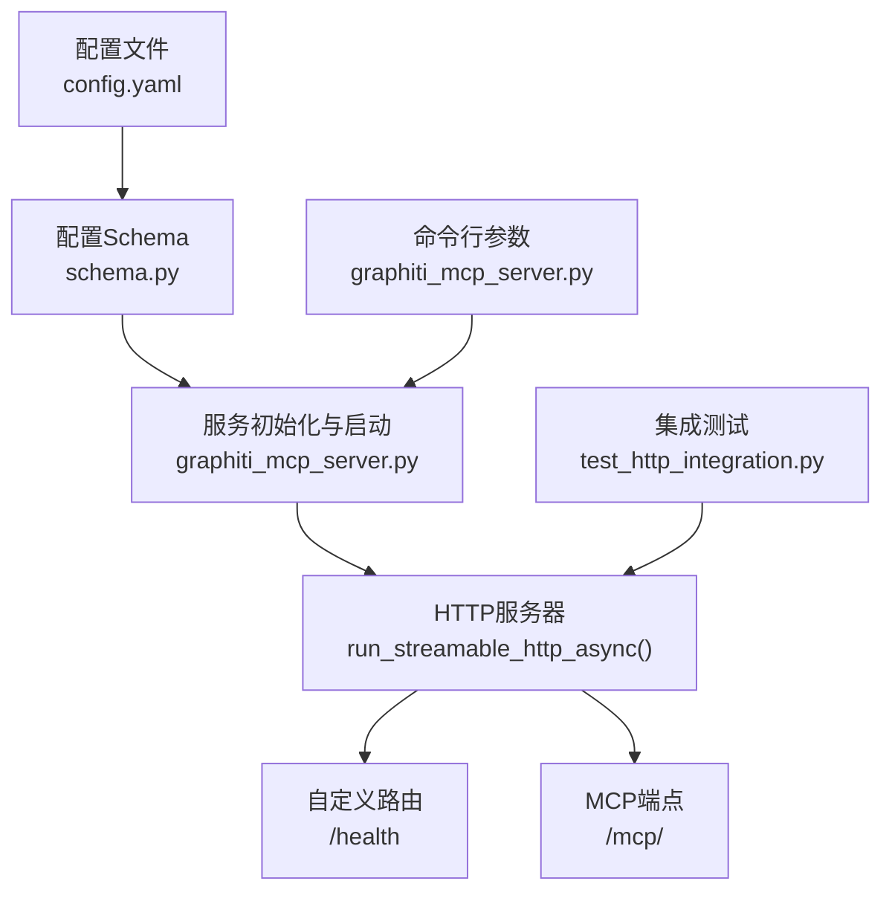
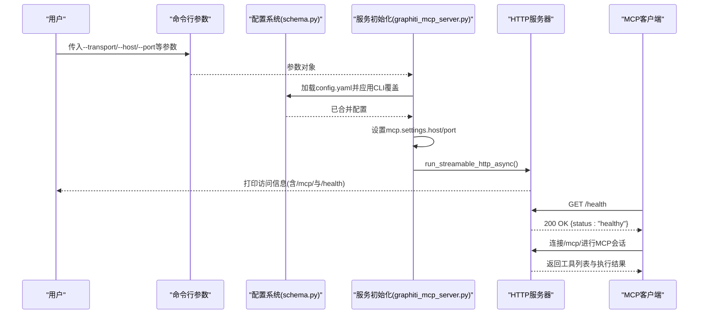
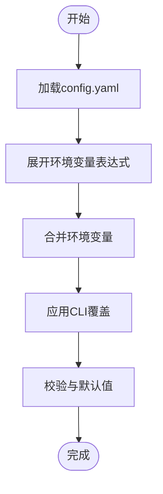
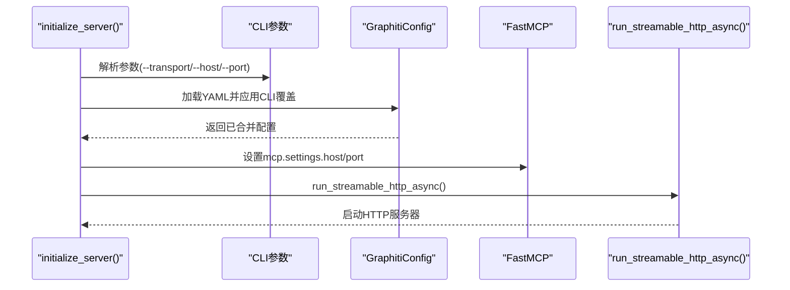
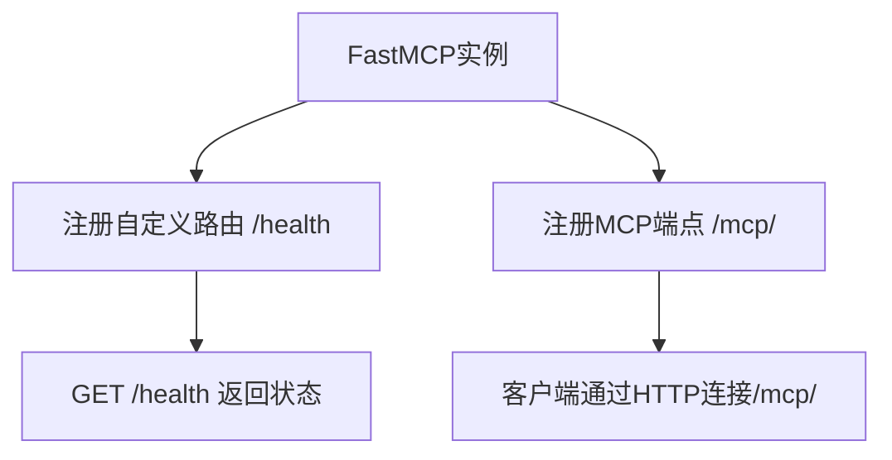
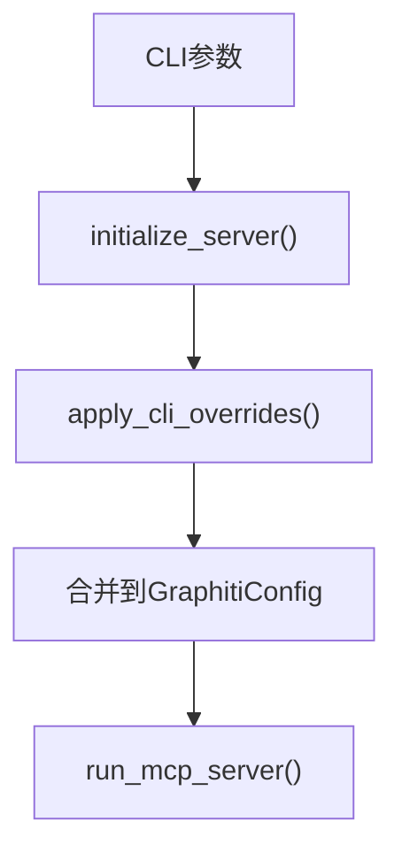
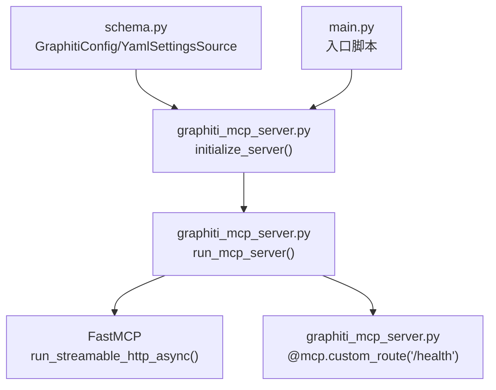

# HTTP传输协议配置

<cite>
**本文引用的文件**
- [config.yaml](file://mcp_server/config/config.yaml)
- [graphiti_mcp_server.py](file://mcp_server/src/graphiti_mcp_server.py)
- [schema.py](file://mcp_server/src/config/schema.py)
- [main.py](file://mcp_server/main.py)
- [test_http_integration.py](file://mcp_server/tests/test_http_integration.py)
- [README.md](file://mcp_server/README.md)
</cite>

## 目录
1. [简介](#简介)
2. [项目结构](#项目结构)
3. [核心组件](#核心组件)
4. [架构总览](#架构总览)
5. [详细组件分析](#详细组件分析)
6. [依赖关系分析](#依赖关系分析)
7. [性能与并发](#性能与并发)
8. [故障排查指南](#故障排查指南)
9. [结论](#结论)
10. [附录：客户端连接与最佳实践](#附录客户端连接与最佳实践)

## 简介
本章节面向需要在MCP服务器中启用HTTP传输协议的用户，系统性说明：
- 在config.yaml中将transport设置为http时的完整配置流程
- host与port参数的设置方法与优先级
- HTTP服务器启动机制、路由注册（含/health健康检查）
- 命令行参数对配置文件的覆盖方式
- 安全配置建议（反向代理HTTPS、身份验证中间件、CORS策略）
- 客户端通过HTTP连接服务器的实际使用路径与错误处理、超时设置的最佳实践

## 项目结构
围绕HTTP传输协议的关键文件与职责如下：
- 配置文件：mcp_server/config/config.yaml，定义默认transport、host、port等
- 配置解析与Schema：mcp_server/src/config/schema.py，提供YAML加载、环境变量展开、CLI覆盖逻辑
- 服务入口与HTTP启动：mcp_server/src/graphiti_mcp_server.py，负责初始化、路由注册、HTTP启动
- 入口脚本：mcp_server/main.py，兼容旧版部署脚本
- 测试用例：mcp_server/tests/test_http_integration.py，展示HTTP客户端连接与工具调用流程
- 文档：mcp_server/README.md，提供运行与访问信息

图表来源
- [config.yaml](file://mcp_server/config/config.yaml#L1-L20)
- [schema.py](file://mcp_server/src/config/schema.py#L230-L292)
- [graphiti_mcp_server.py](file://mcp_server/src/graphiti_mcp_server.py#L755-L760)
- [graphiti_mcp_server.py](file://mcp_server/src/graphiti_mcp_server.py#L908-L950)
- [test_http_integration.py](file://mcp_server/tests/test_http_integration.py#L1-L40)

章节来源
- [config.yaml](file://mcp_server/config/config.yaml#L1-L20)
- [schema.py](file://mcp_server/src/config/schema.py#L230-L292)
- [graphiti_mcp_server.py](file://mcp_server/src/graphiti_mcp_server.py#L755-L760)
- [graphiti_mcp_server.py](file://mcp_server/src/graphiti_mcp_server.py#L908-L950)
- [test_http_integration.py](file://mcp_server/tests/test_http_integration.py#L1-L40)

## 核心组件
- 配置系统
  - 默认transport=http，host=0.0.0.0，port=8000
  - 支持环境变量展开${VAR}或${VAR:default}
  - 通过YamlSettingsSource加载YAML，结合环境变量与dotenv
- 初始化与启动
  - 解析CLI参数，应用CLI覆盖
  - 设置mcp.settings.host/port
  - 根据transport选择运行模式（http/sse/stdio）
  - 启动HTTP服务器并打印访问信息
- 路由注册
  - 自定义路由：/health 健康检查
  - MCP端点：/mcp/（由FastMCP提供）

章节来源
- [config.yaml](file://mcp_server/config/config.yaml#L8-L12)
- [schema.py](file://mcp_server/src/config/schema.py#L16-L74)
- [schema.py](file://mcp_server/src/config/schema.py#L230-L292)
- [graphiti_mcp_server.py](file://mcp_server/src/graphiti_mcp_server.py#L755-L760)
- [graphiti_mcp_server.py](file://mcp_server/src/graphiti_mcp_server.py#L908-L950)

## 架构总览
下图展示了HTTP传输协议从配置到启动、路由注册与客户端访问的整体流程。

图表来源
- [graphiti_mcp_server.py](file://mcp_server/src/graphiti_mcp_server.py#L800-L906)
- [graphiti_mcp_server.py](file://mcp_server/src/graphiti_mcp_server.py#L908-L950)
- [schema.py](file://mcp_server/src/config/schema.py#L230-L292)
- [test_http_integration.py](file://mcp_server/tests/test_http_integration.py#L1-L40)

## 详细组件分析

### 配置文件与Schema
- config.yaml中server.transport=http，host与port分别默认为0.0.0.0与8000
- schema.py提供YamlSettingsSource，支持${VAR}与${VAR:default}语法
- GraphitiConfig.settings_customise_sources定义了配置源优先级：CLI > 环境变量 > YAML > dotenv
- apply_cli_overrides允许在运行时覆盖transport、host、port等字段

图表来源
- [schema.py](file://mcp_server/src/config/schema.py#L16-L74)
- [schema.py](file://mcp_server/src/config/schema.py#L230-L292)

章节来源
- [config.yaml](file://mcp_server/config/config.yaml#L8-L12)
- [schema.py](file://mcp_server/src/config/schema.py#L16-L74)
- [schema.py](file://mcp_server/src/config/schema.py#L230-L292)

### 服务初始化与HTTP启动
- initialize_server解析CLI参数，加载配置并应用CLI覆盖
- 将host/port写入mcp.settings，随后根据transport选择运行模式
- 当transport=http时，打印访问信息（含/mcp/与/health），并调用run_streamable_http_async()

图表来源
- [graphiti_mcp_server.py](file://mcp_server/src/graphiti_mcp_server.py#L800-L906)
- [graphiti_mcp_server.py](file://mcp_server/src/graphiti_mcp_server.py#L908-L950)

章节来源
- [graphiti_mcp_server.py](file://mcp_server/src/graphiti_mcp_server.py#L800-L906)
- [graphiti_mcp_server.py](file://mcp_server/src/graphiti_mcp_server.py#L908-L950)

### 路由注册与健康检查
- 使用@mcp.custom_route注册/health端点，返回JSON响应
- MCP端点由FastMCP提供，默认路径为/mcp/

图表来源
- [graphiti_mcp_server.py](file://mcp_server/src/graphiti_mcp_server.py#L755-L760)
- [README.md](file://mcp_server/README.md#L448-L452)

章节来源
- [graphiti_mcp_server.py](file://mcp_server/src/graphiti_mcp_server.py#L755-L760)
- [README.md](file://mcp_server/README.md#L448-L452)

### 命令行参数覆盖配置文件
- 支持--transport、--host、--port等参数直接覆盖配置文件
- initialize_server中调用apply_cli_overrides，按CLI优先级更新配置
- main.py作为入口脚本，将所有参数透传给graphiti_mcp_server.py

图表来源
- [graphiti_mcp_server.py](file://mcp_server/src/graphiti_mcp_server.py#L800-L906)
- [graphiti_mcp_server.py](file://mcp_server/src/graphiti_mcp_server.py#L908-L950)
- [main.py](file://mcp_server/main.py#L17-L27)

章节来源
- [graphiti_mcp_server.py](file://mcp_server/src/graphiti_mcp_server.py#L800-L906)
- [graphiti_mcp_server.py](file://mcp_server/src/graphiti_mcp_server.py#L908-L950)
- [main.py](file://mcp_server/main.py#L17-L27)

## 依赖关系分析
- 配置加载依赖YAML与环境变量展开
- 初始化依赖CLI参数与配置合并
- HTTP启动依赖FastMCP的run_streamable_http_async
- 路由注册依赖@mcp.custom_route装饰器

图表来源
- [schema.py](file://mcp_server/src/config/schema.py#L230-L292)
- [graphiti_mcp_server.py](file://mcp_server/src/graphiti_mcp_server.py#L800-L950)
- [main.py](file://mcp_server/main.py#L17-L27)

章节来源
- [schema.py](file://mcp_server/src/config/schema.py#L230-L292)
- [graphiti_mcp_server.py](file://mcp_server/src/graphiti_mcp_server.py#L800-L950)
- [main.py](file://mcp_server/main.py#L17-L27)

## 性能与并发
- 并发控制通过SEMAPHORE_LIMIT环境变量限制同时处理的episode数量
- 该设置影响LLM调用并发，需结合各提供商配额调整
- README提供了不同提供商的调优建议与监控要点

章节来源
- [graphiti_mcp_server.py](file://mcp_server/src/graphiti_mcp_server.py#L48-L75)
- [README.md](file://mcp_server/README.md#L329-L371)

## 故障排查指南
- 启动后无法访问
  - 检查transport是否为http且host/port正确
  - 查看日志输出的访问信息，确认/mcp/与/health端点
- 数据库连接失败
  - 服务会在初始化阶段检测数据库连通性并给出明确提示
  - 参考README中的数据库配置与容器启动说明
- 客户端连接失败
  - 使用集成测试脚本验证HTTP连接与工具调用
  - 注意HTTP客户端应连接/mcp/端点

章节来源
- [graphiti_mcp_server.py](file://mcp_server/src/graphiti_mcp_server.py#L908-L950)
- [README.md](file://mcp_server/README.md#L448-L452)
- [test_http_integration.py](file://mcp_server/tests/test_http_integration.py#L1-L40)

## 结论
通过上述配置与实现，MCP服务器在HTTP传输模式下具备清晰的配置来源、可靠的启动流程与标准的健康检查端点。配合命令行参数可灵活覆盖配置文件，满足不同部署场景。建议在生产环境中结合反向代理实现HTTPS与访问控制，并在客户端侧合理设置超时与重试策略以提升稳定性。

## 附录：客户端连接与最佳实践

### 客户端连接路径
- HTTP端点：http://<host>:<port>/mcp/
- 健康检查：http://<host>:<port>/health
- 集成测试展示了通过HTTP流式客户端连接并调用工具的流程

章节来源
- [README.md](file://mcp_server/README.md#L448-L452)
- [test_http_integration.py](file://mcp_server/tests/test_http_integration.py#L1-L40)

### 错误处理与超时设置最佳实践
- 客户端侧
  - 对基础URL连接设置短超时（例如2秒）用于快速探测服务可用性
  - 对工具调用设置合理的请求超时与重试策略
  - 对网络异常与HTTP 5xx进行幂等重试
- 服务端侧
  - 保持/health端点稳定返回健康状态
  - 记录关键错误日志，便于定位问题
  - 控制并发与资源占用，避免因过载导致超时

章节来源
- [test_http_integration.py](file://mcp_server/tests/test_http_integration.py#L224-L236)

### 安全配置建议
- HTTPS与反向代理
  - 在生产环境中通过Nginx或Traefik等反向代理启用TLS终止
  - 将上游指向http://<server>:<port>/mcp/与/health
- 身份验证中间件
  - 在反向代理层添加认证（如Bearer Token、Basic Auth或OIDC）
  - 仅允许受信来源访问/mcp/端点
- CORS策略
  - 若浏览器前端直连，请在反向代理层配置CORS头
  - 严格限定Origin白名单，避免*跨域暴露
- 访问控制
  - 限制/health端点仅允许内部健康检查访问
  - 对敏感操作（如clear_graph）在反向代理层增加额外鉴权

[本节为通用安全建议，不直接分析具体代码文件，故无章节来源]