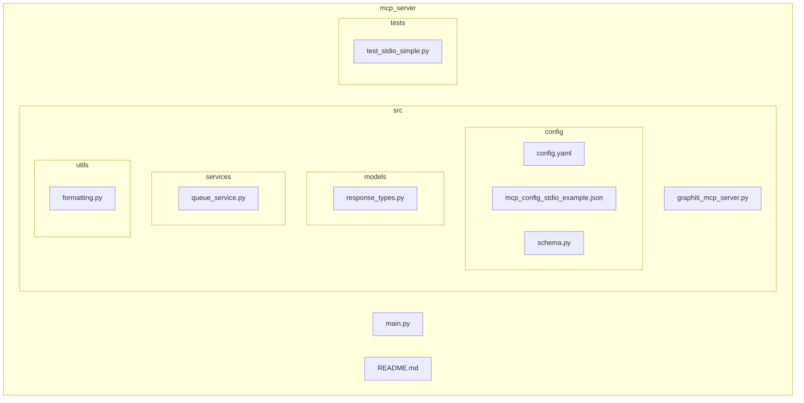
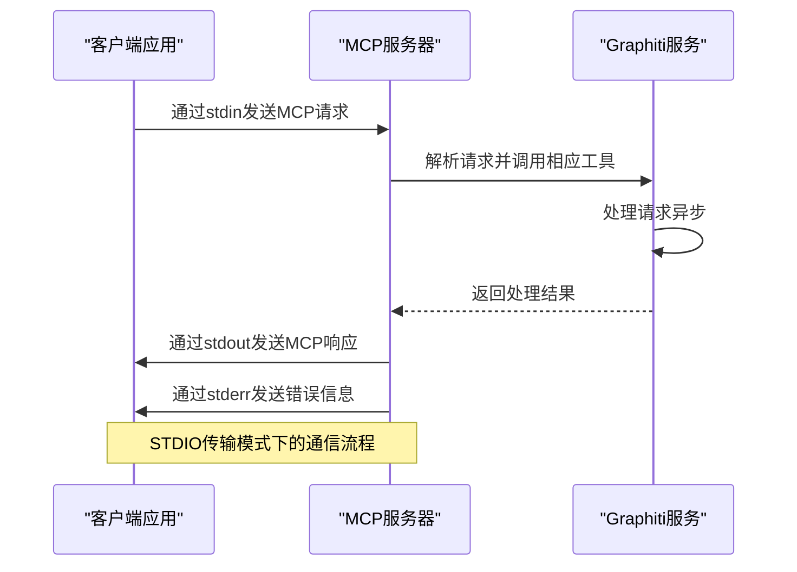
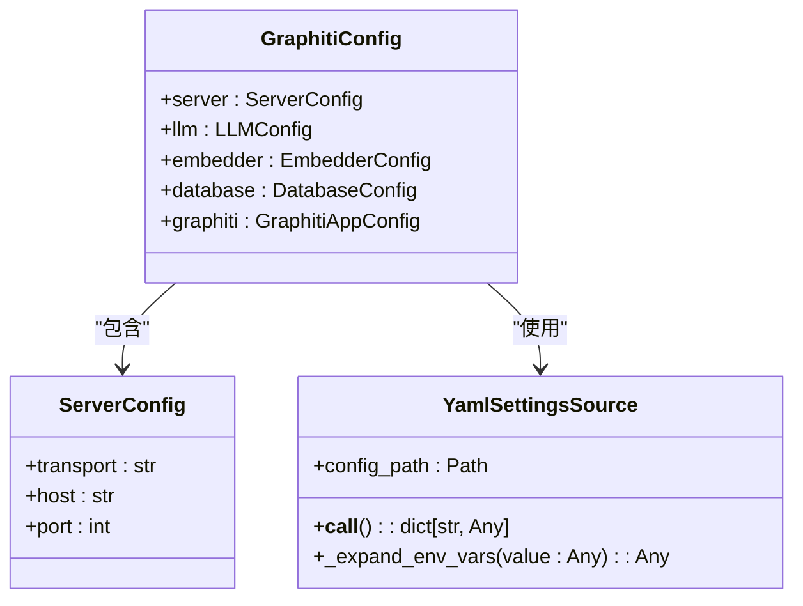
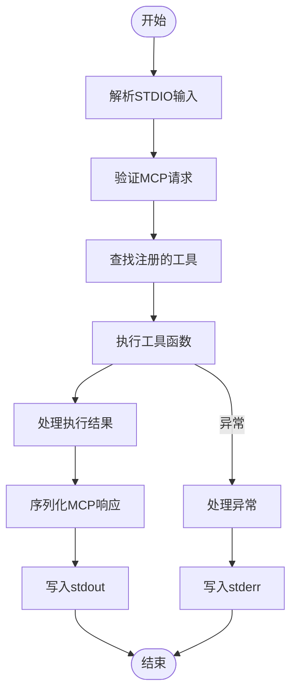

# STDIO传输协议配置

<cite>
**本文档中引用的文件**  
- [config.yaml](file://mcp_server/config/config.yaml)
- [mcp_config_stdio_example.json](file://mcp_server/config/mcp_config_stdio_example.json)
- [graphiti_mcp_server.py](file://mcp_server/src/graphiti_mcp_server.py)
- [schema.py](file://mcp_server/src/config/schema.py)
- [test_stdio_simple.py](file://mcp_server/tests/test_stdio_simple.py)
- [README.md](file://mcp_server/README.md)
</cite>

## 目录
1. [简介](#简介)
2. [项目结构](#项目结构)
3. [核心组件](#核心组件)
4. [架构概述](#架构概述)
5. [详细组件分析](#详细组件分析)
6. [依赖分析](#依赖分析)
7. [性能考虑](#性能考虑)
8. [故障排除指南](#故障排除指南)
9. [结论](#结论)

## 简介
本文档深入讲解MCP服务器的STDIO（标准输入/输出）传输协议配置方法。说明在config.yaml中将transport设置为'stdio'时的工作原理，以及如何在命令行环境中使用该模式。描述STDIO作为进程间通信机制的实现细节，包括消息的序列化格式、流式传输处理和错误输出分离。提供与AI代理框架集成的配置示例，说明如何通过管道将MCP服务器连接到其他应用程序。包含调试技巧，如日志输出重定向和输入流监控，以及性能考虑因素。

## 项目结构
MCP服务器的项目结构包含多个关键目录，其中`mcp_server`目录是核心组件所在位置。该目录包含配置文件、源代码、测试文件和Docker相关文件。`config`目录包含`config.yaml`主配置文件和`mcp_config_stdio_example.json`等示例配置。`src`目录包含服务器的主要实现代码，包括配置模式、模型定义、服务和工具。`tests`目录包含针对STDIO传输的测试文件，如`test_stdio_simple.py`。



**图示来源**  
- [config.yaml](file://mcp_server/config/config.yaml)
- [mcp_config_stdio_example.json](file://mcp_server/config/mcp_config_stdio_example.json)
- [graphiti_mcp_server.py](file://mcp_server/src/graphiti_mcp_server.py)
- [schema.py](file://mcp_server/src/config/schema.py)
- [test_stdio_simple.py](file://mcp_server/tests/test_stdio_simple.py)

## 核心组件
MCP服务器的核心组件包括配置系统、传输协议实现、工具注册机制和异步处理服务。`graphiti_mcp_server.py`是主入口文件，负责初始化服务器配置、注册工具和启动相应的传输协议。`schema.py`定义了配置模式，使用Pydantic和YAML支持来处理复杂的配置需求。`queue_service.py`实现了异步处理队列，确保在STDIO模式下能够正确处理并发请求。

**组件来源**  
- [graphiti_mcp_server.py](file://mcp_server/src/graphiti_mcp_server.py)
- [schema.py](file://mcp_server/src/config/schema.py)
- [queue_service.py](file://mcp_server/src/services/queue_service.py)

## 架构概述
MCP服务器的架构基于Model Context Protocol (MCP)规范，通过不同的传输协议与客户端通信。在STDIO模式下，服务器通过标准输入接收请求，通过标准输出发送响应，错误信息则通过标准错误输出。这种架构允许服务器作为子进程运行，通过管道与其他应用程序集成。服务器使用FastMCP库处理MCP协议的细节，包括消息序列化、工具调用和响应生成。



**图示来源**  
- [graphiti_mcp_server.py](file://mcp_server/src/graphiti_mcp_server.py)
- [queue_service.py](file://mcp_server/src/services/queue_service.py)

## 详细组件分析
### STDIO传输实现分析
MCP服务器的STDIO传输实现基于FastMCP库的`run_stdio_async()`方法。当在配置中将transport设置为'stdio'时，服务器会调用此方法启动STDIO模式。该模式下，服务器从标准输入读取JSON格式的MCP请求，处理后将响应写入标准输出，错误信息写入标准错误。

#### 配置模式分析


**图示来源**  
- [schema.py](file://mcp_server/src/config/schema.py)
- [graphiti_mcp_server.py](file://mcp_server/src/graphiti_mcp_server.py)

#### 工具调用流程分析


**图示来源**  
- [graphiti_mcp_server.py](file://mcp_server/src/graphiti_mcp_server.py)
- [queue_service.py](file://mcp_server/src/services/queue_service.py)

### 配置文件分析
MCP服务器的配置主要通过`config.yaml`文件进行。该文件支持环境变量扩展，使用`${VAR_NAME}`或`${VAR_NAME:default_value}`语法。在STDIO模式下，可以通过环境变量或命令行参数覆盖配置文件中的设置。

```yaml
server:
  transport: "stdio"  # 设置为stdio以启用标准输入/输出模式
  host: "0.0.0.0"
  port: 8000
```

**组件来源**  
- [config.yaml](file://mcp_server/config/config.yaml)
- [schema.py](file://mcp_server/src/config/schema.py)

## 依赖分析
MCP服务器的依赖关系包括核心依赖和可选依赖。核心依赖包括MCP库、OpenAI客户端、Graphiti核心库、Pydantic设置和PyYAML。可选依赖包括Azure身份验证、Google GenAI、Anthropic、Groq、VoyageAI和Sentence Transformers，这些依赖根据使用的LLM提供商和嵌入器提供商选择性安装。

```mermaid
graph TD
MCP_Server --> MCP_Lib
MCP_Server --> OpenAI_Client
MCP_Server --> Graphiti_Core
MCP_Server --> Pydantic_Settings
MCP_Server --> PyYAML
MCP_Server --> |可选| Azure_Identity
MCP_Server --> |可选| Google_GenAI
MCP_Server --> |可选| Anthropic
MCP_Server --> |可选| Groq
MCP_Server --> |可选| VoyageAI
MCP_Server --> |可选| Sentence_Transformers
subgraph "核心依赖"
MCP_Lib[MCP>=1.9.4]
OpenAI_Client[openai>=1.91.0]
Graphiti_Core[graphiti-core[falkordb]>=0.23.1]
Pydantic_Settings[pydantic-settings>=2.0.0]
PyYAML[pyyaml>=6.0]
end
subgraph "可选依赖"
Azure_Identity[azure-identity>=1.21.0]
Google_GenAI[google-genai>=1.8.0]
Anthropic[anthropic>=0.49.0]
Groq[groq>=0.2.0]
VoyageAI[voyageai>=0.2.3]
Sentence_Transformers[sentence-transformers>=2.0.0]
end
```

**图示来源**  
- [pyproject.toml](file://mcp_server/pyproject.toml)
- [graphiti_mcp_server.py](file://mcp_server/src/graphiti_mcp_server.py)

## 性能考虑
在使用STDIO传输协议时，需要考虑以下几个性能因素：

1. **并发处理**：通过`SEMAPHORE_LIMIT`环境变量控制并发处理的episode数量。默认值为10，适合OpenAI Tier 3和中等层级的Anthropic。根据LLM提供商的速率限制调整此值。

2. **消息序列化**：STDIO模式下，所有消息都以JSON格式序列化，这可能会影响性能，特别是在处理大量数据时。

3. **进程间通信开销**：STDIO作为进程间通信机制，相比HTTP协议有更低的开销，但需要确保输入输出流的正确管理。

4. **错误处理**：错误信息通过标准错误输出，需要确保错误处理不会阻塞主处理流程。

**性能来源**  
- [graphiti_mcp_server.py](file://mcp_server/src/graphiti_mcp_server.py)
- [README.md](file://mcp_server/README.md)

## 故障排除指南
### 常见问题及解决方案
1. **STDIO模式无法启动**：确保在命令行中正确指定了`--transport stdio`参数，或在`config.yaml`中正确设置了`transport: "stdio"`。

2. **环境变量未生效**：检查`.env`文件是否位于正确的目录（`mcp_server/`），并确保文件格式正确。

3. **数据库连接失败**：根据配置的数据库提供商（FalkorDB或Neo4j），确保数据库服务正在运行，并且连接参数正确。

4. **LLM提供商认证失败**：检查相应的API密钥环境变量是否已正确设置。

### 调试技巧
1. **日志输出重定向**：可以将标准输出和标准错误重定向到文件，便于调试：
   ```bash
   uv run graphiti_mcp_server.py --transport stdio > stdout.log 2> stderr.log
   ```

2. **输入流监控**：使用工具如`tee`监控输入流：
   ```bash
   echo '{"jsonrpc":"2.0","method":"initialize","params":{}}' | tee /dev/tty | uv run graphiti_mcp_server.py --transport stdio
   ```

3. **简化测试**：使用`test_stdio_simple.py`中的测试代码作为参考，创建简化的测试用例。

**故障排除来源**  
- [graphiti_mcp_server.py](file://mcp_server/src/graphiti_mcp_server.py)
- [test_stdio_simple.py](file://mcp_server/tests/test_stdio_simple.py)
- [README.md](file://mcp_server/README.md)

## 结论
MCP服务器的STDIO传输协议提供了一种轻量级、高效的进程间通信方式，特别适合与AI代理框架集成。通过正确配置`config.yaml`文件和使用适当的命令行参数，可以轻松启用STDIO模式。该模式下，服务器通过标准输入接收请求，通过标准输出发送响应，错误信息则通过标准错误输出，实现了清晰的通信分离。结合环境变量和命令行参数的灵活性，MCP服务器可以适应各种部署场景，从本地开发到生产环境。