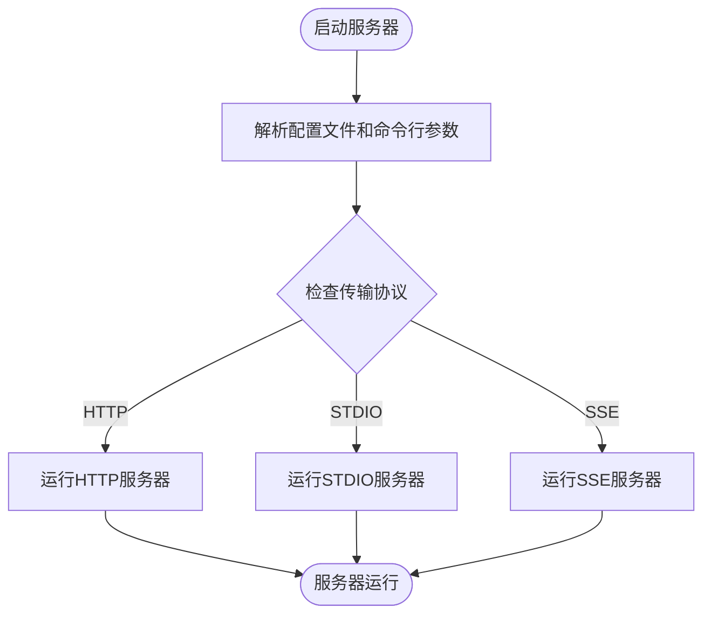
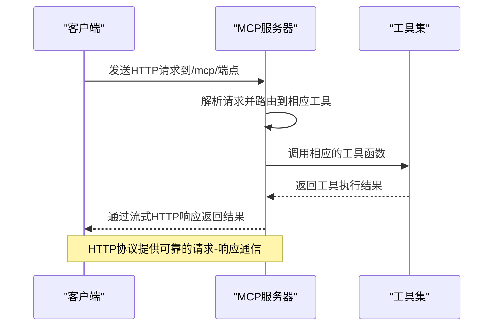
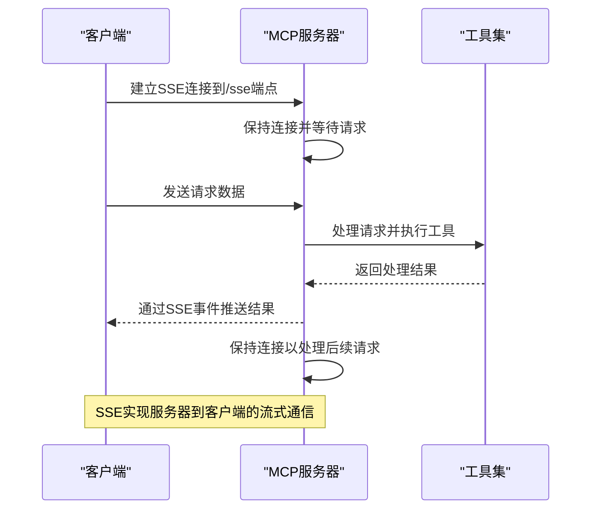

# 传输协议配置

<cite>
**本文档引用的文件**  
- [main.py](file://mcp_server/main.py)
- [graphiti_mcp_server.py](file://mcp_server/src/graphiti_mcp_server.py)
- [config.yaml](file://mcp_server/config/config.yaml)
- [mcp_config_stdio_example.json](file://mcp_server/config/mcp_config_stdio_example.json)
- [schema.py](file://mcp_server/src/config/schema.py)
- [test_mcp_transports.py](file://mcp_server/tests/test_mcp_transports.py)
- [test_http_integration.py](file://mcp_server/tests/test_http_integration.py)
- [README.md](file://mcp_server/README.md)
</cite>

## 目录
1. [简介](#简介)
2. [协议配置方法](#协议配置方法)
3. [HTTP协议配置](#http协议配置)
4. [SSE流式响应实现](#sse流式响应实现)
5. [STDIO管道通信设置](#stdio管道通信设置)
6. [安全考虑](#安全考虑)
7. [客户端连接最佳实践](#客户端连接最佳实践)
8. [总结](#总结)

## 简介

Graphiti MCP服务器支持多种传输协议，包括HTTP、STDIO和SSE，为不同类型的客户端提供了灵活的连接方式。服务器默认使用HTTP协议，推荐用于大多数应用场景，而STDIO协议适用于命令行工具和AI代理框架，SSE协议则作为已弃用的选项存在。通过配置文件和命令行参数，用户可以轻松启用或禁用不同的传输协议，以满足特定的部署需求。

**Section sources**
- [README.md](file://mcp_server/README.md#L1-L684)

## 协议配置方法

MCP服务器的传输协议可以通过配置文件`config.yaml`或命令行参数进行配置。在`config.yaml`文件中，`server.transport`字段定义了使用的传输协议，可选值包括"http"、"stdio"和"sse"。命令行参数`--transport`提供了相同的配置选项，优先级高于配置文件。服务器启动时会根据配置选择相应的传输模式，并在日志中输出相关信息。



**Diagram sources**
- [graphiti_mcp_server.py](file://mcp_server/src/graphiti_mcp_server.py#L900-L966)
- [schema.py](file://mcp_server/src/config/schema.py#L76-L85)

**Section sources**
- [graphiti_mcp_server.py](file://mcp_server/src/graphiti_mcp_server.py#L780-L800)
- [schema.py](file://mcp_server/src/config/schema.py#L76-L85)

## HTTP协议配置

HTTP协议是MCP服务器的默认和推荐传输方式，提供了广泛的客户端兼容性。服务器在`/mcp/`端点暴露MCP功能，支持流式HTTP传输。配置文件中的`server.host`和`server.port`字段定义了服务器绑定的主机和端口，默认为`0.0.0.0:8000`。HTTP服务器启动时会输出访问信息，包括基本URL和MCP端点，方便客户端连接。



**Diagram sources**
- [graphiti_mcp_server.py](file://mcp_server/src/graphiti_mcp_server.py#L922-L945)
- [test_http_integration.py](file://mcp_server/tests/test_http_integration.py#L15-L251)

**Section sources**
- [graphiti_mcp_server.py](file://mcp_server/src/graphiti_mcp_server.py#L922-L945)
- [README.md](file://mcp_server/README.md#L108-L109)

## SSE流式响应实现

SSE（Server-Sent Events）协议实现了服务器到客户端的单向流式通信，允许服务器在处理完成时主动推送结果。虽然SSE协议在代码中仍然支持，但已被标记为"已弃用"。SSE端点位于`/sse`，客户端通过建立持久连接来接收服务器推送的事件。这种模式适用于需要实时更新的场景，但由于其单向通信特性，不如双向的HTTP协议灵活。



**Diagram sources**
- [graphiti_mcp_server.py](file://mcp_server/src/graphiti_mcp_server.py#L916-L922)
- [test_mcp_transports.py](file://mcp_server/tests/test_mcp_transports.py#L16-L275)

**Section sources**
- [graphiti_mcp_server.py](file://mcp_server/src/graphiti_mcp_server.py#L916-L922)
- [README.md](file://mcp_server/README.md#L16)

## STDIO管道通信设置

STDIO协议通过标准输入输出流实现进程间通信，适用于命令行工具和集成到其他应用程序中的场景。配置文件`mcp_config_stdio_example.json`提供了STDIO协议的配置示例，其中`transport`字段设置为"stdio"，`command`字段指定启动服务器的命令。STDIO模式下，服务器从标准输入读取请求，将响应写入标准输出，实现了简单的管道通信机制。

```mermaid
flowchart TD
Subprocess([子进程])
Subprocess --> |stdin| MCP["MCP服务器"]
Subprocess --> |stdout| MCP
MCP --> |处理请求| Tools["工具函数"]
Tools --> |返回结果| MCP
MCP --> |stdout| Subprocess
style Subprocess fill:#f9f,stroke:#333
style MCP fill:#bbf,stroke:#333,color:#fff
style Tools fill:#9f9,stroke:#333
Note: STDIO协议通过标准输入输出实现进程间通信
```

**Diagram sources**
- [mcp_config_stdio_example.json](file://mcp_server/config/mcp_config_stdio_example.json#L1-L22)
- [graphiti_mcp_server.py](file://mcp_server/src/graphiti_mcp_server.py#L914-L916)

**Section sources**
- [mcp_config_stdio_example.json](file://mcp_server/config/mcp_config_stdio_example.json#L1-L22)
- [README.md](file://mcp_server/README.md#L44-L54)

## 安全考虑

MCP服务器的安全配置主要通过环境变量和配置文件实现。服务器支持通过环境变量设置API密钥，如`OPENAI_API_KEY`、`ANTHROPIC_API_KEY`等，避免了密钥硬编码的风险。虽然文档中没有明确提及HTTP端点的身份验证和CORS策略，但通过环境变量配置和合理的部署实践（如使用反向代理），可以实现必要的安全控制。建议在生产环境中使用HTTPS和适当的访问控制来保护服务器。

**Section sources**
- [config.yaml](file://mcp_server/config/config.yaml#L1-L111)
- [README.md](file://mcp_server/README.md#L222-L241)

## 客户端连接最佳实践

不同类型的客户端应根据其特性和需求选择合适的连接方式。浏览器和现代IDE（如Cursor）应使用HTTP协议直接连接到`http://localhost:8000/mcp/`端点。命令行工具和需要嵌入式服务器的应用程序可以使用STDIO协议，通过配置文件指定启动命令和参数。对于不支持HTTP的客户端（如Claude Desktop），可以使用`mcp-remote`等网关工具将HTTP请求转换为STDIO通信，实现兼容性连接。

**Section sources**
- [README.md](file://mcp_server/README.md#L470-L646)

## 总结

Graphiti MCP服务器提供了多种传输协议支持，满足了不同应用场景的需求。HTTP协议作为默认和推荐选项，提供了最佳的兼容性和功能完整性。STDIO协议适用于嵌入式和命令行场景，而SSE协议虽然存在但已不推荐使用。通过合理的配置和安全实践，用户可以根据具体需求选择最适合的传输方式，实现高效、安全的客户端-服务器通信。

**Section sources**
- [README.md](file://mcp_server/README.md#L1-L684)
- [graphiti_mcp_server.py](file://mcp_server/src/graphiti_mcp_server.py#L1-L966)