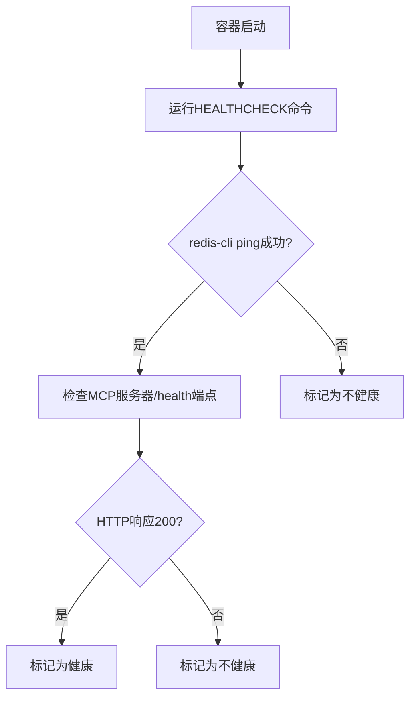
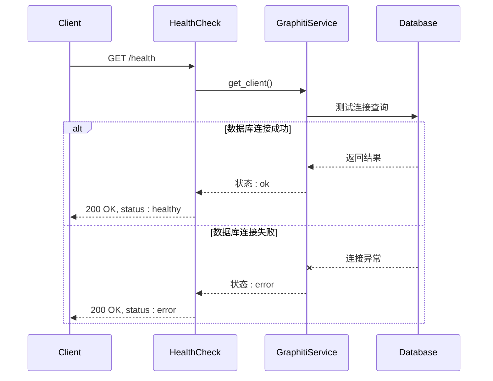

# 健康检查与服务状态

<cite>
**本文档中引用的文件**
- [main.py](file://mcp_server/main.py)
- [graphiti_mcp_server.py](file://mcp_server/src/graphiti_mcp_server.py)
- [response_types.py](file://mcp_server/src/models/response_types.py)
- [Dockerfile](file://mcp_server/docker/Dockerfile)
- [docker-compose.yml](file://mcp_server/docker/docker-compose.yml)
- [config.yaml](file://mcp_server/config/config.yaml)
- [README.md](file://mcp_server/README.md)
- [README-falkordb-combined.md](file://mcp_server/docker/README-falkordb-combined.md)
</cite>

## 目录
1. [健康检查端点实现机制](#健康检查端点实现机制)
2. [容器编排系统集成](#容器编排系统集成)
3. [HEALTHCHECK指令协同工作](#healthcheck指令协同工作)
4. [多环境验证方法](#多环境验证方法)
5. [数据库连接失败处理](#数据库连接失败处理)

## 健康检查端点实现机制

MCP服务器的健康检查端点(/health)通过HTTP GET请求提供服务状态监控功能。该端点在`graphiti_mcp_server.py`文件中通过`@mcp.custom_route('/health', methods=['GET'])`装饰器定义，返回包含状态和服务名称的JSON响应。健康检查端点独立于主要的MCP功能端点(/mcp/)，专门用于服务存活检测。

端点返回的响应包含`status`字段值为"healthy"和`service`字段值为"graphiti-mcp"，表明服务正常运行。此实现遵循标准的健康检查协议，允许容器编排系统定期探测服务可用性。健康检查端点的设计确保了即使在数据库连接问题的情况下，MCP服务器本身的状态仍然可以被正确报告。

**节来源**
- [graphiti_mcp_server.py](file://mcp_server/src/graphiti_mcp_server.py#L756-L759)

## 容器编排系统集成

Docker和Kubernetes等容器编排系统利用/health端点进行服务存活检测。在Docker环境中，`docker-compose.yml`文件配置了健康检查机制，通过执行`redis-cli -p 6379 ping`命令验证FalkorDB的可用性。健康检查配置包括10秒的检查间隔、5秒的超时时间、15秒的启动等待期和最多5次重试。

Kubernetes可以通过定义liveness和readiness探针来集成此健康检查端点。Liveness探针确保容器在失败时被重启，而readiness探针确定容器是否准备好接收流量。这种集成机制确保了服务的高可用性，当健康检查失败时，编排系统会自动采取恢复措施，如重启容器或从服务负载均衡中移除实例。

**节来源**
- [docker-compose.yml](file://mcp_server/docker/docker-compose.yml#L33-L39)
- [README-falkordb-combined.md](file://mcp_server/docker/README-falkordb-combined.md#L148-L154)

## HEALTHCHECK指令协同工作

Dockerfile中的HEALTHCHECK指令与/health HTTP端点协同工作，形成多层次的健康检查机制。在`Dockerfile`中，HEALTHCHECK指令配置为每10秒检查一次FalkorDB的ping响应，确保底层数据库服务的可用性。同时，`start-services.sh`脚本在启动MCP服务器前会等待FalkorDB准备就绪。

这种协同工作机制确保了服务栈的完整健康状态验证。容器的健康状态不仅取决于MCP服务器进程的运行，还依赖于其依赖的数据库服务。当使用`docker compose ps`命令查看服务状态时，可以观察到容器的健康状态基于这些检查结果。这种设计避免了服务在依赖项不可用时报告虚假的健康状态。



**图来源**
- [Dockerfile](file://mcp_server/docker/Dockerfile#L132-L134)
- [start-services.sh](file://mcp_server/docker/Dockerfile#L70-L110)

**节来源**
- [Dockerfile](file://mcp_server/docker/Dockerfile#L132-L134)

## 多环境验证方法

在不同部署环境中验证服务健康状态的具体命令和最佳实践如下：

**Docker Compose环境**：
```bash
# 检查服务整体健康状态
docker compose -f docker/docker-compose.yml ps

# 直接调用健康检查端点
curl http://localhost:8000/health

# 检查FalkorDB数据库状态
docker compose exec graphiti-falkordb redis-cli ping
```

**Kubernetes环境**：
```yaml
livenessProbe:
  httpGet:
    path: /health
    port: 8000
  initialDelaySeconds: 15
  periodSeconds: 10
  timeoutSeconds: 5
  failureThreshold: 3

readinessProbe:
  httpGet:
    path: /health
    port: 8000
  initialDelaySeconds: 10
  periodSeconds: 5
```

**独立运行环境**：
```bash
# 启动服务器
uv run main.py

# 验证健康状态
curl http://localhost:8000/health

# 检查进程状态
ps aux | grep graphiti_mcp_server
```

最佳实践包括设置适当的初始延迟以允许服务启动，配置合理的检查间隔和超时时间，以及使用不同的探针类型区分存活和就绪状态。

**节来源**
- [docker-compose.yml](file://mcp_server/docker/docker-compose.yml)
- [README-falkordb-combined.md](file://mcp_server/docker/README-falkordb-combined.md#L120-L124)

## 数据库连接失败处理

当数据库连接失败时，`get_status`工具函数的错误响应处理逻辑在`graphiti_mcp_server.py`中实现。该函数首先尝试获取Graphiti服务客户端，然后通过执行`MATCH (n) RETURN count(n) as count`查询来测试数据库连接。如果连接成功，返回状态为"ok"的响应；如果连接失败，则捕获异常并返回状态为"error"的响应。

错误响应包含详细的错误信息，帮助诊断连接问题。例如，当FalkorDB或Neo4j数据库未运行时，系统会生成包含具体错误消息和启动指导的运行时异常。这种错误处理机制确保了即使在数据库不可用的情况下，MCP服务器仍然能够提供有意义的状态信息，而不是完全失败。



**图来源**
- [graphiti_mcp_server.py](file://mcp_server/src/graphiti_mcp_server.py#L724-L753)

**节来源**
- [graphiti_mcp_server.py](file://mcp_server/src/graphiti_mcp_server.py#L724-L753)
- [response_types.py](file://mcp_server/src/models/response_types.py#L41-L44)