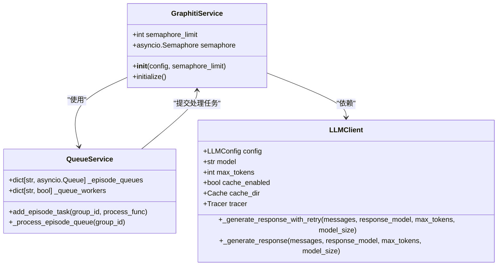
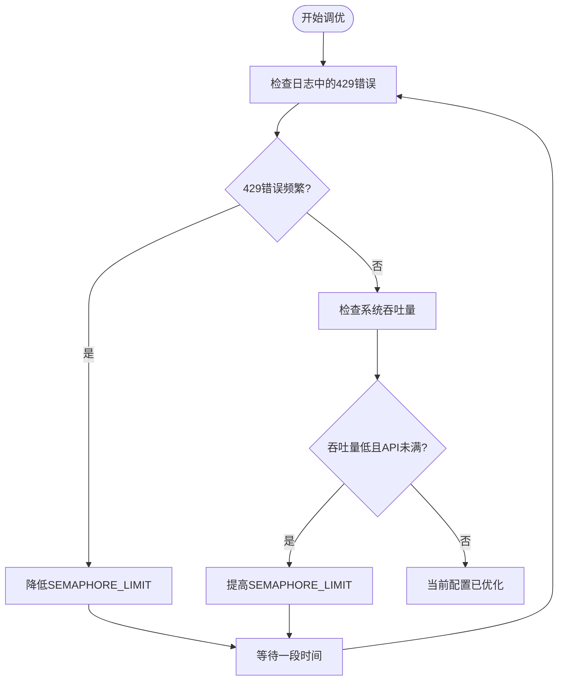

# 性能监控与并发调优

<cite>
**本文档引用文件**   
- [graphiti_mcp_server.py](file://mcp_server/src/graphiti_mcp_server.py)
- [queue_service.py](file://mcp_server/src/services/queue_service.py)
- [client.py](file://graphiti_core/llm_client/client.py)
- [anthropic_client.py](file://graphiti_core/llm_client/anthropic_client.py)
- [openai_client.py](file://graphiti_core/llm_client/openai_client.py)
- [azure_openai_client.py](file://graphiti_core/llm_client/azure_openai_client.py)
- [config.yaml](file://mcp_server/config/config.yaml)
- [.env.example](file://mcp_server/.env.example)
- [test_stress_load.py](file://mcp_server/tests/test_stress_load.py)
- [test_async_operations.py](file://mcp_server/tests/test_async_operations.py)
</cite>

## 目录
1. [引言](#引言)
2. [并发控制机制](#并发控制机制)
3. [性能监控指标](#性能监控指标)
4. [SEMAPHORE_LIMIT调优指南](#semaphore_limit调优指南)
5. [性能压测方法](#性能压测方法)
6. [容量规划建议](#容量规划建议)
7. [结论](#结论)

## 引言

Graphiti MCP服务器是一个基于知识图谱的AI代理记忆服务，通过模型上下文协议（MCP）提供功能。该系统能够处理动态数据，如用户交互、企业数据变化和外部信息，并将其转换为丰富连接的知识网络。为了确保系统在高负载下稳定运行并有效利用LLM API配额，深入理解其性能监控指标和并发控制机制至关重要。

本文档将深入分析MCP服务器的性能监控指标和并发控制机制，重点阐述SEMAPHORE_LIMIT环境变量如何通过asyncio.Semaphore限制并发处理的episode数量，防止LLM API超出速率限制。根据源码中的详细注释，提供针对不同LLM提供商（OpenAI、Anthropic、Azure）的SEMAPHORE_LIMIT调优指南。同时，解释监控请求延迟、错误率（特别是429速率限制错误）和队列积压的重要性，并提供性能压测方法和基于监控数据的容量规划建议。

**Section sources**
- [graphiti_mcp_server.py](file://mcp_server/src/graphiti_mcp_server.py#L1-L800)

## 并发控制机制

MCP服务器的并发控制机制主要通过`SEMAPHORE_LIMIT`环境变量和`asyncio.Semaphore`实现，旨在防止LLM API超出速率限制，同时最大化系统吞吐量。

### SEMAPHORE_LIMIT环境变量

`SEMAPHORE_LIMIT`环境变量是控制并发处理episode数量的核心配置。它定义了`asyncio.Semaphore`的初始值，从而限制同时处理的episode数量。每个episode处理涉及多个LLM调用（如实体提取、去重等），因此实际的并发LLM请求数会更高。



**Diagram sources **
- [graphiti_mcp_server.py](file://mcp_server/src/graphiti_mcp_server.py#L48-L75)
- [queue_service.py](file://mcp_server/src/services/queue_service.py#L12-L153)

### 并发处理流程

1.  **请求接收**：当客户端调用`add_memory`工具时，请求被接收并立即返回，表示episode已排队等待处理。
2.  **队列管理**：`QueueService`负责管理按`group_id`划分的episode处理队列。每个`group_id`有自己的队列，确保同一`group_id`的episodes按顺序处理，避免竞争条件。
3.  **并发限制**：`GraphitiService`在初始化时创建一个`asyncio.Semaphore`，其大小由`SEMAPHORE_LIMIT`决定。当`QueueService`从队列中取出一个episode进行处理时，会先获取信号量。如果信号量已被耗尽，处理任务将被阻塞，直到有其他任务释放信号量。
4.  **LLM调用**：在信号量的保护下，`GraphitiService`执行episode处理，这期间会进行多次LLM调用。LLM客户端（如`OpenAIClient`、`AnthropicClient`）负责与具体的LLM提供商API通信。

### 信号量与队列的协同

`SEMAPHORE_LIMIT`控制的是跨所有`group_id`的全局并发处理数量，而`QueueService`确保了每个`group_id`内部的处理顺序。这种设计允许不同`group_id`的episodes并发处理，提高了整体吞吐量，同时保证了单个`group_id`内数据处理的原子性和一致性。

**Section sources**
- [graphiti_mcp_server.py](file://mcp_server/src/graphiti_mcp_server.py#L161-L169)
- [queue_service.py](file://mcp_server/src/services/queue_service.py#L12-L153)

## 性能监控指标

为了有效调优和维护MCP服务器的性能，必须监控一系列关键指标。这些指标有助于诊断问题、评估系统健康状况并指导容量规划。

### 核心监控指标

| 指标 | 描述 | 重要性 | 监控方法 |
| :--- | :--- | :--- | :--- |
| **请求延迟** | 从客户端发起请求到收到响应的总时间。 | 高延迟直接影响用户体验和系统响应性。 | 通过日志中的时间戳计算，或使用OpenTelemetry等追踪工具。 |
| **错误率** | 失败请求占总请求的比例，特别是429速率限制错误。 | 429错误直接表明LLM API配额已耗尽，是调整`SEMAPHORE_LIMIT`的关键信号。 | 分析服务器日志，统计包含"429"或"Rate limit"的错误信息。 |
| **队列积压** | 等待处理的episodes数量。 | 积压增长表明处理速度跟不上请求速度，可能导致延迟增加和内存消耗。 | 通过`QueueService.get_queue_size()`方法获取特定`group_id`的队列大小。 |
| **LLM API使用率** | 实际的LLM API调用次数与提供商配额的比率。 | 评估资源利用率，避免浪费或超额。 | 查看LLM提供商（如OpenAI、Anthropic）的仪表板。 |
| **系统资源使用** | CPU、内存、网络I/O等系统资源的消耗情况。 | 资源瓶颈可能限制系统性能，即使LLM API未达到限制。 | 使用系统监控工具（如`psutil`）或云平台监控服务。 |

### 监控实现

在代码层面，性能监控主要通过以下方式实现：
-   **结构化日志**：服务器配置了带有时间戳的结构化日志（`LOG_FORMAT`），便于分析和追踪。
-   **错误处理**：`LLMClient`基类和具体实现（如`AnthropicClient`）会捕获并记录HTTP状态错误，特别是5xx服务器错误和429速率限制错误。
-   **重试机制**：对于可重试的错误（如服务器错误、5xx状态码），使用`tenacity`库进行指数退避重试，这本身也是一种监控和恢复机制。
-   **测试用例**：`test_stress_load.py`和`test_async_operations.py`中的测试用例模拟了高负载场景，用于测量吞吐量、延迟和成功率。

**Section sources**
- [graphiti_mcp_server.py](file://mcp_server/src/graphiti_mcp_server.py#L78-L95)
- [client.py](file://graphiti_core/llm_client/client.py#L57-L63)
- [anthropic_client.py](file://graphiti_core/llm_client/anthropic_client.py#L321-L322)
- [test_stress_load.py](file://mcp_server/tests/test_stress_load.py#L1-L528)

## SEMAPHORE_LIMIT调优指南

`SEMAPHORE_LIMIT`的值需要根据所使用的LLM提供商及其API的速率限制来仔细调整。设置过高会导致429错误和成本增加，设置过低则会导致API配额未被充分利用和处理速度变慢。

### 调优原则

根据源码中的详细注释（`graphiti_mcp_server.py`第54-74行），调优应遵循以下原则：
-   **症状判断**：
    -   **过高**：频繁出现429速率限制错误，LLM成本异常增加。
    -   **过低**：系统吞吐量低，LLM API仪表板显示请求率远低于配额，处理延迟长。
-   **监控驱动**：调整后必须密切监控日志中的429错误、episode处理时间和LLM提供商的实际请求率。

### 针对不同LLM提供商的调优建议

| LLM提供商 | 速率限制 (RPM) | 建议的SEMAPHORE_LIMIT范围 | 说明 |
| :--- | :--- | :--- | :--- |
| **OpenAI Tier 1 (免费)** | 3 | 1-2 | 免费层级配额极低，必须严格限制并发。 |
| **OpenAI Tier 2** | 60 | 5-8 | 适用于中等规模应用。 |
| **OpenAI Tier 3** | 500 | 10-15 | 默认值（10）适用于此层级。 |
| **OpenAI Tier 4** | 5,000 | 20-50 | 高配额层级，可设置较高并发。 |
| **Anthropic (默认)** | 50 | 5-8 | 与OpenAI Tier 2类似。 |
| **Anthropic (高配额)** | 1,000 | 15-30 | 可设置较高并发以充分利用配额。 |
| **Azure OpenAI** | 可变 | 根据配额调整 | 需查阅Azure门户中的具体配额，按比例调整。 |

### 配置方法

`SEMAPHORE_LIMIT`可以通过两种方式配置：
1.  **环境变量**：在`.env`文件或系统环境中设置`SEMAPHORE_LIMIT`。这是推荐的方法，因为它与代码分离，便于在不同环境（开发、生产）中调整。
2.  **默认值**：如果未设置环境变量，代码中会使用默认值10。



**Diagram sources **
- [graphiti_mcp_server.py](file://mcp_server/src/graphiti_mcp_server.py#L54-L74)
- [.env.example](file://mcp_server/.env.example#L20-L32)
- [config.yaml](file://mcp_server/config/config.yaml#L1-L111)

**Section sources**
- [graphiti_mcp_server.py](file://mcp_server/src/graphiti_mcp_server.py#L48-L75)
- [.env.example](file://mcp_server/.env.example#L20-L32)

## 性能压测方法

性能压测是验证系统在高负载下的稳定性和确定最佳`SEMAPHORE_LIMIT`值的关键步骤。MCP服务器的代码库中包含了丰富的测试用例，可以作为压测的参考。

### 压测场景

1.  **持续负载测试** (`test_sustained_load`)：模拟长时间的中等负载，测试系统的稳定性和平均延迟。
2.  **突发负载测试** (`test_spike_load`)：模拟请求量的突然激增，测试系统的弹性和恢复能力。
3.  **渐进式负载测试** (`test_gradual_degradation`)：逐步增加并发请求数，观察系统性能（成功率、吞吐量）的下降趋势，找到性能拐点。
4.  **连接池耗尽测试** (`test_connection_pool_exhaustion`)：创建大量并发长时任务，测试数据库或HTTP连接池的健壮性。
5.  **速率限制处理测试** (`test_rate_limit_handling`)：快速发送大量请求以触发LLM API的速率限制，验证系统是否能优雅地处理429错误。

### 压测指标

压测应重点关注以下指标：
-   **成功率**：成功处理的请求占总请求数的比例。
-   **吞吐量**：单位时间内成功处理的请求数（ops/s）。
-   **延迟**：包括平均延迟、P50、P95、P99延迟和最大延迟。
-   **错误分布**：各类错误（如超时、429、连接错误）的数量和比例。
-   **资源使用**：CPU、内存、网络等系统资源的峰值和平均使用率。

### 执行压测

可以使用`pytest`运行`test_stress_load.py`中的测试用例。例如：
```bash
pytest mcp_server/tests/test_stress_load.py -m slow -v
```
通过分析测试输出的报告，可以全面了解系统在不同压力下的表现。

**Section sources**
- [test_stress_load.py](file://mcp_server/tests/test_stress_load.py#L1-L528)
- [test_async_operations.py](file://mcp_server/tests/test_async_operations.py#L1-L490)

## 容量规划建议

容量规划是确保系统能够满足未来业务需求的关键。基于性能监控和压测数据，可以制定合理的容量规划。

### 规划步骤

1.  **评估业务需求**：确定预期的请求量（每秒/每分钟）、数据量和增长趋势。
2.  **基准测试**：在目标硬件和网络环境下，使用生产级别的数据进行压测，确定当前`SEMAPHORE_LIMIT`下的最大稳定吞吐量。
3.  **计算所需容量**：将业务需求与基准测试结果对比。如果需求超过当前容量，则需要：
    -   **纵向扩展**：增加服务器资源（CPU、内存）。
    -   **横向扩展**：部署多个MCP服务器实例，并通过负载均衡分发请求。
    -   **调整SEMAPHORE_LIMIT**：在不触发LLM速率限制的前提下，适当提高并发度。
4.  **监控与迭代**：上线后持续监控关键指标，根据实际运行情况迭代优化配置。

### 关键考虑因素

-   **LLM成本**：更高的`SEMAPHORE_LIMIT`意味着更多的LLM调用，直接增加成本。规划时需平衡性能和成本。
-   **数据库性能**：知识图谱数据库（如FalkorDB、Neo4j）的性能是另一个瓶颈。确保数据库有足够的资源和优化的索引。
-   **网络延迟**：LLM API的网络延迟会影响整体处理时间。选择地理位置较近的API端点可以降低延迟。

**Section sources**
- [test_stress_load.py](file://mcp_server/tests/test_stress_load.py#L495-L523)

## 结论

MCP服务器通过`SEMAPHORE_LIMIT`环境变量和`asyncio.Semaphore`机制，有效地控制了并发处理的episode数量，防止了LLM API的速率限制错误。深入理解这一机制，并结合对请求延迟、错误率和队列积压等关键性能指标的监控，是确保系统稳定高效运行的基础。

通过遵循针对不同LLM提供商的调优指南，利用内置的压测方法进行验证，并基于监控数据进行容量规划，可以将MCP服务器的性能和资源利用率优化到最佳状态。最终目标是在不超出LLM配额和成本预算的前提下，最大化系统的吞吐量和响应速度，为AI代理提供可靠的记忆服务。