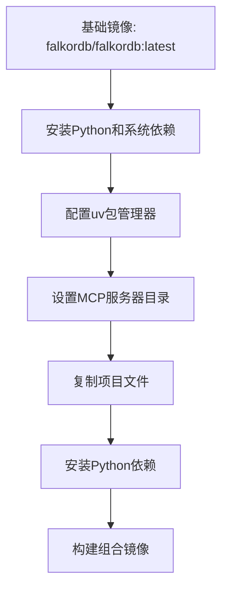
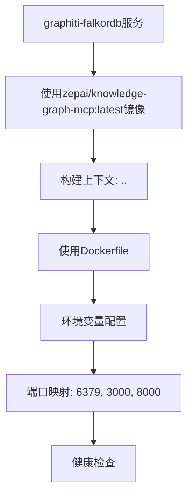

# 部署与运维

<cite>
**本文档引用的文件**
- [Dockerfile](file://mcp_server/docker/Dockerfile)
- [Dockerfile.standalone](file://mcp_server/docker/Dockerfile.standalone)
- [docker-compose.yml](file://mcp_server/docker/docker-compose.yml)
- [docker-compose-falkordb.yml](file://mcp_server/docker/docker-compose-falkordb.yml)
- [docker-compose-neo4j.yml](file://mcp_server/docker/docker-compose-neo4j.yml)
- [config.yaml](file://mcp_server/config/config.yaml)
- [config-docker-falkordb.yaml](file://mcp_server/config/config-docker-falkordb.yaml)
- [config-docker-neo4j.yaml](file://mcp_server/config/config-docker-neo4j.yaml)
- [main.py](file://mcp_server/main.py)
- [graphiti_mcp_server.py](file://mcp_server/src/graphiti_mcp_server.py)
- [pyproject.toml](file://mcp_server/pyproject.toml)
- [README.md](file://mcp_server/docker/README.md)
- [README-falkordb-combined.md](file://mcp_server/docker/README-falkordb-combined.md)
</cite>

## 目录
1. [简介](#简介)
2. [部署模式](#部署模式)
3. [Docker镜像构建](#docker镜像构建)
4. [Docker Compose编排](#docker-compose编排)
5. [配置管理](#配置管理)
6. [传输协议](#传输协议)
7. [健康检查与监控](#健康检查与监控)
8. [日志管理](#日志管理)
9. [性能调优](#性能调优)
10. [生产环境最佳实践](#生产环境最佳实践)

## 简介

本指南详细介绍了MCP服务器的部署与运维，涵盖Docker容器化部署和直接运行两种模式。文档将深入解析Dockerfile的构建过程、多阶段构建策略和镜像优化技术。同时，将解释docker-compose.yml文件的编排配置，包括MCP服务器、FalkorDB/Neo4j数据库和可选组件的网络设置与依赖关系。针对不同数据库后端（FalkorDB、Neo4j）的专用docker-compose文件使用说明也将提供。此外，文档将描述HTTP、STDIO和SSE传输协议的配置方法与适用场景，包含健康检查端点（/health）的监控集成、日志管理策略和性能调优建议（如SEMAPHORE_LIMIT设置），并提供生产环境部署的最佳实践。

**Section sources**
- [README.md](file://mcp_server/docker/README.md#L1-L264)

## 部署模式

MCP服务器支持两种主要的部署模式：Docker容器化部署和直接运行模式。Docker容器化部署提供了环境隔离和依赖管理的优势，而直接运行模式则适用于需要更精细控制的场景。

### Docker容器化部署

Docker容器化部署是推荐的部署方式，它通过容器化技术将MCP服务器及其依赖打包成一个独立的运行单元。这种模式确保了环境一致性，简化了部署流程，并提供了更好的资源隔离。

**Section sources**
- [README.md](file://mcp_server/docker/README.md#L3-L264)

### 直接运行模式

直接运行模式允许在宿主机上直接运行MCP服务器，适用于需要与宿主机紧密集成或对性能有特殊要求的场景。此模式需要手动管理所有依赖和环境配置。

**Section sources**
- [README.md](file://mcp_server/docker/README.md#L3-L264)

## Docker镜像构建

MCP服务器提供了两种Docker镜像构建策略：多阶段构建和独立构建。多阶段构建用于创建包含FalkorDB和MCP服务器的组合镜像，而独立构建则用于创建仅包含MCP服务器的镜像。

### 多阶段构建策略

多阶段构建通过在单个Dockerfile中定义多个构建阶段，实现了镜像的优化和分层。第一个阶段基于FalkorDB基础镜像，安装Python和系统依赖，配置uv包管理器，并设置MCP服务器目录。第二个阶段复制项目文件，安装Python依赖，并最终构建出包含FalkorDB和MCP服务器的组合镜像。

**Diagram sources**
- [Dockerfile](file://mcp_server/docker/Dockerfile#L1-L138)

**Section sources**
- [Dockerfile](file://mcp_server/docker/Dockerfile#L1-L138)

### 镜像优化

镜像优化通过多种技术实现，包括使用slim基础镜像、移除不必要的依赖、使用缓存和多阶段构建。这些技术显著减小了镜像大小，提高了构建和部署效率。

**Section sources**
- [Dockerfile](file://mcp_server/docker/Dockerfile#L1-L138)
- [Dockerfile.standalone](file://mcp_server/docker/Dockerfile.standalone#L1-L82)

## Docker Compose编排

Docker Compose用于定义和运行多容器Docker应用程序。MCP服务器提供了多个docker-compose配置文件，以支持不同的数据库后端和部署场景。

### 基本编排配置

基本编排配置文件`docker-compose.yml`定义了MCP服务器和FalkorDB数据库的服务。该配置使用环境变量进行灵活配置，并通过健康检查确保服务的可用性。

**Diagram sources**
- [docker-compose.yml](file://mcp_server/docker/docker-compose.yml#L1-L45)

**Section sources**
- [docker-compose.yml](file://mcp_server/docker/docker-compose.yml#L1-L45)

### FalkorDB编排配置

FalkorDB编排配置文件`docker-compose-falkordb.yml`定义了独立的FalkorDB数据库和MCP服务器服务。该配置通过`depends_on`指令确保数据库服务在MCP服务器启动前已健康运行。

**Section sources**
- [docker-compose-falkordb.yml](file://mcp_server/docker/docker-compose-falkordb.yml#L1-L51)

### Neo4j编排配置

Neo4j编排配置文件`docker-compose-neo4j.yml`定义了Neo4j数据库和MCP服务器服务。该配置针对Neo4j的特定需求进行了优化，包括内存和页面缓存的配置。

**Section sources**
- [docker-compose-neo4j.yml](file://mcp_server/docker/docker-compose-neo4j.yml#L1-L56)

## 配置管理

MCP服务器的配置管理通过YAML配置文件和环境变量实现。配置文件定义了服务器、LLM、嵌入器、数据库和Graphiti的核心参数，而环境变量则提供了运行时的灵活性。

### 核心配置文件

核心配置文件`config.yaml`定义了MCP服务器的所有可配置参数。该文件支持环境变量扩展，允许在运行时动态修改配置。

**Section sources**
- [config.yaml](file://mcp_server/config/config.yaml#L1-L111)

### 数据库特定配置

针对不同数据库后端，MCP服务器提供了专用的配置文件。`config-docker-falkordb.yaml`和`config-docker-neo4j.yaml`分别针对FalkorDB和Neo4j进行了优化配置。

**Section sources**
- [config-docker-falkordb.yaml](file://mcp_server/config/config-docker-falkordb.yaml#L1-L101)
- [config-docker-neo4j.yaml](file://mcp_server/config/config-docker-neo4j.yaml#L1-L103)

## 传输协议

MCP服务器支持多种传输协议，包括HTTP、STDIO和SSE。这些协议适用于不同的使用场景和集成需求。

### HTTP协议

HTTP协议是推荐的传输方式，它通过RESTful API提供服务。该协议适用于大多数Web应用和微服务架构。

**Section sources**
- [config.yaml](file://mcp_server/config/config.yaml#L9-L11)

### STDIO协议

STDIO协议通过标准输入输出流进行通信，适用于命令行工具和脚本集成。

**Section sources**
- [config.yaml](file://mcp_server/config/config.yaml#L9-L11)

### SSE协议

SSE（Server-Sent Events）协议允许服务器向客户端推送实时更新，但已被标记为弃用。

**Section sources**
- [config.yaml](file://mcp_server/config/config.yaml#L9-L11)

## 健康检查与监控

健康检查是确保MCP服务器稳定运行的关键。通过Docker的HEALTHCHECK指令和应用程序的/health端点，可以实现对服务状态的持续监控。

### Docker健康检查

Docker健康检查通过定期执行命令来验证服务的可用性。对于组合镜像，健康检查验证FalkorDB的响应；对于独立镜像，健康检查验证MCP服务器的/health端点。

**Section sources**
- [Dockerfile](file://mcp_server/docker/Dockerfile#L132-L133)
- [Dockerfile.standalone](file://mcp_server/docker/Dockerfile.standalone#L77-L78)

### 应用程序健康端点

应用程序健康端点`/health`提供了一个简单的HTTP接口，用于检查MCP服务器的运行状态。该端点可用于集成到外部监控系统。

**Section sources**
- [graphiti_mcp_server.py](file://mcp_server/src/graphiti_mcp_server.py#L1-L966)

## 日志管理

日志管理对于故障排除和性能监控至关重要。MCP服务器通过结构化日志记录和集中式日志管理，提供了强大的日志功能。

### 结构化日志记录

MCP服务器使用Python的logging模块进行结构化日志记录。日志包含时间戳、日志级别、模块名称和消息，便于分析和过滤。

**Section sources**
- [graphiti_mcp_server.py](file://mcp_server/src/graphiti_mcp_server.py#L78-L87)

### 日志持久化

在Docker部署中，日志通过卷（volume）持久化到宿主机。这确保了容器重启后日志的保留，并便于日志的备份和分析。

**Section sources**
- [docker-compose.yml](file://mcp_server/docker/docker-compose.yml#L28)
- [Dockerfile](file://mcp_server/docker/Dockerfile#L67)

## 性能调优

性能调优是确保MCP服务器高效运行的关键。通过调整并发限制、数据库配置和资源分配，可以显著提升系统性能。

### SEMAPHORE_LIMIT设置

SEMAPHORE_LIMIT环境变量控制着并发处理的限制。根据LLM提供商的速率限制，合理设置此值可以避免429错误并优化资源利用率。

**Diagram sources**
- [graphiti_mcp_server.py](file://mcp_server/src/graphiti_mcp_server.py#L48-L75)

**Section sources**
- [graphiti_mcp_server.py](file://mcp_server/src/graphiti_mcp_server.py#L48-L75)

## 生产环境最佳实践

在生产环境中部署MCP服务器时，应遵循一系列最佳实践，以确保系统的稳定性、安全性和可维护性。

### 资源限制

在生产环境中，应为容器设置CPU和内存限制，以防止资源耗尽和影响其他服务。

**Section sources**
- [README-falkordb-combined.md](file://mcp_server/docker/README-falkordb-combined.md#L234-L240)

### 持久化存储

使用命名卷或绑定挂载来持久化数据库和日志数据，确保数据在容器重启后不会丢失。

**Section sources**
- [README-falkordb-combined.md](file://mcp_server/docker/README-falkordb-combined.md#L242-L243)

### 安全性

在生产环境中，应设置数据库密码，并使用安全的API密钥管理策略。

**Section sources**
- [README-falkordb-combined.md](file://mcp_server/docker/README-falkordb-combined.md#L245-L246)

### 监控与告警

集成外部监控系统，对MCP服务器的性能指标进行持续监控，并设置告警机制。

**Section sources**
- [README-falkordb-combined.md](file://mcp_server/docker/README-falkordb-combined.md#L243-L244)

### 备份策略

定期备份数据库数据，以防止数据丢失。

**Section sources**
- [README-falkordb-combined.md](file://mcp_server/docker/README-falkordb-combined.md#L244-L245)