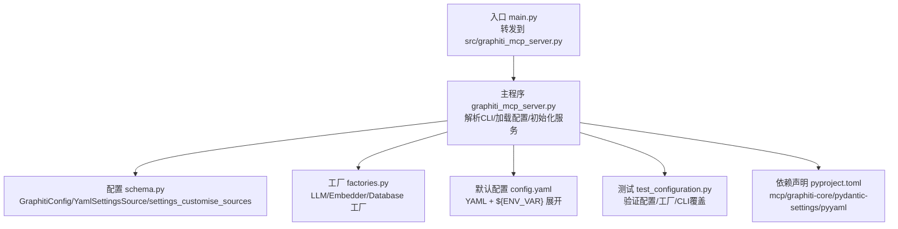
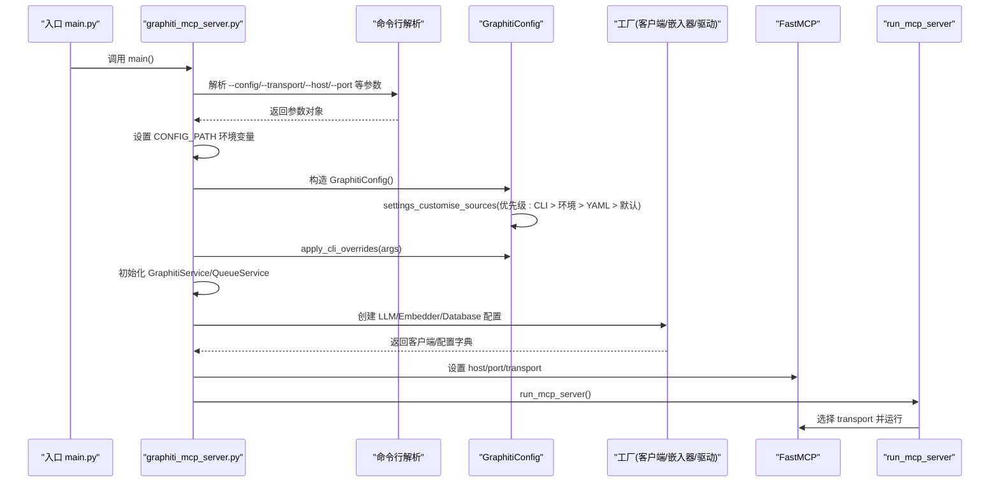
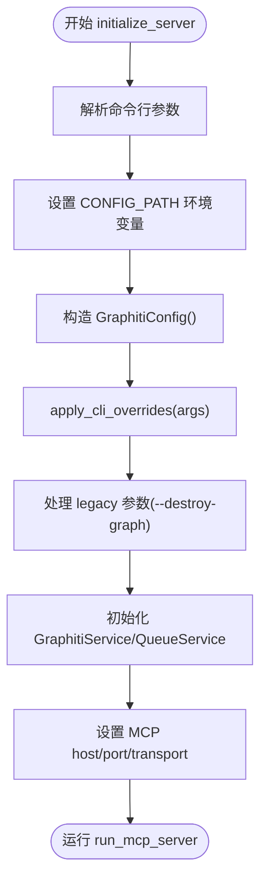
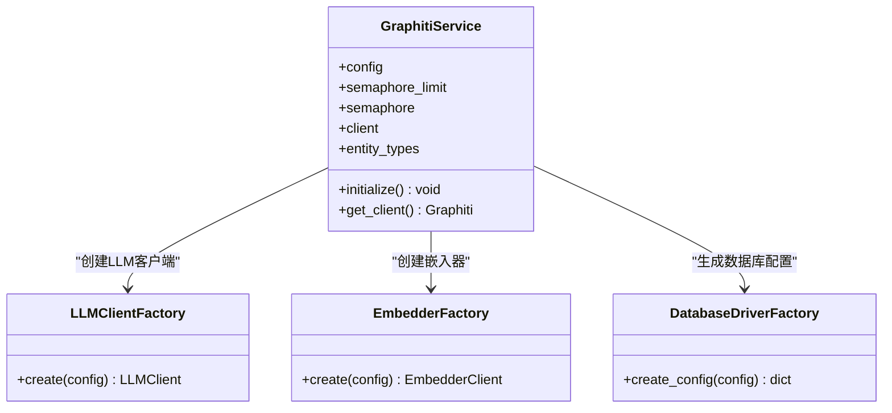
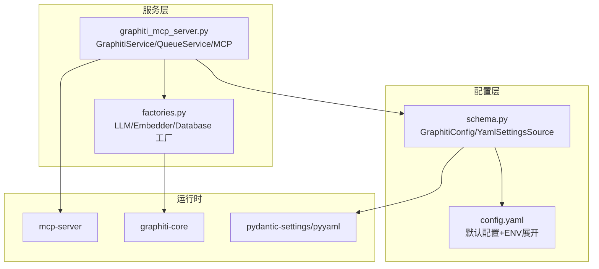

# 服务初始化流程

<cite>
**本文引用的文件列表**
- [mcp_server/main.py](file://mcp_server/main.py)
- [mcp_server/src/graphiti_mcp_server.py](file://mcp_server/src/graphiti_mcp_server.py)
- [mcp_server/src/config/schema.py](file://mcp_server/src/config/schema.py)
- [mcp_server/src/services/factories.py](file://mcp_server/src/services/factories.py)
- [mcp_server/config/config.yaml](file://mcp_server/config/config.yaml)
- [mcp_server/tests/test_configuration.py](file://mcp_server/tests/test_configuration.py)
- [mcp_server/pyproject.toml](file://mcp_server/pyproject.toml)
</cite>

## 目录
1. [引言](#引言)
2. [项目结构](#项目结构)
3. [核心组件](#核心组件)
4. [架构总览](#架构总览)
5. [详细组件分析](#详细组件分析)
6. [依赖关系分析](#依赖关系分析)
7. [性能考量](#性能考量)
8. [故障排查指南](#故障排查指南)
9. [结论](#结论)

## 引言
本文件围绕MCP服务器的初始化流程展开，自入口文件main.py开始，逐步解析配置加载、命令行参数解析与覆盖、以及全局服务实例的创建顺序与依赖关系。重点说明GraphitiConfig类settings_customise_sources方法如何实现“CLI > 环境变量 > YAML > 默认值”的优先级；apply_cli_overrides方法对--config、--transport、--host、--port、--llm-provider、--model、--temperature、--embedder-provider、--embedder-model、--database-provider、--group-id、--user-id等参数的覆盖逻辑；以及全局服务实例（LLM客户端、嵌入器、图数据库驱动）的初始化顺序与依赖关系。

## 项目结构
- 入口文件位于mcp_server/main.py，通过导入src目录中的graphiti_mcp_server.py并转发调用其main函数，保持部署脚本与文档的向后兼容。
- 核心逻辑集中在mcp_server/src/graphiti_mcp_server.py：包含日志配置、FastMCP实例、全局服务对象、工具函数、命令行参数解析、配置初始化与服务启动。
- 配置系统位于mcp_server/src/config/schema.py：定义GraphitiConfig及其子模型，并通过自定义YamlSettingsSource与pydantic-settings实现YAML与环境变量支持，同时提供settings_customise_sources定制优先级。
- 工厂模式位于mcp_server/src/services/factories.py：分别负责LLMClientFactory、EmbedderFactory、DatabaseDriverFactory的创建与配置字典生成。
- 默认配置位于mcp_server/config/config.yaml：提供默认的server、llm、embedder、database、graphiti等分组配置，并支持${VAR}与${VAR:default}的环境变量展开。
- 测试位于mcp_server/tests/test_configuration.py：验证配置加载、环境变量覆盖、工厂创建与CLI覆盖行为。
- 依赖声明位于mcp_server/pyproject.toml：声明mcp、graphiti-core、pydantic-settings、pyyaml等关键依赖。

图表来源
- [mcp_server/main.py](file://mcp_server/main.py#L1-L27)
- [mcp_server/src/graphiti_mcp_server.py](file://mcp_server/src/graphiti_mcp_server.py#L762-L966)
- [mcp_server/src/config/schema.py](file://mcp_server/src/config/schema.py#L1-L292)
- [mcp_server/src/services/factories.py](file://mcp_server/src/services/factories.py#L1-L438)
- [mcp_server/config/config.yaml](file://mcp_server/config/config.yaml#L1-L111)
- [mcp_server/tests/test_configuration.py](file://mcp_server/tests/test_configuration.py#L1-L208)
- [mcp_server/pyproject.toml](file://mcp_server/pyproject.toml#L1-L77)

章节来源
- [mcp_server/main.py](file://mcp_server/main.py#L1-L27)
- [mcp_server/src/graphiti_mcp_server.py](file://mcp_server/src/graphiti_mcp_server.py#L762-L966)
- [mcp_server/src/config/schema.py](file://mcp_server/src/config/schema.py#L1-L292)
- [mcp_server/src/services/factories.py](file://mcp_server/src/services/factories.py#L1-L438)
- [mcp_server/config/config.yaml](file://mcp_server/config/config.yaml#L1-L111)
- [mcp_server/tests/test_configuration.py](file://mcp_server/tests/test_configuration.py#L1-L208)
- [mcp_server/pyproject.toml](file://mcp_server/pyproject.toml#L1-L77)

## 核心组件
- 入口与转发：main.py将执行权转交给src/graphiti_mcp_server.py的main函数，确保现有部署脚本与文档不受影响。
- 配置系统：GraphitiConfig通过pydantic-settings加载环境变量、dotenv与YAML；YamlSettingsSource支持${VAR}与${VAR:default}展开；settings_customise_sources返回优先级为CLI > 环境变量 > YAML > 默认值的元组。
- 命令行解析与覆盖：initialize_server中定义所有CLI参数，解析后设置CONFIG_PATH环境变量，构造GraphitiConfig并调用apply_cli_overrides进行覆盖，再初始化服务。
- 全局服务实例：GraphitiService在initialize中按顺序创建LLM客户端、嵌入器、数据库驱动配置，并最终构建Graphiti客户端；QueueService与全局graphiti_client在服务初始化后创建并注入。

章节来源
- [mcp_server/main.py](file://mcp_server/main.py#L1-L27)
- [mcp_server/src/config/schema.py](file://mcp_server/src/config/schema.py#L1-L292)
- [mcp_server/src/graphiti_mcp_server.py](file://mcp_server/src/graphiti_mcp_server.py#L762-L966)

## 架构总览
下图展示从入口到服务启动的关键交互路径，包括配置加载、CLI覆盖、服务初始化与MCP运行时选择。

图表来源
- [mcp_server/main.py](file://mcp_server/main.py#L1-L27)
- [mcp_server/src/graphiti_mcp_server.py](file://mcp_server/src/graphiti_mcp_server.py#L762-L966)
- [mcp_server/src/config/schema.py](file://mcp_server/src/config/schema.py#L248-L292)
- [mcp_server/src/services/factories.py](file://mcp_server/src/services/factories.py#L1-L438)

## 详细组件分析

### 配置优先级与YAML加载：GraphitiConfig.settings_customise_sources
- 自定义YamlSettingsSource：支持从指定路径加载YAML配置，并递归展开${VAR}与${VAR:default}表达式，自动将布尔字符串转换为Python布尔值，空字符串表示未设置的可选字段。
- settings_customise_sources：返回(初始化设置, 环境设置, YAML设置, dotenv设置)，其中初始化设置即CLI参数，因此优先级为CLI > 环境变量 > YAML > 默认值。
- 环境变量展开：config.yaml中大量使用${VAR:default}语法，YamlSettingsSource在加载时完成替换，随后pydantic-settings按上述优先级合并。

章节来源
- [mcp_server/src/config/schema.py](file://mcp_server/src/config/schema.py#L1-L110)
- [mcp_server/src/config/schema.py](file://mcp_server/src/config/schema.py#L248-L292)
- [mcp_server/config/config.yaml](file://mcp_server/config/config.yaml#L1-L111)

### 命令行参数解析与覆盖：initialize_server与apply_cli_overrides
- initialize_server：
  - 定义--config、--transport、--host、--port、--llm-provider、--embedder-provider、--database-provider、--model、--small-model、--temperature、--embedder-model、--group-id、--user-id、--destroy-graph等参数。
  - 解析后设置CONFIG_PATH环境变量，使YamlSettingsSource能从CLI指定路径加载YAML。
  - 构造GraphitiConfig()，随后调用apply_cli_overrides(args)进行覆盖。
  - 同时处理legacy参数如--destroy-graph。
- apply_cli_overrides：
  - 覆盖server.transport、llm.provider/model/temperature、embedder.provider/model、database.provider、graphiti.group_id/user_id。
  - 该方法确保CLI参数优先于环境变量与YAML配置。

图表来源
- [mcp_server/src/graphiti_mcp_server.py](file://mcp_server/src/graphiti_mcp_server.py#L762-L966)
- [mcp_server/src/config/schema.py](file://mcp_server/src/config/schema.py#L263-L292)

章节来源
- [mcp_server/src/graphiti_mcp_server.py](file://mcp_server/src/graphiti_mcp_server.py#L762-L966)
- [mcp_server/src/config/schema.py](file://mcp_server/src/config/schema.py#L263-L292)

### 全局服务实例创建：GraphitiService.initialize与工厂模式
- GraphitiService.initialize：
  - 顺序：先尝试创建LLM客户端，再尝试创建嵌入器，然后通过DatabaseDriverFactory.create_config生成数据库配置字典。
  - 对于FalkorDB，直接构造FalkorDriver并传入host/port/password/database；对于Neo4j，使用uri/user/password。
  - 最终构建Graphiti客户端，建立索引与约束，并记录日志输出当前使用的提供商与配置。
- 工厂模式：
  - LLMClientFactory：根据provider分支创建对应LLM客户端，校验API密钥，构建Core LLM配置并返回具体实现。
  - EmbedderFactory：根据provider分支创建对应Embedder客户端，校验API密钥，构建Embedder配置并返回具体实现。
  - DatabaseDriverFactory.create_config：根据provider返回Neo4j或FalkorDB的配置字典，支持环境变量覆盖（如NEO4J_*、FALKORDB_*），并解析Redis URI提取host/port。
- 依赖关系：
  - GraphitiService依赖LLM/Embedder/Database配置，三者相互独立但共同构成Graphiti客户端的运行时依赖。
  - QueueService在GraphitiService初始化后创建并注入Graphiti客户端。

图表来源
- [mcp_server/src/graphiti_mcp_server.py](file://mcp_server/src/graphiti_mcp_server.py#L161-L319)
- [mcp_server/src/services/factories.py](file://mcp_server/src/services/factories.py#L1-L438)

章节来源
- [mcp_server/src/graphiti_mcp_server.py](file://mcp_server/src/graphiti_mcp_server.py#L161-L319)
- [mcp_server/src/services/factories.py](file://mcp_server/src/services/factories.py#L1-L438)

### MCP运行时选择与传输层
- run_mcp_server根据config.server.transport选择运行模式：
  - stdio：标准输入输出。
  - sse：服务端事件（已标记为弃用）。
  - http：流式HTTP（推荐），打印访问信息并配置uvicorn日志格式。
- mcp.settings.host/port在initialize_server阶段被设置，确保运行时与配置一致。

章节来源
- [mcp_server/src/graphiti_mcp_server.py](file://mcp_server/src/graphiti_mcp_server.py#L908-L966)

## 依赖关系分析
- 配置依赖：GraphitiConfig依赖pydantic-settings与pyyaml；YamlSettingsSource负责从文件系统读取YAML并展开环境变量。
- 运行时依赖：mcp_server依赖graphiti-core（含falkordb驱动）、openai、pydantic-settings、pyyaml等；optional-dependencies提供Azure/Anthropic/Gemini/Groq/Voyage等提供商支持。
- 服务依赖：GraphitiService依赖LLM/Embedder/Database工厂；QueueService依赖Graphiti客户端；FastMCP依赖transport设置。

图表来源
- [mcp_server/src/config/schema.py](file://mcp_server/src/config/schema.py#L1-L292)
- [mcp_server/config/config.yaml](file://mcp_server/config/config.yaml#L1-L111)
- [mcp_server/src/services/factories.py](file://mcp_server/src/services/factories.py#L1-L438)
- [mcp_server/src/graphiti_mcp_server.py](file://mcp_server/src/graphiti_mcp_server.py#L762-L966)
- [mcp_server/pyproject.toml](file://mcp_server/pyproject.toml#L1-L77)

章节来源
- [mcp_server/pyproject.toml](file://mcp_server/pyproject.toml#L1-L77)

## 性能考量
- 并发控制：SEMAPHORE_LIMIT用于限制并发Graphiti操作数量，避免LLM速率限制与成本过高；建议根据LLM提供商RPM调整。
- 数据库连接：FalkorDB/Neo4j连接失败会给出明确提示与启动指引，避免长时间阻塞。
- 日志级别：uvicorn与mcp相关日志降低噪声，便于生产环境观察。

章节来源
- [mcp_server/src/graphiti_mcp_server.py](file://mcp_server/src/graphiti_mcp_server.py#L48-L109)
- [mcp_server/src/graphiti_mcp_server.py](file://mcp_server/src/graphiti_mcp_server.py#L241-L279)

## 故障排查指南
- 配置未生效：
  - 检查--config是否正确传递且CONFIG_PATH已设置。
  - 确认YAML中${VAR}是否被正确的环境变量覆盖。
  - 使用apply_cli_overrides覆盖项验证CLI优先级。
- LLM/Embedder未创建：
  - 确认对应provider的API密钥已配置；工厂会在缺少密钥时报错。
- 数据库连接失败：
  - 根据provider输出的错误信息检查FalkorDB/Neo4j是否运行、URI/密码是否正确。
- MCP无法启动：
  - 检查--transport/--host/--port是否合法；http模式会打印访问URL与UI链接。

章节来源
- [mcp_server/src/config/schema.py](file://mcp_server/src/config/schema.py#L248-L292)
- [mcp_server/src/services/factories.py](file://mcp_server/src/services/factories.py#L76-L98)
- [mcp_server/src/graphiti_mcp_server.py](file://mcp_server/src/graphiti_mcp_server.py#L241-L279)
- [mcp_server/src/graphiti_mcp_server.py](file://mcp_server/src/graphiti_mcp_server.py#L923-L945)

## 结论
MCP服务器的初始化流程以清晰的优先级与模块化设计为核心：入口main.py仅作转发；配置系统通过YamlSettingsSource与pydantic-settings实现“CLI > 环境变量 > YAML > 默认值”的优先级；initialize_server统一解析CLI并应用覆盖；GraphitiService.initialize按顺序创建LLM/Embedder/Database组件，最终构建Graphiti客户端并启动MCP服务。工厂模式保证了不同提供商的可插拔性与可扩展性，配合测试用例验证了配置加载、环境变量覆盖与CLI覆盖的有效性。