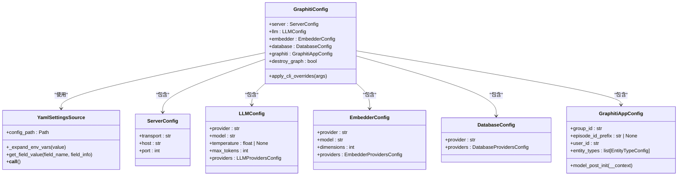
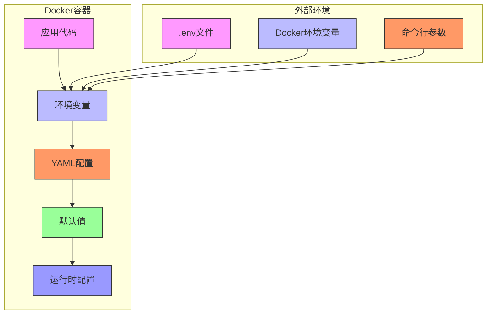

# 环境变量集成

<cite>
**本文档引用的文件**  
- [config.yaml](file://mcp_server/config/config.yaml)
- [.env.example](file://mcp_server/.env.example)
- [graphiti_mcp_server.py](file://mcp_server/src/graphiti_mcp_server.py)
- [schema.py](file://mcp_server/src/config/schema.py)
- [docker-compose.yml](file://mcp_server/docker/docker-compose.yml)
- [Dockerfile](file://mcp_server/docker/Dockerfile)
- [config-docker-falkordb.yaml](file://mcp_server/config/config-docker-falkordb.yaml)
- [config-docker-neo4j.yaml](file://mcp_server/config/config-docker-neo4j.yaml)
</cite>

## 目录
1. [简介](#简介)
2. [环境变量集成机制](#环境变量集成机制)
3. [支持的环境变量](#支持的环境变量)
4. [配置优先级与默认值](#配置优先级与默认值)
5. [安全实践建议](#安全实践建议)
6. [Docker部署中的应用](#docker部署中的应用)

## 简介
本文档系统性地描述了MCP服务器的环境变量集成机制。通过分析代码库，详细说明了如何在YAML配置中使用`${VAR_NAME}`语法引用环境变量，列出了所有支持的环境变量及其对应配置路径，解释了环境变量与YAML配置的优先级关系，并提供了安全实践建议和Docker部署中的应用方式。

## 环境变量集成机制
MCP服务器通过自定义的`YamlSettingsSource`类实现了环境变量的动态解析和集成。该机制允许在YAML配置文件中使用`${VAR_NAME}`或`${VAR_NAME:default_value}`语法来引用环境变量。

核心实现位于`mcp_server/src/config/schema.py`文件中的`YamlSettingsSource`类。该类继承自`PydanticBaseSettingsSource`，并在`_expand_env_vars`方法中递归处理配置值。当解析YAML配置时，系统会识别`${...}`格式的字符串，并将其替换为相应的环境变量值。

```mermaid
flowchart TD
Start([开始加载配置]) --> LoadYAML["加载YAML配置文件"]
LoadYAML --> ParseYAML["解析YAML内容"]
ParseYAML --> FindEnvVars["查找${VAR_NAME}模式"]
FindEnvVars --> CheckSyntax{"语法检查"}
CheckSyntax --> |${VAR_NAME}| GetEnv["获取环境变量值"]
CheckSyntax --> |${VAR_NAME:default}| GetEnvWithDefault["获取环境变量值<br/>若未设置则使用默认值"]
GetEnv --> ReplaceValue["替换配置值"]
GetEnvWithDefault --> ReplaceValue
ReplaceValue --> ConvertType["类型转换<br/>(字符串->布尔值等)"]
ConvertType --> Complete["完成配置加载"]
```

**图示来源**
- [schema.py](file://mcp_server/src/config/schema.py#L16-L58)

**本节来源**
- [schema.py](file://mcp_server/src/config/schema.py#L16-L58)
- [graphiti_mcp_server.py](file://mcp_server/src/graphiti_mcp_server.py#L845)

## 支持的环境变量
以下是MCP服务器支持的所有环境变量及其对应的配置路径：

### LLM提供商相关
- `OPENAI_API_KEY`: 配置路径 `llm.providers.openai.api_key`
- `OPENAI_API_URL`: 配置路径 `llm.providers.openai.api_url`，默认值 `https://api.openai.com/v1`
- `OPENAI_ORGANIZATION_ID`: 配置路径 `llm.providers.openai.organization_id`
- `AZURE_OPENAI_API_KEY`: 配置路径 `llm.providers.azure_openai.api_key`
- `AZURE_OPENAI_ENDPOINT`: 配置路径 `llm.providers.azure_openai.api_url`
- `AZURE_OPENAI_API_VERSION`: 配置路径 `llm.providers.azure_openai.api_version`，默认值 `2024-10-21`
- `AZURE_OPENAI_DEPLOYMENT`: 配置路径 `llm.providers.azure_openai.deployment_name`
- `USE_AZURE_AD`: 配置路径 `llm.providers.azure_openai.use_azure_ad`，默认值 `false`
- `ANTHROPIC_API_KEY`: 配置路径 `llm.providers.anthropic.api_key`
- `ANTHROPIC_API_URL`: 配置路径 `llm.providers.anthropic.api_url`，默认值 `https://api.anthropic.com`
- `GOOGLE_API_KEY`: 配置路径 `llm.providers.gemini.api_key`
- `GOOGLE_PROJECT_ID`: 配置路径 `llm.providers.gemini.project_id`
- `GOOGLE_LOCATION`: 配置路径 `llm.providers.gemini.location`，默认值 `us-central1`
- `GROQ_API_KEY`: 配置路径 `llm.providers.groq.api_key`
- `GROQ_API_URL`: 配置路径 `llm.providers.groq.api_url`，默认值 `https://api.groq.com/openai/v1`

### 嵌入式提供商相关
- `VOYAGE_API_KEY`: 配置路径 `embedder.providers.voyage.api_key`
- `VOYAGE_API_URL`: 配置路径 `embedder.providers.voyage.api_url`，默认值 `https://api.voyageai.com/v1`

### 数据库相关
- `FALKORDB_URI`: 配置路径 `database.providers.falkordb.uri`，默认值 `redis://localhost:6379`
- `FALKORDB_PASSWORD`: 配置路径 `database.providers.falkordb.password`
- `FALKORDB_DATABASE`: 配置路径 `database.providers.falkordb.database`，默认值 `default_db`
- `NEO4J_URI`: 配置路径 `database.providers.neo4j.uri`，默认值 `bolt://localhost:7687`
- `NEO4J_USER`: 配置路径 `database.providers.neo4j.username`，默认值 `neo4j`
- `NEO4J_PASSWORD`: 配置路径 `database.providers.neo4j.password`
- `NEO4J_DATABASE`: 配置路径 `database.providers.neo4j.database`，默认值 `neo4j`
- `USE_PARALLEL_RUNTIME`: 配置路径 `database.providers.neo4j.use_parallel_runtime`，默认值 `false`

### 应用程序相关
- `GRAPHITI_GROUP_ID`: 配置路径 `graphiti.group_id`，默认值 `main`
- `EPISODE_ID_PREFIX`: 配置路径 `graphiti.episode_id_prefix`
- `USER_ID`: 配置路径 `graphiti.user_id`，默认值 `mcp_user`
- `SEMAPHORE_LIMIT`: 控制并发处理的信号量限制，默认值 `10`

**本节来源**
- [config.yaml](file://mcp_server/config/config.yaml)
- [.env.example](file://mcp_server/.env.example)
- [config-docker-falkordb.yaml](file://mcp_server/config/config-docker-falkordb.yaml)
- [config-docker-neo4j.yaml](file://mcp_server/config/config-docker-neo4j.yaml)

## 配置优先级与默认值
MCP服务器遵循特定的配置优先级顺序，确保配置的灵活性和可覆盖性。优先级从高到低如下：

1. **命令行参数**：通过CLI传递的参数具有最高优先级
2. **环境变量**：通过`os.environ`设置的环境变量
3. **YAML配置文件**：通过`config.yaml`文件定义的配置
4. **默认值**：在代码中定义的默认值

环境变量支持`${VAR_NAME:default_value}`语法，其中`default_value`在环境变量未设置时使用。例如，`${OPENAI_API_URL:https://api.openai.com/v1}`表示如果`OPENAI_API_URL`环境变量未设置，则使用`https://api.openai.com/v1`作为默认值。

此外，系统还会对某些字符串值进行自动类型转换：
- `"true"`, `"1"`, `"yes"`, `"on"` 转换为 `True`
- `"false"`, `"0"`, `"no"`, `"off"` 转换为 `False`



**图示来源**
- [schema.py](file://mcp_server/src/config/schema.py#L229-L292)
- [schema.py](file://mcp_server/src/config/schema.py#L76-L227)

**本节来源**
- [schema.py](file://mcp_server/src/config/schema.py#L248-L261)
- [schema.py](file://mcp_server/src/config/schema.py#L23-L58)

## 安全实践建议
为了确保MCP服务器的安全运行，建议采取以下安全实践：

1. **使用.env文件管理敏感信息**：将API密钥、密码等敏感信息存储在`.env`文件中，而不是直接写入配置文件。项目根目录下的`.env.example`文件提供了环境变量的示例模板。

2. **限制环境变量的暴露**：在生产环境中，避免将敏感环境变量暴露给前端应用或日志系统。使用专门的密钥管理服务（如AWS Secrets Manager、Hashicorp Vault）来存储和管理敏感信息。

3. **设置适当的并发限制**：通过`SEMAPHORE_LIMIT`环境变量控制并发处理的数量，以避免超出LLM提供商的速率限制。根据不同的提供商调整此值：
   - OpenAI免费层：1-2
   - OpenAI Tier 3：10-15
   - Anthropic高阶层：15-30

4. **定期轮换密钥**：定期轮换API密钥和其他认证凭据，减少密钥泄露的风险。

5. **使用HTTPS**：确保所有API调用都通过HTTPS进行，保护数据传输的安全性。

6. **最小权限原则**：为数据库用户和其他服务账户分配最小必要的权限，遵循最小权限原则。

**本节来源**
- [.env.example](file://mcp_server/.env.example)
- [graphiti_mcp_server.py](file://mcp_server/src/graphiti_mcp_server.py#L75-L76)
- [config.yaml](file://mcp_server/config/config.yaml#L4-L6)

## Docker部署中的应用
在Docker部署中，环境变量的使用方式有所不同，主要通过`docker-compose.yml`文件和Dockerfile进行配置。

在`docker-compose.yml`文件中，环境变量可以通过`environment`字段直接定义，或者通过`env_file`字段从`.env`文件加载。例如：

```yaml
environment:
  - FALKORDB_PASSWORD=${FALKORDB_PASSWORD:-}
  - BROWSER=${BROWSER:-1}
  - FALKORDB_URI=redis://localhost:6379
  - FALKORDB_DATABASE=${FALKORDB_DATABASE:-default_db}
  - GRAPHITI_GROUP_ID=${GRAPHITI_GROUP_ID:-main}
  - SEMAPHORE_LIMIT=${SEMAPHORE_LIMIT:-10}
```

Dockerfile中也定义了一些环境变量，如`UV_COMPILE_BYTECODE`、`UV_LINK_MODE`等，用于优化Python包的安装和运行。

在Docker环境中，建议使用环境变量覆盖机制来适应不同的部署环境。例如，在开发环境中可以使用默认值，而在生产环境中通过环境变量覆盖这些值。



**图示来源**
- [docker-compose.yml](file://mcp_server/docker/docker-compose.yml)
- [Dockerfile](file://mcp_server/docker/Dockerfile)

**本节来源**
- [docker-compose.yml](file://mcp_server/docker/docker-compose.yml)
- [Dockerfile](file://mcp_server/docker/Dockerfile)
- [config-docker-falkordb.yaml](file://mcp_server/config/config-docker-falkordb.yaml)