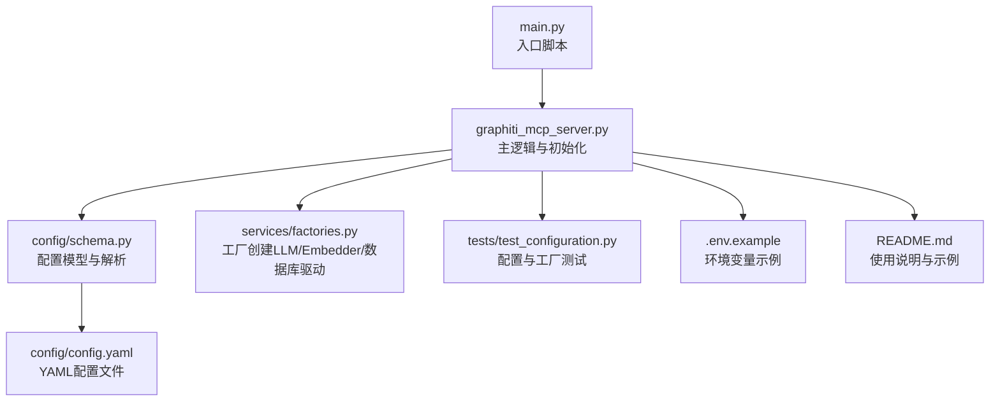
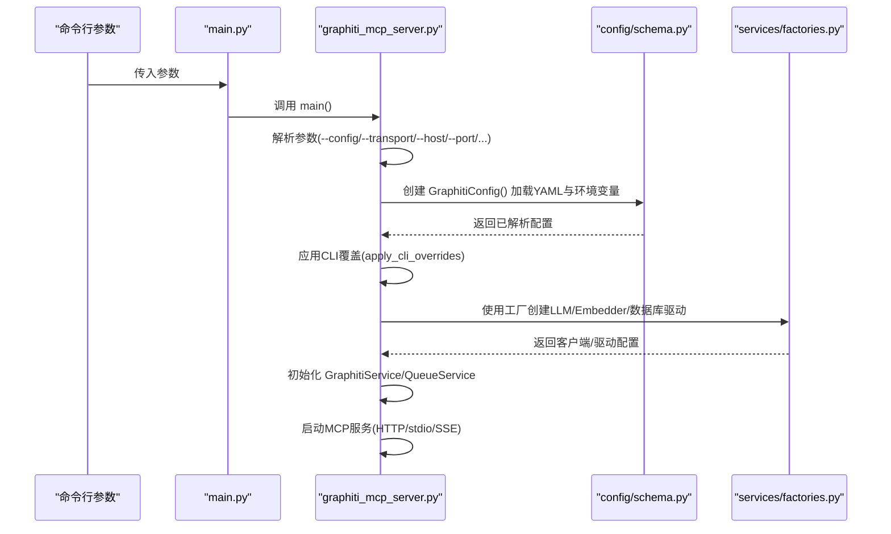
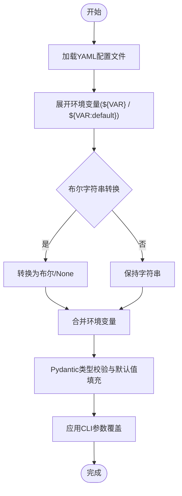
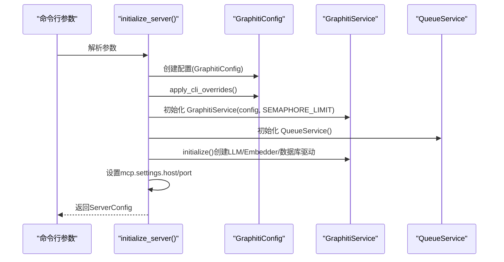
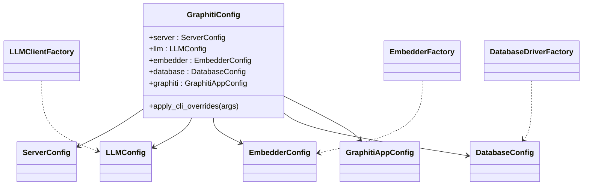

# 配置与初始化

<cite>
**本文引用的文件列表**
- [mcp_server/config/config.yaml](file://mcp_server/config/config.yaml)
- [mcp_server/config/config-docker-falkordb.yaml](file://mcp_server/config/config-docker-falkordb.yaml)
- [mcp_server/config/config-docker-neo4j.yaml](file://mcp_server/config/config-docker-neo4j.yaml)
- [mcp_server/src/config/schema.py](file://mcp_server/src/config/schema.py)
- [mcp_server/src/graphiti_mcp_server.py](file://mcp_server/src/graphiti_mcp_server.py)
- [mcp_server/main.py](file://mcp_server/main.py)
- [mcp_server/src/services/factories.py](file://mcp_server/src/services/factories.py)
- [mcp_server/tests/test_configuration.py](file://mcp_server/tests/test_configuration.py)
- [mcp_server/.env.example](file://mcp_server/.env.example)
- [mcp_server/README.md](file://mcp_server/README.md)
</cite>

## 目录
1. [简介](#简介)
2. [项目结构](#项目结构)
3. [核心组件](#核心组件)
4. [架构总览](#架构总览)
5. [详细组件分析](#详细组件分析)
6. [依赖关系分析](#依赖关系分析)
7. [性能考量](#性能考量)
8. [故障排查指南](#故障排查指南)
9. [结论](#结论)
10. [附录：配置示例与最佳实践](#附录配置示例与最佳实践)

## 简介
本文件面向Graphiti MCP服务器的配置与初始化流程，聚焦于基于YAML的配置文件（config.yaml）结构、环境变量注入机制、配置解析优先级、以及服务启动时的全局实例创建过程。文档同时覆盖server、llm、embedder、database、graphiti五大配置区块的字段语义与用法，并提供常见问题排查建议与可定制化示例（切换LLM提供商、调整并发限制、自定义实体类型等）。

## 项目结构
MCP服务器的配置与初始化主要涉及以下模块：
- 配置文件：mcp_server/config/config.yaml 及其Docker专用变体
- 配置模型与解析：mcp_server/src/config/schema.py
- 服务入口与初始化：mcp_server/src/graphiti_mcp_server.py
- 入口脚本：mcp_server/main.py
- 工厂与客户端创建：mcp_server/src/services/factories.py
- 测试与示例：mcp_server/tests/test_configuration.py、.env.example、README.md

图表来源
- [mcp_server/main.py](file://mcp_server/main.py#L1-L27)
- [mcp_server/src/graphiti_mcp_server.py](file://mcp_server/src/graphiti_mcp_server.py#L762-L966)
- [mcp_server/src/config/schema.py](file://mcp_server/src/config/schema.py#L1-L292)
- [mcp_server/src/services/factories.py](file://mcp_server/src/services/factories.py#L1-L438)
- [mcp_server/tests/test_configuration.py](file://mcp_server/tests/test_configuration.py#L1-L208)
- [mcp_server/.env.example](file://mcp_server/.env.example#L1-L50)
- [mcp_server/README.md](file://mcp_server/README.md#L101-L173)

章节来源
- [mcp_server/main.py](file://mcp_server/main.py#L1-L27)
- [mcp_server/src/graphiti_mcp_server.py](file://mcp_server/src/graphiti_mcp_server.py#L762-L966)
- [mcp_server/src/config/schema.py](file://mcp_server/src/config/schema.py#L1-L292)
- [mcp_server/src/services/factories.py](file://mcp_server/src/services/factories.py#L1-L438)
- [mcp_server/tests/test_configuration.py](file://mcp_server/tests/test_configuration.py#L1-L208)
- [mcp_server/.env.example](file://mcp_server/.env.example#L1-L50)
- [mcp_server/README.md](file://mcp_server/README.md#L101-L173)

## 核心组件
- 配置模型与解析
  - 自定义YamlSettingsSource：支持在YAML中使用${VAR}或${VAR:default}进行环境变量展开；对布尔字符串做转换；递归处理字典与列表。
  - GraphitiConfig：统一的顶层配置对象，包含server、llm、embedder、database、graphiti五个子配置块，并定义了配置来源顺序（CLI > 环境变量 > YAML > 默认值）。
- 服务初始化
  - 命令行参数解析：--config、--transport、--host、--port、--llm-provider、--embedder-provider、--database-provider、--model、--temperature、--group-id、--user-id、--destroy-graph。
  - 全局服务实例：GraphitiService、QueueService、Graphiti客户端、全局信号量（SEMAPHORE_LIMIT）。
- 工厂模式
  - LLMClientFactory、EmbedderFactory、DatabaseDriverFactory：根据配置动态创建对应客户端或驱动配置。

章节来源
- [mcp_server/src/config/schema.py](file://mcp_server/src/config/schema.py#L16-L74)
- [mcp_server/src/config/schema.py](file://mcp_server/src/config/schema.py#L229-L262)
- [mcp_server/src/graphiti_mcp_server.py](file://mcp_server/src/graphiti_mcp_server.py#L762-L966)
- [mcp_server/src/services/factories.py](file://mcp_server/src/services/factories.py#L100-L251)
- [mcp_server/src/services/factories.py](file://mcp_server/src/services/factories.py#L253-L361)
- [mcp_server/src/services/factories.py](file://mcp_server/src/services/factories.py#L363-L438)

## 架构总览
下图展示了从命令行到配置加载、再到服务初始化的整体流程。

图表来源
- [mcp_server/main.py](file://mcp_server/main.py#L1-L27)
- [mcp_server/src/graphiti_mcp_server.py](file://mcp_server/src/graphiti_mcp_server.py#L762-L966)
- [mcp_server/src/config/schema.py](file://mcp_server/src/config/schema.py#L229-L262)
- [mcp_server/src/services/factories.py](file://mcp_server/src/services/factories.py#L100-L251)

## 详细组件分析

### 配置文件结构与字段说明
- server
  - transport: 传输方式，支持 http、stdio、sse（已标记为过时）。默认 http。
  - host: 绑定地址，默认 0.0.0.0。
  - port: 端口，默认 8000。
- llm
  - provider: LLM提供商，支持 openai、azure_openai、anthropic、gemini、groq。
  - model: 模型名称。
  - max_tokens: 最大生成长度。
  - providers.*: 各提供商的密钥、URL、版本、部署名、认证方式等。
- embedder
  - provider: 嵌入模型提供商，支持 openai、azure_openai、gemini、voyage。
  - model: 嵌入模型名称。
  - dimensions: 嵌入维度。
  - providers.*: 对应提供商的密钥、URL、版本、部署名、认证方式等。
- database
  - provider: 数据库提供商，支持 falkordb、neo4j。
  - providers.*: 各数据库的连接参数（如URI、用户名、密码、数据库名、是否启用并行运行等）。
- graphiti
  - group_id: 图的命名空间，默认 main。
  - episode_id_prefix: Episode ID前缀，默认空。
  - user_id: 用户标识，默认 mcp_user。
  - entity_types: 实体类型列表，每个条目包含 name 与 description，用于知识抽取。

章节来源
- [mcp_server/config/config.yaml](file://mcp_server/config/config.yaml#L1-L111)
- [mcp_server/config/config-docker-falkordb.yaml](file://mcp_server/config/config-docker-falkordb.yaml#L1-L101)
- [mcp_server/config/config-docker-neo4j.yaml](file://mcp_server/config/config-docker-neo4j.yaml#L1-L103)

### 环境变量注入与默认值
- YAML中的${VAR}与${VAR:default}语法由YamlSettingsSource实现，支持：
  - 完整匹配表达式时，将字符串转为布尔（true/false/1/0/yes/no/on/off/空串等）。
  - 部分替换时，对字符串进行环境变量替换。
  - 递归处理字典与列表。
- 配置来源优先级（从高到低）：CLI参数 > 环境变量 > YAML配置 > 默认值。
- 关键环境变量（示例）
  - LLM提供商：OPENAI_API_KEY、ANTHROPIC_API_KEY、GOOGLE_API_KEY、GROQ_API_KEY、AZURE_OPENAI_API_KEY、AZURE_OPENAI_ENDPOINT、AZURE_OPENAI_DEPLOYMENT、AZURE_OPENAI_API_VERSION、USE_AZURE_AD。
  - 数据库：NEO4J_URI、NEO4J_USER、NEO4J_PASSWORD、NEO4J_DATABASE、USE_PARALLEL_RUNTIME、FALKORDB_URI、FALKORDB_PASSWORD、FALKORDB_DATABASE。
  - 其他：SEMAPHORE_LIMIT（并发控制）、GRAPHITI_GROUP_ID、USER_ID、EPISODE_ID_PREFIX。

章节来源
- [mcp_server/src/config/schema.py](file://mcp_server/src/config/schema.py#L16-L74)
- [mcp_server/src/config/schema.py](file://mcp_server/src/config/schema.py#L248-L262)
- [mcp_server/.env.example](file://mcp_server/.env.example#L1-L50)
- [mcp_server/README.md](file://mcp_server/README.md#L222-L243)

### 配置解析流程（含默认值、注入与类型验证）
- 解析步骤
  1) 读取YAML文件（默认路径可通过环境变量 CONFIG_PATH 覆盖）。
  2) 递归展开环境变量，按需转换布尔值。
  3) 通过Pydantic模型进行类型校验与默认值填充。
  4) 合并环境变量与CLI参数，CLI优先级最高。
- 类型验证
  - 所有配置字段均通过Pydantic模型定义，包含默认值与描述信息，确保字段类型正确。
- CLI覆盖
  - 支持覆盖 server.transport、llm.provider/model/temperature、embedder.provider/model、database.provider、graphiti.group_id/user_id 等。

图表来源
- [mcp_server/src/config/schema.py](file://mcp_server/src/config/schema.py#L16-L74)
- [mcp_server/src/config/schema.py](file://mcp_server/src/config/schema.py#L248-L262)
- [mcp_server/src/graphiti_mcp_server.py](file://mcp_server/src/graphiti_mcp_server.py#L840-L849)

章节来源
- [mcp_server/src/config/schema.py](file://mcp_server/src/config/schema.py#L16-L74)
- [mcp_server/src/config/schema.py](file://mcp_server/src/config/schema.py#L229-L262)
- [mcp_server/src/graphiti_mcp_server.py](file://mcp_server/src/graphiti_mcp_server.py#L840-L849)

### 服务初始化过程（命令行参数、全局实例创建）
- 命令行参数
  - --config：指定YAML配置文件路径（默认指向 mcp_server/config/config.yaml）。
  - --transport/--host/--port：覆盖 server.transport/host/port。
  - --llm-provider/--embedder-provider/--database-provider：覆盖对应provider。
  - --model/--temperature：覆盖 llm.model/temperature。
  - --embedder-model：覆盖 embedder.model。
  - --group-id/--user-id：覆盖 graphiti.group_id/user_id。
  - --destroy-graph：启动时销毁所有Graphiti图数据。
- 全局实例
  - GraphitiService：封装Graphiti客户端、并发信号量、实体类型模型构建。
  - QueueService：异步队列服务，负责批量处理Episode。
  - 全局Graphiti客户端与信号量：供工具函数使用。
- MCP服务
  - 根据transport选择 http/stdio/sse 并启动相应服务端。

图表来源
- [mcp_server/src/graphiti_mcp_server.py](file://mcp_server/src/graphiti_mcp_server.py#L762-L966)

章节来源
- [mcp_server/src/graphiti_mcp_server.py](file://mcp_server/src/graphiti_mcp_server.py#L762-L966)

### 工厂与客户端创建
- LLMClientFactory
  - 根据 provider 动态创建对应LLM客户端（OpenAI/Azure OpenAI/Anthropic/Gemini/Groq），并校验API Key。
- EmbedderFactory
  - 根据 provider 动态创建嵌入客户端（OpenAI/Azure OpenAI/Gemini/Voyage），并校验API Key。
- DatabaseDriverFactory
  - 根据 provider 返回数据库配置字典（Neo4j/FalkorDB），并支持环境变量覆盖。

章节来源
- [mcp_server/src/services/factories.py](file://mcp_server/src/services/factories.py#L100-L251)
- [mcp_server/src/services/factories.py](file://mcp_server/src/services/factories.py#L253-L361)
- [mcp_server/src/services/factories.py](file://mcp_server/src/services/factories.py#L363-L438)

### 配置自定义示例
- 切换LLM提供商
  - 在 llm.provider 中设置为 openai/azure_openai/anthropic/gemini/groq，并在对应 providers.* 中填写API密钥与URL。
  - 或通过命令行 --llm-provider 覆盖。
- 调整并发限制（SEMAPHORE_LIMIT）
  - 在 .env 文件中设置 SEMAPHORE_LIMIT，或通过环境变量覆盖。
  - README提供了不同提供商的调优建议与监控要点。
- 设置自定义实体类型
  - 在 graphiti.entity_types 中添加或修改实体类型，每个条目包含 name 与 description。
  - 服务启动时会动态构建实体类型的Pydantic模型以供抽取使用。

章节来源
- [mcp_server/config/config.yaml](file://mcp_server/config/config.yaml#L89-L111)
- [mcp_server/.env.example](file://mcp_server/.env.example#L20-L33)
- [mcp_server/README.md](file://mcp_server/README.md#L329-L371)
- [mcp_server/src/graphiti_mcp_server.py](file://mcp_server/src/graphiti_mcp_server.py#L161-L211)

## 依赖关系分析
- 配置模型依赖
  - GraphitiConfig 依赖各子配置模型（ServerConfig、LLMConfig、EmbedderConfig、DatabaseConfig、GraphitiAppConfig）。
  - 子配置模型进一步依赖各提供商配置模型（OpenAI/AzureOpenAI/Anthropic/Gemini/Groq、Neo4j/FalkorDB、EntityTypeConfig）。
- 运行时依赖
  - 初始化阶段依赖工厂类创建客户端与驱动配置。
  - 工具函数依赖全局 GraphitiService 与 QueueService。

图表来源
- [mcp_server/src/config/schema.py](file://mcp_server/src/config/schema.py#L229-L262)
- [mcp_server/src/services/factories.py](file://mcp_server/src/services/factories.py#L100-L251)
- [mcp_server/src/services/factories.py](file://mcp_server/src/services/factories.py#L253-L361)
- [mcp_server/src/services/factories.py](file://mcp_server/src/services/factories.py#L363-L438)

章节来源
- [mcp_server/src/config/schema.py](file://mcp_server/src/config/schema.py#L229-L262)
- [mcp_server/src/services/factories.py](file://mcp_server/src/services/factories.py#L100-L251)
- [mcp_server/src/services/factories.py](file://mcp_server/src/services/factories.py#L253-L361)
- [mcp_server/src/services/factories.py](file://mcp_server/src/services/factories.py#L363-L438)

## 性能考量
- 并发控制（SEMAPHORE_LIMIT）
  - 控制“每组”Episode的并发处理数量，实际LLM并发请求会更高。
  - 不同提供商的速率限制不同，建议参考README中的调优指南与监控建议。
- 传输与绑定
  - 默认HTTP传输，便于大多数MCP客户端接入；stdio适合仅支持标准输入输出的客户端。
- 数据库选择
  - FalkorDB（默认）与Neo4j均可选，结合自身部署与运维偏好选择。

章节来源
- [mcp_server/src/graphiti_mcp_server.py](file://mcp_server/src/graphiti_mcp_server.py#L48-L75)
- [mcp_server/README.md](file://mcp_server/README.md#L329-L371)

## 故障排查指南
- 常见错误与定位
  - 数据库连接失败：检查 database.provider 与对应URI/凭据；服务启动时会针对不同数据库给出明确提示与启动指引。
  - API Key缺失：LLM/Embedder工厂在创建客户端前会校验API Key，缺失时抛出异常。
  - YAML解析错误：确认YAML缩进与键名正确；必要时使用默认配置文件作为对照。
  - 环境变量未生效：确认 .env 文件位置与加载顺序；或直接在环境中设置。
  - 429速率限制：降低 SEMAPHORE_LIMIT 或调整提供商配额。
- 排查步骤
  - 查看启动日志，关注“Using LLM/Embedder/Database/Group ID/Transport”等信息。
  - 使用健康检查端点 /health 检查服务状态。
  - 通过 destroy-graph 参数清理后重试，排除历史数据影响。

章节来源
- [mcp_server/src/graphiti_mcp_server.py](file://mcp_server/src/graphiti_mcp_server.py#L241-L279)
- [mcp_server/src/graphiti_mcp_server.py](file://mcp_server/src/graphiti_mcp_server.py#L756-L760)
- [mcp_server/src/services/factories.py](file://mcp_server/src/services/factories.py#L76-L98)
- [mcp_server/README.md](file://mcp_server/README.md#L329-L371)

## 结论
Graphiti MCP服务器采用清晰的配置模型与多源解析策略，结合工厂模式与严格的类型校验，实现了灵活且可靠的运行时配置管理。通过YAML、环境变量与命令行参数的组合，用户可以快速定制LLM提供商、嵌入模型、数据库后端与实体类型，并通过并发控制与监控手段优化吞吐与稳定性。

## 附录：配置示例与最佳实践
- 示例文件
  - mcp_server/config/config.yaml：通用配置模板，包含server、llm、embedder、database、graphiti五块。
  - mcp_server/config/config-docker-falkordb.yaml：Docker+FalkorDB专用配置。
  - mcp_server/config/config-docker-neo4j.yaml：Docker+Neo4j专用配置。
- 最佳实践
  - 将敏感信息放入 .env 文件并在启动时加载。
  - 使用 --config 指向不同环境的配置文件，避免硬编码。
  - 通过 --destroy-graph 清理测试数据，但谨慎用于生产环境。
  - 根据提供商速率限制调整 SEMAPHORE_LIMIT，并持续监控429错误与处理时延。

章节来源
- [mcp_server/config/config.yaml](file://mcp_server/config/config.yaml#L1-L111)
- [mcp_server/config/config-docker-falkordb.yaml](file://mcp_server/config/config-docker-falkordb.yaml#L1-L101)
- [mcp_server/config/config-docker-neo4j.yaml](file://mcp_server/config/config-docker-neo4j.yaml#L1-L103)
- [mcp_server/.env.example](file://mcp_server/.env.example#L1-L50)
- [mcp_server/README.md](file://mcp_server/README.md#L317-L371)