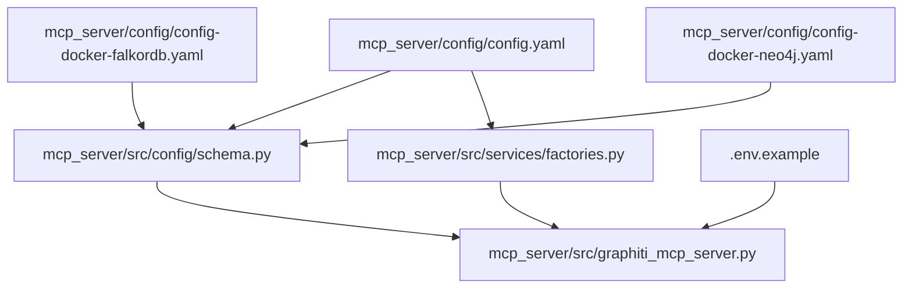
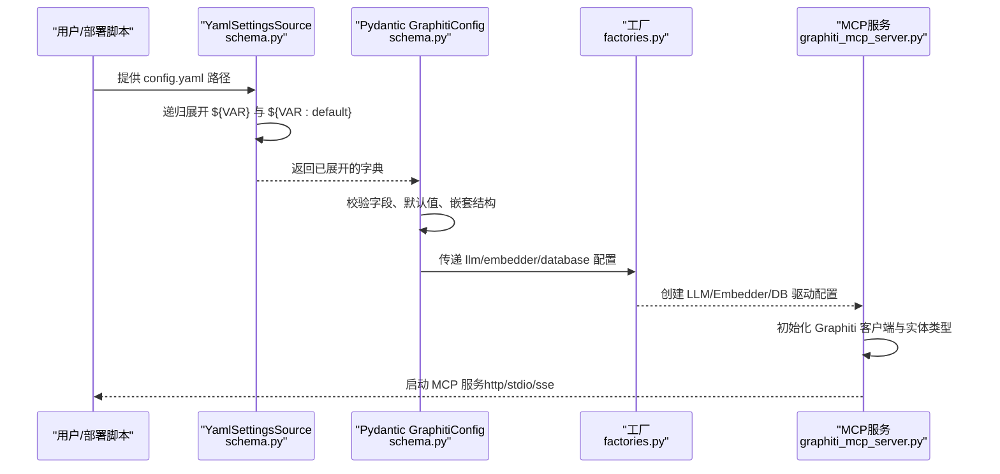
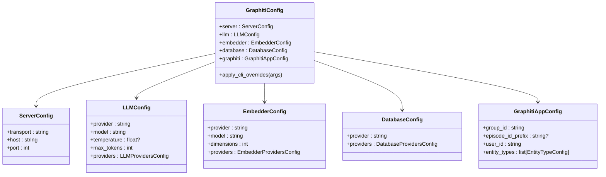

# 配置文件结构

<cite>
**本文引用的文件**
- [mcp_server/config/config.yaml](file://mcp_server/config/config.yaml)
- [mcp_server/config/config-docker-falkordb.yaml](file://mcp_server/config/config-docker-falkordb.yaml)
- [mcp_server/config/config-docker-neo4j.yaml](file://mcp_server/config/config-docker-neo4j.yaml)
- [mcp_server/src/config/schema.py](file://mcp_server/src/config/schema.py)
- [mcp_server/src/services/factories.py](file://mcp_server/src/services/factories.py)
- [mcp_server/src/graphiti_mcp_server.py](file://mcp_server/src/graphiti_mcp_server.py)
- [mcp_server/.env.example](file://mcp_server/.env.example)
- [mcp_server/tests/test_configuration.py](file://mcp_server/tests/test_configuration.py)
</cite>

## 目录
1. [简介](#简介)
2. [项目结构](#项目结构)
3. [核心组件](#核心组件)
4. [架构总览](#架构总览)
5. [详细组件分析](#详细组件分析)
6. [依赖关系分析](#依赖关系分析)
7. [性能与并发](#性能与并发)
8. [故障排查指南](#故障排查指南)
9. [结论](#结论)
10. [附录：示例与最佳实践](#附录示例与最佳实践)

## 简介
本文件系统性解析 MCP 服务器的 YAML 配置文件（config.yaml）结构，聚焦以下五大配置区块：
- server：传输方式与网络绑定
- llm：大语言模型提供商与参数
- embedder：嵌入模型提供商与维度
- database：图数据库提供商与连接参数
- graphiti：应用级分组与自定义实体类型

同时，解释环境变量注入语法 ${VAR_NAME} 与 ${VAR_NAME:default_value} 的工作机制，并给出实际配置示例，包括如何配置 Azure OpenAI 作为 LLM 提供商，以及如何切换到 Neo4j 数据库。

## 项目结构
MCP 服务器的配置位于 mcp_server/config 目录，核心逻辑在 mcp_server/src 下，包含配置模式定义、工厂创建与服务初始化。

图表来源
- [mcp_server/config/config.yaml](file://mcp_server/config/config.yaml#L1-L111)
- [mcp_server/src/config/schema.py](file://mcp_server/src/config/schema.py#L1-L292)
- [mcp_server/src/services/factories.py](file://mcp_server/src/services/factories.py#L1-L438)
- [mcp_server/src/graphiti_mcp_server.py](file://mcp_server/src/graphiti_mcp_server.py#L1-L200)
- [mcp_server/.env.example](file://mcp_server/.env.example#L1-L50)
- [mcp_server/config/config-docker-falkordb.yaml](file://mcp_server/config/config-docker-falkordb.yaml#L1-L101)
- [mcp_server/config/config-docker-neo4j.yaml](file://mcp_server/config/config-docker-neo4j.yaml#L1-L103)

章节来源
- [mcp_server/config/config.yaml](file://mcp_server/config/config.yaml#L1-L111)
- [mcp_server/src/config/schema.py](file://mcp_server/src/config/schema.py#L1-L292)

## 核心组件
- 配置模式（schema）：通过 Pydantic 模型定义 server、llm、embedder、database、graphiti 各区块的字段、默认值与校验规则，并支持从 YAML 文件与环境变量加载。
- 工厂（factories）：根据配置动态创建 LLM 客户端、嵌入客户端与数据库驱动配置。
- 服务初始化（graphiti_mcp_server）：读取配置、构建实体类型、初始化 Graphiti 客户端并启动 MCP 服务。

章节来源
- [mcp_server/src/config/schema.py](file://mcp_server/src/config/schema.py#L76-L292)
- [mcp_server/src/services/factories.py](file://mcp_server/src/services/factories.py#L1-L438)
- [mcp_server/src/graphiti_mcp_server.py](file://mcp_server/src/graphiti_mcp_server.py#L160-L311)

## 架构总览
下图展示配置文件如何被加载、扩展环境变量、映射到 Pydantic 模型，并最终驱动工厂创建与服务初始化。

图表来源
- [mcp_server/src/config/schema.py](file://mcp_server/src/config/schema.py#L16-L74)
- [mcp_server/src/config/schema.py](file://mcp_server/src/config/schema.py#L229-L292)
- [mcp_server/src/services/factories.py](file://mcp_server/src/services/factories.py#L100-L438)
- [mcp_server/src/graphiti_mcp_server.py](file://mcp_server/src/graphiti_mcp_server.py#L161-L311)

## 详细组件分析

### server 区块
- 字段
  - transport：传输类型，可选值为 stdio、sse（已弃用）、http；默认 http。
  - host：监听地址，默认 0.0.0.0。
  - port：监听端口，默认 8000。
- 默认值与可选值
  - transport 默认 http；CLI 支持覆盖为 stdio 或 http。
  - host 默认 0.0.0.0；port 默认 8000。
- 环境变量注入
  - 该区块不直接使用 ${VAR} 注入，但可通过 CLI 参数覆盖。
- 实际示例
  - 在 Docker 配置中，transport 通常设为 http 并绑定 8000 端口。

章节来源
- [mcp_server/config/config.yaml](file://mcp_server/config/config.yaml#L8-L12)
- [mcp_server/src/config/schema.py](file://mcp_server/src/config/schema.py#L76-L85)
- [mcp_server/src/graphiti_mcp_server.py](file://mcp_server/src/graphiti_mcp_server.py#L762-L806)

### llm 区块
- 字段
  - provider：LLM 提供商，可选 openai、azure_openai、anthropic、gemini、groq；默认 openai。
  - model：模型名称；默认 gpt-4.1（注意：config.yaml 中示例为 gpt-5-mini，schema 默认为 gpt-4.1）。
  - temperature：温度（可选）。
  - max_tokens：最大生成长度，默认 4096。
  - providers：各提供商的专用配置对象。
- 各提供商子区块
  - openai：api_key、api_url、organization_id。
  - azure_openai：api_key、api_url、api_version、deployment_name、use_azure_ad。
  - anthropic：api_key、api_url、max_retries。
  - gemini：api_key、project_id、location。
  - groq：api_key、api_url。
- 默认值与可选值
  - provider 默认 openai；各提供商默认值见 schema。
  - temperature 可省略（None）。
- 环境变量注入
  - 使用 ${VAR_NAME} 或 ${VAR_NAME:default_value} 注入密钥与 URL。
- 实际示例
  - Azure OpenAI：设置 AZURE_OPENAI_ENDPOINT、AZURE_OPENAI_API_VERSION、AZURE_OPENAI_DEPLOYMENT 等；若启用 Azure AD，则 use_azure_ad=true。

章节来源
- [mcp_server/config/config.yaml](file://mcp_server/config/config.yaml#L13-L44)
- [mcp_server/src/config/schema.py](file://mcp_server/src/config/schema.py#L146-L174)
- [mcp_server/src/config/schema.py](file://mcp_server/src/config/schema.py#L136-L145)
- [mcp_server/src/config/schema.py](file://mcp_server/src/config/schema.py#L87-L126)
- [mcp_server/src/config/schema.py](file://mcp_server/src/config/schema.py#L121-L134)
- [mcp_server/src/services/factories.py](file://mcp_server/src/services/factories.py#L100-L251)
- [mcp_server/.env.example](file://mcp_server/.env.example#L42-L50)

### embedder 区块
- 字段
  - provider：嵌入提供商，可选 openai、azure_openai、gemini、voyage；默认 openai。
  - model：嵌入模型名；默认 text-embedding-3-small。
  - dimensions：嵌入维度；默认 1536。
  - providers：各提供商专用配置。
- 各提供商子区块
  - openai：api_key、api_url、organization_id。
  - azure_openai：api_key、api_url、api_version、deployment_name、use_azure_ad。
  - gemini：api_key、project_id、location。
  - voyage：api_key、api_url、model。
- 默认值与可选值
  - provider 默认 openai；dimensions 默认 1536。
- 环境变量注入
  - 使用 ${VAR_NAME} 或 ${VAR_NAME:default_value} 注入密钥与 URL。
- 实际示例
  - Azure OpenAI 嵌入：设置 AZURE_OPENAI_EMBEDDINGS_ENDPOINT、AZURE_OPENAI_EMBEDDINGS_DEPLOYMENT 等。

章节来源
- [mcp_server/config/config.yaml](file://mcp_server/config/config.yaml#L45-L72)
- [mcp_server/src/config/schema.py](file://mcp_server/src/config/schema.py#L167-L174)
- [mcp_server/src/config/schema.py](file://mcp_server/src/config/schema.py#L158-L166)
- [mcp_server/src/config/schema.py](file://mcp_server/src/config/schema.py#L136-L157)
- [mcp_server/src/services/factories.py](file://mcp_server/src/services/factories.py#L253-L361)
- [mcp_server/.env.example](file://mcp_server/.env.example#L42-L50)

### database 区块
- 字段
  - provider：数据库提供商，可选 neo4j、falkordb；默认 falkordb。
  - providers：各提供商专用配置。
- 各提供商子区块
  - falkordb：uri、password、database。
  - neo4j：uri、username、password、database、use_parallel_runtime。
- 默认值与可选值
  - provider 默认 falkordb；各默认值见 schema。
- 环境变量注入
  - 使用 ${VAR_NAME} 或 ${VAR_NAME:default_value} 注入连接参数。
- 实际示例
  - 切换到 Neo4j：将 provider 设为 neo4j，并配置 NEO4J_URI、NEO4J_USER、NEO4J_PASSWORD 等。

章节来源
- [mcp_server/config/config.yaml](file://mcp_server/config/config.yaml#L73-L111)
- [mcp_server/src/config/schema.py](file://mcp_server/src/config/schema.py#L201-L206)
- [mcp_server/src/config/schema.py](file://mcp_server/src/config/schema.py#L176-L200)
- [mcp_server/src/config/schema.py](file://mcp_server/src/config/schema.py#L186-L193)
- [mcp_server/src/config/schema.py](file://mcp_server/src/config/schema.py#L176-L185)
- [mcp_server/src/services/factories.py](file://mcp_server/src/services/factories.py#L363-L438)
- [mcp_server/config/config-docker-neo4j.yaml](file://mcp_server/config/config-docker-neo4j.yaml#L69-L80)
- [mcp_server/config/config-docker-falkordb.yaml](file://mcp_server/config/config-docker-falkordb.yaml#L69-L78)

### graphiti 区块
- 字段
  - group_id：知识图谱分组标识，默认 main。
  - episode_id_prefix：剧集 ID 前缀（可空），默认空字符串。
  - user_id：用户标识，默认 mcp_user。
  - entity_types：自定义实体类型列表，每项含 name 与 description。
- 默认值与可选值
  - group_id 默认 main；episode_id_prefix 默认空字符串；user_id 默认 mcp_user。
- 自定义实体类型定义方法
  - 在 entity_types 中添加多个条目，每个条目包含 name 与 description。
  - 服务初始化时会基于配置动态构建实体类型模型，用于后续实体抽取与过滤。
- 实际示例
  - 在 Docker 配置中，提供了完整的 entity_types 示例清单。

章节来源
- [mcp_server/config/config.yaml](file://mcp_server/config/config.yaml#L89-L111)
- [mcp_server/src/config/schema.py](file://mcp_server/src/config/schema.py#L215-L228)
- [mcp_server/src/graphiti_mcp_server.py](file://mcp_server/src/graphiti_mcp_server.py#L193-L211)
- [mcp_server/config/config-docker-falkordb.yaml](file://mcp_server/config/config-docker-falkordb.yaml#L79-L101)
- [mcp_server/config/config-docker-neo4j.yaml](file://mcp_server/config/config-docker-neo4j.yaml#L81-L103)

## 依赖关系分析
- 配置加载顺序
  - 优先级：CLI 参数 > 环境变量 > YAML 文件 > 默认值。
  - YAML 文件通过自定义 YamlSettingsSource 加载并递归展开环境变量表达式。
- 工厂依赖
  - LLMClientFactory/EmbedderFactory/DatabaseDriverFactory 依据 provider 与 providers 子区块创建对应客户端或驱动配置。
- 服务依赖
  - GraphitiService 初始化时，根据 database.provider 决定使用 Neo4j 或 FalkorDB 的不同路径，并构建实体类型模型。

图表来源
- [mcp_server/src/config/schema.py](file://mcp_server/src/config/schema.py#L229-L292)
- [mcp_server/src/config/schema.py](file://mcp_server/src/config/schema.py#L76-L228)

章节来源
- [mcp_server/src/config/schema.py](file://mcp_server/src/config/schema.py#L248-L262)
- [mcp_server/src/services/factories.py](file://mcp_server/src/services/factories.py#L100-L438)
- [mcp_server/src/graphiti_mcp_server.py](file://mcp_server/src/graphiti_mcp_server.py#L161-L311)

## 性能与并发
- 并发控制
  - 通过 SEMAPHORE_LIMIT 控制“剧集”处理并发度，避免 LLM 速率限制导致 429 错误。
  - 不同提供商的推荐范围已在注释中给出，建议按配额调整。
- 影响因素
  - 每个剧集处理涉及多次 LLM 调用，因此并发数应低于 LLM 请求速率配额。
- 调优建议
  - 从默认 10 开始，逐步提高并观察日志中的 429 错误与处理时间，找到平衡点。

章节来源
- [mcp_server/src/graphiti_mcp_server.py](file://mcp_server/src/graphiti_mcp_server.py#L48-L75)
- [mcp_server/.env.example](file://mcp_server/.env.example#L20-L33)

## 故障排查指南
- 数据库连接失败
  - 若数据库不可达，服务会抛出明确错误提示，包含启动指引（如 Docker Compose 启动命令）。
- API 密钥缺失
  - 工厂在创建客户端前会校验 API Key 是否存在，缺失时抛出异常。
- 传输类型问题
  - 仅支持 http、stdio；sse 已弃用。确保 transport 与部署方式匹配。
- 环境变量未生效
  - 确认 .env 文件已加载，且 YAML 中的 ${VAR} 表达式正确；必要时使用 ${VAR:default} 提供默认值。

章节来源
- [mcp_server/src/graphiti_mcp_server.py](file://mcp_server/src/graphiti_mcp_server.py#L241-L279)
- [mcp_server/src/services/factories.py](file://mcp_server/src/services/factories.py#L76-L98)
- [mcp_server/src/graphiti_mcp_server.py](file://mcp_server/src/graphiti_mcp_server.py#L762-L806)

## 结论
本配置文件以清晰的区块划分与强类型模式定义，结合环境变量注入与工厂模式，实现了对 LLM、嵌入与数据库的灵活配置与运行时切换。通过合理设置 provider、模型与数据库，配合并发控制，可在不同部署环境中稳定运行 MCP 服务。

## 附录：示例与最佳实践

### 环境变量注入语法
- 语法
  - ${VAR_NAME}：若环境变量存在则替换为变量值，否则保持原样。
  - ${VAR_NAME:default_value}：若环境变量存在则替换为变量值，否则使用默认值。
- 行为
  - 当整个值为单一表达式时，会对布尔字符串进行转换（如 true/false/1/0/yes/no/on/off 等）。
  - 非单一表达式时，执行字符串替换（保留为字符串）。
- 示例
  - OPENAI_API_KEY、NEO4J_URI、FALKORDB_URI 等均通过 ${VAR} 注入。
  - use_azure_ad、use_parallel_runtime 等布尔字段通过 ${VAR:default} 提供默认值。

章节来源
- [mcp_server/src/config/schema.py](file://mcp_server/src/config/schema.py#L16-L74)
- [mcp_server/config/config.yaml](file://mcp_server/config/config.yaml#L1-L7)
- [mcp_server/.env.example](file://mcp_server/.env.example#L1-L50)

### 如何配置 Azure OpenAI 作为 LLM 提供商
- 步骤
  - 将 llm.provider 设为 azure_openai。
  - 在 providers.azure_openai 中设置：
    - api_key 或启用 Azure AD 认证（use_azure_ad=true）。
    - api_url（Azure OpenAI 端点）。
    - api_version（API 版本）。
    - deployment_name（模型部署名）。
  - 如需嵌入模型，同样在 embedder.provider=azure_openai 下配置嵌入端点与部署名。
- 参考
  - Azure OpenAI 配置项与默认值见 schema 与 YAML 示例。

章节来源
- [mcp_server/config/config.yaml](file://mcp_server/config/config.yaml#L18-L30)
- [mcp_server/src/config/schema.py](file://mcp_server/src/config/schema.py#L95-L103)
- [mcp_server/src/services/factories.py](file://mcp_server/src/services/factories.py#L147-L194)

### 如何切换到 Neo4j 数据库
- 步骤
  - 将 database.provider 设为 neo4j。
  - 在 providers.neo4j 中设置：
    - uri（默认 bolt://localhost:7687）。
    - username（默认 neo4j）。
    - password。
    - database（默认 neo4j）。
    - use_parallel_runtime（默认 false）。
  - 也可通过环境变量覆盖（如 NEO4J_URI、NEO4J_USER、NEO4J_PASSWORD）。
- 参考
  - Docker 配置示例中已提供完整的 neo4j 区块。

章节来源
- [mcp_server/config/config.yaml](file://mcp_server/config/config.yaml#L73-L88)
- [mcp_server/src/config/schema.py](file://mcp_server/src/config/schema.py#L176-L184)
- [mcp_server/src/services/factories.py](file://mcp_server/src/services/factories.py#L363-L400)
- [mcp_server/config/config-docker-neo4j.yaml](file://mcp_server/config/config-docker-neo4j.yaml#L69-L80)

### 自定义实体类型定义方法
- 步骤
  - 在 graphiti.entity_types 中添加多个条目，每个条目包含 name 与 description。
  - 服务初始化时会基于这些条目动态构建实体类型模型，用于实体抽取与查询过滤。
- 参考
  - YAML 示例中提供了完整的实体类型清单。

章节来源
- [mcp_server/config/config.yaml](file://mcp_server/config/config.yaml#L89-L111)
- [mcp_server/src/graphiti_mcp_server.py](file://mcp_server/src/graphiti_mcp_server.py#L193-L211)
- [mcp_server/config/config-docker-falkordb.yaml](file://mcp_server/config/config-docker-falkordb.yaml#L79-L101)
- [mcp_server/config/config-docker-neo4j.yaml](file://mcp_server/config/config-docker-neo4j.yaml#L81-L103)

### 配置加载与 CLI 覆盖流程
- 流程
  - 读取 YAML 文件并展开环境变量。
  - 应用环境变量与 .env 文件。
  - CLI 参数优先覆盖（transport、llm/provider/model/temperature、embedder/provider/model、database/provider、group_id/user_id）。
- 参考
  - 测试用例展示了 CLI 覆盖行为。

章节来源
- [mcp_server/src/config/schema.py](file://mcp_server/src/config/schema.py#L248-L262)
- [mcp_server/src/graphiti_mcp_server.py](file://mcp_server/src/graphiti_mcp_server.py#L762-L806)
- [mcp_server/tests/test_configuration.py](file://mcp_server/tests/test_configuration.py#L148-L177)