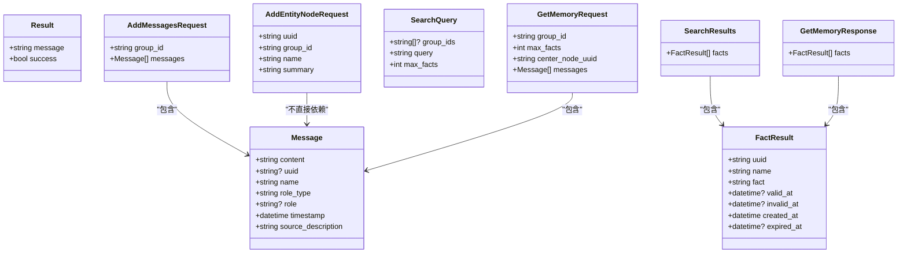

# REST API

<cite>
**本文引用的文件**
- [server/graph_service/main.py](file://server/graph_service/main.py)
- [server/graph_service/routers/ingest.py](file://server/graph_service/routers/ingest.py)
- [server/graph_service/routers/retrieve.py](file://server/graph_service/routers/retrieve.py)
- [server/graph_service/dto/ingest.py](file://server/graph_service/dto/ingest.py)
- [server/graph_service/dto/retrieve.py](file://server/graph_service/dto/retrieve.py)
- [server/graph_service/dto/common.py](file://server/graph_service/dto/common.py)
- [server/graph_service/zep_graphiti.py](file://server/graph_service/zep_graphiti.py)
- [server/graph_service/config.py](file://server/graph_service/config.py)
- [server/README.md](file://server/README.md)
</cite>

## 目录
1. [简介](#简介)
2. [项目结构](#项目结构)
3. [核心组件](#核心组件)
4. [架构总览](#架构总览)
5. [详细组件分析](#详细组件分析)
6. [依赖关系分析](#依赖关系分析)
7. [性能与并发](#性能与并发)
8. [故障排查指南](#故障排查指南)
9. [结论](#结论)
10. [附录](#附录)

## 简介
本文件为 Graphiti 服务的 REST API 权威参考文档，采用 OpenAPI/Swagger 风格，覆盖以下端点：
- /ingest/messages（批量入队消息）
- /ingest/entity-node（新增实体节点）
- /ingest/entity-edge/{uuid}（删除实体边）
- /ingest/group/{group_id}（删除分组及其关联数据）
- /ingest/episode/{uuid}（删除时序事件）
- /ingest/clear（清空图数据并重建索引约束）
- /retrieve/search（按查询词检索事实）
- /retrieve/entity-edge/{uuid}（按 uuid 获取实体边）
- /retrieve/episodes/{group_id}（按分组获取最近 N 条时序事件）
- /retrieve/get-memory（基于消息组合查询检索事实）

文档同时说明：
- HTTP 方法、URL 路径、请求头（认证）、请求体（Pydantic DTO 结构）与响应格式
- FastAPI 应用配置与依赖注入
- 错误码（4xx/5xx）与常见问题
- API 密钥管理、CORS 配置与生产部署安全建议
- curl 示例与速率限制策略

## 项目结构
服务由 FastAPI 应用统一注册路由，核心逻辑位于 routers 与 DTO 模型中；数据访问通过 ZepGraphiti 依赖注入实现。

图表来源
- [server/graph_service/main.py](file://server/graph_service/main.py#L1-L30)
- [server/graph_service/routers/ingest.py](file://server/graph_service/routers/ingest.py#L1-L112)
- [server/graph_service/routers/retrieve.py](file://server/graph_service/routers/retrieve.py#L1-L64)
- [server/graph_service/dto/ingest.py](file://server/graph_service/dto/ingest.py#L1-L16)
- [server/graph_service/dto/retrieve.py](file://server/graph_service/dto/retrieve.py#L1-L46)
- [server/graph_service/dto/common.py](file://server/graph_service/dto/common.py#L1-L29)
- [server/graph_service/zep_graphiti.py](file://server/graph_service/zep_graphiti.py#L1-L115)
- [server/graph_service/config.py](file://server/graph_service/config.py#L1-L27)

章节来源
- [server/graph_service/main.py](file://server/graph_service/main.py#L1-L30)
- [server/graph_service/routers/ingest.py](file://server/graph_service/routers/ingest.py#L1-L112)
- [server/graph_service/routers/retrieve.py](file://server/graph_service/routers/retrieve.py#L1-L64)
- [server/graph_service/dto/ingest.py](file://server/graph_service/dto/ingest.py#L1-L16)
- [server/graph_service/dto/retrieve.py](file://server/graph_service/dto/retrieve.py#L1-L46)
- [server/graph_service/dto/common.py](file://server/graph_service/dto/common.py#L1-L29)
- [server/graph_service/zep_graphiti.py](file://server/graph_service/zep_graphiti.py#L1-L115)
- [server/graph_service/config.py](file://server/graph_service/config.py#L1-L27)

## 核心组件
- FastAPI 应用与生命周期
  - 应用在启动时初始化 Graphiti 并在关闭时释放资源。
  - 注册 /retrieve 与 /ingest 路由。
- 依赖注入
  - ZepGraphitiDep：从配置读取数据库连接信息，构建 Graphiti 客户端，并在请求结束时关闭连接。
  - ZepEnvDep：读取 OPENAI_* 与 NEO4J_* 等环境变量。
- DTO 模型
  - 公共：Message、Result
  - 入队：AddMessagesRequest、AddEntityNodeRequest
  - 检索：SearchQuery、FactResult、SearchResults、GetMemoryRequest、GetMemoryResponse

章节来源
- [server/graph_service/main.py](file://server/graph_service/main.py#L1-L30)
- [server/graph_service/zep_graphiti.py](file://server/graph_service/zep_graphiti.py#L1-L115)
- [server/graph_service/config.py](file://server/graph_service/config.py#L1-L27)
- [server/graph_service/dto/common.py](file://server/graph_service/dto/common.py#L1-L29)
- [server/graph_service/dto/ingest.py](file://server/graph_service/dto/ingest.py#L1-L16)
- [server/graph_service/dto/retrieve.py](file://server/graph_service/dto/retrieve.py#L1-L46)

## 架构总览
下图展示请求从客户端到服务端再到图数据库的调用链路与数据流。

图表来源
- [server/graph_service/main.py](file://server/graph_service/main.py#L1-L30)
- [server/graph_service/routers/ingest.py](file://server/graph_service/routers/ingest.py#L1-L112)
- [server/graph_service/routers/retrieve.py](file://server/graph_service/routers/retrieve.py#L1-L64)
- [server/graph_service/zep_graphiti.py](file://server/graph_service/zep_graphiti.py#L1-L115)

## 详细组件分析

### /ingest/messages（批量入队消息）
- 方法与路径
  - POST /ingest/messages
- 认证
  - 未在路由层声明自定义认证头；如需鉴权，请在网关或反向代理层统一接入。
- 请求体（Pydantic DTO）
  - AddMessagesRequest
    - group_id: 字符串，必填
    - messages: 列表，元素为 Message
- 响应
  - Result：包含 message 与 success 字段
- 处理流程
  - 将每个 Message 作为独立任务投递至异步工作队列，后台逐个写入图数据库（EpisodicNode/Episode 类型）。
  - 返回状态码 202 Accepted 表示已入队，非阻塞处理。
- curl 示例
  - 注意：请将 {host} 替换为实际主机地址
  - curl -X POST "http://{host}/ingest/messages" -H "Content-Type: application/json" -d '{...}'
- 错误码
  - 404：当底层图操作找不到目标对象时（例如删除实体边/时序事件时）
  - 5xx：数据库或 LLM 客户端异常
- 速率限制
  - 默认并发受 SEMAPHORE_LIMIT 控制，避免 LLM 提供方限流（429）。可在环境变量中调整。

章节来源
- [server/graph_service/routers/ingest.py](file://server/graph_service/routers/ingest.py#L51-L71)
- [server/graph_service/dto/ingest.py](file://server/graph_service/dto/ingest.py#L1-L16)
- [server/graph_service/dto/common.py](file://server/graph_service/dto/common.py#L1-L29)
- [server/README.md](file://server/README.md#L226-L237)

### /ingest/entity-node（新增实体节点）
- 方法与路径
  - POST /ingest/entity-node
- 认证
  - 同上
- 请求体（Pydantic DTO）
  - AddEntityNodeRequest
    - uuid: 字符串，必填
    - group_id: 字符串，必填
    - name: 字符串，必填
    - summary: 字符串，可选
- 响应
  - 返回新创建的实体节点对象（EntityNode）
- curl 示例
  - curl -X POST "http://{host}/ingest/entity-node" -H "Content-Type: application/json" -d '{...}'

章节来源
- [server/graph_service/routers/ingest.py](file://server/graph_service/routers/ingest.py#L73-L85)
- [server/graph_service/dto/ingest.py](file://server/graph_service/dto/ingest.py#L1-L16)
- [server/graph_service/zep_graphiti.py](file://server/graph_service/zep_graphiti.py#L17-L31)

### /ingest/entity-edge/{uuid}（删除实体边）
- 方法与路径
  - DELETE /ingest/entity-edge/{uuid}
- 认证
  - 同上
- 响应
  - Result：删除成功
- curl 示例
  - curl -X DELETE "http://{host}/ingest/entity-edge/{uuid}"

章节来源
- [server/graph_service/routers/ingest.py](file://server/graph_service/routers/ingest.py#L87-L91)
- [server/graph_service/zep_graphiti.py](file://server/graph_service/zep_graphiti.py#L59-L65)

### /ingest/group/{group_id}（删除分组及其关联数据）
- 方法与路径
  - DELETE /ingest/group/{group_id}
- 认证
  - 同上
- 响应
  - Result：删除成功
- curl 示例
  - curl -X DELETE "http://{host}/ingest/group/{group_id}"

章节来源
- [server/graph_service/routers/ingest.py](file://server/graph_service/routers/ingest.py#L93-L96)
- [server/graph_service/zep_graphiti.py](file://server/graph_service/zep_graphiti.py#L39-L58)

### /ingest/episode/{uuid}（删除时序事件）
- 方法与路径
  - DELETE /ingest/episode/{uuid}
- 认证
  - 同上
- 响应
  - Result：删除成功
- curl 示例
  - curl -X DELETE "http://{host}/ingest/episode/{uuid}"

章节来源
- [server/graph_service/routers/ingest.py](file://server/graph_service/routers/ingest.py#L100-L102)
- [server/graph_service/zep_graphiti.py](file://server/graph_service/zep_graphiti.py#L66-L71)

### /ingest/clear（清空图数据并重建索引约束）
- 方法与路径
  - POST /ingest/clear
- 认证
  - 同上
- 响应
  - Result：清空成功
- curl 示例
  - curl -X POST "http://{host}/ingest/clear"

章节来源
- [server/graph_service/routers/ingest.py](file://server/graph_service/routers/ingest.py#L105-L112)

### /retrieve/search（按查询词检索事实）
- 方法与路径
  - POST /retrieve/search
- 认证
  - 同上
- 请求体（Pydantic DTO）
  - SearchQuery
    - group_ids: 字符串数组，可选
    - query: 字符串，必填
    - max_facts: 整数，默认 10
- 响应
  - SearchResults
    - facts: 列表，元素为 FactResult
- FactResult 字段
  - uuid、name、fact、valid_at、invalid_at、created_at、expired_at
  - 时间字段以 UTC ISO 格式序列化
- curl 示例
  - curl -X POST "http://{host}/retrieve/search" -H "Content-Type: application/json" -d '{...}'

章节来源
- [server/graph_service/routers/retrieve.py](file://server/graph_service/routers/retrieve.py#L17-L28)
- [server/graph_service/dto/retrieve.py](file://server/graph_service/dto/retrieve.py#L1-L46)
- [server/graph_service/zep_graphiti.py](file://server/graph_service/zep_graphiti.py#L102-L111)

### /retrieve/entity-edge/{uuid}（按 uuid 获取实体边）
- 方法与路径
  - GET /retrieve/entity-edge/{uuid}
- 认证
  - 同上
- 响应
  - 单个 FactResult
- curl 示例
  - curl -X GET "http://{host}/retrieve/entity-edge/{uuid}"

章节来源
- [server/graph_service/routers/retrieve.py](file://server/graph_service/routers/retrieve.py#L30-L34)
- [server/graph_service/dto/retrieve.py](file://server/graph_service/dto/retrieve.py#L16-L27)
- [server/graph_service/zep_graphiti.py](file://server/graph_service/zep_graphiti.py#L102-L111)

### /retrieve/episodes/{group_id}（按分组获取最近 N 条时序事件）
- 方法与路径
  - GET /retrieve/episodes/{group_id}?last_n={整数}
- 认证
  - 同上
- 响应
  - 时序事件列表（EpisodicNode 列表）
- curl 示例
  - curl -X GET "http://{host}/retrieve/episodes/{group_id}?last_n=10"

章节来源
- [server/graph_service/routers/retrieve.py](file://server/graph_service/routers/retrieve.py#L36-L41)

### /retrieve/get-memory（基于消息组合查询检索事实）
- 方法与路径
  - POST /retrieve/get-memory
- 认证
  - 同上
- 请求体（Pydantic DTO）
  - GetMemoryRequest
    - group_id: 字符串，必填
    - max_facts: 整数，默认 10
    - center_node_uuid: 字符串，必填
    - messages: 列表，元素为 Message
- 响应
  - GetMemoryResponse
    - facts: 列表，元素为 FactResult
- curl 示例
  - curl -X POST "http://{host}/retrieve/get-memory" -H "Content-Type: application/json" -d '{...}'

章节来源
- [server/graph_service/routers/retrieve.py](file://server/graph_service/routers/retrieve.py#L44-L57)
- [server/graph_service/dto/retrieve.py](file://server/graph_service/dto/retrieve.py#L33-L46)
- [server/graph_service/dto/common.py](file://server/graph_service/dto/common.py#L13-L29)

## 依赖关系分析

图表来源
- [server/graph_service/dto/common.py](file://server/graph_service/dto/common.py#L1-L29)
- [server/graph_service/dto/ingest.py](file://server/graph_service/dto/ingest.py#L1-L16)
- [server/graph_service/dto/retrieve.py](file://server/graph_service/dto/retrieve.py#L1-L46)

章节来源
- [server/graph_service/dto/common.py](file://server/graph_service/dto/common.py#L1-L29)
- [server/graph_service/dto/ingest.py](file://server/graph_service/dto/ingest.py#L1-L16)
- [server/graph_service/dto/retrieve.py](file://server/graph_service/dto/retrieve.py#L1-L46)

## 性能与并发
- 并发与限流
  - 默认并发受 SEMAPHORE_LIMIT 控制，避免 LLM 提供方 429 限流。可根据吞吐需求调整该值。
- 异步入队
  - /ingest/messages 使用异步队列将消息入队，返回 202，适合高吞吐场景。
- 检索性能
  - 检索接口支持 group_ids 过滤与 max_facts 控制，减少响应体积与延迟。

章节来源
- [server/README.md](file://server/README.md#L226-L237)
- [server/graph_service/routers/ingest.py](file://server/graph_service/routers/ingest.py#L1-L112)

## 故障排查指南
- 常见错误码
  - 404：删除/查询实体边或时序事件时未找到目标对象
  - 429：LLM 提供方限流（可通过降低并发或提高 SEMAPHORE_LIMIT 解决）
  - 5xx：数据库连接失败、LLM 客户端异常
- 排查步骤
  - 检查环境变量 OPENAI_API_KEY、NEO4J_URI/USER/PASSWORD 是否正确
  - 确认图数据库可达且已初始化索引与约束
  - 查看服务日志定位异常堆栈
- 建议
  - 在网关层统一接入限流与熔断
  - 对外部 LLM 的错误进行重试与降级

章节来源
- [server/graph_service/zep_graphiti.py](file://server/graph_service/zep_graphiti.py#L32-L71)
- [server/graph_service/config.py](file://server/graph_service/config.py#L1-L27)
- [server/README.md](file://server/README.md#L226-L237)

## 结论
本文档提供了 Graphiti REST API 的权威参考，涵盖入队与检索两大类端点的完整契约与行为说明。通过 Pydantic DTO 明确了请求/响应的数据结构，结合 FastAPI 的依赖注入与异步队列机制，实现了高并发与可扩展的图数据服务。生产部署建议配合网关层的安全与限流策略，确保稳定性与安全性。

## 附录

### FastAPI 应用与中间件
- 应用入口
  - 在 lifespan 中完成 Graphiti 初始化与关闭
- 路由注册
  - 包含 /retrieve 与 /ingest 路由
- Swagger/ReDoc
  - 可通过 /docs 与 /redoc 访问交互式文档

章节来源
- [server/graph_service/main.py](file://server/graph_service/main.py#L1-L30)
- [server/README.md](file://server/README.md#L74-L77)

### API 密钥管理
- 环境变量
  - OPENAI_API_KEY、NEO4J_USER、NEO4J_PASSWORD、NEO4J_URI 等
- 建议
  - 使用密钥管理服务（如 Vault、KMS）存储敏感信息
  - 严格最小权限原则，分离开发/测试/生产环境密钥

章节来源
- [server/graph_service/config.py](file://server/graph_service/config.py#L1-L27)
- [server/README.md](file://server/README.md#L31-L41)

### CORS 配置
- 当前未在 FastAPI 层显式配置 CORS
- 建议
  - 在网关或反向代理层统一配置 CORS，避免跨域问题
  - 生产环境仅允许必要域名与方法

[本节为通用建议，无需特定文件来源]

### 生产部署安全建议
- 网关层
  - 统一鉴权（如 API Key/JWT）、限流、熔断与 WAF
  - HTTPS/TLS 强制启用
- 数据库
  - 最小权限账号、网络隔离、备份与审计
- 日志与监控
  - 敏感字段脱敏、异常告警、性能指标采集

[本节为通用建议，无需特定文件来源]