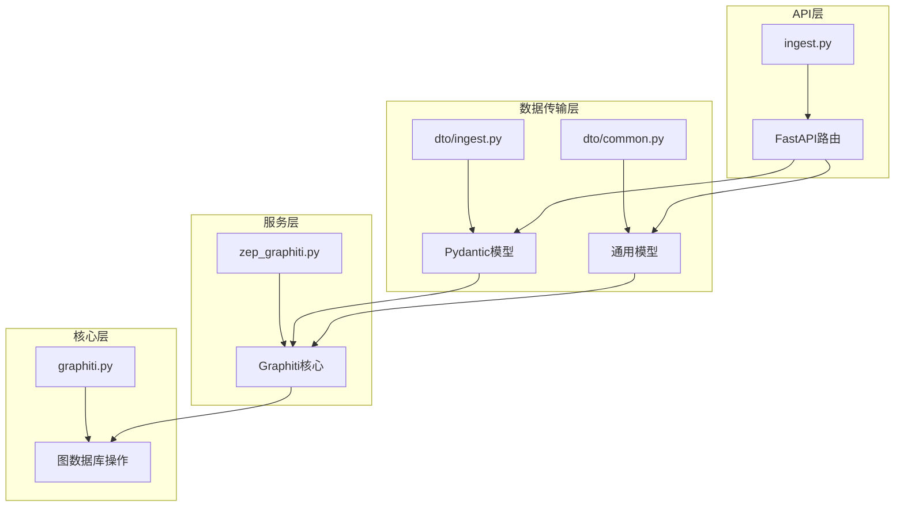
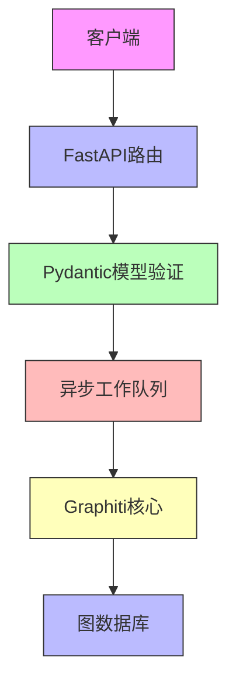
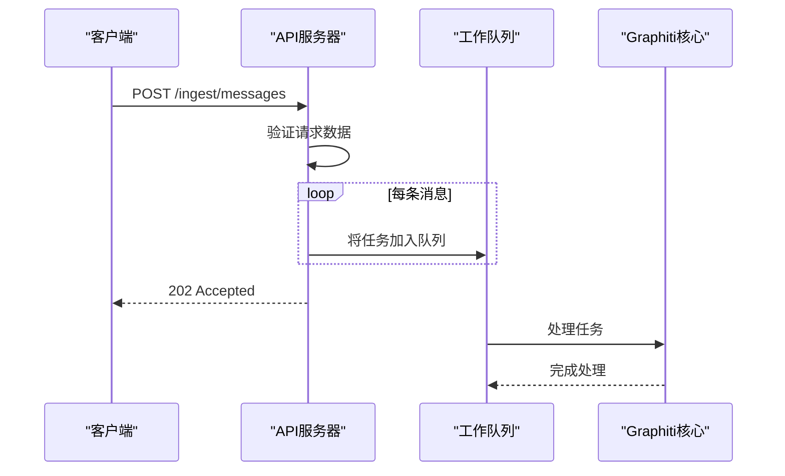
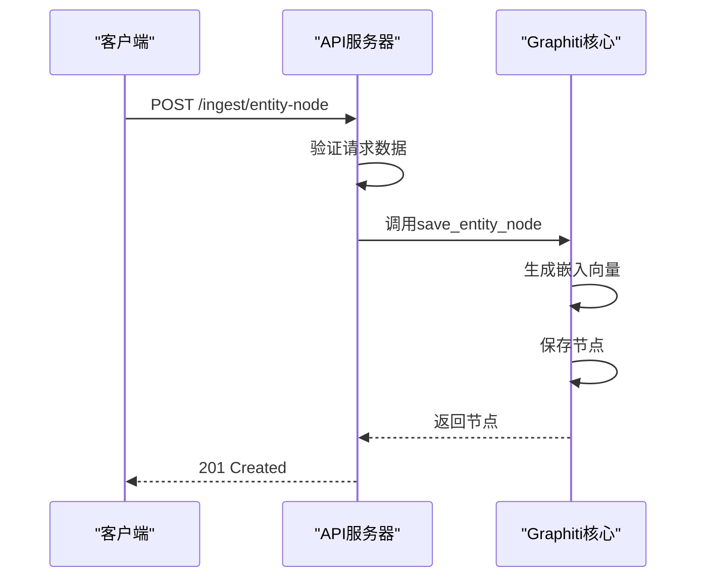
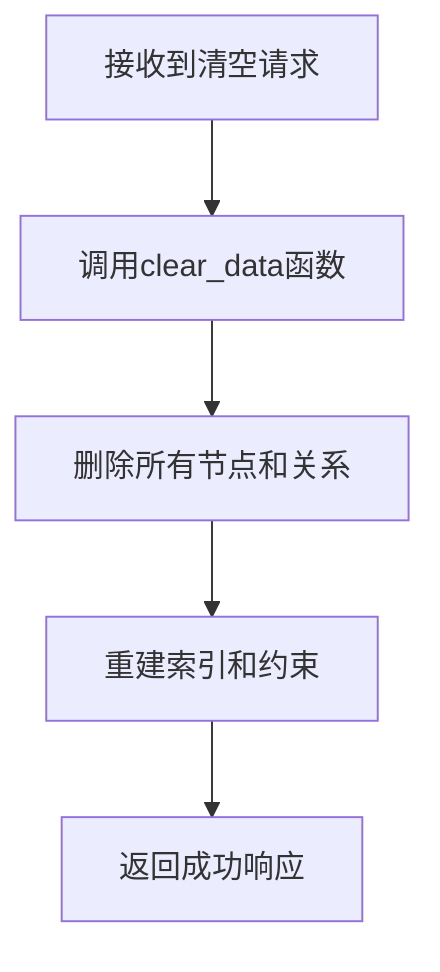
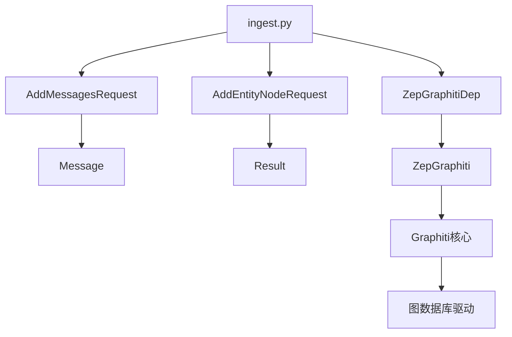

# 数据摄入API

<cite>
**本文档中引用的文件**   
- [ingest.py](file://server/graph_service/routers/ingest.py)
- [ingest.py](file://server/graph_service/dto/ingest.py)
- [common.py](file://server/graph_service/dto/common.py)
- [zep_graphiti.py](file://server/graph_service/zep_graphiti.py)
- [graphiti.py](file://graphiti_core/graphiti.py)
- [graph_data_operations.py](file://graphiti_core/utils/maintenance/graph_data_operations.py)
</cite>

## 目录
1. [介绍](#介绍)
2. [项目结构](#项目结构)
3. [核心组件](#核心组件)
4. [架构概述](#架构概述)
5. [详细组件分析](#详细组件分析)
6. [依赖分析](#依赖分析)
7. [性能考虑](#性能考虑)
8. [故障排除指南](#故障排除指南)
9. [结论](#结论)

## 介绍
数据摄入API是Graphiti系统的核心功能之一，负责处理向知识图谱添加新数据的请求。该API提供了多个端点来支持不同类型的数据摄入操作，包括异步添加消息、创建实体节点和清空图谱等。API基于FastAPI框架构建，利用异步工作队列模式处理批量消息摄入，确保系统在高负载下的稳定性和响应性。通过Pydantic模型定义请求体结构，API实现了严格的输入验证和类型检查。本文档将详细解释各个端点的实现细节、数据流和错误处理机制。

## 项目结构
数据摄入API位于`server/graph_service/routers/`目录下，主要由`ingest.py`文件实现。该模块依赖于`dto`目录中的数据传输对象（DTO）定义，并通过`zep_graphiti.py`与Graphiti核心功能集成。API的请求处理流程涉及多个层次的组件协作，从HTTP路由到核心图谱操作。

**Diagram sources**
- [ingest.py](file://server/graph_service/routers/ingest.py)
- [dto/ingest.py](file://server/graph_service/dto/ingest.py)
- [dto/common.py](file://server/graph_service/dto/common.py)
- [zep_graphiti.py](file://server/graph_service/zep_graphiti.py)

**Section sources**
- [ingest.py](file://server/graph_service/routers/ingest.py)
- [dto/ingest.py](file://server/graph_service/dto/ingest.py)
- [dto/common.py](file://server/graph_service/dto/common.py)

## 核心组件
数据摄入API的核心组件包括FastAPI路由、异步工作队列、Pydantic数据模型和Graphiti核心集成。`AsyncWorker`类实现了异步工作队列模式，用于处理批量消息摄入，确保系统在高并发场景下的稳定性。`AddMessagesRequest`和`AddEntityNodeRequest`等Pydantic模型定义了请求体的结构和约束，提供了类型安全和输入验证。API通过`ZepGraphitiDep`依赖注入与Graphiti核心功能集成，实现了从HTTP请求到图谱操作的无缝衔接。

**Section sources**
- [ingest.py](file://server/graph_service/routers/ingest.py#L13-L38)
- [dto/ingest.py](file://server/graph_service/dto/ingest.py#L6-L15)
- [zep_graphiti.py](file://server/graph_service/zep_graphiti.py#L17-L114)

## 架构概述
数据摄入API采用分层架构设计，将HTTP路由、数据验证、业务逻辑和数据存储分离。API层负责接收和路由HTTP请求，DTO层负责数据结构定义和验证，服务层负责业务逻辑处理，核心层负责与图数据库的交互。这种分层设计提高了代码的可维护性和可测试性。

**Diagram sources**
- [ingest.py](file://server/graph_service/routers/ingest.py)
- [dto/ingest.py](file://server/graph_service/dto/ingest.py)
- [zep_graphiti.py](file://server/graph_service/zep_graphiti.py)

## 详细组件分析

### 消息摄入分析
消息摄入端点`/ingest/messages`采用异步工作队列模式处理批量消息。当客户端发送消息请求时，API将每个消息包装成一个任务并放入队列，立即返回响应。工作队列中的任务由后台工作者逐个处理，调用Graphiti核心的`add_episode`方法将消息添加到知识图谱中。

**Diagram sources**
- [ingest.py](file://server/graph_service/routers/ingest.py#L51-L70)
- [graphiti.py](file://graphiti_core/graphiti.py#L615-L800)

**Section sources**
- [ingest.py](file://server/graph_service/routers/ingest.py#L51-L70)
- [graphiti.py](file://graphiti_core/graphiti.py#L615-L800)

### 实体节点创建分析
实体节点创建端点`/ingest/entity-node`直接创建实体节点并立即返回结果。该端点使用`201 Created`状态码表示资源成功创建。API通过`save_entity_node`方法在图谱中创建新节点，并生成相应的嵌入向量。

**Diagram sources**
- [ingest.py](file://server/graph_service/routers/ingest.py#L73-L84)
- [zep_graphiti.py](file://server/graph_service/zep_graphiti.py#L21-L30)

**Section sources**
- [ingest.py](file://server/graph_service/routers/ingest.py#L73-L84)
- [zep_graphiti.py](file://server/graph_service/zep_graphiti.py#L21-L30)

### 图谱清空分析
图谱清空端点`/ingest/clear`用于清空整个知识图谱或特定分组的数据。该操作首先调用`clear_data`函数删除所有节点和关系，然后重建索引和约束以确保图谱的完整性。

**Diagram sources**
- [ingest.py](file://server/graph_service/routers/ingest.py#L105-L111)
- [graph_data_operations.py](file://graphiti_core/utils/maintenance/graph_data_operations.py#L34-L58)

**Section sources**
- [ingest.py](file://server/graph_service/routers/ingest.py#L105-L111)
- [graph_data_operations.py](file://graphiti_core/utils/maintenance/graph_data_operations.py#L34-L58)

## 依赖分析
数据摄入API的组件之间存在明确的依赖关系。API路由依赖于DTO模型进行数据验证，同时依赖于`ZepGraphiti`服务进行核心操作。`ZepGraphiti`服务又依赖于Graphiti核心功能和图数据库驱动。这种依赖关系确保了各组件的职责分离和代码的可维护性。

**Diagram sources**
- [ingest.py](file://server/graph_service/routers/ingest.py)
- [dto/ingest.py](file://server/graph_service/dto/ingest.py)
- [zep_graphiti.py](file://server/graph_service/zep_graphiti.py)

**Section sources**
- [ingest.py](file://server/graph_service/routers/ingest.py)
- [dto/ingest.py](file://server/graph_service/dto/ingest.py)
- [zep_graphiti.py](file://server/graph_service/zep_graphiti.py)

## 性能考虑
数据摄入API在设计时充分考虑了性能因素。异步工作队列模式允许API快速响应客户端请求，同时在后台处理耗时的操作。批量处理机制减少了数据库交互次数，提高了整体吞吐量。此外，API通过连接池和异步I/O操作优化了资源利用率，在高并发场景下仍能保持良好的性能表现。

## 故障排除指南
当遇到数据摄入API的问题时，可以按照以下步骤进行排查：
1. 检查请求体是否符合Pydantic模型定义的结构和约束
2. 验证图数据库连接是否正常
3. 查看工作队列是否积压了大量任务
4. 检查日志文件中的错误信息

**Section sources**
- [ingest.py](file://server/graph_service/routers/ingest.py)
- [zep_graphiti.py](file://server/graph_service/zep_graphiti.py)

## 结论
数据摄入API为Graphiti系统提供了强大而灵活的数据接入能力。通过异步工作队列、严格的输入验证和清晰的分层架构，API能够在保证数据完整性的同时提供高性能的服务。各个端点的设计充分考虑了实际使用场景，为开发者提供了简单易用的接口来构建和维护知识图谱。