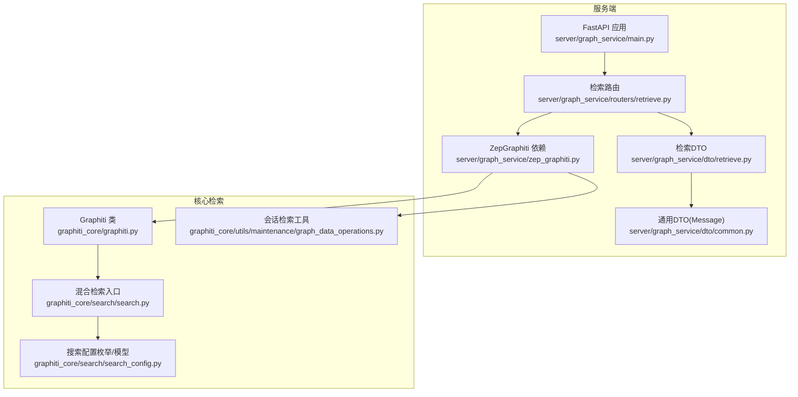
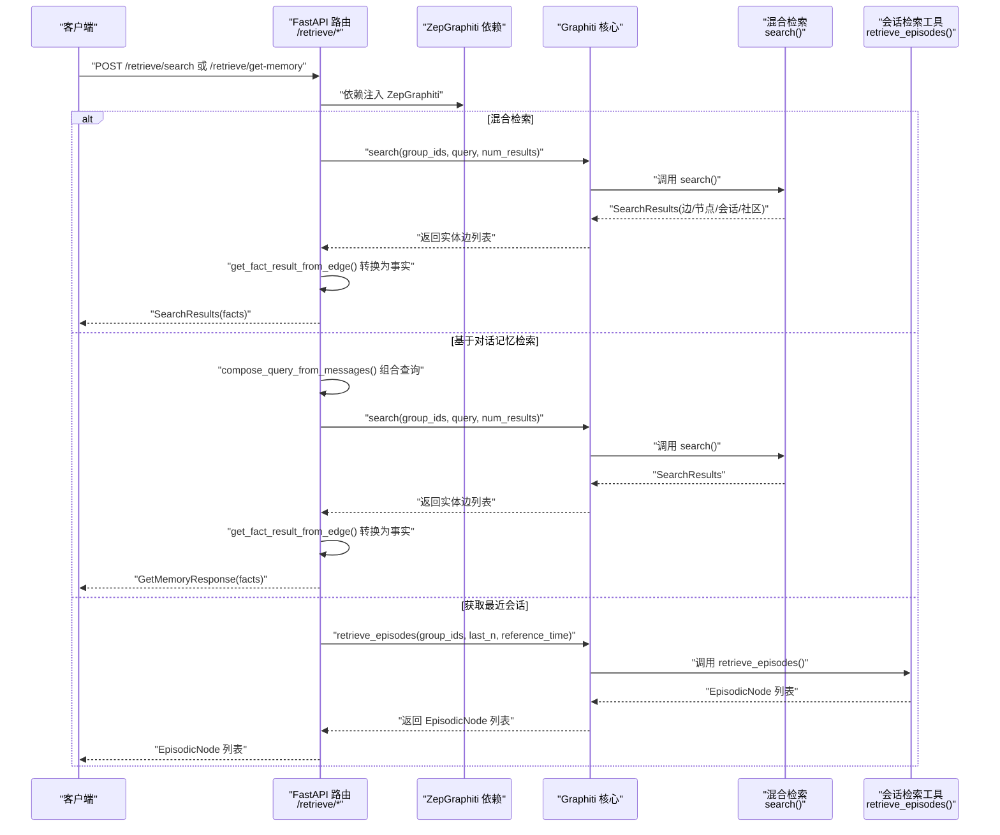
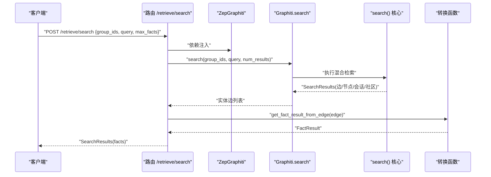
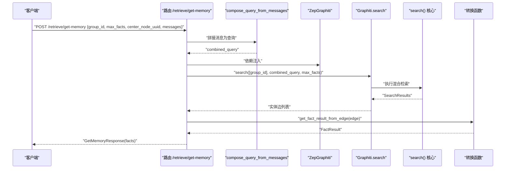
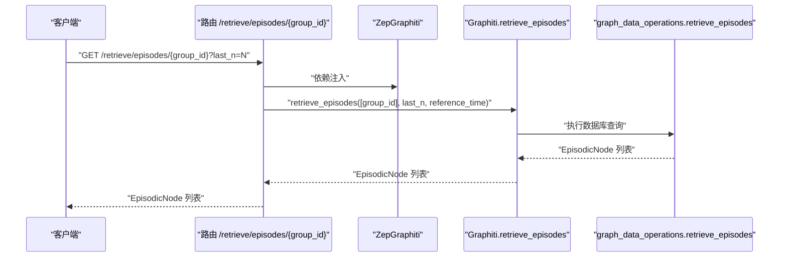
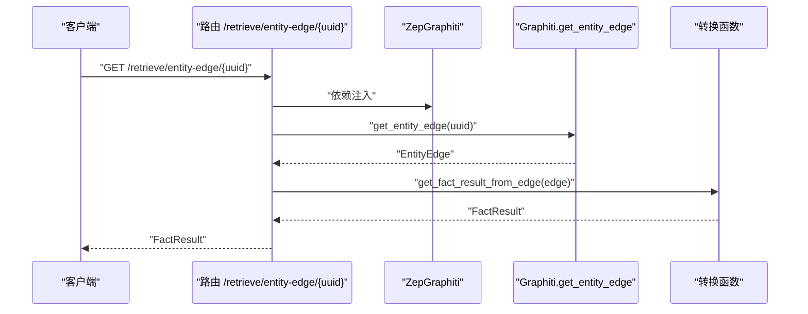
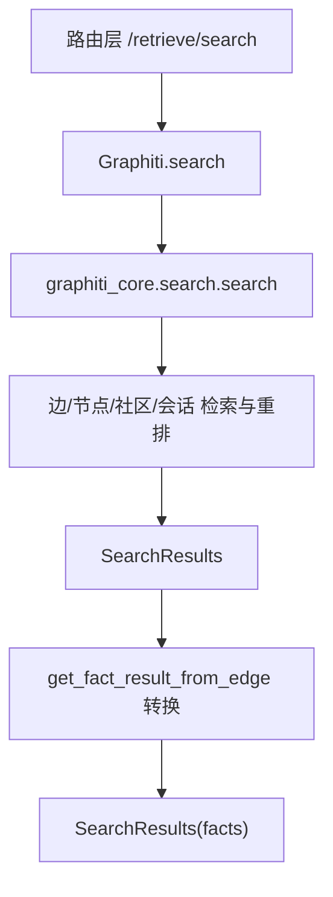
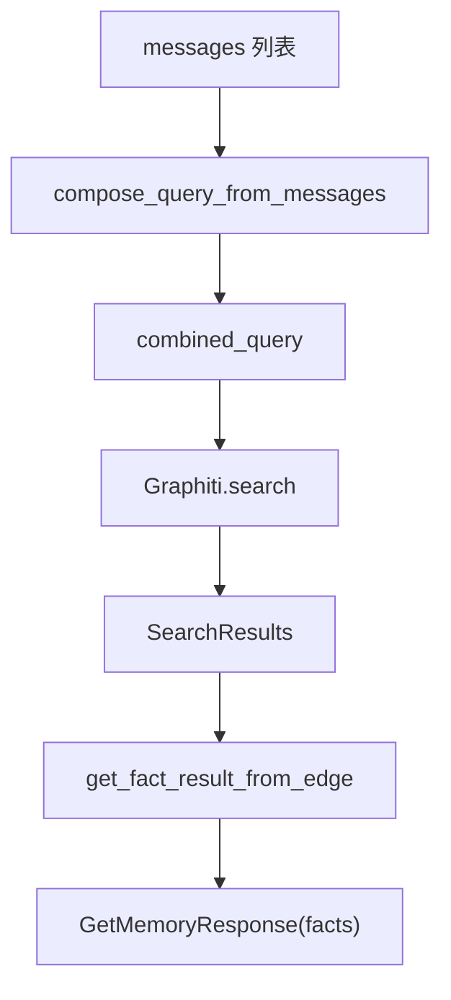
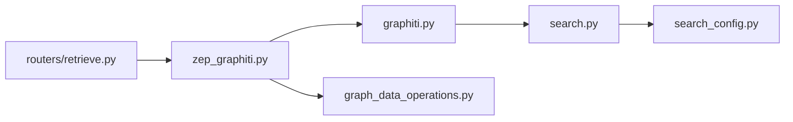

# 数据检索API

<cite>
**本文引用的文件**
- [server/graph_service/routers/retrieve.py](file://server/graph_service/routers/retrieve.py)
- [server/graph_service/dto/retrieve.py](file://server/graph_service/dto/retrieve.py)
- [server/graph_service/dto/common.py](file://server/graph_service/dto/common.py)
- [server/graph_service/zep_graphiti.py](file://server/graph_service/zep_graphiti.py)
- [server/graph_service/main.py](file://server/graph_service/main.py)
- [graphiti_core/search/search.py](file://graphiti_core/search/search.py)
- [graphiti_core/search/search_config.py](file://graphiti_core/search/search_config.py)
- [graphiti_core/graphiti.py](file://graphiti_core/graphiti.py)
- [graphiti_core/utils/maintenance/graph_data_operations.py](file://graphiti_core/utils/maintenance/graph_data_operations.py)
</cite>

## 目录
1. [简介](#简介)
2. [项目结构](#项目结构)
3. [核心组件](#核心组件)
4. [架构总览](#架构总览)
5. [详细组件分析](#详细组件分析)
6. [依赖关系分析](#依赖关系分析)
7. [性能考量](#性能考量)
8. [故障排查指南](#故障排查指南)
9. [结论](#结论)
10. [附录：API使用示例与说明](#附录api使用示例与说明)

## 简介
本文件面向“数据检索API”的开发与使用，聚焦以下端点：
- GET /retrieve/episodes/{group_id}：按组ID获取最近N条会话（EpisodicNode）
- POST /retrieve/search：混合检索（支持边、节点、社区、会话多模态融合）
- POST /retrieve/get-memory：基于对话历史的记忆检索
- GET /retrieve/entity-edge/{uuid}：按UUID获取单个关系（边）详情

同时，文档解释了SearchQuery与SearchResults等Pydantic模型的字段语义，以及search端点如何调用Graphiti核心的混合检索能力并将结果转换为事实（facts）列表；并说明get_memory端点如何通过compose_query_from_messages将对话历史拼接为查询语句。

## 项目结构
服务端采用FastAPI路由组织检索相关接口，DTO层定义请求/响应模型，ZepGraphiti封装Graphiti核心能力并通过依赖注入提供给路由层。核心检索逻辑位于graphiti_core模块中，包含多种搜索方法与重排策略。

图表来源
- [server/graph_service/main.py](file://server/graph_service/main.py#L1-L30)
- [server/graph_service/routers/retrieve.py](file://server/graph_service/routers/retrieve.py#L1-L64)
- [server/graph_service/dto/retrieve.py](file://server/graph_service/dto/retrieve.py#L1-L46)
- [server/graph_service/dto/common.py](file://server/graph_service/dto/common.py#L1-L29)
- [server/graph_service/zep_graphiti.py](file://server/graph_service/zep_graphiti.py#L1-L115)
- [graphiti_core/search/search.py](file://graphiti_core/search/search.py#L1-L180)
- [graphiti_core/search/search_config.py](file://graphiti_core/search/search_config.py#L1-L161)
- [graphiti_core/graphiti.py](file://graphiti_core/graphiti.py#L575-L612)
- [graphiti_core/utils/maintenance/graph_data_operations.py](file://graphiti_core/utils/maintenance/graph_data_operations.py#L60-L119)

章节来源
- [server/graph_service/main.py](file://server/graph_service/main.py#L1-L30)
- [server/graph_service/routers/retrieve.py](file://server/graph_service/routers/retrieve.py#L1-L64)
- [server/graph_service/dto/retrieve.py](file://server/graph_service/dto/retrieve.py#L1-L46)
- [server/graph_service/dto/common.py](file://server/graph_service/dto/common.py#L1-L29)
- [server/graph_service/zep_graphiti.py](file://server/graph_service/zep_graphiti.py#L1-L115)
- [graphiti_core/search/search.py](file://graphiti_core/search/search.py#L1-L180)
- [graphiti_core/search/search_config.py](file://graphiti_core/search/search_config.py#L1-L161)
- [graphiti_core/graphiti.py](file://graphiti_core/graphiti.py#L575-L612)
- [graphiti_core/utils/maintenance/graph_data_operations.py](file://graphiti_core/utils/maintenance/graph_data_operations.py#L60-L119)

## 核心组件
- 检索路由层
  - 提供四个端点：/retrieve/search、/retrieve/get-memory、/retrieve/episodes/{group_id}、/retrieve/entity-edge/{uuid}
  - 使用Pydantic DTO进行请求/响应校验与序列化
- ZepGraphiti依赖
  - 继承Graphiti，提供实体边查询、删除等能力，并将Graphiti实例注入到路由层
  - 提供get_fact_result_from_edge将底层实体边转换为API响应模型
- Graphiti核心
  - 暴露retrieve_episodes方法，委托graph_data_operations实现按时间窗口与分组过滤的会话检索
  - 暴露search方法，作为混合检索入口，支持边/节点/社区/会话四类对象的联合检索与重排
- 搜索配置与重排
  - 定义Edge/Node/Episode/Community的搜索方法与重排器枚举
  - 支持BM25、余弦相似度、广度优先搜索、互信息最大化、交叉编码器重排、RRF等策略

章节来源
- [server/graph_service/routers/retrieve.py](file://server/graph_service/routers/retrieve.py#L1-L64)
- [server/graph_service/zep_graphiti.py](file://server/graph_service/zep_graphiti.py#L1-L115)
- [graphiti_core/graphiti.py](file://graphiti_core/graphiti.py#L575-L612)
- [graphiti_core/search/search.py](file://graphiti_core/search/search.py#L68-L184)
- [graphiti_core/search/search_config.py](file://graphiti_core/search/search_config.py#L32-L161)

## 架构总览
下图展示了从HTTP请求到Graphiti核心检索再到结果返回的整体流程。

图表来源
- [server/graph_service/routers/retrieve.py](file://server/graph_service/routers/retrieve.py#L17-L64)
- [server/graph_service/zep_graphiti.py](file://server/graph_service/zep_graphiti.py#L102-L115)
- [graphiti_core/graphiti.py](file://graphiti_core/graphiti.py#L575-L612)
- [graphiti_core/search/search.py](file://graphiti_core/search/search.py#L68-L184)
- [graphiti_core/utils/maintenance/graph_data_operations.py](file://graphiti_core/utils/maintenance/graph_data_operations.py#L60-L119)

## 详细组件分析

### /retrieve/search（混合检索）
- 请求体：SearchQuery
  - group_ids：可选，用于限定检索范围的分组ID列表
  - query：必填，检索查询文本
  - max_facts：可选，默认值，限制返回的事实数量
- 处理流程
  - 调用Graphiti.search，传入group_ids、query、num_results=max_facts
  - 将返回的实体边列表逐条转换为事实（FactResult），封装为SearchResults
- 返回体：SearchResults
  - facts：事实列表，每个事实包含uuid、name、fact、valid_at、invalid_at、created_at、expired_at等字段

图表来源
- [server/graph_service/routers/retrieve.py](file://server/graph_service/routers/retrieve.py#L17-L27)
- [server/graph_service/zep_graphiti.py](file://server/graph_service/zep_graphiti.py#L102-L115)
- [graphiti_core/search/search.py](file://graphiti_core/search/search.py#L68-L184)

章节来源
- [server/graph_service/routers/retrieve.py](file://server/graph_service/routers/retrieve.py#L17-L27)
- [server/graph_service/dto/retrieve.py](file://server/graph_service/dto/retrieve.py#L8-L14)
- [server/graph_service/dto/retrieve.py](file://server/graph_service/dto/retrieve.py#L29-L31)
- [server/graph_service/zep_graphiti.py](file://server/graph_service/zep_graphiti.py#L102-L115)
- [graphiti_core/search/search.py](file://graphiti_core/search/search.py#L68-L184)

### /retrieve/get-memory（基于对话记忆检索）
- 请求体：GetMemoryRequest
  - group_id：必填，记忆所属分组ID
  - max_facts：可选，默认值，限制返回的事实数量
  - center_node_uuid：必填，检索中心节点UUID
  - messages：必填，对话消息列表，用于构建查询
- 处理流程
  - 使用compose_query_from_messages将messages拼接为查询字符串
  - 调用Graphiti.search，传入group_ids=[group_id]、query=拼接后的查询、num_results=max_facts
  - 将返回的实体边列表转换为事实（FactResult），封装为GetMemoryResponse
- 返回体：GetMemoryResponse
  - facts：事实列表

图表来源
- [server/graph_service/routers/retrieve.py](file://server/graph_service/routers/retrieve.py#L44-L56)
- [server/graph_service/routers/retrieve.py](file://server/graph_service/routers/retrieve.py#L59-L64)
- [server/graph_service/zep_graphiti.py](file://server/graph_service/zep_graphiti.py#L102-L115)
- [graphiti_core/search/search.py](file://graphiti_core/search/search.py#L68-L184)

章节来源
- [server/graph_service/routers/retrieve.py](file://server/graph_service/routers/retrieve.py#L44-L56)
- [server/graph_service/routers/retrieve.py](file://server/graph_service/routers/retrieve.py#L59-L64)
- [server/graph_service/dto/retrieve.py](file://server/graph_service/dto/retrieve.py#L33-L42)
- [server/graph_service/dto/retrieve.py](file://server/graph_service/dto/retrieve.py#L44-L46)
- [server/graph_service/dto/common.py](file://server/graph_service/dto/common.py#L13-L29)
- [server/graph_service/zep_graphiti.py](file://server/graph_service/zep_graphiti.py#L102-L115)
- [graphiti_core/search/search.py](file://graphiti_core/search/search.py#L68-L184)

### /retrieve/episodes/{group_id}（获取最近会话）
- 路径参数：group_id
- 查询参数：last_n（默认值由后端控制）
- 处理流程
  - 调用Graphiti.retrieve_episodes，传入group_ids=[group_id]、last_n、reference_time=当前UTC时间
  - 实际检索由graph_data_operations.retrieve_episodes完成，按valid_at倒序取前N条
- 返回体：EpisodicNode列表（按时间顺序排列）

图表来源
- [server/graph_service/routers/retrieve.py](file://server/graph_service/routers/retrieve.py#L36-L41)
- [graphiti_core/graphiti.py](file://graphiti_core/graphiti.py#L575-L612)
- [graphiti_core/utils/maintenance/graph_data_operations.py](file://graphiti_core/utils/maintenance/graph_data_operations.py#L60-L119)

章节来源
- [server/graph_service/routers/retrieve.py](file://server/graph_service/routers/retrieve.py#L36-L41)
- [graphiti_core/graphiti.py](file://graphiti_core/graphiti.py#L575-L612)
- [graphiti_core/utils/maintenance/graph_data_operations.py](file://graphiti_core/utils/maintenance/graph_data_operations.py#L60-L119)

### /retrieve/entity-edge/{uuid}（按UUID获取单个关系详情）
- 路径参数：uuid
- 处理流程
  - 调用Graphiti.get_entity_edge，按UUID查询实体边
  - 将实体边转换为事实（FactResult）返回
- 返回体：单个事实（FactResult）

图表来源
- [server/graph_service/routers/retrieve.py](file://server/graph_service/routers/retrieve.py#L30-L33)
- [server/graph_service/zep_graphiti.py](file://server/graph_service/zep_graphiti.py#L32-L38)
- [server/graph_service/zep_graphiti.py](file://server/graph_service/zep_graphiti.py#L102-L115)

章节来源
- [server/graph_service/routers/retrieve.py](file://server/graph_service/routers/retrieve.py#L30-L33)
- [server/graph_service/zep_graphiti.py](file://server/graph_service/zep_graphiti.py#L32-L38)
- [server/graph_service/zep_graphiti.py](file://server/graph_service/zep_graphiti.py#L102-L115)

### SearchQuery 与 SearchResults 模型
- SearchQuery
  - group_ids：可选，限定检索分组
  - query：必填，检索查询文本
  - max_facts：可选，默认值，限制返回事实数量
- SearchResults
  - facts：事实列表，每个事实包含uuid、name、fact、valid_at、invalid_at、created_at、expired_at等字段
- GetMemoryRequest/GetMemoryResponse
  - GetMemoryRequest：group_id、max_facts、center_node_uuid、messages
  - GetMemoryResponse：facts

章节来源
- [server/graph_service/dto/retrieve.py](file://server/graph_service/dto/retrieve.py#L8-L14)
- [server/graph_service/dto/retrieve.py](file://server/graph_service/dto/retrieve.py#L29-L31)
- [server/graph_service/dto/retrieve.py](file://server/graph_service/dto/retrieve.py#L33-L42)
- [server/graph_service/dto/retrieve.py](file://server/graph_service/dto/retrieve.py#L44-L46)
- [server/graph_service/dto/common.py](file://server/graph_service/dto/common.py#L13-L29)

### search 端点如何调用Graphiti核心的混合检索
- 路由层直接调用Graphiti.search，传入group_ids、query、num_results
- Graphiti.search内部委托graphiti_core.search.search，执行边/节点/社区/会话的联合检索与重排
- 最终返回SearchResults，路由层将其转换为事实列表

图表来源
- [server/graph_service/routers/retrieve.py](file://server/graph_service/routers/retrieve.py#L17-L27)
- [graphiti_core/search/search.py](file://graphiti_core/search/search.py#L68-L184)
- [server/graph_service/zep_graphiti.py](file://server/graph_service/zep_graphiti.py#L102-L115)

章节来源
- [server/graph_service/routers/retrieve.py](file://server/graph_service/routers/retrieve.py#L17-L27)
- [graphiti_core/search/search.py](file://graphiti_core/search/search.py#L68-L184)
- [server/graph_service/zep_graphiti.py](file://server/graph_service/zep_graphiti.py#L102-L115)

### get_memory 如何将对话历史组合为查询
- compose_query_from_messages遍历消息列表，按“角色类型(角色名): 内容”格式拼接
- 将拼接后的查询传入Graphiti.search，得到检索结果并转换为事实

图表来源
- [server/graph_service/routers/retrieve.py](file://server/graph_service/routers/retrieve.py#L44-L56)
- [server/graph_service/routers/retrieve.py](file://server/graph_service/routers/retrieve.py#L59-L64)
- [server/graph_service/zep_graphiti.py](file://server/graph_service/zep_graphiti.py#L102-L115)

章节来源
- [server/graph_service/routers/retrieve.py](file://server/graph_service/routers/retrieve.py#L44-L56)
- [server/graph_service/routers/retrieve.py](file://server/graph_service/routers/retrieve.py#L59-L64)
- [server/graph_service/zep_graphiti.py](file://server/graph_service/zep_graphiti.py#L102-L115)

## 依赖关系分析
- 路由层依赖ZepGraphiti，后者继承Graphiti，提供数据库驱动与LLM客户端
- Graphiti.search委托graphiti_core.search.search，后者实现多类对象的联合检索与重排
- retrieve_episodes委托graphiti_core.utils.maintenance.graph_data_operations.retrieve_episodes
- 路由层通过get_fact_result_from_edge统一将底层实体边转换为API响应模型

图表来源
- [server/graph_service/routers/retrieve.py](file://server/graph_service/routers/retrieve.py#L1-L64)
- [server/graph_service/zep_graphiti.py](file://server/graph_service/zep_graphiti.py#L1-L115)
- [graphiti_core/graphiti.py](file://graphiti_core/graphiti.py#L575-L612)
- [graphiti_core/search/search.py](file://graphiti_core/search/search.py#L68-L184)
- [graphiti_core/search/search_config.py](file://graphiti_core/search/search_config.py#L1-L161)
- [graphiti_core/utils/maintenance/graph_data_operations.py](file://graphiti_core/utils/maintenance/graph_data_operations.py#L60-L119)

章节来源
- [server/graph_service/routers/retrieve.py](file://server/graph_service/routers/retrieve.py#L1-L64)
- [server/graph_service/zep_graphiti.py](file://server/graph_service/zep_graphiti.py#L1-L115)
- [graphiti_core/graphiti.py](file://graphiti_core/graphiti.py#L575-L612)
- [graphiti_core/search/search.py](file://graphiti_core/search/search.py#L68-L184)
- [graphiti_core/search/search_config.py](file://graphiti_core/search/search_config.py#L1-L161)
- [graphiti_core/utils/maintenance/graph_data_operations.py](file://graphiti_core/utils/maintenance/graph_data_operations.py#L60-L119)

## 性能考量
- 并发与限流
  - 混合检索内部使用并发gather以并行执行不同类型的搜索任务，提升整体吞吐
- 重排策略
  - 支持RRF、MMR、交叉编码器重排等多种策略，合理选择可平衡召回与重排质量
- 向量化与相似度
  - 当启用余弦相似度时，会预先计算查询向量，减少重复计算
- 分组过滤
  - group_ids为空时会被置为None，避免无效过滤带来的额外开销

章节来源
- [graphiti_core/search/search.py](file://graphiti_core/search/search.py#L111-L113)
- [graphiti_core/search/search.py](file://graphiti_core/search/search.py#L103-L110)
- [graphiti_core/search/search.py](file://graphiti_core/search/search.py#L186-L206)

## 故障排查指南
- 404错误（实体边不存在）
  - get_entity_edge在找不到对应实体边时抛出HTTP 404
- 无结果
  - query为空或group_ids不匹配会导致返回空结果
- 中心节点缺失
  - 某些重排器（如节点距离重排）要求提供center_node_uuid，否则会抛出异常

章节来源
- [server/graph_service/zep_graphiti.py](file://server/graph_service/zep_graphiti.py#L32-L38)
- [graphiti_core/search/search.py](file://graphiti_core/search/search.py#L85-L87)
- [graphiti_core/search/search.py](file://graphiti_core/search/search.py#L277-L280)

## 结论
本文档系统梳理了Graphiti服务端的数据检索API，明确了各端点的职责、输入输出模型、核心处理流程与依赖关系。通过将Graphiti的核心混合检索能力与FastAPI路由层结合，实现了灵活、可扩展的检索服务。建议在生产环境中根据业务场景选择合适的搜索与重排策略，并合理设置max_facts与group_ids以获得最佳性能与准确性。

## 附录：API使用示例与说明
- curl 示例（执行搜索）
  - POST /retrieve/search
  - 请求体字段：group_ids（可选）、query（必填）、max_facts（可选）
  - 响应体：SearchResults(facts)
- curl 示例（获取特定组的最近N条会话）
  - GET /retrieve/episodes/{group_id}?last_n=N
  - 响应体：EpisodicNode列表
- curl 示例（基于对话历史的记忆检索）
  - POST /retrieve/get-memory
  - 请求体字段：group_id（必填）、max_facts（可选）、center_node_uuid（必填）、messages（必填）
  - 响应体：GetMemoryResponse(facts)
- curl 示例（按UUID获取单个关系详情）
  - GET /retrieve/entity-edge/{uuid}
  - 响应体：单个事实（FactResult）

章节来源
- [server/graph_service/routers/retrieve.py](file://server/graph_service/routers/retrieve.py#L17-L27)
- [server/graph_service/routers/retrieve.py](file://server/graph_service/routers/retrieve.py#L36-L41)
- [server/graph_service/routers/retrieve.py](file://server/graph_service/routers/retrieve.py#L44-L56)
- [server/graph_service/routers/retrieve.py](file://server/graph_service/routers/retrieve.py#L30-L33)
- [server/graph_service/dto/retrieve.py](file://server/graph_service/dto/retrieve.py#L8-L14)
- [server/graph_service/dto/retrieve.py](file://server/graph_service/dto/retrieve.py#L29-L31)
- [server/graph_service/dto/retrieve.py](file://server/graph_service/dto/retrieve.py#L33-L42)
- [server/graph_service/dto/retrieve.py](file://server/graph_service/dto/retrieve.py#L44-L46)
- [server/graph_service/dto/common.py](file://server/graph_service/dto/common.py#L13-L29)