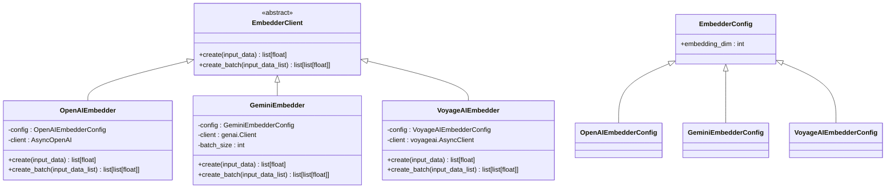
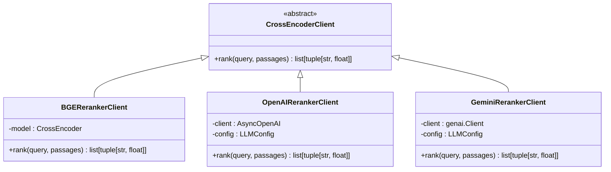
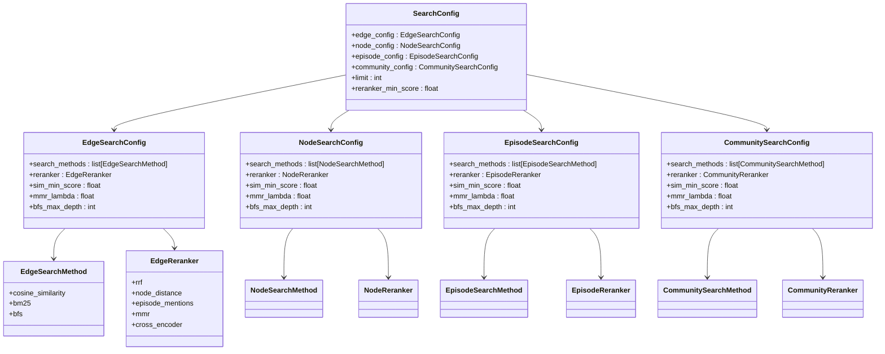

# 嵌入与重排序

<cite>
**本文档中引用的文件**  
- [client.py](file://graphiti_core/embedder/client.py)
- [openai.py](file://graphiti_core/embedder/openai.py)
- [gemini.py](file://graphiti_core/embedder/gemini.py)
- [voyage.py](file://graphiti_core/embedder/voyage.py)
- [client.py](file://graphiti_core/cross_encoder/client.py)
- [bge_reranker_client.py](file://graphiti_core/cross_encoder/bge_reranker_client.py)
- [openai_reranker_client.py](file://graphiti_core/cross_encoder/openai_reranker_client.py)
- [gemini_reranker_client.py](file://graphiti_core/cross_encoder/gemini_reranker_client.py)
- [search.py](file://graphiti_core/search/search.py)
- [search_config.py](file://graphiti_core/search/search_config.py)
</cite>

## 目录
1. [简介](#简介)
2. [嵌入生成](#嵌入生成)
3. [重排序机制](#重排序机制)
4. [配置与优化](#配置与优化)
5. [性能基准与建议](#性能基准与建议)

## 简介

本文档深入探讨了Graphiti系统中嵌入生成与结果重排序的技术实现。系统通过集成多个AI提供商（OpenAI、Gemini、VoyageAI）的API来生成文本向量，并利用CrossEncoder对初步检索结果进行精排序，以提升搜索相关性。文档详细说明了各组件的工作原理、配置选项和性能特点，为开发者提供全面的技术指导。

## 嵌入生成

### Embedder组件架构

Embedder组件是系统的核心，负责调用不同AI提供商的API生成文本向量。该组件采用抽象基类设计模式，定义了统一的接口，使得不同提供商的实现可以无缝替换。



**图示来源**
- [client.py](file://graphiti_core/embedder/client.py#L30-L39)
- [openai.py](file://graphiti_core/embedder/openai.py#L33-L67)
- [gemini.py](file://graphiti_core/embedder/gemini.py#L50-L184)
- [voyage.py](file://graphiti_core/embedder/voyage.py#L43-L77)

### OpenAI嵌入实现

OpenAIEmbedder实现了对OpenAI和Azure OpenAI服务的调用。该实现支持异步操作，能够高效处理单个或批量的嵌入请求。

```python
async def create(self, input_data: str | list[str] | Iterable[int] | Iterable[Iterable[int]]) -> list[float]:
    result = await self.client.embeddings.create(
        input=input_data, model=self.config.embedding_model
    )
    return result.data[0].embedding[: self.config.embedding_dim]
```

该实现的关键特性包括：
- 使用`text-embedding-3-small`作为默认嵌入模型
- 支持通过配置自定义API密钥、基础URL和嵌入模型
- 自动截取指定维度的嵌入向量

**节来源**
- [openai.py](file://graphiti_core/embedder/openai.py#L54-L67)

### Gemini嵌入实现

GeminiEmbedder提供了对Google Gemini服务的集成。该实现特别处理了Gemini API的批量限制，确保在不同模型下的兼容性。

```python
async def create_batch(self, input_data_list: list[str]) -> list[list[float]]:
    if not input_data_list:
        return []
        
    batch_size = self.batch_size
    all_embeddings = []
    
    # Process inputs in batches
    for i in range(0, len(input_data_list), batch_size):
        batch = input_data_list[i : i + batch_size]
        
        try:
            result = await self.client.aio.models.embed_content(
                model=self.config.embedding_model or DEFAULT_EMBEDDING_MODEL,
                contents=batch,
                config=types.EmbedContentConfig(
                    output_dimensionality=self.config.embedding_dim
                ),
            )
            
            # Process embeddings from this batch
            for embedding in result.embeddings:
                if not embedding.values:
                    raise ValueError('Empty embedding values returned')
                all_embeddings.append(embedding.values)
                
        except Exception as e:
            # If batch processing fails, fall back to individual processing
            logger.warning(f'Batch embedding failed... falling back to individual processing: {e}')
            # ... individual processing logic
```

该实现的关键特性包括：
- 根据模型自动调整批量大小（`gemini-embedding-001`为1，其他为100）
- 实现了批量处理失败时的优雅降级机制
- 支持输出维度的动态配置

**节来源**
- [gemini.py](file://graphiti_core/embedder/gemini.py#L113-L184)

### VoyageAI嵌入实现

VoyageAIEmbedder集成了VoyageAI服务，提供了高性能的嵌入生成能力。

```python
async def create_batch(self, input_data_list: list[str]) -> list[list[float]]:
    result = await self.client.embed(input_data_list, model=self.config.embedding_model)
    return [
        [float(x) for x in embedding[: self.config.embedding_dim]]
        for embedding in result.embeddings
    ]
```

该实现的关键特性包括：
- 使用`voyage-3`作为默认嵌入模型
- 简洁高效的批量处理接口
- 自动处理数据类型转换

**节来源**
- [voyage.py](file://graphiti_core/embedder/voyage.py#L71-L77)

## 重排序机制

### CrossEncoder架构

CrossEncoder组件负责对初步检索结果进行精排序，以提升搜索结果的相关性。该组件同样采用抽象基类设计，支持多种重排序模型的实现。



**图示来源**
- [client.py](file://graphiti_core/cross_encoder/client.py#L20-L41)
- [bge_reranker_client.py](file://graphiti_core/cross_encoder/bge_reranker_client.py#L34-L55)
- [openai_reranker_client.py](file://graphiti_core/cross_encoder/openai_reranker_client.py#L34-L124)
- [gemini_reranker_client.py](file://graphiti_core/cross_encoder/gemini_reranker_client.py#L43-L162)

### BAAI/bge-reranker模型

BGERerankerClient实现了对BAAI/bge-reranker-v2-m3模型的集成，这是一个专门用于重排序的交叉编码器模型。

```python
async def rank(self, query: str, passages: list[str]) -> list[tuple[str, float]]:
    if not passages:
        return []

    input_pairs = [[query, passage] for passage in passages]

    # Run the synchronous predict method in an executor
    loop = asyncio.get_running_loop()
    scores = await loop.run_in_executor(None, self.model.predict, input_pairs)

    ranked_passages = sorted(
        [(passage, float(score)) for passage, score in zip(passages, scores, strict=False)],
        key=lambda x: x[1],
        reverse=True,
    )

    return ranked_passages
```

该实现的关键特性包括：
- 使用`BAAI/bge-reranker-v2-m3`作为默认模型
- 在异步事件循环中执行同步预测方法
- 返回按相关性分数降序排列的结果

**节来源**
- [bge_reranker_client.py](file://graphiti_core/cross_encoder/bge_reranker_client.py#L38-L55)

### OpenAI重排序实现

OpenAIRerankerClient利用OpenAI的API进行重排序，通过一个简单的布尔分类器提示来评估段落的相关性。

```python
async def rank(self, query: str, passages: list[str]) -> list[tuple[str, float]]:
    openai_messages_list: Any = [
        [
            Message(
                role='system',
                content='You are an expert tasked with determining whether the passage is relevant to the query',
            ),
            Message(
                role='user',
                content=f"""
                       Respond with "True" if PASSAGE is relevant to QUERY and "False" otherwise.
                       <PASSAGE>
                       {passage}
                       </PASSAGE>
                       <QUERY>
                       {query}
                       </QUERY>
                       """,
            ),
        ]
        for passage in passages
    ]
    
    responses = await semaphore_gather(
        *[
            self.client.chat.completions.create(
                model=self.config.model or DEFAULT_MODEL,
                messages=openai_messages,
                temperature=0,
                max_tokens=1,
                logit_bias={'6432': 1, '7983': 1},
                logprobs=True,
                top_logprobs=2,
            )
            for openai_messages in openai_messages_list
        ]
    )
    
    # Process logprobs to generate scores
    responses_top_logprobs = [
        response.choices[0].logprobs.content[0].top_logprobs
        if response.choices[0].logprobs is not None
        and response.choices[0].logprobs.content is not None
        else []
        for response in responses
    ]
    
    scores: list[float] = []
    for top_logprobs in responses_top_logprobs:
        if len(top_logprobs) == 0:
            continue
        norm_logprobs = np.exp(top_logprobs[0].logprob)
        if top_logprobs[0].token.strip().split(' ')[0].lower() == 'true':
            scores.append(norm_logprobs)
        else:
            scores.append(1 - norm_logprobs)
            
    results = [(passage, score) for passage, score in zip(passages, scores, strict=True)]
    results.sort(reverse=True, key=lambda x: x[1])
    return results
```

该实现的关键特性包括：
- 使用log-probabilities来量化相关性
- 通过logit bias确保模型输出"True"或"False"
- 利用归一化对数概率计算最终分数

**节来源**
- [openai_reranker_client.py](file://graphiti_core/cross_encoder/openai_reranker_client.py#L61-L119)

### Gemini重排序实现

GeminiRerankerClient使用Gemini API直接对段落进行相关性评分，每个段落被单独评分并归一化到[0,1]范围。

```python
async def rank(self, query: str, passages: list[str]) -> list[tuple[str, float]]:
    if len(passages) <= 1:
        return [(passage, 1.0) for passage in passages]

    # Generate scoring prompts for each passage
    scoring_prompts = []
    for passage in passages:
        prompt = f"""Rate how well this passage answers or relates to the query. Use a scale from 0 to 100.

Query: {query}

Passage: {passage}

Provide only a number between 0 and 100 (no explanation, just the number):"""

        scoring_prompts.append(
            [
                types.Content(
                    role='user',
                    parts=[types.Part.from_text(text=prompt)],
                ),
            ]
        )

    # Execute all scoring requests concurrently
    responses = await semaphore_gather(
        *[
            self.client.aio.models.generate_content(
                model=self.config.model or DEFAULT_MODEL,
                contents=prompt_messages,
                config=types.GenerateContentConfig(
                    system_instruction='You are an expert at rating passage relevance. Respond with only a number from 0-100.',
                    temperature=0.0,
                    max_output_tokens=3,
                ),
            )
            for prompt_messages in scoring_prompts
        ]
    )

    # Extract scores and create results
    results = []
    for passage, response in zip(passages, responses, strict=True):
        try:
            if hasattr(response, 'text') and response.text:
                score_text = response.text.strip()
                score_match = re.search(r'\b(\d{1,3})\b', score_text)
                if score_match:
                    score = float(score_match.group(1))
                    normalized_score = max(0.0, min(1.0, score / 100.0))
                    results.append((passage, normalized_score))
                else:
                    logger.warning(f'Could not extract numeric score from response: {score_text}')
                    results.append((passage, 0.0))
            else:
                logger.warning('Empty response from Gemini for passage scoring')
                results.append((passage, 0.0))
        except (ValueError, AttributeError) as e:
            logger.warning(f'Error parsing score from Gemini response: {e}')
            results.append((passage, 0.0))

    # Sort by score in descending order
    results.sort(reverse=True, key=lambda x: x[1])
    return results
```

该实现的关键特性包括：
- 每个段落独立评分，范围为0-100
- 结果归一化到[0,1]范围
- 强大的错误处理和日志记录机制

**节来源**
- [gemini_reranker_client.py](file://graphiti_core/cross_encoder/gemini_reranker_client.py#L73-L147)

## 配置与优化

### 搜索配置

系统通过SearchConfig类提供灵活的搜索配置选项，支持对不同类型的搜索结果进行精细化控制。



**图示来源**
- [search_config.py](file://graphiti_core/search/search_config.py#L112-L161)

### 嵌入维度与相似度算法

系统使用余弦距离作为主要的相似度算法来计算向量之间的相似性。

```python
def calculate_cosine_similarity(vector1: list[float], vector2: list[float]) -> float:
    """
    计算两个向量之间的余弦相似度。
    """
    dot_product = np.dot(vector1, vector2)
    norm_vector1 = np.linalg.norm(vector1)
    norm_vector2 = np.linalg.norm(vector2)

    if norm_vector1 == 0 or norm_vector2 == 0:
        return 0  # 处理零向量的情况

    return dot_product / (norm_vector1 * norm_vector2)
```

系统默认的嵌入维度为1024，可通过环境变量`EMBEDDING_DIM`进行配置。

**节来源**
- [search_utils.py](file://graphiti_core/search/search_utils.py#L70-L82)
- [client.py](file://graphiti_core/embedder/client.py#L23)

### 缓存策略

虽然代码中没有显式的缓存实现，但系统通过以下方式优化性能：
- 使用`semaphore_gather`并发执行多个搜索任务
- 对嵌入向量进行预计算和批量处理
- 在重排序过程中复用已计算的嵌入向量

## 性能基准与建议

### 模型选择建议

根据不同的使用场景，建议选择不同的嵌入和重排序模型：

| 场景 | 推荐嵌入模型 | 推荐重排序模型 | 理由 |
|------|-------------|---------------|------|
| 高精度搜索 | OpenAI text-embedding-3-small | BAAI/bge-reranker-v2-m3 | 平衡精度和性能 |
| 成本敏感应用 | VoyageAI voyage-3 | OpenAI gpt-4.1-nano | 较低的API调用成本 |
| Google生态系统集成 | Gemini text-embedding-001 | Gemini gemini-2.5-flash-lite | 与Google服务无缝集成 |

### 性能优化建议

1. **批量处理**：尽可能使用`create_batch`方法而不是多次调用`create`，以减少API调用开销
2. **并发执行**：利用系统的异步特性，并发执行多个搜索和重排序任务
3. **缓存策略**：在应用层实现嵌入向量的缓存，避免重复计算
4. **参数调优**：根据具体场景调整`mmr_lambda`、`sim_min_score`等参数，优化搜索结果质量

### 性能基准测试

虽然具体的性能数据未在代码中提供，但可以根据模型特性进行推断：

- **BAAI/bge-reranker**：本地运行，延迟低，适合高吞吐量场景
- **OpenAI重排序**：依赖网络调用，但利用log-probabilities提供精确的相关性评估
- **Gemini重排序**：直接评分机制，适合需要明确评分的场景

建议在实际部署环境中进行基准测试，以确定最适合特定用例的配置组合。