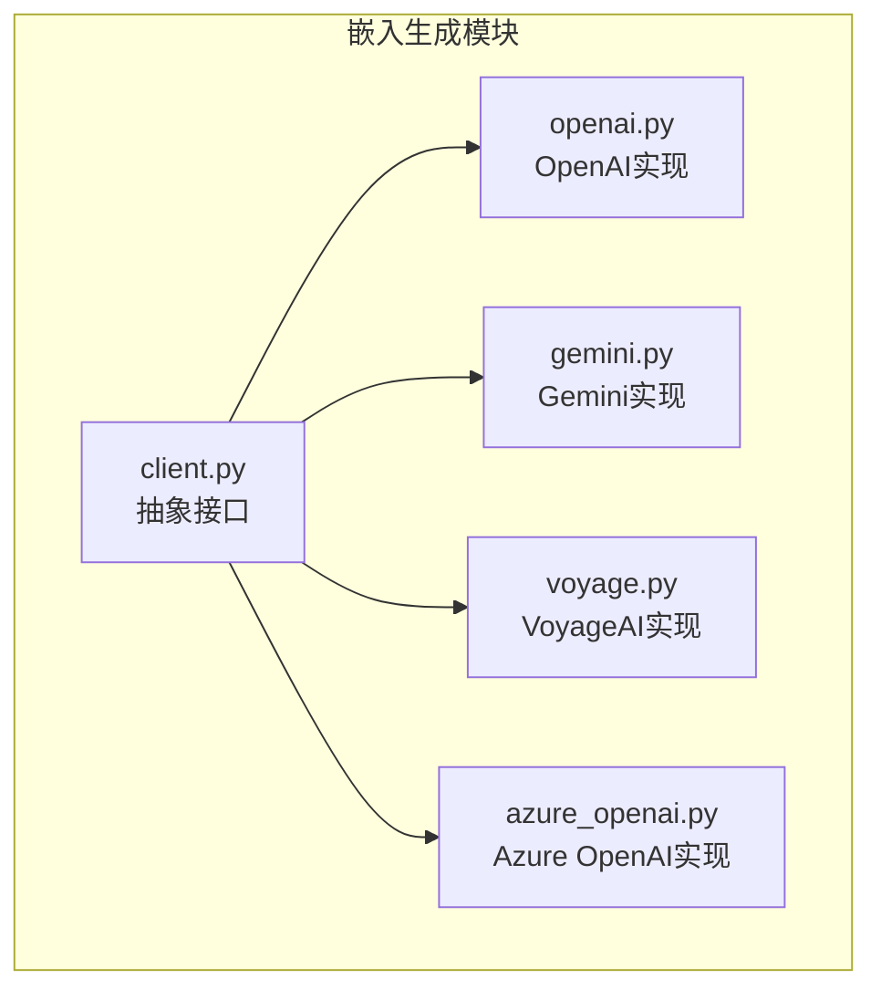
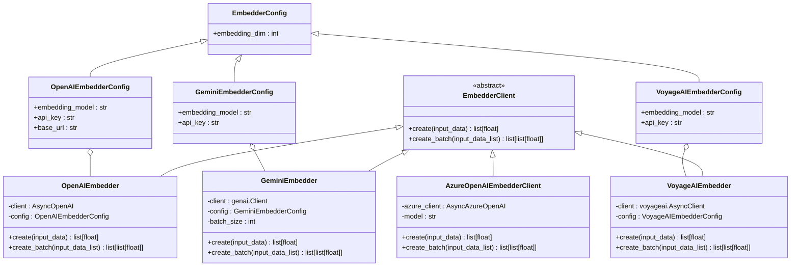
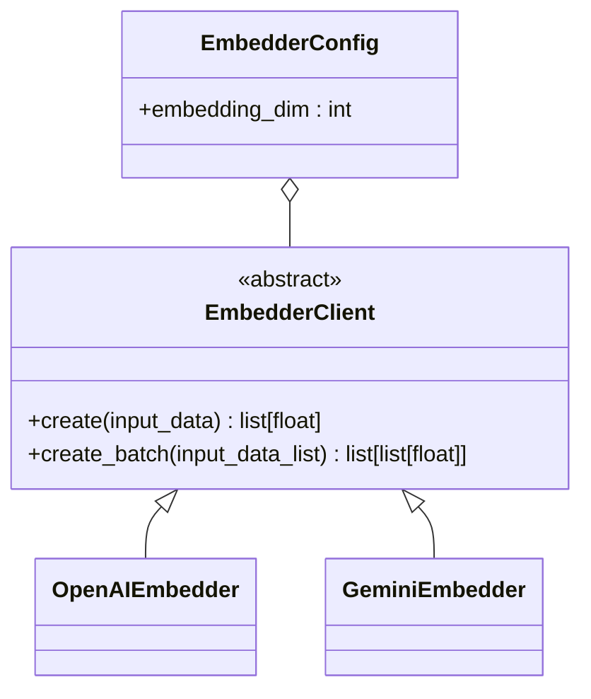
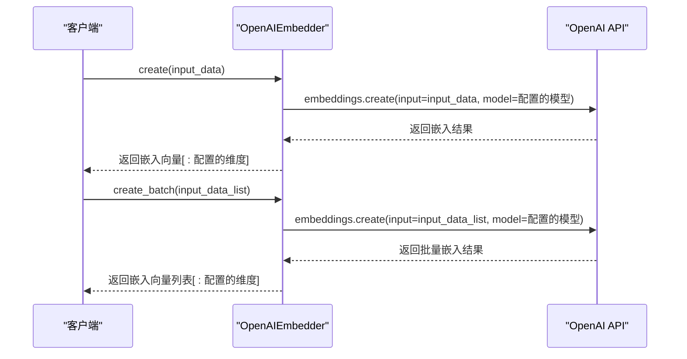
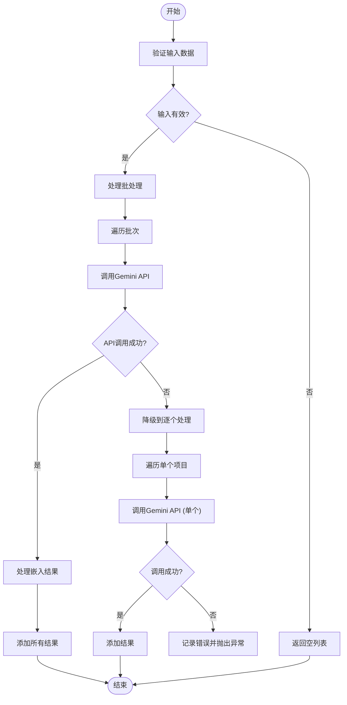
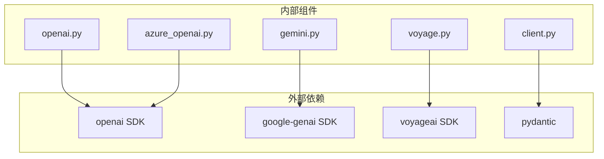

# 嵌入生成

<cite>
**本文档中引用的文件**   
- [client.py](file://graphiti_core/embedder/client.py)
- [openai.py](file://graphiti_core/embedder/openai.py)
- [gemini.py](file://graphiti_core/embedder/gemini.py)
- [voyage.py](file://graphiti_core/embedder/voyage.py)
- [azure_openai.py](file://graphiti_core/embedder/azure_openai.py)
- [test_openai.py](file://tests/embedder/test_openai.py)
- [test_gemini.py](file://tests/embedder/test_gemini.py)
- [test_voyage.py](file://tests/embedder/test_voyage.py)
- [azure_openai_neo4j.py](file://examples/azure-openai/azure_openai_neo4j.py)
- [quickstart_neo4j.py](file://examples/quickstart/quickstart_neo4j.py)
</cite>

## 目录
1. [简介](#简介)
2. [项目结构](#项目结构)
3. [核心组件](#核心组件)
4. [架构概述](#架构概述)
5. [详细组件分析](#详细组件分析)
6. [依赖分析](#依赖分析)
7. [性能考虑](#性能考虑)
8. [故障排除指南](#故障排除指南)
9. [结论](#结论)

## 简介
本文档全面介绍了Graphiti框架中的嵌入生成模块，重点分析了Embedder组件的实现。文档详细说明了如何通过OpenAI、Gemini、VoyageAI和Azure OpenAI等LLM提供商生成高质量文本向量，涵盖了各嵌入模型的API调用机制、输入输出格式、错误处理与重试策略。解释了Embedder抽象接口的设计原理及其与不同提供商的适配方式。提供了配置嵌入维度、批处理大小和缓存策略的实践指南。结合代码示例展示了如何在知识图谱构建流程中集成嵌入生成。对比了不同嵌入模型在语义质量、延迟和成本方面的权衡，给出了选型建议。包含了性能基准测试方法与优化技巧，如异步批量处理和向量缓存。

## 项目结构
Graphiti框架的嵌入生成模块位于`graphiti_core/embedder/`目录下，采用模块化设计，支持多种LLM提供商。该模块通过抽象接口实现统一的嵌入生成API，同时为每个提供商提供具体的实现类。这种设计使得系统能够灵活地集成不同的嵌入服务，而无需修改核心业务逻辑。

**图示来源**
- [client.py](file://graphiti_core/embedder/client.py)
- [openai.py](file://graphiti_core/embedder/openai.py)
- [gemini.py](file://graphiti_core/embedder/gemini.py)
- [voyage.py](file://graphiti_core/embedder/voyage.py)
- [azure_openai.py](file://graphiti_core/embedder/azure_openai.py)

## 核心组件
嵌入生成模块的核心组件包括抽象的`EmbedderClient`接口和针对不同提供商的具体实现类。`EmbedderClient`定义了统一的API，包括`create`和`create_batch`方法，用于生成单个或批量文本的嵌入向量。每个具体实现类都遵循这一接口，确保了API的一致性。模块还包含了配置类，用于管理嵌入模型的参数，如模型名称、API密钥和嵌入维度。

**节来源**
- [client.py](file://graphiti_core/embedder/client.py)
- [openai.py](file://graphiti_core/embedder/openai.py)
- [gemini.py](file://graphiti_core/embedder/gemini.py)
- [voyage.py](file://graphiti_core/embedder/voyage.py)

## 架构概述
嵌入生成模块采用面向接口的编程模式，通过`EmbedderClient`抽象基类定义了统一的嵌入生成API。具体实现类如`OpenAIEmbedder`、`GeminiEmbedder`等实现了该接口，封装了与各LLM提供商的API交互细节。这种设计实现了关注点分离，使得上层应用无需关心底层提供商的具体实现。模块支持异步操作，能够高效处理大量文本的嵌入生成请求。

**图示来源**
- [client.py](file://graphiti_core/embedder/client.py)
- [openai.py](file://graphiti_core/embedder/openai.py)
- [gemini.py](file://graphiti_core/embedder/gemini.py)
- [voyage.py](file://graphiti_core/embedder/voyage.py)
- [azure_openai.py](file://graphiti_core/embedder/azure_openai.py)

## 详细组件分析
### EmbedderClient 抽象接口
`EmbedderClient`是嵌入生成模块的核心抽象接口，定义了所有嵌入提供商必须实现的方法。该接口采用异步编程模式，支持高效的并发处理。接口中的`create`方法用于生成单个输入的嵌入向量，而`create_batch`方法则用于批量处理多个输入，提高处理效率。

#### 类图

**图示来源**
- [client.py](file://graphiti_core/embedder/client.py)

**节来源**
- [client.py](file://graphiti_core/embedder/client.py)

### OpenAI 嵌入实现
`OpenAIEmbedder`类实现了OpenAI和Azure OpenAI的嵌入API。该实现支持配置不同的嵌入模型，如`text-embedding-3-small`，并允许通过环境变量或配置参数设置嵌入维度。实现中使用了OpenAI的异步客户端，确保了高性能的API调用。

#### 序列图

**图示来源**
- [openai.py](file://graphiti_core/embedder/openai.py)

**节来源**
- [openai.py](file://graphiti_core/embedder/openai.py)
- [test_openai.py](file://tests/embedder/test_openai.py)

### Gemini 嵌入实现
`GeminiEmbedder`类实现了Google Gemini的嵌入API。该实现特别处理了Gemini API的批处理限制，对于`gemini-embedding-001`模型自动将批处理大小设置为1，而对于其他模型则使用默认的100。实现中包含了完善的错误处理机制，当批处理失败时会自动降级到逐个处理模式。

#### 流程图

**图示来源**
- [gemini.py](file://graphiti_core/embedder/gemini.py)

**节来源**
- [gemini.py](file://graphiti_core/embedder/gemini.py)
- [test_gemini.py](file://tests/embedder/test_gemini.py)

### VoyageAI 嵌入实现
`VoyageAIEmbedder`类实现了VoyageAI的嵌入API。该实现对输入数据进行了预处理，确保所有输入都转换为字符串列表。实现中使用了VoyageAI的异步客户端，支持高效的API调用。与其它实现类似，该类也支持配置嵌入模型和API密钥。

**节来源**
- [voyage.py](file://graphiti_core/embedder/voyage.py)
- [test_voyage.py](file://tests/embedder/test_voyage.py)

### Azure OpenAI 嵌入实现
`AzureOpenAIEmbedderClient`类专门用于Azure OpenAI服务。该实现支持Azure特有的API端点和认证机制。与标准OpenAI实现相比，它提供了更灵活的客户端注入方式，允许用户传入已配置的Azure OpenAI客户端实例。

**节来源**
- [azure_openai.py](file://graphiti_core/embedder/azure_openai.py)

## 依赖分析
嵌入生成模块依赖于多个外部库和内部组件。外部依赖包括`openai`、`google-genai`和`voyageai`等提供商的官方SDK。内部依赖包括`pydantic`用于数据验证和配置管理，以及`abc`模块用于定义抽象基类。模块通过`__init__.py`文件导出主要类和函数，确保了清晰的API边界。

**图示来源**
- [client.py](file://graphiti_core/embedder/client.py)
- [openai.py](file://graphiti_core/embedder/openai.py)
- [gemini.py](file://graphiti_core/embedder/gemini.py)
- [voyage.py](file://graphiti_core/embedder/voyage.py)
- [azure_openai.py](file://graphiti_core/embedder/azure_openai.py)

**节来源**
- [client.py](file://graphiti_core/embedder/client.py)
- [openai.py](file://graphiti_core/embedder/openai.py)
- [gemini.py](file://graphiti_core/embedder/gemini.py)
- [voyage.py](file://graphiti_core/embedder/voyage.py)
- [azure_openai.py](file://graphiti_core/embedder/azure_openai.py)

## 性能考虑
嵌入生成模块在设计时充分考虑了性能因素。通过异步API调用，模块能够高效处理大量并发请求。批处理功能显著减少了API调用次数，降低了网络开销。对于不同的提供商，模块实现了针对性的优化策略，如Gemini实现中的智能批处理大小调整。建议在生产环境中使用批处理模式，并根据具体提供商的限制调整批处理大小以获得最佳性能。

## 故障排除指南
在使用嵌入生成模块时，可能会遇到各种问题。常见的问题包括API密钥无效、网络连接问题和输入数据格式错误。对于API密钥问题，请确保正确设置了环境变量或配置参数。对于网络问题，建议检查网络连接和防火墙设置。对于输入数据问题，请确保输入数据符合API要求的格式。模块中的错误处理机制会记录详细的错误信息，有助于快速定位和解决问题。

**节来源**
- [client.py](file://graphiti_core/embedder/client.py)
- [openai.py](file://graphiti_core/embedder/openai.py)
- [gemini.py](file://graphiti_core/embedder/gemini.py)
- [voyage.py](file://graphiti_core/embedder/voyage.py)
- [azure_openai.py](file://graphiti_core/embedder/azure_openai.py)

## 结论
Graphiti框架的嵌入生成模块提供了一个灵活、高效且易于扩展的解决方案，用于生成高质量的文本向量。通过抽象接口和具体的提供商实现，模块实现了良好的解耦和可维护性。支持多种主流的LLM提供商，使得用户可以根据具体需求选择最适合的嵌入服务。模块的异步设计和批处理功能确保了高性能的嵌入生成能力，适用于大规模的知识图谱构建场景。