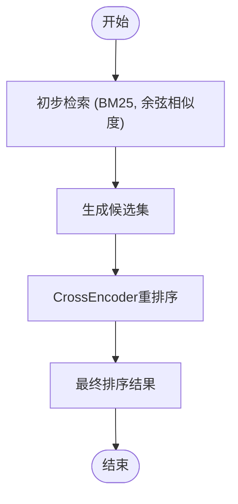

# 结果重排序

<cite>
**本文档引用的文件**
- [bge_reranker_client.py](file://graphiti_core/cross_encoder/bge_reranker_client.py)
- [client.py](file://graphiti_core/cross_encoder/client.py)
- [gemini_reranker_client.py](file://graphiti_core/cross_encoder/gemini_reranker_client.py)
- [openai_reranker_client.py](file://graphiti_core/cross_encoder/openai_reranker_client.py)
- [search.py](file://graphiti_core/search/search.py)
- [search_config.py](file://graphiti_core/search/search_config.py)
- [search_config_recipes.py](file://graphiti_core/search/search_config_recipes.py)
- [graphiti.py](file://graphiti_core/graphiti.py)
- [podcast_runner.py](file://examples/podcast/podcast_runner.py)
- [runner.py](file://examples/ecommerce/runner.py)
</cite>

## 目录
1. [引言](#引言)
2. [CrossEncoder重排序机制架构](#crossencoder重排序机制架构)
3. [重排序模型实现](#重排序模型实现)
4. [混合检索流程中的重排序](#混合检索流程中的重排序)
5. [配置与参数调优](#配置与参数调优)
6. [实际应用案例](#实际应用案例)
7. [性能优化策略](#性能优化策略)
8. [结论](#结论)

## 引言
结果重排序是Graphiti知识图谱系统中提升检索准确率的关键技术。在混合检索流程中，系统首先通过多种方法（如BM25、余弦相似度、广度优先搜索等）获取初步检索结果，然后利用CrossEncoder重排序机制对这些结果进行精细化相关性评分和重新排序。这种两阶段的检索策略结合了快速检索和精确排序的优势，能够显著提高最终检索结果的质量。本文档深入解析CrossEncoder重排序机制的技术实现，阐述其在混合检索流程中的关键作用，并提供配置和优化指导。

## CrossEncoder重排序机制架构

**图示来源**
- [client.py](file://graphiti_core/cross_encoder/client.py#L20-L40)
- [search.py](file://graphiti_core/search/search.py#L68-L183)

**本节来源**
- [client.py](file://graphiti_core/cross_encoder/client.py#L1-L41)
- [search.py](file://graphiti_core/search/search.py#L1-L520)

## 重排序模型实现

### BAAI/bge-reranker实现
BAAI/bge-reranker是基于sentence-transformers库的本地重排序模型。它使用预训练的交叉编码器模型对查询和文档对进行联合编码，从而获得更精确的相关性评分。

**图示来源**
- [bge_reranker_client.py](file://graphiti_core/cross_encoder/bge_reranker_client.py#L34-L55)

**本节来源**
- [bge_reranker_client.py](file://graphiti_core/cross_encoder/bge_reranker_client.py#L1-L55)

### Gemini重排序实现
Gemini重排序客户端通过Google的Gemini API进行远程调用，使用直接评分方法对每个段落进行0-100的评分，然后归一化到[0,1]范围。

**图示来源**
- [gemini_reranker_client.py](file://graphiti_core/cross_encoder/gemini_reranker_client.py#L43-L162)

**本节来源**
- [gemini_reranker_client.py](file://graphiti_core/cross_encoder/gemini_reranker_client.py#L1-L162)

### OpenAI重排序实现
OpenAI重排序客户端使用OpenAI API运行布尔分类器提示，利用log-probabilities对段落进行排名。

**图示来源**
- [openai_reranker_client.py](file://graphiti_core/cross_encoder/openai_reranker_client.py#L34-L124)

**本节来源**
- [openai_reranker_client.py](file://graphiti_core/cross_encoder/openai_reranker_client.py#L1-L124)

## 混合检索流程中的重排序

### 重排序工作流程
在混合检索流程中，CrossEncoder重排序作为最后的精排序阶段，对初步检索结果进行精细化处理。

**本节来源**
- [search.py](file://graphiti_core/search/search.py#L119-L166)

### 与Embedder的协同关系
CrossEncoder与Embedder在架构上协同工作，Embedder负责生成向量嵌入用于初步检索，而CrossEncoder则负责精细化的相关性评分。

**图示来源**
- [graphiti.py](file://graphiti_core/graphiti.py#L128-L800)
- [search.py](file://graphiti_core/search/search.py#L68-L183)

**本节来源**
- [graphiti.py](file://graphiti_core/graphiti.py#L1-L1264)
- [search.py](file://graphiti_core/search/search.py#L1-L520)

## 配置与参数调优

### 重排序配置
系统通过SearchConfig类配置重排序参数，包括候选集大小、重排序阈值和并行处理能力。

**本节来源**
- [search_config.py](file://graphiti_core/search/search_config.py#L1-L161)

### 配置示例
以下是使用不同重排序策略的配置示例：

**本节来源**
- [search_config_recipes.py](file://graphiti_core/search/search_config_recipes.py#L1-L224)

## 实际应用案例

### 播客分析案例
在播客分析场景中，系统使用CrossEncoder重排序来提高对播客内容的检索准确率。

**本节来源**
- [podcast_runner.py](file://examples/podcast/podcast_runner.py#L1-L130)

### 电商搜索案例
在电商搜索场景中，系统使用重排序来提高产品推荐的相关性。

**本节来源**
- [runner.py](file://examples/ecommerce/runner.py#L1-L124)

## 性能优化策略

### 模型延迟与精度平衡
在实际应用中，需要在模型延迟和精度之间找到平衡点。

**本节来源**
- [search.py](file://graphiti_core/search/search.py#L269-L276)
- [gemini_reranker_client.py](file://graphiti_core/cross_encoder/gemini_reranker_client.py#L104-L117)

### 性能优化建议
1. **结果截断**：设置合理的候选集大小限制，避免处理过多结果
2. **异步重排序**：对于耗时较长的重排序操作，采用异步处理方式
3. **缓存机制**：对频繁查询的结果进行缓存，减少重复计算
4. **并行处理**：充分利用并发能力，同时处理多个重排序请求

## 结论
CrossEncoder重排序机制是Graphiti系统中提升检索质量的核心组件。通过深入分析其技术实现，我们了解到它如何与Embedder协同工作，在混合检索流程中发挥关键作用。系统支持多种重排序模型（BAAI/bge-reranker、Gemini和OpenAI），提供了灵活的配置选项和优化策略。在实际应用中，这种重排序机制显著提高了播客分析、电商搜索等场景的检索准确率。未来可以通过进一步优化模型选择、缓存策略和并行处理能力来提升系统性能。