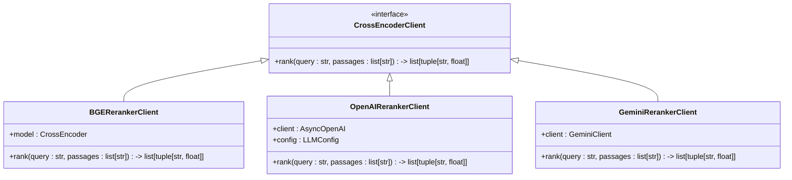

# 搜索与检索

<cite>
**本文档引用的文件**   
- [search.py](file://graphiti_core/search/search.py)
- [search_config.py](file://graphiti_core/search/search_config.py)
- [search_config_recipes.py](file://graphiti_core/search/search_config_recipes.py)
- [search_filters.py](file://graphiti_core/search/search_filters.py)
- [search_utils.py](file://graphiti_core/search/search_utils.py)
- [client.py](file://graphiti_core/cross_encoder/client.py)
- [bge_reranker_client.py](file://graphiti_core/cross_encoder/bge_reranker_client.py)
- [openai_reranker_client.py](file://graphiti_core/cross_encoder/openai_reranker_client.py)
- [gemini_reranker_client.py](file://graphiti_core/cross_encoder/gemini_reranker_client.py)
- [client.py](file://graphiti_core/embedder/client.py)
- [snippets.py](file://graphiti_core/prompts/snippets.py)
</cite>

## 目录
1. [混合检索架构](#混合检索架构)
2. [检索模式详解](#检索模式详解)
3. [搜索配置详解](#搜索配置详解)
4. [结果后处理流程](#结果后处理流程)
5. [查询场景最佳实践](#查询场景最佳实践)
6. [性能优化建议](#性能优化建议)
7. [常见问题解决方案](#常见问题解决方案)

## 混合检索架构

该系统实现了混合检索（Hybrid Search）架构，通过并行执行多种检索模式并融合结果，提供更全面和准确的搜索能力。系统核心由`search`函数驱动，协调语义搜索、关键词搜索和图遍历三种模式。


**图源**
- [search.py](file://graphiti_core/search/search.py#L68-L183)

## 检索模式详解

### 语义搜索（向量相似度）

语义搜索基于向量嵌入技术，通过计算查询与数据之间的向量相似度来发现语义上相关的内容。系统使用嵌入模型将文本转换为高维向量，并通过余弦相似度算法进行匹配。


**图源**
- [search_utils.py](file://graphiti_core/search/search_utils.py#L70-L81)
- [search.py](file://graphiti_core/search/search.py#L103-L107)

### 关键词搜索（BM25）

关键词搜索采用BM25算法，基于词频和逆文档频率进行相关性评分。该模式特别适合精确匹配和术语查找，能够快速定位包含特定关键词的内容。


**图源**
- [search_utils.py](file://graphiti_core/search/search_utils.py#L84-L110)
- [search.py](file://graphiti_core/search/search.py#L204-L206)

### 图遍历（Cypher查询）

图遍历模式通过Cypher查询语言在知识图谱中进行深度遍历，发现实体间的关联关系。该模式支持广度优先搜索（BFS），可配置最大遍历深度。


**图源**
- [search_utils.py](file://graphiti_core/search/search_utils.py#L433-L553)
- [search.py](file://graphiti_core/search/search.py#L222-L231)

## 搜索配置详解

### SearchConfig配置选项

`SearchConfig`类提供了全面的配置选项，允许用户定制检索行为。配置主要包括权重分配、过滤条件和重排序策略。


**图源**
- [search_config.py](file://graphiti_core/search/search_config.py#L112-L119)

### 权重分配策略

系统提供了多种预定义的搜索配置配方，针对不同场景优化权重分配：

- **COMBINED_HYBRID_SEARCH_RRF**: 使用倒数排名融合（RRF）进行结果融合
- **COMBINED_HYBRID_SEARCH_MMR**: 使用最大边际相关性（MMR）减少结果冗余
- **COMBINED_HYBRID_SEARCH_CROSS_ENCODER**: 使用交叉编码器进行精确重排序

**节源**
- [search_config_recipes.py](file://graphiti_core/search/search_config_recipes.py#L34-L108)

### 过滤条件配置

通过`SearchFilters`类可以配置多种过滤条件，包括节点标签、边类型和时间范围过滤。


**图源**
- [search_filters.py](file://graphiti_core/search/search_filters.py#L44-L56)

## 结果后处理流程

### 片段生成

检索结果通过`search_results_to_context_string`函数转换为适合LLM处理的上下文字符串。该过程将不同类型的实体（事实、实体、片段、社区）格式化为结构化JSON。


**图源**
- [search_helpers.py](file://graphiti_core/search/search_helpers.py#L27-L72)

### 重排序机制

系统支持多种重排序策略，通过`CrossEncoderClient`接口实现：



**图源**
- [client.py](file://graphiti_core/cross_encoder/client.py#L20-L40)
- [bge_reranker_client.py](file://graphiti_core/cross_encoder/bge_reranker_client.py#L34-L54)
- [openai_reranker_client.py](file://graphiti_core/cross_encoder/openai_reranker_client.py#L34-L124)

## 查询场景最佳实践

### 精确匹配场景

对于需要精确匹配的查询，建议使用关键词搜索为主，语义搜索为辅的配置：

```python
SearchConfig(
    edge_config=EdgeSearchConfig(
        search_methods=[EdgeSearchMethod.bm25],
        reranker=EdgeReranker.rrf
    ),
    node_config=NodeSearchConfig(
        search_methods=[NodeSearchMethod.bm25],
        reranker=NodeReranker.rrf
    )
)
```

**节源**
- [search_config_recipes.py](file://graphiti_core/search/search_config_recipes.py#L111-L116)

### 模糊查找场景

对于模糊查找和语义理解，建议使用语义搜索为主，结合重排序技术：

```python
SearchConfig(
    edge_config=EdgeSearchConfig(
        search_methods=[EdgeSearchMethod.cosine_similarity],
        reranker=EdgeReranker.cross_encoder
    ),
    node_config=NodeSearchConfig(
        search_methods=[NodeSearchMethod.cosine_similarity],
        reranker=NodeReranker.cross_encoder
    )
)
```

**节源**
- [search_config_recipes.py](file://graphiti_core/search/search_config_recipes.py#L81-L108)

### 上下文扩展场景

对于需要发现关联信息的场景，建议启用图遍历功能：

```python
SearchConfig(
    edge_config=EdgeSearchConfig(
        search_methods=[EdgeSearchMethod.bfs],
        bfs_max_depth=3
    ),
    node_config=NodeSearchConfig(
        search_methods=[NodeSearchMethod.bfs],
        bfs_max_depth=3
    )
)
```

**节源**
- [search.py](file://graphiti_core/search/search.py#L222-L231)

## 性能优化建议

### 索引策略

1. **向量索引**: 为频繁进行语义搜索的字段创建向量索引
2. **全文索引**: 为需要关键词搜索的字段创建全文索引
3. **复合索引**: 为常用过滤条件组合创建复合索引

### 缓存机制

系统通过以下方式优化性能：

- **查询结果缓存**: 缓存频繁查询的结果
- **向量缓存**: 缓存已计算的嵌入向量
- **连接池**: 使用连接池管理数据库连接


**节源**
- [search.py](file://graphiti_core/search/search.py#L79-L182)

## 常见问题解决方案

### 结果不相关

**问题原因**:
- 查询向量质量不佳
- 相似度阈值设置不当
- 训练数据偏差

**解决方案**:
1. 检查嵌入模型配置
2. 调整`sim_min_score`参数
3. 优化查询预处理

### 延迟高

**问题原因**:
- 查询复杂度高
- 数据量过大
- 网络延迟

**解决方案**:
1. 优化Cypher查询语句
2. 增加索引
3. 使用异步处理
4. 调整`limit`参数

**节源**
- [search.py](file://graphiti_core/search/search.py#L179-L181)
- [search_utils.py](file://graphiti_core/search/search_utils.py#L63-L66)