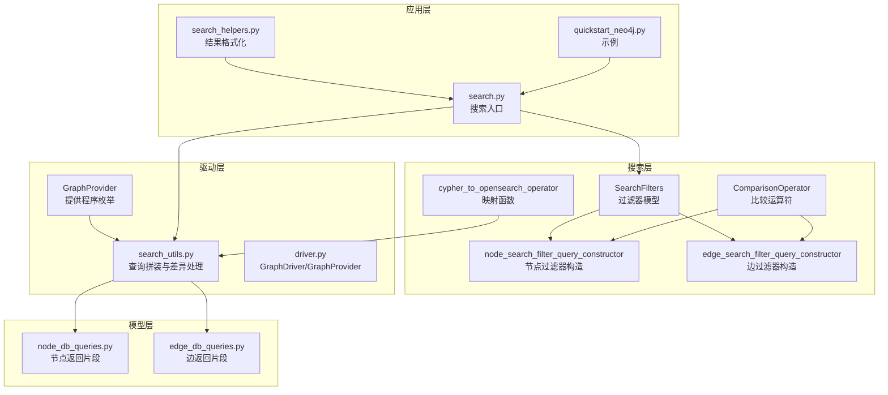
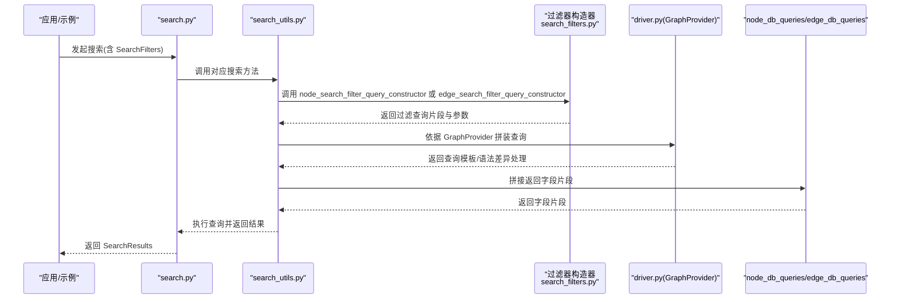
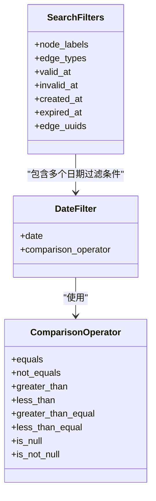
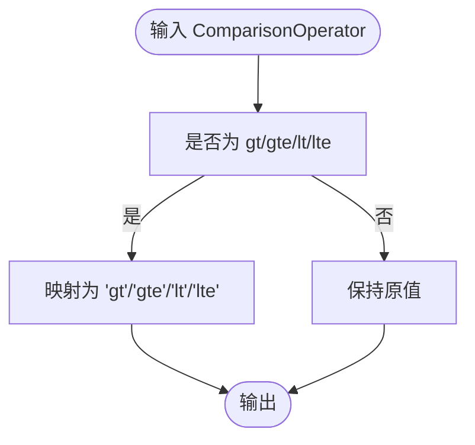
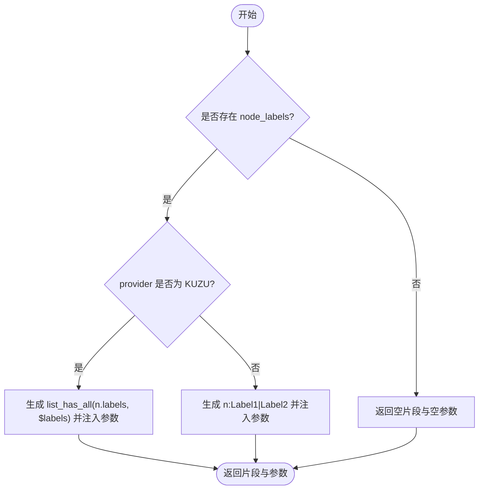
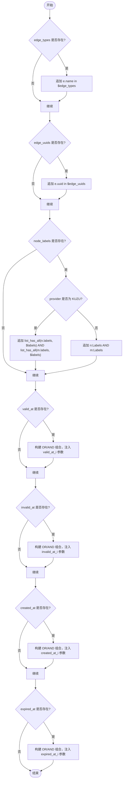
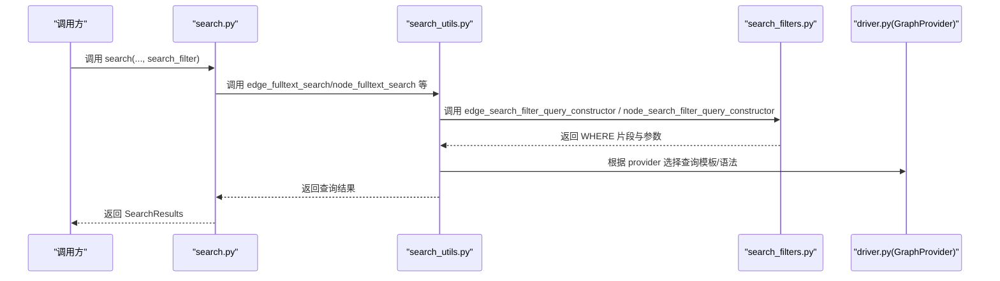
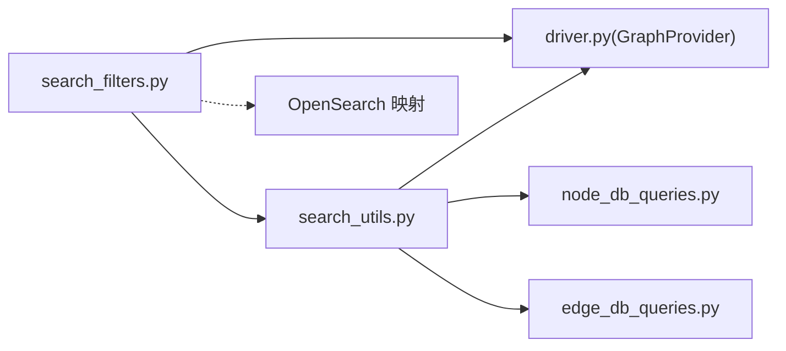

# 搜索过滤器

<cite>
**本文引用的文件**
- [search_filters.py](file://graphiti_core/search/search_filters.py)
- [search_utils.py](file://graphiti_core/search/search_utils.py)
- [driver.py](file://graphiti_core/driver/driver.py)
- [search.py](file://graphiti_core/search/search.py)
- [node_db_queries.py](file://graphiti_core/models/nodes/node_db_queries.py)
- [edge_db_queries.py](file://graphiti_core/models/edges/edge_db_queries.py)
- [search_config.py](file://graphiti_core/search/search_config.py)
- [search_helpers.py](file://graphiti_core/search/search_helpers.py)
- [quickstart_neo4j.py](file://examples/quickstart/quickstart_neo4j.py)
</cite>

## 目录
1. [简介](#简介)
2. [项目结构](#项目结构)
3. [核心组件](#核心组件)
4. [架构总览](#架构总览)
5. [详细组件分析](#详细组件分析)
6. [依赖关系分析](#依赖关系分析)
7. [性能考量](#性能考量)
8. [故障排查指南](#故障排查指南)
9. [结论](#结论)
10. [附录](#附录)

## 简介
本文件系统化阐述 Graphiti 的“搜索过滤器”能力，重点覆盖：
- SearchFilters 类支持的过滤条件：节点标签、边类型、边的多时态字段（valid_at、invalid_at、created_at、expired_at）、边 UUID。
- ComparisonOperator 枚举支持的比较操作符。
- 辅助函数 cypher_to_opensearch_operator 的作用与映射策略。
- 节点与边过滤器查询构造器 node_search_filter_query_constructor 与 edge_search_filter_query_constructor 的实现逻辑与差异。
- 不同图数据库提供程序（Neo4j、FalkorDB、Kuzu、Neptune）在过滤器构造上的差异与适配。

## 项目结构
围绕搜索过滤器的相关模块分布如下：
- graphiti_core/search/search_filters.py：定义过滤器模型、比较运算符、过滤器查询构造器与辅助函数。
- graphiti_core/search/search_utils.py：搜索流程中对过滤器的消费与拼接，包含跨提供程序的查询拼装与差异处理。
- graphiti_core/driver/driver.py：提供 GraphProvider 枚举，标识当前使用的图数据库提供程序。
- graphiti_core/search/search.py：对外搜索入口，调用各搜索方法并将 SearchFilters 传入。
- graphiti_core/models/nodes/node_db_queries.py 与 graphiti_core/models/edges/edge_db_queries.py：返回节点/边查询片段，体现不同提供程序的返回字段差异。
- graphiti_core/search/search_config.py：搜索配置与重排策略，间接影响过滤器的使用场景。
- graphiti_core/search/search_helpers.py：结果格式化与上下文字符串生成，便于理解过滤后结果的呈现。
- examples/quickstart/quickstart_neo4j.py：示例脚本，展示如何进行搜索与检索，可作为理解过滤器在真实流程中的位置的参考。

图表来源
- [search_filters.py](file://graphiti_core/search/search_filters.py#L1-L252)
- [search_utils.py](file://graphiti_core/search/search_utils.py#L1-L280)
- [driver.py](file://graphiti_core/driver/driver.py#L42-L47)
- [node_db_queries.py](file://graphiti_core/models/nodes/node_db_queries.py#L256-L277)
- [edge_db_queries.py](file://graphiti_core/models/edges/edge_db_queries.py#L187-L222)
- [search.py](file://graphiti_core/search/search.py#L68-L184)
- [search_helpers.py](file://graphiti_core/search/search_helpers.py#L27-L73)
- [quickstart_neo4j.py](file://examples/quickstart/quickstart_neo4j.py#L138-L185)

章节来源
- [search_filters.py](file://graphiti_core/search/search_filters.py#L1-L252)
- [search_utils.py](file://graphiti_core/search/search_utils.py#L1-L280)
- [driver.py](file://graphiti_core/driver/driver.py#L42-L47)
- [search.py](file://graphiti_core/search/search.py#L68-L184)

## 核心组件
- SearchFilters：用于表达搜索过滤条件的数据模型，支持节点标签、边类型、边的多时态字段（valid_at、invalid_at、created_at、expired_at）以及边 UUID。
- ComparisonOperator：统一的比较运算符枚举，覆盖等于、不等于、大于、小于、大于等于、小于等于、空值判断等。
- cypher_to_opensearch_operator：将 Cypher 风格的比较运算符映射为 OpenSearch 支持的键值比较操作符（如 gt/gte/lt/lte），用于与 OpenSearch 兼容的过滤场景。
- node_search_filter_query_constructor：根据过滤条件与 GraphProvider，生成节点侧的过滤查询片段与参数。
- edge_search_filter_query_constructor：根据过滤条件与 GraphProvider，生成边侧的过滤查询片段与参数，并处理多时态字段与标签组合。

章节来源
- [search_filters.py](file://graphiti_core/search/search_filters.py#L26-L66)
- [search_filters.py](file://graphiti_core/search/search_filters.py#L68-L85)
- [search_filters.py](file://graphiti_core/search/search_filters.py#L100-L252)

## 架构总览
搜索过滤器在整体搜索流程中的位置如下：
- 应用层通过 search.py 的入口发起搜索请求，将 SearchFilters 传递给各搜索方法。
- 各搜索方法在执行前，调用 search_utils.py 中的过滤器构造函数，生成 WHERE 子句与参数字典。
- 不同 GraphProvider 在查询拼装、匹配语法、返回字段等方面存在差异，search_utils.py 对这些差异进行适配。
- 结果返回后，search_helpers.py 将结果格式化为上下文字符串，便于下游 LLM 使用。

图表来源
- [search.py](file://graphiti_core/search/search.py#L68-L184)
- [search_utils.py](file://graphiti_core/search/search_utils.py#L170-L283)
- [search_filters.py](file://graphiti_core/search/search_filters.py#L68-L252)
- [driver.py](file://graphiti_core/driver/driver.py#L42-L47)
- [node_db_queries.py](file://graphiti_core/models/nodes/node_db_queries.py#L256-L277)
- [edge_db_queries.py](file://graphiti_core/models/edges/edge_db_queries.py#L187-L222)

## 详细组件分析

### SearchFilters 与 ComparisonOperator
- SearchFilters 字段：
  - node_labels：节点标签列表；用于节点过滤。
  - edge_types：边类型列表；用于边过滤。
  - valid_at/invalid_at/created_at/expired_at：均为二维列表，表示“或/与”组合的日期过滤条件。
  - edge_uuids：边 UUID 列表；用于精确过滤。
- ComparisonOperator 枚举：
  - 支持等值、不等值、大小比较、空值判断等常见比较操作符。
  - 与 date_filter_query_constructor 协作，生成带占位符的 WHERE 片段。

图表来源
- [search_filters.py](file://graphiti_core/search/search_filters.py#L26-L66)
- [search_filters.py](file://graphiti_core/search/search_filters.py#L37-L56)

章节来源
- [search_filters.py](file://graphiti_core/search/search_filters.py#L26-L66)
- [search_filters.py](file://graphiti_core/search/search_filters.py#L37-L56)

### cypher_to_opensearch_operator
- 作用：将 ComparisonOperator 映射到 OpenSearch 支持的键值比较操作符（如 gt、gte、lt、lte）。
- 适用场景：当过滤器需要与 OpenSearch 过滤器协同工作时，使用该函数进行符号转换。
- 注意：对于 is_null/is_not_null 等特殊操作符，直接沿用原值。

图表来源
- [search_filters.py](file://graphiti_core/search/search_filters.py#L58-L66)

章节来源
- [search_filters.py](file://graphiti_core/search/search_filters.py#L58-L66)

### 节点过滤器构造：node_search_filter_query_constructor
- 功能：根据 SearchFilters 与 GraphProvider 生成节点过滤查询片段与参数。
- 关键差异：
  - 当 provider 为 KUZU 时，使用集合函数（如 list_has_all）检查节点标签是否包含所有指定标签。
  - 其他提供程序（如 Neo4j/FalkorDB/Neptune）使用标签匹配语法（如 n:Label1|Label2）。
- 参数：将 node_labels 注入为参数字典，供最终查询绑定。

图表来源
- [search_filters.py](file://graphiti_core/search/search_filters.py#L68-L85)

章节来源
- [search_filters.py](file://graphiti_core/search/search_filters.py#L68-L85)

### 边过滤器构造：edge_search_filter_query_constructor
- 功能：根据 SearchFilters 与 GraphProvider 生成边过滤查询片段与参数。
- 支持的边过滤：
  - edge_types：使用 e.name in $edge_types。
  - edge_uuids：使用 e.uuid in $edge_uuids。
  - node_labels：与节点标签类似，KUZU 使用两端节点标签同时满足的逻辑，其他提供程序使用 n:Labels AND m:Labels。
  - 多时态字段过滤：valid_at、invalid_at、created_at、expired_at。
    - 支持“或/与”组合：外层为 OR，内层为 AND。
    - 日期参数按顺序注入，非空值才注入。
    - 使用 date_filter_query_constructor 生成形如 “e.field operator $param”的片段。
- 参数：将 edge_types、edge_uuids、labels、以及每个日期参数注入参数字典。

图表来源
- [search_filters.py](file://graphiti_core/search/search_filters.py#L100-L252)
- [search_filters.py](file://graphiti_core/search/search_filters.py#L87-L98)

章节来源
- [search_filters.py](file://graphiti_core/search/search_filters.py#L100-L252)
- [search_filters.py](file://graphiti_core/search/search_filters.py#L87-L98)

### 不同提供程序的过滤器构造差异
- Kuzu：
  - 节点标签：使用 list_has_all(n.labels, $labels)。
  - 边标签：两端节点均需满足标签集合。
  - 边匹配：实体边在存储上采用中间节点结构，搜索时需考虑路径深度与中间节点匹配。
- Neo4j/FalkorDB/Neptune：
  - 节点标签：使用 n:Label1|Label2 形式。
  - 边标签：使用 e.name in $edge_types。
  - 多时态字段：直接使用 e.valid_at/e.invalid_at 等字段进行比较。
- 返回字段差异：
  - 节点返回字段：Kuzu 返回 labels 字段，其他提供程序返回 labels(n)/properties(n)。
  - 边返回字段：Neptune 与其它提供程序在 episodes/expires 等字段的返回形式略有差异，但构造器仅负责 WHERE 条件，返回字段由模型层返回片段决定。

章节来源
- [search_filters.py](file://graphiti_core/search/search_filters.py#L68-L85)
- [search_filters.py](file://graphiti_core/search/search_filters.py#L100-L126)
- [node_db_queries.py](file://graphiti_core/models/nodes/node_db_queries.py#L256-L277)
- [edge_db_queries.py](file://graphiti_core/models/edges/edge_db_queries.py#L187-L222)

### 过滤器在搜索流程中的使用
- 搜索入口：search.py 的 search/edge_search/node_search 等方法会将 SearchFilters 传入具体搜索实现。
- 查询拼装：search_utils.py 在各搜索方法中调用过滤器构造器，生成 WHERE 片段与参数，并结合 provider 差异进行查询拼装。
- 结果格式化：search_helpers.py 将搜索结果转为上下文字符串，便于 LLM 使用。

图表来源
- [search.py](file://graphiti_core/search/search.py#L68-L184)
- [search_utils.py](file://graphiti_core/search/search_utils.py#L170-L283)
- [search_filters.py](file://graphiti_core/search/search_filters.py#L68-L252)
- [driver.py](file://graphiti_core/driver/driver.py#L42-L47)

章节来源
- [search.py](file://graphiti_core/search/search.py#L68-L184)
- [search_utils.py](file://graphiti_core/search/search_utils.py#L170-L283)

## 依赖关系分析
- 模块耦合：
  - search_filters.py 与 driver.py 通过 GraphProvider 枚举耦合，用于区分不同提供程序的语法差异。
  - search_utils.py 依赖 search_filters.py 的过滤器构造器，并在不同 provider 下进行查询拼装。
  - node_db_queries.py 与 edge_db_queries.py 提供返回字段片段，与过滤器构造器解耦，仅在最终返回阶段生效。
- 外部依赖：
  - OpenSearch：通过 cypher_to_opensearch_operator 实现比较符映射，用于与 OpenSearch 过滤器协同。
  - 图数据库：Neo4j/FalkorDB/Kuzu/Neptune 的语法差异在 search_utils.py 中集中处理。

图表来源
- [search_filters.py](file://graphiti_core/search/search_filters.py#L58-L66)
- [search_utils.py](file://graphiti_core/search/search_utils.py#L170-L283)
- [driver.py](file://graphiti_core/driver/driver.py#L42-L47)
- [node_db_queries.py](file://graphiti_core/models/nodes/node_db_queries.py#L256-L277)
- [edge_db_queries.py](file://graphiti_core/models/edges/edge_db_queries.py#L187-L222)

章节来源
- [search_filters.py](file://graphiti_core/search/search_filters.py#L58-L66)
- [search_utils.py](file://graphiti_core/search/search_utils.py#L170-L283)
- [driver.py](file://graphiti_core/driver/driver.py#L42-L47)

## 性能考量
- 过滤器构造复杂度：
  - 节点过滤：单次标签匹配，复杂度近似 O(k)，k 为标签数量。
  - 边过滤：多时态字段支持“或/与”组合，最坏情况下复杂度与组合数量成正比。
- 参数注入：
  - 仅对非空值注入日期参数，避免无效参数导致查询开销。
- 提供程序差异：
  - Kuzu 的标签匹配使用集合函数，可能在大标签集下有额外开销；其他提供程序使用标签语法，通常更高效。
- 建议：
  - 合理限制过滤器规模（如 edge_types/node_labels 数量），避免过度组合导致查询膨胀。
  - 在 OpenSearch 场景下，优先使用 cypher_to_opensearch_operator 进行比较符映射，减少二次处理成本。

[本节为通用建议，无需特定文件来源]

## 故障排查指南
- 常见问题与定位：
  - 过滤器未生效：检查是否正确传入 SearchFilters，确认过滤器构造器返回的 WHERE 片段是否被拼接到最终查询中。
  - 标签过滤异常：确认 GraphProvider 是否为 KUZU，Kuzu 使用 list_has_all(n.labels, $labels)，其他提供程序使用 n:Label1|Label2。
  - 多时态字段过滤错误：核对 valid_at/invalid_at/created_at/expired_at 的“或/与”组合是否符合预期，确保日期参数已注入。
  - OpenSearch 过滤不匹配：确认使用 cypher_to_opensearch_operator 将比较符映射为 gt/gte/lt/lte。
- 定位步骤：
  - 在 search_utils.py 中断点或日志打印 WHERE 片段与参数字典，验证过滤器构造结果。
  - 根据 GraphProvider 分支检查查询模板与语法差异。
  - 使用最小化过滤器组合复现问题，逐步缩小范围。

章节来源
- [search_filters.py](file://graphiti_core/search/search_filters.py#L68-L252)
- [search_utils.py](file://graphiti_core/search/search_utils.py#L170-L283)

## 结论
SearchFilters 与相关构造器提供了灵活而强大的搜索过滤能力，覆盖节点标签、边类型、边的多时态字段与边 UUID 等关键维度。通过 ComparisonOperator 与 cypher_to_opensearch_operator 的配合，既能满足 Cypher 语法需求，也能与 OpenSearch 过滤器协同。不同提供程序的语法差异在 search_utils.py 中得到集中处理，保证了跨平台的一致行为。建议在实际使用中合理设计过滤器组合，以获得最佳性能与准确性。

[本节为总结，无需特定文件来源]

## 附录
- 使用建议：
  - 在需要精确时间窗口的场景下，优先使用 valid_at/invalid_at 组合，避免使用 created_at/expired_at 作为有效性判断。
  - 对于 Kuzu，节点标签过滤应尽量使用全集匹配（list_has_all），避免过多标签导致匹配开销上升。
  - 在 OpenSearch 场景下，务必使用 cypher_to_opensearch_operator 进行比较符映射。

[本节为补充说明，无需特定文件来源]