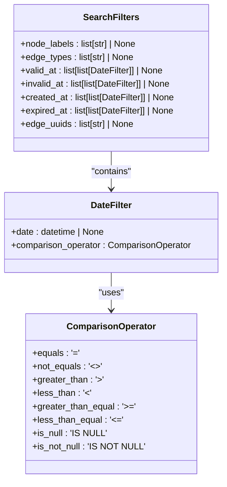

# 搜索过滤器概述

<cite>
**本文档中引用的文件**  
- [search_filters.py](file://graphiti_core/search/search_filters.py)
- [search.py](file://graphiti_core/search/search.py)
- [driver.py](file://graphiti_core/driver/driver.py)
- [kuzu_driver.py](file://graphiti_core/driver/kuzu_driver.py)
- [neo4j_driver.py](file://graphiti_core/driver/neo4j_driver.py)
- [search_utils.py](file://graphiti_core/search/search_utils.py)
</cite>

## 目录
1. [简介](#简介)
2. [SearchFilters类设计目的](#searchfilters类设计目的)
3. [核心功能与过滤机制](#核心功能与过滤机制)
4. [与GraphProvider枚举的集成](#与graphprovider枚举的集成)
5. [在不同图数据库中的适配机制](#在不同图数据库中的适配机制)
6. [在混合检索流程中的位置](#在混合检索流程中的位置)
7. [对查询性能的影响](#对查询性能的影响)

## 简介
SearchFilters类是Graphiti知识图谱系统中用于定义和管理查询过滤条件的核心组件。该类作为知识图谱查询的过滤条件载体，支持节点标签、边类型以及基于时间的有效性过滤（如valid_at、invalid_at等）。通过与GraphProvider枚举的集成，SearchFilters能够在不同图数据库（如Kuzu、Neo4j）中实现适配，确保查询的一致性和高效性。本概述文档将详细介绍SearchFilters的设计目的、核心作用、集成关系及在混合检索流程中的位置和对查询性能的影响。

## SearchFilters类设计目的
SearchFilters类的主要设计目的是为知识图谱查询提供灵活且强大的过滤机制。通过定义节点标签、边类型和基于时间的有效性过滤条件，SearchFilters能够帮助用户精确地筛选出符合特定条件的图数据。该类的设计考虑了不同图数据库的特性和限制，通过与GraphProvider枚举的集成，实现了跨数据库的兼容性和一致性。此外，SearchFilters还支持复杂的逻辑组合，使得用户可以构建复杂的查询条件，满足多样化的查询需求。

**Section sources**
- [search_filters.py](file://graphiti_core/search/search_filters.py#L44-L56)

## 核心功能与过滤机制
SearchFilters类的核心功能包括节点标签过滤、边类型过滤和基于时间的有效性过滤。节点标签过滤通过`node_labels`字段实现，允许用户指定一个或多个节点标签进行过滤。边类型过滤通过`edge_types`字段实现，允许用户指定一个或多个边类型进行过滤。基于时间的有效性过滤通过`valid_at`、`invalid_at`、`created_at`和`expired_at`字段实现，支持对边的有效性和创建时间进行精确过滤。这些过滤条件可以通过逻辑组合，形成复杂的查询条件。

**Diagram sources**
- [search_filters.py](file://graphiti_core/search/search_filters.py#L44-L56)
- [search_filters.py](file://graphiti_core/search/search_filters.py#L37-L42)
- [search_filters.py](file://graphiti_core/search/search_filters.py#L26-L35)

## 与GraphProvider枚举的集成
SearchFilters类通过与GraphProvider枚举的集成，实现了对不同图数据库的支持。GraphProvider枚举定义了支持的图数据库类型，如Neo4j、FalkorDB、Kuzu和Neptune。在查询过程中，SearchFilters会根据当前使用的图数据库类型，生成相应的查询语句。例如，在Kuzu中，节点标签过滤使用`list_has_all(n.labels, $labels)`，而在其他数据库中则使用`n:label1|label2`。这种集成机制确保了查询语句的正确性和效率。

**Section sources**
- [driver.py](file://graphiti_core/driver/driver.py#L42-L47)
- [search_filters.py](file://graphiti_core/search/search_filters.py#L76-L82)
- [search_filters.py](file://graphiti_core/search/search_filters.py#L117-L125)

## 在不同图数据库中的适配机制
SearchFilters类在不同图数据库中的适配机制主要体现在查询语句的生成上。对于Kuzu，由于其不支持动态索引创建，SearchFilters需要在初始化时设置好模式和索引。对于Neo4j和FalkorDB，SearchFilters利用其内置的全文索引和范围索引功能，生成高效的查询语句。例如，在Neo4j中，SearchFilters使用`YIELD relationship AS rel, score`来获取关系及其评分，而在FalkorDB中则使用`MATCH (n:Entity)-[e:RELATES_TO]->(m:Entity)`。这种适配机制确保了在不同图数据库中都能实现高效的查询。

**Section sources**
- [kuzu_driver.py](file://graphiti_core/driver/kuzu_driver.py#L26-L90)
- [neo4j_driver.py](file://graphiti_core/driver/neo4j_driver.py#L95-L99)
- [search_utils.py](file://graphiti_core/search/search_utils.py#L183-L210)
- [search_utils.py](file://graphiti_core/search/search_utils.py#L307-L314)

## 在混合检索流程中的位置
SearchFilters在混合检索流程中扮演着关键角色。混合检索流程结合了多种搜索方法，如BM25文本检索、余弦相似度搜索和广度优先搜索（BFS）。SearchFilters作为过滤条件的载体，贯穿整个检索流程。在BM25文本检索中，SearchFilters用于过滤出符合条件的节点和边；在余弦相似度搜索中，SearchFilters用于过滤出具有相似向量的节点和边；在BFS中，SearchFilters用于过滤出从指定节点出发的路径。通过这种方式，SearchFilters确保了检索结果的准确性和相关性。

**Section sources**
- [search.py](file://graphiti_core/search/search.py#L186-L307)
- [search.py](file://graphiti_core/search/search.py#L309-L370)
- [search.py](file://graphiti_core/search/search.py#L433-L454)

## 对查询性能的影响
SearchFilters对查询性能有显著影响。通过精确的过滤条件，SearchFilters能够减少不必要的数据扫描和计算，从而提高查询效率。例如，在大规模图数据中，通过节点标签和边类型的过滤，可以大幅减少需要处理的数据量。此外，基于时间的有效性过滤能够进一步缩小查询范围，提高查询速度。然而，过于复杂的过滤条件可能会增加查询解析和执行的开销，因此在实际应用中需要权衡过滤条件的复杂性和查询性能。

**Section sources**
- [search_filters.py](file://graphiti_core/search/search_filters.py#L68-L84)
- [search_filters.py](file://graphiti_core/search/search_filters.py#L100-L115)
- [search_utils.py](file://graphiti_core/search/search_utils.py#L170-L282)
- [search_utils.py](file://graphiti_core/search/search_utils.py#L648-L667)