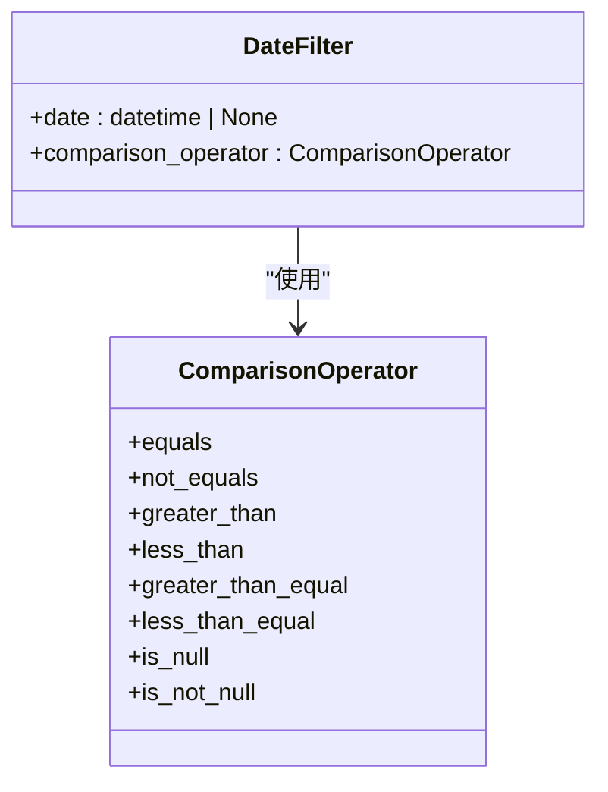
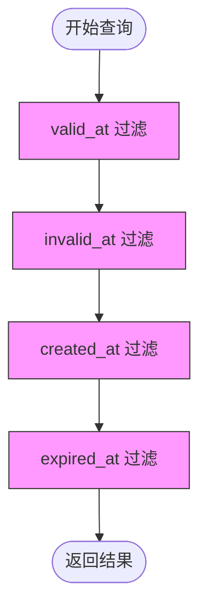
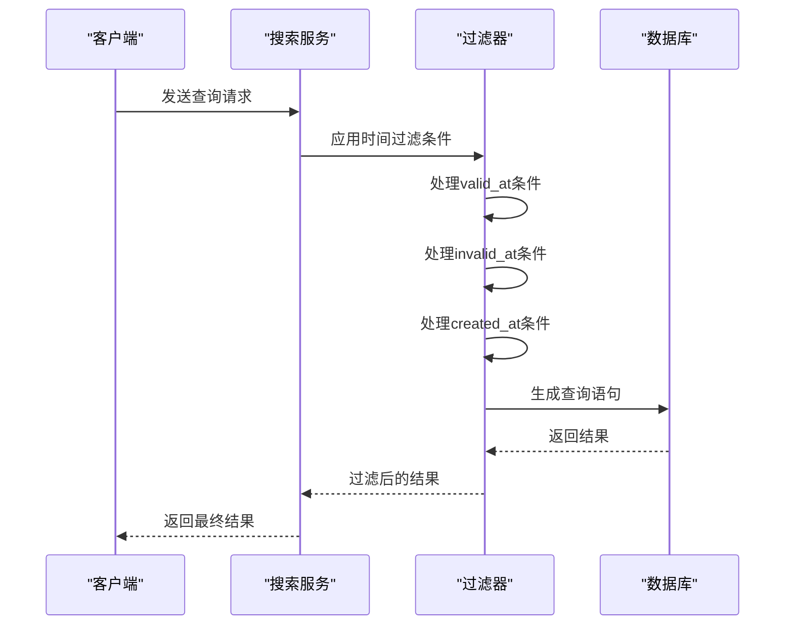
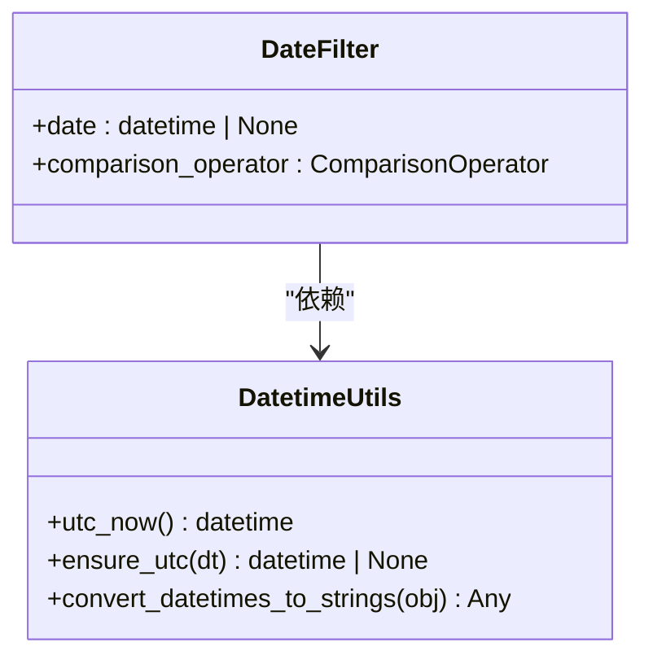

# 日期过滤器

<cite>
**本文档中引用的文件**  
- [search_filters.py](file://graphiti_core/search/search_filters.py)
- [datetime_utils.py](file://graphiti_core/utils/datetime_utils.py)
- [test_graphiti_mock.py](file://tests/test_graphiti_mock.py)
- [search.py](file://graphiti_core/search/search.py)
</cite>

## 目录
1. [简介](#简介)
2. [核心组件](#核心组件)
3. [DateFilter类工作机制](#datefilter类工作机制)
4. [时间过滤的应用场景](#时间过滤的应用场景)
5. [复杂查询构建示例](#复杂查询构建示例)
6. [日期时间安全处理与一致性](#日期时间安全处理与一致性)
7. [结论](#结论)

## 简介
DateFilter类是知识图谱系统中用于实现精确时间过滤的核心组件。该类通过date字段和comparison_operator字段的协同工作，支持对valid_at、invalid_at、created_at和expired_at等时间属性进行精确的时间点过滤和范围查询。本文档详细说明其工作机制、应用场景和最佳实践。

## 核心组件

DateFilter类基于Pydantic的BaseModel实现，包含两个核心字段：date和comparison_operator。它与SearchFilters类协同工作，为知识图谱查询提供强大的时间过滤能力。

**Section sources**
- [search_filters.py](file://graphiti_core/search/search_filters.py#L37-L42)

## DateFilter类工作机制

### 字段协同工作原理

DateFilter类通过两个字段的协同工作实现灵活的时间过滤：

- **date字段**：表示用于过滤的datetime对象，可为None
- **comparison_operator字段**：表示日期比较操作符，使用ComparisonOperator枚举类型

这两个字段共同定义了时间过滤条件，支持等于、不等于、大于、小于、大于等于、小于等于等多种比较操作。

### 比较操作符支持

ComparisonOperator枚举类型支持以下操作符：
- equals (=)
- not_equals (<>)
- greater_than (>)
- less_than (<)
- greater_than_equal (>=)
- less_than_equal (<=)
- is_null (IS NULL)
- is_not_null (IS NOT NULL)



**Diagram sources**
- [search_filters.py](file://graphiti_core/search/search_filters.py#L26-L42)

**Section sources**
- [search_filters.py](file://graphiti_core/search/search_filters.py#L26-L42)

## 时间过滤的应用场景

### 精确时间点过滤

通过设置comparison_operator为equals，可以实现精确时间点的过滤，用于查找在特定时间点有效的知识图谱关系。

### 时间范围查询

通过组合使用greater_than_equal和less_than_equal操作符，可以实现时间范围查询，查找在特定时间段内有效的实体关系。

### 有效时间过滤（valid_at）

valid_at字段用于过滤在指定时间仍然有效的知识图谱关系。例如，查找在当前时间有效的所有关系。

### 无效时间过滤（invalid_at）

invalid_at字段用于过滤在指定时间已失效的知识图谱关系。例如，查找在特定时间点之后失效的关系。

### 创建时间过滤（created_at）

created_at字段用于过滤在特定时间创建的知识图谱元素，支持按创建时间进行范围查询。

### 过期时间过滤（expired_at）

expired_at字段用于过滤已过期的知识图谱关系，帮助识别生命周期已结束的实体连接。



**Diagram sources**
- [search_filters.py](file://graphiti_core/search/search_filters.py#L51-L54)
- [search.py](file://graphiti_core/search/search.py#L119-L130)

**Section sources**
- [search_filters.py](file://graphiti_core/search/search_filters.py#L51-L54)

## 复杂查询构建示例

### 多时间条件组合查询

可以构建包含多个时间条件的复杂查询，例如查找在特定时间段内有效的知识图谱关系：

```python
search_filters = SearchFilters(
    valid_at=[
        [DateFilter(date=now + timedelta(days=1), comparison_operator=ComparisonOperator.greater_than_equal)],
        [DateFilter(date=now + timedelta(days=3), comparison_operator=ComparisonOperator.less_than_equal)]
    ],
    invalid_at=[
        [DateFilter(date=now + timedelta(days=3), comparison_operator=ComparisonOperator.greater_than)],
        [DateFilter(date=now + timedelta(days=5), comparison_operator=ComparisonOperator.less_than)]
    ]
)
```

### OR条件查询

通过在SearchFilters中使用列表的列表结构，可以实现OR条件查询。外层列表表示OR关系，内层列表表示AND关系。

### 实际应用示例

在测试代码中可以看到实际的使用示例，通过组合多个DateFilter条件来精确控制查询结果。



**Diagram sources**
- [test_graphiti_mock.py](file://tests/test_graphiti_mock.py#L974-L1010)
- [search_filters.py](file://graphiti_core/search/search_filters.py#L127-L157)

**Section sources**
- [test_graphiti_mock.py](file://tests/test_graphiti_mock.py#L974-L1010)

## 日期时间安全处理与一致性

### UTC时区一致性

系统强制要求所有datetime对象都必须是时区感知的，并统一使用UTC时区，确保时间处理的一致性。

### datetime类型安全

通过ensure_utc函数确保所有datetime对象都经过时区处理，避免因时区差异导致的查询错误。

### 空值处理

系统正确处理None值，确保在date字段为None时仍能正确执行查询操作。

### ISO格式转换

提供convert_datetimes_to_strings工具函数，将datetime对象转换为ISO格式字符串，便于序列化和传输。



**Diagram sources**
- [datetime_utils.py](file://graphiti_core/utils/datetime_utils.py#L20-L53)
- [search_filters.py](file://graphiti_core/search/search_filters.py#L37-L42)

**Section sources**
- [datetime_utils.py](file://graphiti_core/utils/datetime_utils.py#L20-L53)

## 结论
DateFilter类通过date字段和comparison_operator字段的协同工作，为知识图谱系统提供了强大而灵活的时间过滤能力。它支持精确的时间点过滤和范围查询，能够满足valid_at、invalid_at等多种应用场景的需求。通过强制UTC时区一致性和datetime类型安全处理，确保了时间数据的准确性和可靠性。