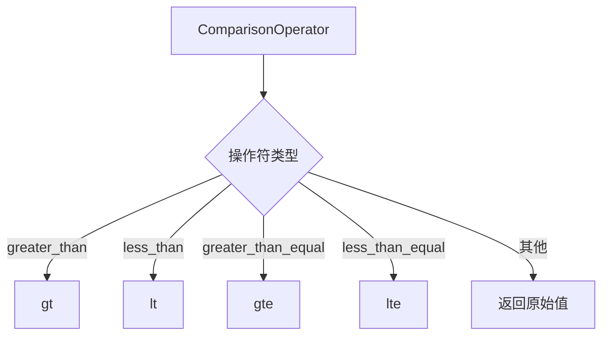

# 比较操作符

<cite>
**本文档中引用的文件**   
- [search_filters.py](file://graphiti_core/search/search_filters.py)
- [search_utils.py](file://graphiti_core/search/search_utils.py)
- [test_graphiti_mock.py](file://tests/test_graphiti_mock.py)
</cite>

## 目录
1. [引言](#引言)
2. [ComparisonOperator 枚举详解](#comparisonoperator-枚举详解)
3. [Cypher 到 OpenSearch 操作符转换](#cypher-到-opensearch-操作符转换)
4. [SearchFilters 中的复杂条件构建](#searchfilters-中的复杂条件构建)
5. [结论](#结论)

## 引言
ComparisonOperator 枚举是 Graphiti 项目中用于定义搜索查询中各种比较操作的核心组件。它在 Cypher 查询语言和 OpenSearch 查询之间提供了关键的映射桥梁，使得开发者能够以统一的方式构建复杂的搜索条件。本文档将深入探讨每个枚举值的技术实现和语义含义，详细解释 cypher_to_opensearch_operator 函数的映射逻辑，并通过实际代码示例展示如何在 SearchFilters 中使用这些操作符进行复杂条件的构建。

## ComparisonOperator 枚举详解

ComparisonOperator 枚举定义了六种基本的比较操作符和两种特殊的空值检查操作符，它们在搜索过滤器中用于精确控制查询条件。

### equals (等于)
`equals` 操作符（符号 `=`）用于检查字段值是否与指定值完全相等。在 Cypher 查询中，它直接转换为标准的等号比较。例如，在测试代码中，`ComparisonOperator.equals` 被用来精确匹配 `created_at` 时间戳。

**Section sources**
- [search_filters.py](file://graphiti_core/search/search_filters.py#L27)
- [test_graphiti_mock.py](file://tests/test_graphiti_mock.py#L978)

### not_equals (不等于)
`not_equals` 操作符（符号 `<>`）用于检查字段值是否与指定值不相等。这是 `equals` 的逻辑反义词，在排除特定条件时非常有用。

**Section sources**
- [search_filters.py](file://graphiti_core/search/search_filters.py#L28)
- [test_graphiti_mock.py](file://tests/test_graphiti_mock.py#L981)

### greater_than (大于)
`greater_than` 操作符（符号 `>`）用于检查字段值是否严格大于指定值。在时间序列数据的查询中，它常用于筛选出发生在某个时间点之后的记录。

**Section sources**
- [search_filters.py](file://graphiti_core/search/search_filters.py#L29)
- [test_graphiti_mock.py](file://tests/test_graphiti_mock.py#L1001)

### less_than (小于)
`less_than` 操作符（符号 `<`）用于检查字段值是否严格小于指定值。与 `greater_than` 相反，它用于筛选出发生在某个时间点之前的记录。

**Section sources**
- [search_filters.py](file://graphiti_core/search/search_filters.py#L30)
- [test_graphiti_mock.py](file://tests/test_graphiti_mock.py#L1006)

### greater_than_equal (大于等于)
`greater_than_equal` 操作符（符号 `>=`）用于检查字段值是否大于或等于指定值。它结合了 `greater_than` 和 `equals` 的功能，提供了一个包含边界的比较。

**Section sources**
- [search_filters.py](file://graphiti_core/search/search_filters.py#L31)
- [test_graphiti_mock.py](file://tests/test_graphiti_mock.py#L987)

### less_than_equal (小于等于)
`less_than_equal` 操作符（符号 `<=`）用于检查字段值是否小于或等于指定值。同样，它提供了一个包含下边界的比较范围。

**Section sources**
- [search_filters.py](file://graphiti_core/search/search_filters.py#L32)
- [test_graphiti_mock.py](file://tests/test_graphiti_mock.py#L993)

### is_null (为空)
`is_null` 操作符（字符串 `IS NULL`）用于检查字段值是否为 `NULL` 或未定义。这是一个特殊的操作符，不涉及数值比较，而是用于检查字段的存在性。

**Section sources**
- [search_filters.py](file://graphiti_core/search/search_filters.py#L33)
- [test_graphiti_int.py](file://tests/test_graphiti_int.py#L66)

### is_not_null (不为空)
`is_not_null` 操作符（字符串 `IS NOT NULL`）是 `is_null` 的反义词，用于检查字段值是否已定义且不为 `NULL`。

**Section sources**
- [search_filters.py](file://graphiti_core/search/search_filters.py#L34)
- [test_graphiti_int.py](file://tests/test_graphiti_int.py#L68)

## Cypher 到 OpenSearch 操作符转换

`cypher_to_opensearch_operator` 函数是实现 Cypher 查询与 OpenSearch 查询之间转换的关键。它将 Cypher 中的符号操作符映射到 OpenSearch 中的函数式操作符名称。



**Diagram sources**
- [search_filters.py](file://graphiti_core/search/search_filters.py#L58-L65)

该函数的实现逻辑如下：
1.  对于 `greater_than`, `less_than`, `greater_than_equal`, `less_than_equal` 这四种操作符，函数返回它们在 OpenSearch 中对应的缩写形式（`gt`, `lt`, `gte`, `lte`）。
2.  对于 `equals`, `not_equals`, `is_null`, `is_not_null` 等操作符，函数直接返回其原始值（如 `=` 或 `IS NULL`），因为这些操作符在目标查询语言中可能保持不变或由其他机制处理。

这种映射确保了在不同后端存储系统（如 Neo4j 和 OpenSearch）之间进行搜索时，比较逻辑的一致性和正确性。

**Section sources**
- [search_filters.py](file://graphiti_core/search/search_filters.py#L58-L65)

## SearchFilters 中的复杂条件构建

`SearchFilters` 类利用 `ComparisonOperator` 枚举来构建复杂的、多条件的搜索查询。它支持对节点标签、边类型以及各种时间戳（如 `valid_at`, `invalid_at`, `created_at`, `expired_at`）进行过滤。

### 复杂时间条件示例
以下代码示例展示了如何使用 `SearchFilters` 构建一个包含多个 OR 和 AND 条件的复杂时间过滤器：

```python
search_filters = SearchFilters(
    valid_at=[
        [DateFilter(date=now + timedelta(days=1), comparison_operator=ComparisonOperator.greater_than_equal)],
    ],
    invalid_at=[
        [DateFilter(date=now + timedelta(days=3), comparison_operator=ComparisonOperator.less_than)],
    ],
)
```

这个过滤器的语义是：查找 `valid_at` 时间大于等于 `now + 1天` **并且** `invalid_at` 时间小于 `now + 3天` 的所有边。`valid_at` 和 `invalid_at` 列表中的每个子列表代表一个 AND 条件组，而这些组之间则通过 OR 连接。

### 实际应用
在 `edge_search_filter_query_constructor` 函数中，`SearchFilters` 被解析并转换为具体的 Cypher 查询片段。例如，对于 `valid_at` 过滤器，函数会遍历每个 `DateFilter`，根据其 `comparison_operator` 构建相应的比较表达式，并将它们用 `AND` 或 `OR` 连接起来。

**Section sources**
- [search_filters.py](file://graphiti_core/search/search_filters.py#L44-L252)
- [test_graphiti_mock.py](file://tests/test_graphiti_mock.py#L974-L1009)

## 结论
`ComparisonOperator` 枚举是 Graphiti 搜索系统中一个设计精良的核心组件。它不仅为开发者提供了清晰、类型安全的 API 来表达各种比较逻辑，还通过 `cypher_to_opensearch_operator` 函数实现了不同查询语言之间的无缝转换。结合 `SearchFilters` 类，它使得构建复杂的、多维度的搜索条件成为可能，极大地增强了系统的查询能力和灵活性。理解这些操作符的语义和转换逻辑对于有效使用 Graphiti 进行知识图谱搜索至关重要。