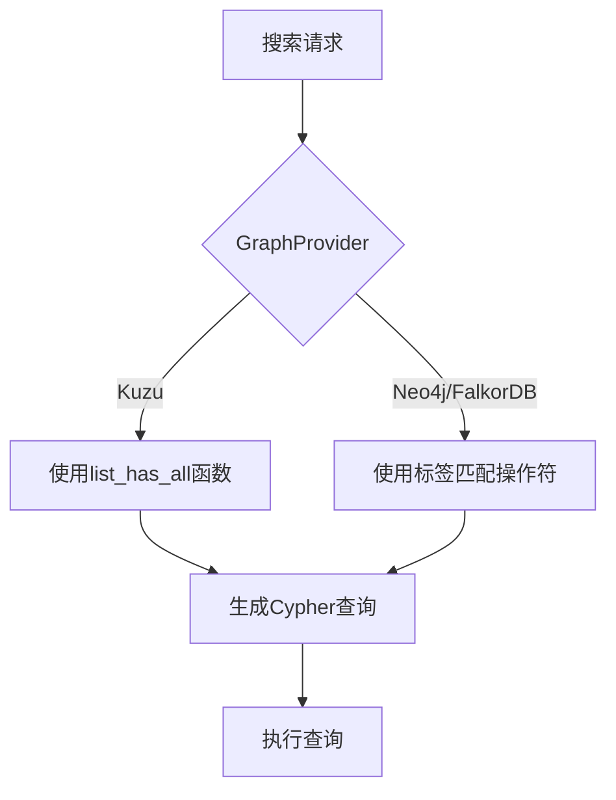
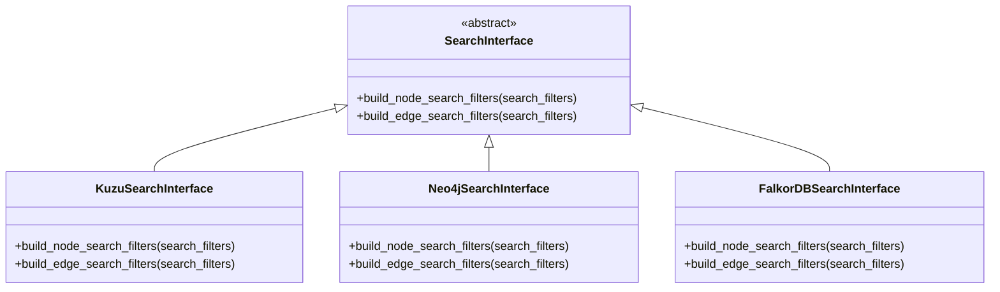

# 数据库适配差异

<cite>
**本文档中引用的文件**   
- [search_interface.py](file://graphiti_core/driver/search_interface/search_interface.py)
- [search_filters.py](file://graphiti_core/search/search_filters.py)
- [search_utils.py](file://graphiti_core/search/search_utils.py)
- [kuzu_driver.py](file://graphiti_core/driver/kuzu_driver.py)
- [neo4j_driver.py](file://graphiti_core/driver/neo4j_driver.py)
- [falkordb_driver.py](file://graphiti_core/driver/falkordb_driver.py)
- [driver.py](file://graphiti_core/driver/driver.py)
</cite>

## 目录
1. [引言](#引言)
2. [节点过滤器在不同图数据库间的适配差异](#节点过滤器在不同图数据库间的适配差异)
3. [Kuzu特有的list_has_all函数](#kuzu特有的list_has_all函数)
4. [搜索过滤接口的抽象设计](#搜索过滤接口的抽象设计)
5. [系统可扩展性与维护性分析](#系统可扩展性与维护性分析)
6. [结论](#结论)

## 引言

在图数据库系统中，不同数据库提供商（GraphProvider）在处理数据查询和过滤时存在显著的技术差异。本文档重点阐述节点过滤器在Kuzu、Neo4j和FalkorDB等不同图数据库间的适配差异，特别是标签过滤的实现方式。通过分析`search_interface.py`中的`build_node_search_filters`抽象方法，说明系统如何封装底层数据库差异，实现搜索过滤逻辑的可插拔设计。这种抽象层不仅提升了系统的可扩展性，也增强了代码的可维护性。

## 节点过滤器在不同图数据库间的适配差异

不同图数据库在处理标签过滤时采用了不同的技术方案。Kuzu、Neo4j和FalkorDB在标签存储和查询语法上存在根本性差异，这直接影响了节点过滤器的实现方式。

在Kuzu中，节点标签以列表形式存储在`labels`字段中，因此需要使用`list_has_all`函数来检查标签包含关系。而在Neo4j和FalkorDB中，标签是作为节点类型直接体现在图模式中的，查询时使用`:`操作符进行匹配。

这种差异在`search_filters.py`文件中的`node_search_filter_query_constructor`函数中得到了充分体现。该函数根据不同的`GraphProvider`生成相应的查询片段，实现了对底层数据库差异的封装。

**图来源**
- [search_filters.py](file://graphiti_core/search/search_filters.py#L68-L84)

**本节来源**
- [search_filters.py](file://graphiti_core/search/search_filters.py#L68-L84)
- [driver.py](file://graphiti_core/driver/driver.py#L41-L46)

## Kuzu特有的list_has_all函数

Kuzu图数据库特有的`list_has_all`函数在处理标签过滤时具有独特的优势。该函数用于检查一个列表是否包含所有指定的元素，在节点标签过滤场景中发挥着关键作用。

当需要过滤具有多个标签的节点时，`list_has_all`函数能够高效地完成这一任务。例如，在`search_filters.py`中，当`GraphProvider`为Kuzu时，系统会生成`list_has_all(n.labels, $labels)`这样的查询条件，其中`$labels`是参数化的标签列表。

这种设计的优势在于：
1. **灵活性**：可以轻松处理任意数量的标签过滤条件
2. **性能**：在Kuzu的向量化执行引擎下，列表操作具有良好的性能表现
3. **一致性**：与Kuzu将标签存储为字符串列表的数据模型完美匹配

相比之下，Neo4j和FalkorDB需要使用标签联合查询（如`n:Label1|Label2`）来实现类似功能，这在处理大量标签时可能导致查询复杂度增加。

**本节来源**
- [search_filters.py](file://graphiti_core/search/search_filters.py#L76-L78)
- [kuzu_driver.py](file://graphiti_core/driver/kuzu_driver.py#L46)

## 搜索过滤接口的抽象设计

系统通过`search_interface.py`中的`SearchInterface`类实现了搜索过滤逻辑的抽象设计。这一设计模式有效地封装了底层数据库的差异，提供了统一的接口供上层应用调用。

`SearchInterface`类定义了`build_node_search_filters`和`build_edge_search_filters`等抽象方法，这些方法的具体实现由各个数据库驱动负责。这种设计实现了"依赖倒置"原则，使得上层业务逻辑不依赖于具体的数据库实现。

在`search_utils.py`中，`node_fulltext_search`和`edge_fulltext_search`等函数通过`driver.search_interface`来调用相应的搜索接口，实现了运行时的多态性。这种可插拔的设计使得系统能够轻松支持新的图数据库，只需实现相应的搜索接口即可。

**图来源**
- [search_interface.py](file://graphiti_core/driver/search_interface/search_interface.py#L81-L86)
- [search_utils.py](file://graphiti_core/search/search_utils.py#L563-L646)

**本节来源**
- [search_interface.py](file://graphiti_core/driver/search_interface/search_interface.py#L81-L86)
- [search_utils.py](file://graphiti_core/search/search_utils.py#L177-L180)

## 系统可扩展性与维护性分析

通过抽象搜索接口的设计，系统在可扩展性和维护性方面获得了显著优势。这种设计模式遵循了"开闭原则"，即对扩展开放，对修改关闭。

当需要支持新的图数据库时，开发人员只需实现相应的`SearchInterface`，而无需修改现有的业务逻辑代码。这种模块化的设计大大降低了引入新数据库的风险，同时也简化了测试工作。

在维护性方面，由于数据库特定的逻辑被隔离在各自的驱动实现中，代码库更加清晰和易于理解。错误修复和性能优化可以针对特定的数据库驱动进行，而不会影响其他数据库的实现。

此外，这种抽象层还为系统提供了更好的测试能力。可以通过模拟（mock）搜索接口来编写单元测试，而无需依赖真实的数据库连接，从而提高了测试的效率和可靠性。

**本节来源**
- [search_interface.py](file://graphiti_core/driver/search_interface/search_interface.py)
- [search_utils.py](file://graphiti_core/search/search_utils.py#L170-L282)
- [driver.py](file://graphiti_core/driver/driver.py#L73-L116)

## 结论

本文档详细分析了节点过滤器在不同图数据库间的适配差异，重点阐述了Kuzu特有的`list_has_all`函数在标签过滤中的应用优势。通过`search_interface.py`中的抽象方法设计，系统成功封装了底层数据库的差异，实现了搜索过滤逻辑的可插拔架构。

这种设计不仅解决了不同图数据库在标签处理上的技术差异，还显著提升了系统的可扩展性和维护性。未来，这种抽象层设计模式可以作为系统架构的典范，应用于其他需要适配多种技术实现的场景中。