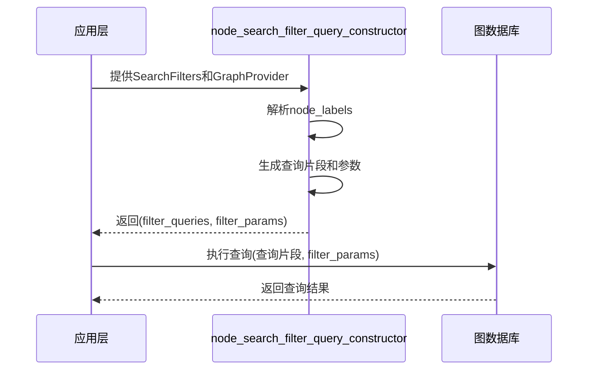
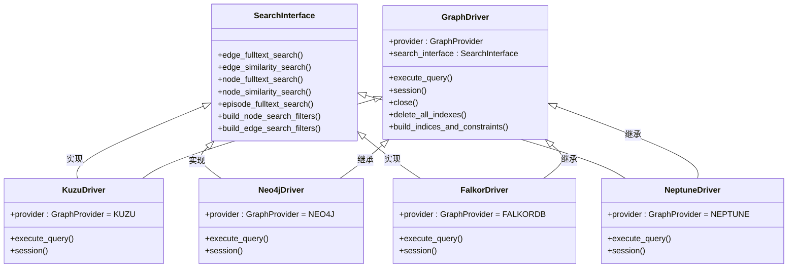
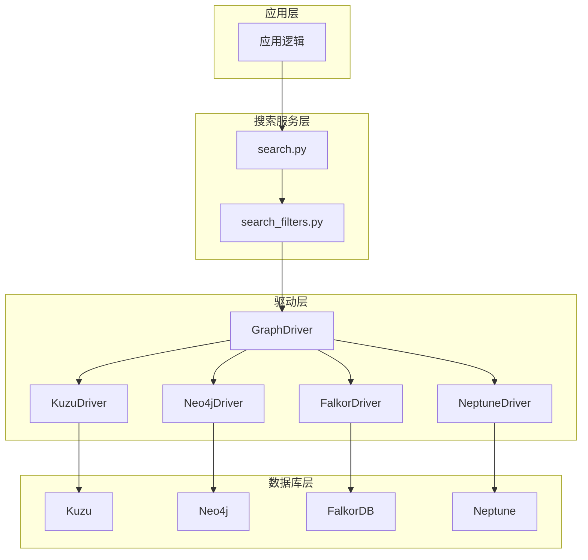
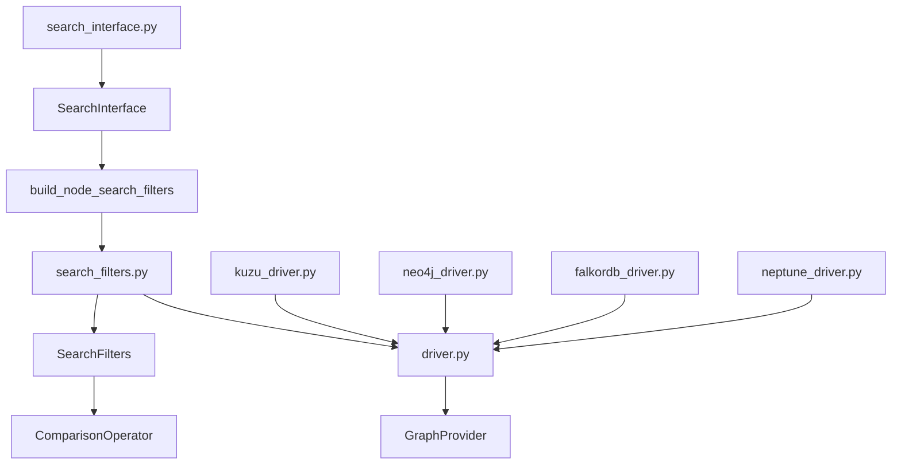

# 节点过滤器

<cite>
**本文档中引用的文件**  
- [search_filters.py](file://graphiti_core/search/search_filters.py)
- [search_interface.py](file://graphiti_core/driver/search_interface/search_interface.py)
- [kuzu_driver.py](file://graphiti_core/driver/kuzu_driver.py)
- [neo4j_driver.py](file://graphiti_core/driver/neo4j_driver.py)
- [falkordb_driver.py](file://graphiti_core/driver/falkordb_driver.py)
- [neptune_driver.py](file://graphiti_core/driver/neptune_driver.py)
- [driver.py](file://graphiti_core/driver/driver.py)
</cite>

## 目录
1. [简介](#简介)
2. [核心组件分析](#核心组件分析)
3. [node_search_filter_query_constructor函数详解](#node_search_filter_query_constructor函数详解)
4. [GraphProvider差异与list_has_all函数](#graphprovider差异与list_has_all函数)
5. [filter_params参数的安全机制](#filter_params参数的安全机制)
6. [接口抽象与实现协作模式](#接口抽象与实现协作模式)
7. [架构概览](#架构概览)
8. [依赖分析](#依赖分析)

## 简介
本文档深入分析`node_search_filter_query_constructor`函数的实现机制，重点阐述其如何根据`SearchFilters`中的`node_labels`字段生成对应的Cypher查询片段。文档详细说明了针对不同图数据库提供程序（GraphProvider）的查询构造差异，特别是Kuzu与其他数据库在`list_has_all`函数使用上的区别。同时，文档解释了`filter_params`参数的构建机制及其在防止Cypher注入攻击方面的安全意义，并结合`search_interface.py`中的`build_node_search_filters`方法，阐明了接口抽象与具体实现之间的协作模式。

## 核心组件分析

本文档分析的核心组件包括：
- `node_search_filter_query_constructor`：负责根据搜索过滤器生成Cypher查询片段的核心函数
- `SearchFilters`：定义搜索过滤条件的数据模型
- `GraphProvider`：枚举所有支持的图数据库提供程序
- `SearchInterface`：定义搜索功能的抽象接口
- 各种`GraphDriver`实现：如`KuzuDriver`、`Neo4jDriver`等，提供与具体图数据库的交互

**节段来源**
- [search_filters.py](file://graphiti_core/search/search_filters.py#L68-L84)
- [driver.py](file://graphiti_core/driver/driver.py#L42-L46)
- [search_interface.py](file://graphiti_core/driver/search_interface/search_interface.py#L22-L90)

## node_search_filter_query_constructor函数详解

`node_search_filter_query_constructor`函数是构建节点搜索查询的核心组件。该函数接收`SearchFilters`对象和`GraphProvider`枚举作为输入，返回一个包含查询片段的列表和一个包含参数的字典。

函数的主要逻辑如下：
1. 初始化`filter_queries`列表和`filter_params`字典
2. 检查`filters.node_labels`是否为非空
3. 根据不同的`GraphProvider`生成相应的查询片段
4. 将生成的查询片段添加到`filter_queries`列表中
5. 返回查询片段列表和参数字典

当`node_labels`字段存在时，函数会根据图数据库提供程序的不同生成不同的Cypher查询语法。对于Kuzu数据库，使用`list_has_all(n.labels, $labels)`函数来检查节点标签；对于其他数据库，则使用标准的Cypher标签匹配语法`n:label1|label2|label3`。

**节段来源**
- [search_filters.py](file://graphiti_core/search/search_filters.py#L68-L84)

## GraphProvider差异与list_has_all函数

不同图数据库提供程序在处理节点标签过滤时存在显著差异，这主要体现在`node_search_filter_query_constructor`函数的实现中。

```mermaid
graph TD
A[开始] --> B{node_labels是否为空?}
B --> |否| C[返回空查询]
B --> |是| D{GraphProvider类型?}
D --> |KUZU| E[使用list_has_all函数]
D --> |NEO4J/FALKORDB/NEPTUNE| F[使用标签联合语法]
E --> G[生成: list_has_all(n.labels, $labels)]
F --> H[生成: n:label1|label2|label3]
G --> I[返回查询片段]
H --> I
I --> J[结束]
```

**图表来源**
- [search_filters.py](file://graphiti_core/search/search_filters.py#L75-L82)

### Kuzu数据库的特殊处理
Kuzu数据库使用`list_has_all`函数来检查节点的标签列表是否包含指定的所有标签。这种设计反映了Kuzu将标签存储为字符串数组的内部数据结构。例如，当搜索标签为`["Person", "Employee"]`时，生成的查询片段为`list_has_all(n.labels, $labels)`，其中`$labels`是一个参数，其值为`["Person", "Employee"]`。

### 其他数据库的标准处理
对于Neo4j、FalkorDB和Neptune等数据库，采用标准的Cypher语法，通过管道符`|`连接多个标签，形成`n:Person|Employee`这样的查询片段。这种语法表示节点n必须具有Person或Employee标签中的至少一个。

这种差异体现了不同图数据库在数据模型和查询语言上的设计哲学：Kuzu更倾向于将标签视为可编程的集合，而其他数据库则将标签视为固定的分类。

**节段来源**
- [search_filters.py](file://graphiti_core/search/search_filters.py#L75-L82)
- [kuzu_driver.py](file://graphiti_core/driver/kuzu_driver.py#L93-L183)
- [neo4j_driver.py](file://graphiti_core/driver/neo4j_driver.py#L31-L118)

## filter_params参数的安全机制

`filter_params`参数在防止Cypher注入攻击方面起着至关重要的作用。该机制通过参数化查询的方式，将用户输入的数据与查询结构分离，从而有效防止恶意代码注入。



**图表来源**
- [search_filters.py](file://graphiti_core/search/search_filters.py#L72-L73)
- [kuzu_driver.py](file://graphiti_core/driver/kuzu_driver.py#L109-L131)

### 安全机制详解
1. **参数分离**：用户提供的标签列表被存储在`filter_params`字典中，而不是直接拼接到查询字符串中
2. **参数化查询**：在执行查询时，数据库驱动程序会将`$labels`这样的占位符替换为`filter_params`中对应的实际值
3. **类型安全**：`filter_params`中的值保持其原始数据类型（如字符串列表），避免了字符串拼接可能带来的类型混淆
4. **输入验证**：`SearchFilters`模型使用Pydantic进行输入验证，确保`node_labels`字段的类型和格式正确

这种方法不仅提高了安全性，还增强了查询的可重用性和性能，因为数据库可以缓存参数化查询的执行计划。

**节段来源**
- [search_filters.py](file://graphiti_core/search/search_filters.py#L72-L79)
- [kuzu_driver.py](file://graphiti_core/driver/kuzu_driver.py#L110-L112)

## 接口抽象与实现协作模式

系统通过`SearchInterface`抽象接口与具体`GraphDriver`实现的协作，实现了搜索功能的灵活性和可扩展性。



**图表来源**
- [search_interface.py](file://graphiti_core/driver/search_interface/search_interface.py#L22-L90)
- [driver.py](file://graphiti_core/driver/driver.py#L73-L116)

### 协作模式分析
1. **接口定义**：`SearchInterface`类定义了所有搜索相关方法的抽象接口，包括`build_node_search_filters`方法
2. **具体实现**：每个`GraphDriver`的具体实现（如`KuzuDriver`）继承自`GraphDriver`基类，并可以实现`SearchInterface`
3. **运行时绑定**：在运行时，根据配置的`GraphProvider`选择相应的驱动程序，从而使用对应的查询构造逻辑
4. **关注点分离**：接口定义了"做什么"，而具体实现定义了"如何做"，这种分离使得系统可以轻松支持新的图数据库

这种设计模式遵循了面向对象编程的开闭原则（对扩展开放，对修改关闭），使得添加新的图数据库支持变得简单而安全。

**节段来源**
- [search_interface.py](file://graphiti_core/driver/search_interface/search_interface.py#L82-L86)
- [driver.py](file://graphiti_core/driver/driver.py#L83-L116)

## 架构概览

整个系统的架构体现了分层设计和关注点分离的原则。从上到下分为应用层、搜索服务层、驱动层和数据库层。



**图表来源**
- [search.py](file://graphiti_core/search/search.py#L68-L183)
- [driver.py](file://graphiti_core/driver/driver.py#L73-L116)
- [search_filters.py](file://graphiti_core/search/search_filters.py#L68-L84)

## 依赖分析

系统中各组件之间的依赖关系清晰而有序，确保了模块间的低耦合和高内聚。



**图表来源**
- [search_filters.py](file://graphiti_core/search/search_filters.py#L23)
- [driver.py](file://graphiti_core/driver/driver.py#L42-L46)
- [search_interface.py](file://graphiti_core/driver/search_interface/search_interface.py#L28)
- [kuzu_driver.py](file://graphiti_core/driver/kuzu_driver.py#L22)
- [neo4j_driver.py](file://graphiti_core/driver/neo4j_driver.py#L24)
- [falkordb_driver.py](file://graphiti_core/driver/falkordb_driver.py#L36)
- [neptune_driver.py](file://graphiti_core/driver/neptune_driver.py#L27)

**节段来源**
- [search_filters.py](file://graphiti_core/search/search_filters.py#L1-L252)
- [driver.py](file://graphiti_core/driver/driver.py#L1-L125)
- [search_interface.py](file://graphiti_core/driver/search_interface/search_interface.py#L1-L90)