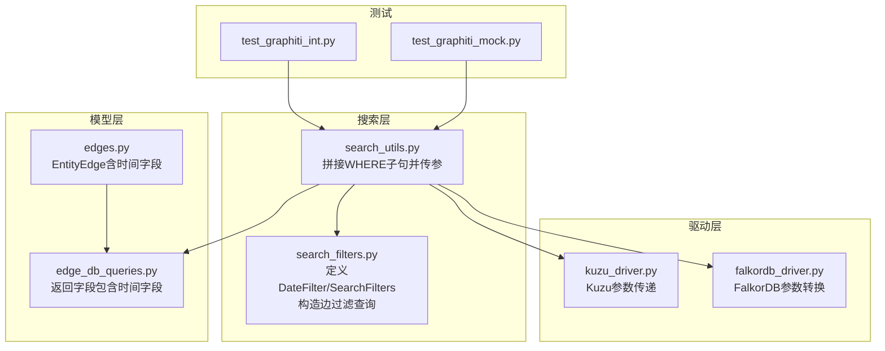
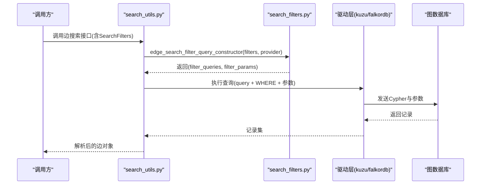
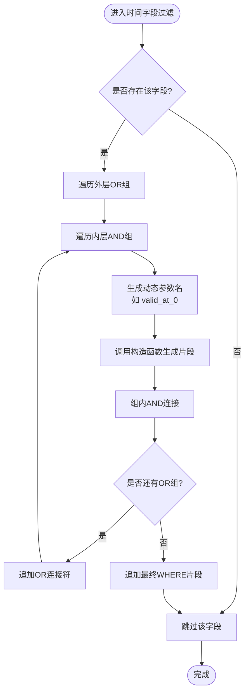
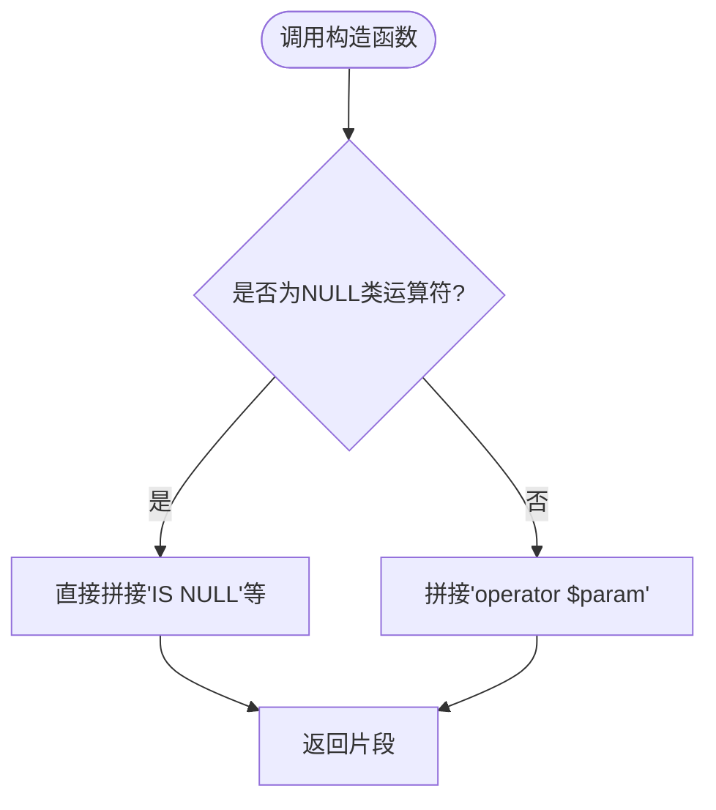
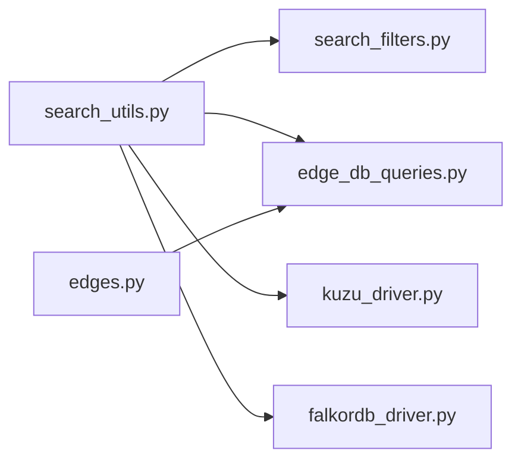
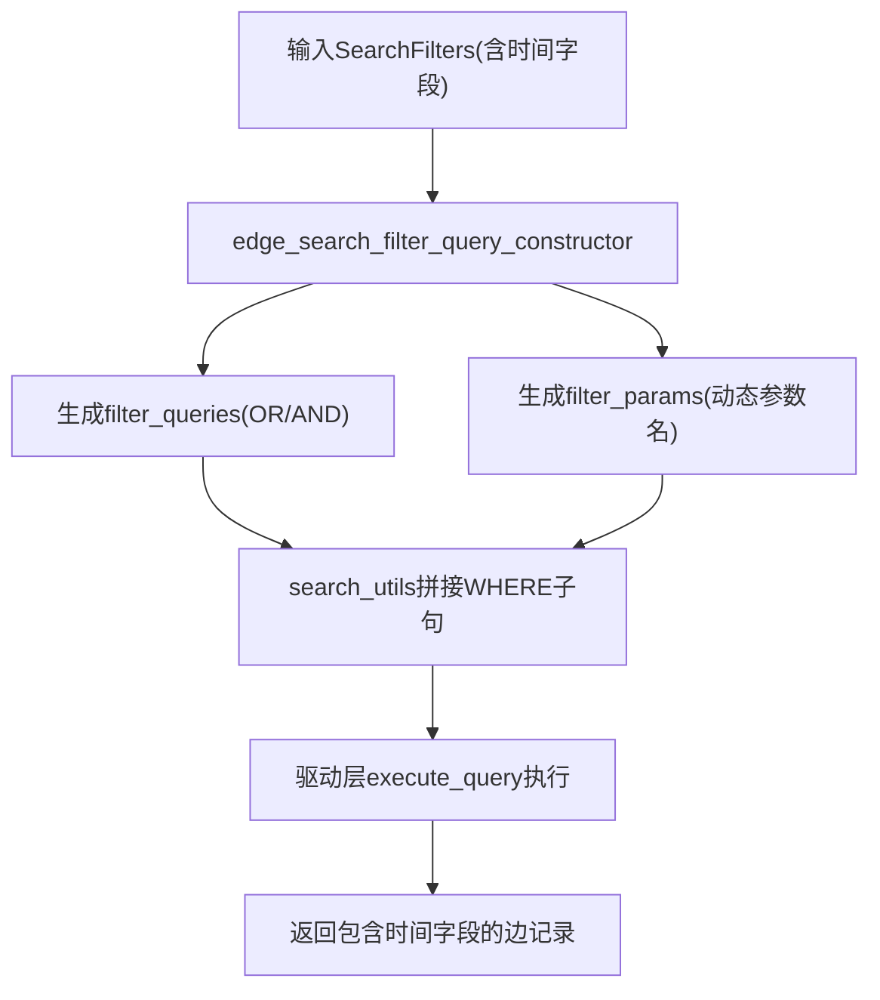

# 基于时间的边过滤

<cite>
**本文引用的文件**
- [search_filters.py](file://graphiti_core/search/search_filters.py)
- [search_utils.py](file://graphiti_core/search/search_utils.py)
- [edge_db_queries.py](file://graphiti_core/models/edges/edge_db_queries.py)
- [edges.py](file://graphiti_core/edges.py)
- [kuzu_driver.py](file://graphiti_core/driver/kuzu_driver.py)
- [falkordb_driver.py](file://graphiti_core/driver/falkordb_driver.py)
- [test_graphiti_int.py](file://tests/test_graphiti_int.py)
- [test_graphiti_mock.py](file://tests/test_graphiti_mock.py)
</cite>

## 目录
1. [引言](#引言)
2. [项目结构](#项目结构)
3. [核心组件](#核心组件)
4. [架构总览](#架构总览)
5. [详细组件分析](#详细组件分析)
6. [依赖关系分析](#依赖关系分析)
7. [性能考量](#性能考量)
8. [故障排查指南](#故障排查指南)
9. [结论](#结论)
10. [附录：最佳实践与示例](#附录最佳实践与示例)

## 引言
本文件围绕“基于时间的边过滤”主题，系统性阐述以下内容：
- 边实体中的时间字段语义：valid_at、invalid_at、created_at、expired_at 在历史查询与时点一致性中的作用。
- list[list[DateFilter]] 结构如何表达嵌套的 OR/AND 组合逻辑，并结合 date_filter_query_constructor 的递归构造过程进行解析。
- filter_params 中动态参数命名（如 valid_at_0）的生成机制及其在防止 SQL 注入方面的安全优势。
- 多层时间条件的构建方式与常见使用场景（如“查找在特定时间段内有效的边”“排除已过期的关系”）的最佳实践。

## 项目结构
与时间过滤相关的核心代码分布在如下模块：
- 搜索过滤定义与构造：graphiti_core/search/search_filters.py
- 搜索工具与查询拼装：graphiti_core/search/search_utils.py
- 边实体模型与返回字段：graphiti_core/edges.py、graphiti_core/models/edges/edge_db_queries.py
- 驱动层对时间参数的处理：graphiti_core/driver/kuzu_driver.py、graphiti_core/driver/falkordb_driver.py
- 测试用例验证时间过滤行为：tests/test_graphiti_int.py、tests/test_graphiti_mock.py

图表来源
- [search_filters.py](file://graphiti_core/search/search_filters.py#L36-L251)
- [search_utils.py](file://graphiti_core/search/search_utils.py#L170-L282)
- [edge_db_queries.py](file://graphiti_core/models/edges/edge_db_queries.py#L187-L223)
- [edges.py](file://graphiti_core/edges.py#L221-L316)
- [kuzu_driver.py](file://graphiti_core/driver/kuzu_driver.py#L109-L131)
- [falkordb_driver.py](file://graphiti_core/driver/falkordb_driver.py#L168-L200)
- [test_graphiti_int.py](file://tests/test_graphiti_int.py#L60-L81)
- [test_graphiti_mock.py](file://tests/test_graphiti_mock.py#L970-L1112)

章节来源
- [search_filters.py](file://graphiti_core/search/search_filters.py#L36-L251)
- [search_utils.py](file://graphiti_core/search/search_utils.py#L170-L282)
- [edge_db_queries.py](file://graphiti_core/models/edges/edge_db_queries.py#L187-L223)
- [edges.py](file://graphiti_core/edges.py#L221-L316)
- [kuzu_driver.py](file://graphiti_core/driver/kuzu_driver.py#L109-L131)
- [falkordb_driver.py](file://graphiti_core/driver/falkordb_driver.py#L168-L200)
- [test_graphiti_int.py](file://tests/test_graphiti_int.py#L60-L81)
- [test_graphiti_mock.py](file://tests/test_graphiti_mock.py#L970-L1112)

## 核心组件
- 时间字段语义
  - valid_at：关系在该时间点开始有效（时点一致性），用于“在某时刻成立”的边筛选。
  - invalid_at：关系在该时间点停止有效（时点一致性），用于“在某时刻失效”的边筛选。
  - created_at：关系创建时间，常用于按创建时间范围检索。
  - expired_at：关系过期时间，常用于排除已过期的关系。
- 过滤模型
  - DateFilter：包含日期值与比较运算符。
  - SearchFilters：支持 valid_at、invalid_at、created_at、expired_at 四个字段，类型为 list[list[DateFilter]]，以双重列表表达 OR/AND 组合。
- 查询构造
  - date_filter_query_constructor：将单个 DateFilter 转换为 Cypher 片段。
  - edge_search_filter_query_constructor：遍历 SearchFilters 的四个时间字段，逐层构造 AND/OR 子句，并将日期参数写入 filter_params，参数名采用“字段名_序号”的动态命名策略。

章节来源
- [search_filters.py](file://graphiti_core/search/search_filters.py#L36-L251)
- [edges.py](file://graphiti_core/edges.py#L221-L316)
- [edge_db_queries.py](file://graphiti_core/models/edges/edge_db_queries.py#L187-L223)

## 架构总览
下图展示了从调用到执行的关键流程：上层通过 SearchFilters 提供时间过滤条件，search_utils 将其拼接为 WHERE 子句并传给驱动层；驱动层负责参数传递与结果返回。

图表来源
- [search_utils.py](file://graphiti_core/search/search_utils.py#L170-L282)
- [search_filters.py](file://graphiti_core/search/search_filters.py#L100-L251)
- [kuzu_driver.py](file://graphiti_core/driver/kuzu_driver.py#L109-L131)
- [falkordb_driver.py](file://graphiti_core/driver/falkordb_driver.py#L168-L200)

## 详细组件分析

### 时间字段与语义
- valid_at/invalid_at
  - valid_at：关系在该时间点之后成立，可用于“在某时刻有效的边”筛选。
  - invalid_at：关系在该时间点之前成立，可用于“在某时刻失效的边”筛选。
- created_at/expired_at
  - created_at：用于按创建时间范围检索。
  - expired_at：用于排除已过期的关系，确保只返回仍有效的边。

章节来源
- [edges.py](file://graphiti_core/edges.py#L221-L316)
- [edge_db_queries.py](file://graphiti_core/models/edges/edge_db_queries.py#L187-L223)

### list[list[DateFilter]] 的 OR/AND 语义与构造
- 语义
  - 外层数组表示 OR 条件组；
  - 内层数组表示组内的 AND 条件。
- 构造流程
  - 遍历每个外层 OR 组，对组内每个 DateFilter 生成 Cypher 片段；
  - 组内用 AND 连接；
  - 不同 OR 组之间用 OR 连接；
  - 对于非空值比较，同时向 filter_params 写入动态参数。

图表来源
- [search_filters.py](file://graphiti_core/search/search_filters.py#L127-L250)

章节来源
- [search_filters.py](file://graphiti_core/search/search_filters.py#L127-L250)

### date_filter_query_constructor 的递归构造过程
- 输入：字段名、参数占位名、比较运算符
- 输出：形如“(e.field operator $param)”的 Cypher 片段
- 特殊处理：当运算符为 IS NULL 或 IS NOT NULL 时，不附加参数占位符

图表来源
- [search_filters.py](file://graphiti_core/search/search_filters.py#L86-L98)

章节来源
- [search_filters.py](file://graphiti_core/search/search_filters.py#L86-L98)

### 动态参数命名与安全优势
- 命名规则
  - 字段名 + 下划线 + 序号，例如 valid_at_0、invalid_at_1 等；
  - 仅在比较运算符为非空值时写入参数，避免注入风险。
- 安全性
  - 使用参数化查询，所有外部输入通过参数绑定，而非字符串拼接；
  - 非空值比较才注入参数，NULL 类型比较直接使用关键字，降低误注入可能。

章节来源
- [search_filters.py](file://graphiti_core/search/search_filters.py#L131-L156)
- [search_filters.py](file://graphiti_core/search/search_filters.py#L160-L187)
- [search_filters.py](file://graphiti_core/search/search_filters.py#L191-L218)
- [search_filters.py](file://graphiti_core/search/search_filters.py#L221-L249)

### 驱动层参数传递与兼容性
- KuzuDriver
  - 直接传递参数字典，无需额外转换。
- FalkorDriver
  - 将 datetime 对象转换为字符串后再传递，避免驱动不支持原生 datetime 的问题。

章节来源
- [kuzu_driver.py](file://graphiti_core/driver/kuzu_driver.py#L109-L131)
- [falkordb_driver.py](file://graphiti_core/driver/falkordb_driver.py#L168-L200)

### 实际调用链与返回字段
- search_utils 在多种搜索接口中调用 edge_search_filter_query_constructor，拼接 WHERE 子句并将 filter_params 作为命名参数传入驱动层；
- 返回字段包含 valid_at、invalid_at、created_at、expired_at，便于上层进行二次筛选或展示。

章节来源
- [search_utils.py](file://graphiti_core/search/search_utils.py#L170-L282)
- [edge_db_queries.py](file://graphiti_core/models/edges/edge_db_queries.py#L187-L223)

## 依赖关系分析
- 模块耦合
  - search_utils 依赖 search_filters 的查询构造函数；
  - edges.py 与 edge_db_queries.py 共同定义边实体的时间字段与返回字段；
  - 驱动层对参数传递有差异化处理，但对外统一通过 execute_query 接口。
- 外部依赖
  - 不同驱动对 datetime 的支持差异，需在驱动层做适配。

图表来源
- [search_utils.py](file://graphiti_core/search/search_utils.py#L170-L282)
- [search_filters.py](file://graphiti_core/search/search_filters.py#L100-L251)
- [edge_db_queries.py](file://graphiti_core/models/edges/edge_db_queries.py#L187-L223)
- [edges.py](file://graphiti_core/edges.py#L221-L316)
- [kuzu_driver.py](file://graphiti_core/driver/kuzu_driver.py#L109-L131)
- [falkordb_driver.py](file://graphiti_core/driver/falkordb_driver.py#L168-L200)

## 性能考量
- 复杂度
  - 对于每种时间字段，若存在 N 个 OR 组、每组平均 M 个 DateFilter，则构造复杂度约为 O(N*M)。
- 索引建议
  - 在数据库侧为 valid_at、invalid_at、created_at、expired_at 建立索引可显著提升范围查询性能（具体取决于所选驱动与图数据库能力）。
- 参数化查询
  - 使用动态参数名避免重复参数键冲突，同时保持查询可缓存性。

## 故障排查指南
- 常见问题
  - 参数键冲突：确保同一字段的多个 DateFilter 使用不同序号后缀（如 valid_at_0、valid_at_1）。
  - NULL 比较错误：使用 IS NULL/IS NOT NULL 运算符时不要附加参数值。
  - 驱动不支持 datetime：在 FalkorDB 场景下确认参数已被转换为字符串。
- 参考测试
  - 单元测试覆盖了多字段组合与边界情况，可对照定位问题。

章节来源
- [test_graphiti_int.py](file://tests/test_graphiti_int.py#L60-L81)
- [test_graphiti_mock.py](file://tests/test_graphiti_mock.py#L970-L1112)

## 结论
- 通过 list[list[DateFilter]] 的双层结构，系统实现了灵活的 OR/AND 时间条件组合；
- date_filter_query_constructor 保证了 Cypher 片段的安全与可维护；
- 动态参数命名机制在保证灵活性的同时，避免了 SQL 注入风险；
- 在不同驱动层的适配下，时间过滤可在多数据库环境中稳定运行。

## 附录：最佳实践与示例

### 最佳实践
- “查找在特定时间段内有效的边”
  - 使用 valid_at 的大于等于与 invalid_at 的小于等于组合，确保时点一致性。
  - 示例路径参考：[test_graphiti_mock.py](file://tests/test_graphiti_mock.py#L970-L1112)
- “排除已过期的关系”
  - 使用 expired_at 的不等于或为空判断，确保仅返回未过期的边。
  - 示例路径参考：[test_graphiti_mock.py](file://tests/test_graphiti_mock.py#L970-L1112)
- “按创建时间范围检索”
  - 使用 created_at 的范围比较，结合 group_id 等其他过滤条件。
  - 示例路径参考：[test_graphiti_int.py](file://tests/test_graphiti_int.py#L60-L81)

### 关键流程图（从输入到输出）

图表来源
- [search_filters.py](file://graphiti_core/search/search_filters.py#L100-L251)
- [search_utils.py](file://graphiti_core/search/search_utils.py#L170-L282)
- [edge_db_queries.py](file://graphiti_core/models/edges/edge_db_queries.py#L187-L223)