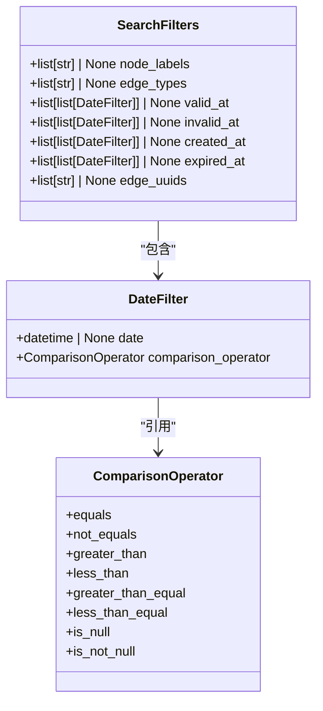
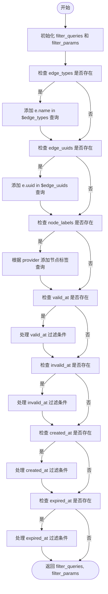
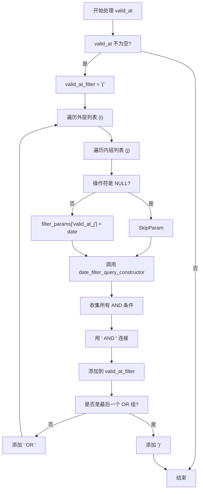
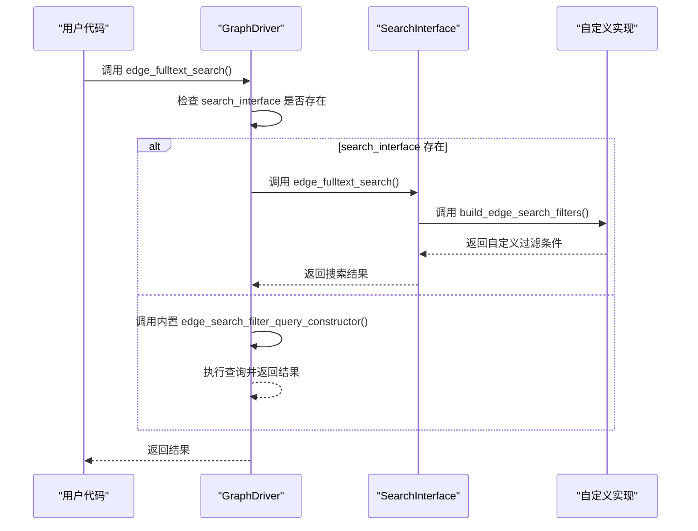

# 边过滤器

<cite>
**本文档中引用的文件**  
- [search_filters.py](file://graphiti_core/search/search_filters.py)
- [search_utils.py](file://graphiti_core/search/search_utils.py)
- [search_interface.py](file://graphiti_core/driver/search_interface/search_interface.py)
</cite>

## 目录
1. [简介](#简介)
2. [核心数据结构](#核心数据结构)
3. [边过滤查询构造逻辑](#边过滤查询构造逻辑)
4. [时间条件过滤机制](#时间条件过滤机制)
5. [嵌套OR/AND条件处理](#嵌套orand条件处理)
6. [动态参数命名策略](#动态参数命名策略)
7. [自定义边过滤扩展](#自定义边过滤扩展)

## 简介
本文档详细说明了`edge_search_filter_query_constructor`函数的实现逻辑，该函数用于构建图数据库中边（edge）的搜索过滤条件。该函数支持多种过滤维度，包括边类型、边UUID以及基于时间的有效性、失效性、创建时间和过期时间等条件。文档将深入解析其处理嵌套逻辑条件的机制，以及如何通过`date_filter_query_constructor`辅助函数递归构造复杂的日期过滤查询。

**Section sources**
- [search_filters.py](file://graphiti_core/search/search_filters.py#L99-L252)

## 核心数据结构
边过滤功能依赖于几个关键的数据结构，这些结构定义了过滤条件的类型和格式。

### SearchFilters 模型
`SearchFilters` 是一个 Pydantic 模型，用于封装所有可能的过滤条件。它包含以下字段：

- `node_labels`: 节点标签列表，用于过滤与特定标签节点相连的边。
- `edge_types`: 边类型列表，用于过滤特定类型的边。
- `valid_at`: 有效性时间过滤条件列表。
- `invalid_at`: 失效时间过滤条件列表。
- `created_at`: 创建时间过滤条件列表。
- `expired_at`: 过期时间过滤条件列表。
- `edge_uuids`: 边UUID列表，用于精确匹配特定的边。

### DateFilter 模型
`DateFilter` 模型定义了单个日期过滤条件，包含：
- `date`: 要比较的日期时间值。
- `comparison_operator`: 比较操作符，如等于、大于、小于等。

### ComparisonOperator 枚举
`ComparisonOperator` 枚举定义了所有可用的比较操作符，包括：
- `equals` (=)
- `not_equals` (<>)
- `greater_than` (>)
- `less_than` (<)
- `greater_than_equal` (>=)
- `less_than_equal` (<=)
- `is_null` (IS NULL)
- `is_not_null` (IS NOT NULL)



**Diagram sources**
- [search_filters.py](file://graphiti_core/search/search_filters.py#L44-L56)
- [search_filters.py](file://graphiti_core/search/search_filters.py#L37-L43)
- [search_filters.py](file://graphiti_core/search/search_filters.py#L26-L35)

**Section sources**
- [search_filters.py](file://graphiti_core/search/search_filters.py#L26-L56)

## 边过滤查询构造逻辑
`edge_search_filter_query_constructor` 函数是构建边过滤查询的核心。它接收 `SearchFilters` 对象和图数据库提供者（`GraphProvider`）作为输入，并返回一个包含查询片段和参数字典的元组。

### 函数签名
```python
def edge_search_filter_query_constructor(
    filters: SearchFilters,
    provider: GraphProvider,
) -> tuple[list[str], dict[str, Any]]:
```

### 处理流程
1. **初始化**: 创建两个空容器：`filter_queries`（存储查询片段）和 `filter_params`（存储参数值）。
2. **边类型过滤**: 如果 `filters.edge_types` 不为空，则生成 `e.name in $edge_types` 查询片段，并将边类型列表存入 `filter_params['edge_types']`。
3. **边UUID过滤**: 如果 `filters.edge_uuids` 不为空，则生成 `e.uuid in $edge_uuids` 查询片段，并将UUID列表存入 `filter_params['edge_uuids']`。
4. **节点标签过滤**: 如果 `filters.node_labels` 不为空，则根据图数据库提供者（Kùzu 或其他）生成相应的节点标签过滤查询。
5. **时间条件过滤**: 对 `valid_at`, `invalid_at`, `created_at`, `expired_at` 四个时间字段分别进行处理，调用内部逻辑生成相应的查询片段。



**Diagram sources**
- [search_filters.py](file://graphiti_core/search/search_filters.py#L100-L252)

**Section sources**
- [search_filters.py](file://graphiti_core/search/search_filters.py#L100-L252)

## 时间条件过滤机制
对于 `valid_at`, `invalid_at`, `created_at`, `expired_at` 等时间字段，系统采用 `list[list[DateFilter]]` 的嵌套列表结构来表示复杂的逻辑条件。

### 嵌套列表的语义
- **外层列表 (OR 逻辑)**: 外层列表中的每个元素代表一个独立的过滤条件组。这些组之间是 **OR** 逻辑关系。即，只要满足任意一个组的条件，该边就会被选中。
- **内层列表 (AND 逻辑)**: 每个组（即外层列表的一个元素）本身是一个 `list[DateFilter]`。这个内层列表中的所有 `DateFilter` 条件之间是 **AND** 逻辑关系。即，必须同时满足该组内的所有条件。

例如，`valid_at=[[DateFilter(date=t1, op='>'), DateFilter(date=t2, op='<')], [DateFilter(date=t3, op='=')]]` 表示：边的有效时间必须满足 `(t > t1 AND t < t2)` **OR** `(t = t3)`。

### date_filter_query_constructor 辅助函数
该函数负责将单个 `DateFilter` 对象转换为 Cypher 查询中的字符串片段。

```python
def date_filter_query_constructor(
    value_name: str, param_name: str, operator: ComparisonOperator
) -> str:
    query = '(' + value_name + ' '
    if operator in [is_null, is_not_null]:
        query += operator.value + ')'
    else:
        query += operator.value + ' ' + param_name + ')'
    return query
```

它接收要比较的字段名（如 `e.valid_at`）、参数名（如 `$valid_at_0`）和操作符，然后拼接成形如 `(e.valid_at > $valid_at_0)` 的查询片段。

**Section sources**
- [search_filters.py](file://graphiti_core/search/search_filters.py#L87-L98)
- [search_filters.py](file://graphiti_core/search/search_filters.py#L127-L252)

## 嵌套OR/AND条件处理
`edge_search_filter_query_constructor` 函数通过循环遍历 `list[list[DateFilter]]` 结构来实现嵌套的 OR/AND 逻辑。

### 处理逻辑
以 `valid_at` 字段为例：
1. 初始化一个空字符串 `valid_at_filter`，并以 `(` 开头。
2. 遍历外层列表 `filters.valid_at`，使用索引 `i` 记录当前是第几个 OR 组。
3. 对于每个 OR 组 (`or_list`)，遍历其内部的 `DateFilter` 列表。
4. 对于每个 `DateFilter`，如果操作符不是 `IS NULL` 或 `IS NOT NULL`，则将其 `date` 值存入 `filter_params`，参数名为 `valid_at_j`（`j` 是内层索引）。
5. 使用 `date_filter_query_constructor` 为该组内的每个 `DateFilter` 生成查询片段，并用 `AND` 连接，形成一个完整的 AND 条件组。
6. 将这个 AND 条件组添加到 `valid_at_filter` 中。
7. 如果不是最后一个 OR 组，则在后面添加 `OR`；如果是最后一个，则添加 `)` 闭合括号。

此过程确保了 `(AND组1) OR (AND组2) OR ...` 的正确逻辑结构。



**Diagram sources**
- [search_filters.py](file://graphiti_core/search/search_filters.py#L127-L157)

**Section sources**
- [search_filters.py](file://graphiti_core/search/search_filters.py#L127-L157)

## 动态参数命名策略
为了防止不同过滤条件的参数名冲突，系统采用了一套动态的参数命名策略。

### 命名规则
对于时间过滤条件，参数名采用 `{field_name}_{index}` 的格式，其中：
- `{field_name}` 是时间字段的名称，如 `valid_at`, `created_at`。
- `{index}` 是内层 `DateFilter` 列表的索引。

例如，`valid_at` 的第一个条件参数名为 `valid_at_0`，第二个为 `valid_at_1`。

### 实现方式
在代码中，通过字符串拼接实现：
```python
filter_params['valid_at_' + str(j)] = date_filter.date
```
这里的 `j` 是内层循环的索引。

### 在参数化查询中的作用
这种命名策略确保了每个日期值都被安全地作为参数传递给数据库查询，避免了SQL注入风险。生成的查询片段如 `e.valid_at > $valid_at_0`，其中 `$valid_at_0` 会在执行时被 `filter_params` 字典中对应的实际日期值替换。这不仅提高了安全性，也使得查询计划可以被数据库缓存和重用，提升了性能。

**Section sources**
- [search_filters.py](file://graphiti_core/search/search_filters.py#L135-L136)
- [search_filters.py](file://graphiti_core/search/search_filters.py#L166-L167)
- [search_filters.py](file://graphiti_core/search/search_filters.py#L197-L198)
- [search_filters.py](file://graphiti_core/search/search_filters.py#L228-L229)

## 自定义边过滤扩展
系统通过 `SearchInterface` 类提供了扩展自定义边过滤逻辑的可能性。

### build_edge_search_filters 接口方法
`SearchInterface` 类中定义了一个抽象方法 `build_edge_search_filters`：

```python
def build_edge_search_filters(self, search_filters: Any) -> Any:
    raise NotImplementedError
```

### 扩展机制
1. **实现接口**: 用户可以创建一个类，继承 `SearchInterface`，并重写 `build_edge_search_filters` 方法。
2. **自定义逻辑**: 在重写的方法中，用户可以实现完全自定义的过滤逻辑，例如集成外部搜索引擎、应用复杂的业务规则或使用不同的查询语言。
3. **注入使用**: 将自定义的 `SearchInterface` 实例注入到 `GraphDriver` 中。
4. **优先调用**: 当 `GraphDriver` 执行搜索时，如果检测到 `search_interface` 存在，它会优先调用该接口的 `edge_fulltext_search` 或 `edge_similarity_search` 等方法，这些方法内部会调用用户自定义的 `build_edge_search_filters` 来生成过滤条件。

这种方式使得核心的 `edge_search_filter_query_constructor` 逻辑可以被完全替换或增强，为系统提供了极大的灵活性和可扩展性。



**Diagram sources**
- [search_interface.py](file://graphiti_core/driver/search_interface/search_interface.py#L84-L86)
- [search_utils.py](file://graphiti_core/search/search_utils.py#L177-L180)
- [search_utils.py](file://graphiti_core/search/search_utils.py#L295-L305)

**Section sources**
- [search_interface.py](file://graphiti_core/driver/search_interface/search_interface.py#L84-L86)
- [search_utils.py](file://graphiti_core/search/search_utils.py#L177-L180)
- [search_utils.py](file://graphiti_core/search/search_utils.py#L295-L305)