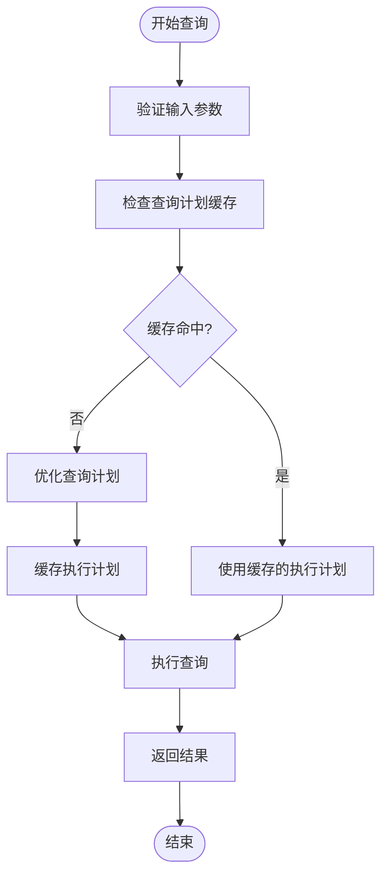

# 非时间属性的边过滤

<cite>
**本文档引用的文件**  
- [search_filters.py](file://graphiti_core/search/search_filters.py)
- [edge_db_queries.py](file://graphiti_core/models/edges/edge_db_queries.py)
- [kuzu_driver.py](file://graphiti_core/driver/kuzu_driver.py)
- [search.py](file://graphiti_core/search/search.py)
- [search_utils.py](file://graphiti_core/search/search_utils.py)
</cite>

## 目录
1. [引言](#引言)
2. [核心过滤条件实现逻辑](#核心过滤条件实现逻辑)
3. [Kuzu与其他图数据库的标签过滤差异](#kuzu与其他图数据库的标签过滤差异)
4. [自定义非时间过滤扩展](#自定义非时间过滤扩展)
5. [性能优化建议](#性能优化建议)
6. [结论](#结论)

## 引言
本文档全面阐述了在Graphiti图数据库系统中，`edge_types`、`edge_uuids`和`node_labels`等非时间过滤条件的实现逻辑。重点分析了这些过滤条件如何通过参数化查询机制实现高效的数据检索，并探讨了在不同图数据库后端（如Kuzu、FalkorDB、Neo4j等）上的语法差异处理。文档还介绍了如何通过`build_edge_search_filters`接口扩展自定义的非时间过滤逻辑，并提供了相关的性能优化建议。

## 核心过滤条件实现逻辑

### edge_types 类型匹配实现
`edge_types`过滤条件用于根据边的类型进行匹配。该功能通过`$edge_types`参数化查询实现，确保了查询的安全性和效率。

在`search_filters.py`文件中，`edge_search_filter_query_constructor`函数负责构建边的过滤查询。当`filters.edge_types`不为空时，系统会生成相应的查询语句：
```python
if filters.edge_types is not None:
    edge_types = filters.edge_types
    filter_queries.append('e.name in $edge_types')
    filter_params['edge_types'] = edge_types
```
此实现将边类型列表作为参数传递给查询引擎，避免了SQL注入风险，并允许数据库优化器对查询进行有效优化。

**Section sources**
- [search_filters.py](file://graphiti_core/search/search_filters.py#L107-L111)

### edge_uuids 精确边实例检索
`edge_uuids`过滤条件支持对特定边实例的精确检索。该功能同样通过参数化查询实现，确保能够快速定位到指定的边。

在`edge_search_filter_query_constructor`函数中，当`filters.edge_uuids`不为空时，系统会添加相应的过滤条件：
```python
if filters.edge_uuids is not None:
    filter_queries.append('e.uuid in $edge_uuids')
    filter_params['edge_uuids'] = filters.edge_uuids
```
这种实现方式允许用户通过提供一个UUID列表来精确检索一组特定的边，适用于需要对已知边进行操作的场景。

**Section sources**
- [search_filters.py](file://graphiti_core/search/search_filters.py#L112-L115)

### node_labels 跨节点标签约束
`node_labels`过滤条件用于在源节点和目标节点上施加标签约束。该功能需要考虑不同图数据库的语法差异。

在`edge_search_filter_query_constructor`函数中，根据不同的`GraphProvider`，系统会生成不同的查询语句：
- 对于Kuzu数据库，使用`list_has_all`函数：
```python
if provider == GraphProvider.KUZU:
    node_label_filter = (
        'list_has_all(n.labels, $labels) AND list_has_all(m.labels, $labels)'
    )
    filter_params['labels'] = filters.node_labels
```
- 对于其他数据库，使用Cypher风格的标签表达式：
```python
else:
    node_labels = '|'.join(filters.node_labels)
    node_label_filter = 'n:' + node_labels + ' AND m:' + node_labels
```
这种差异化处理确保了在不同图数据库后端上都能正确执行标签约束。

**Section sources**
- [search_filters.py](file://graphiti_core/search/search_filters.py#L116-L125)

## Kuzu与其他图数据库的标签过滤差异

### list_has_all 与 Cypher标签表达式的对比
Kuzu图数据库与其他主流图数据库（如Neo4j、FalkorDB）在标签过滤语法上存在显著差异。主要体现在以下方面：

| 特性 | Kuzu | Neo4j/FalkorDB |
|------|------|----------------|
| 标签存储 | 数组类型 | 节点标签 |
| 过滤函数 | `list_has_all(n.labels, $labels)` | `n:Label1\|Label2` |
| 语法风格 | SQL-like | Cypher |

Kuzu使用`list_has_all`函数来检查节点标签数组是否包含指定的所有标签，而Neo4j和FalkorDB则使用Cypher查询语言中的标签表达式。这种差异要求系统在生成查询时必须根据具体的数据库提供者进行适配。

```mermaid
classDiagram
class GraphProvider {
+KUZU
+FALKORDB
+NEO4J
+NEPTUNE
}
class SearchFilters {
+node_labels : list[str]
+edge_types : list[str]
+edge_uuids : list[str]
}
class edge_search_filter_query_constructor {
+build_query(filters, provider)
}
GraphProvider --> edge_search_filter_query_constructor : "决定查询语法"
SearchFilters --> edge_search_filter_query_constructor : "提供过滤条件"
edge_search_filter_query_constructor --> "Cypher Query" : "生成"
```

**Diagram sources**
- [search_filters.py](file://graphiti_core/search/search_filters.py#L76-L82)
- [search_filters.py](file://graphiti_core/search/search_filters.py#L117-L124)

## 自定义非时间过滤扩展

### build_edge_search_filters 接口分析
`build_edge_search_filters`接口为系统提供了扩展自定义非时间过滤逻辑的能力。该接口位于`search_interface.py`文件中，允许开发者根据特定需求实现自定义的过滤逻辑。

虽然具体的实现细节未在提供的代码片段中完全展示，但从`edge_search_filter_query_constructor`函数的设计可以看出，系统采用了模块化的过滤构建方式。开发者可以通过实现类似的接口来添加新的过滤条件，例如基于边属性的复杂过滤或基于业务逻辑的自定义过滤。

这种设计模式使得系统具有良好的可扩展性，能够适应不同应用场景下的过滤需求。

**Section sources**
- [search_interface.py](file://graphiti_core/driver/search_interface/search_interface.py#L84)

## 性能优化建议

### 索引配置最佳实践
为了提高非时间过滤条件的查询性能，建议进行以下索引配置：

1. **边类型索引**：在`e.name`字段上创建索引，以加速`edge_types`过滤。
2. **边UUID索引**：确保`e.uuid`字段具有唯一索引，以优化`edge_uuids`的精确检索。
3. **节点标签索引**：在`n.labels`和`m.labels`字段上创建适当的索引，以提高标签约束的执行效率。

对于Kuzu数据库，由于其特殊的边存储模式（使用中间节点`RelatesToNode_`），还需要在中间节点的相关字段上创建索引。

### 参数化查询最佳实践
使用参数化查询不仅提高了安全性，还能带来性能优势：

1. **查询计划缓存**：数据库可以缓存参数化查询的执行计划，减少查询解析和优化的开销。
2. **批量处理**：对于`IN`操作符，建议将多个值作为数组参数传递，而不是拼接SQL字符串。
3. **参数复用**：在多个查询中复用相同的参数，可以进一步提高缓存命中率。



**Diagram sources**
- [search_filters.py](file://graphiti_core/search/search_filters.py#L107-L115)
- [kuzu_driver.py](file://graphiti_core/driver/kuzu_driver.py#L30-L90)

## 结论
本文档详细分析了Graphiti系统中非时间属性的边过滤实现逻辑。通过参数化查询机制，系统实现了安全高效的`edge_types`、`edge_uuids`和`node_labels`过滤功能。针对Kuzu与其他图数据库在标签过滤语法上的差异，系统采用了条件判断的方式进行适配。`build_edge_search_filters`接口为扩展自定义过滤逻辑提供了可能性。通过合理的索引配置和参数化查询最佳实践，可以显著提升过滤操作的性能。这些设计和实现确保了系统在不同图数据库后端上的兼容性和高效性。