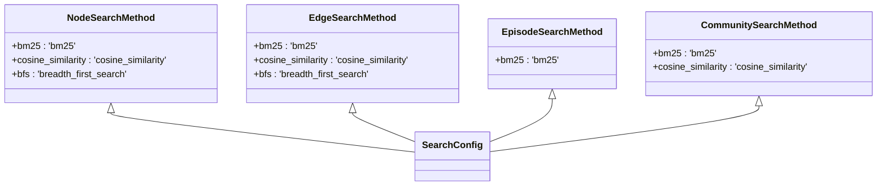
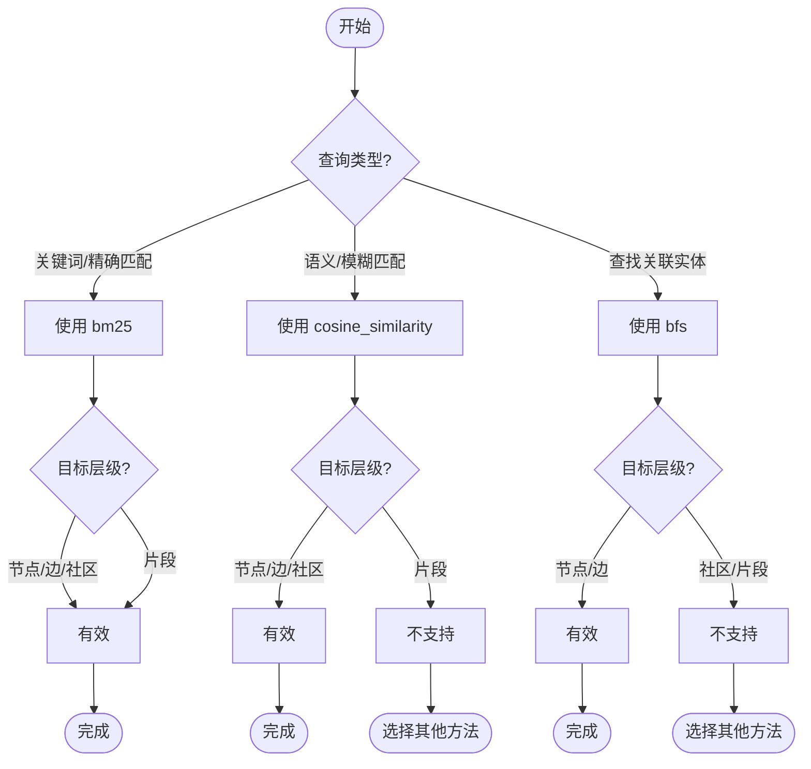
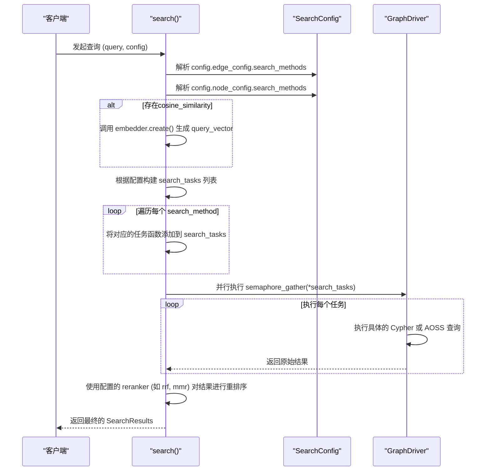

# 检索方法枚举类型

<cite>
**本文档引用的文件**  
- [search_config.py](file://graphiti_core/search/search_config.py)
- [search.py](file://graphiti_core/search/search.py)
- [search_utils.py](file://graphiti_core/search/search_utils.py)
- [search_config_recipes.py](file://graphiti_core/search/search_config_recipes.py)
- [search_filters.py](file://graphiti_core/search/search_filters.py)
</cite>

## 目录
1. [引言](#引言)
2. [检索方法枚举类型详解](#检索方法枚举类型详解)
3. [核心检索技术原理](#核心检索技术原理)
4. [不同层级对检索方法的支持差异](#不同层级对检索方法的支持差异)
5. [检索方法选择决策树](#检索方法选择决策树)
6. [性能考量与实践建议](#性能考量与实践建议)
7. [底层驱动解析与执行机制](#底层驱动解析与执行机制)
8. [结论](#结论)

## 引言
本文档系统化地文档化了 `NodeSearchMethod`、`EdgeSearchMethod`、`EpisodeSearchMethod` 和 `CommunitySearchMethod` 四个枚举类。我们将深入探讨 `cosine_similarity`（向量相似度）、`bm25`（关键词匹配）和 `bfs`（广度优先搜索）这三种核心检索技术的原理与适用场景。同时，本文将解释不同数据层级对这些检索方法的支持差异，提供一个选择合适检索方法的决策树，并结合延迟和资源消耗等性能考量给出实践建议。最后，我们将说明这些枚举值如何被底层驱动解析并执行实际查询。

**Section sources**
- [search_config.py](file://graphiti_core/search/search_config.py#L31-L51)

## 检索方法枚举类型详解
系统定义了四个独立的枚举类，分别对应图数据中的四种核心实体：节点（Node）、边（Edge）、片段（Episode）和社区（Community）。每个枚举类都定义了该实体类型所支持的检索方法。

**Diagram sources**
- [search_config.py](file://graphiti_core/search/search_config.py#L31-L51)

### NodeSearchMethod (节点检索方法)
`NodeSearchMethod` 枚举定义了对实体节点（EntityNode）进行检索的三种方式：
- `bm25`: 基于关键词的全文检索。
- `cosine_similarity`: 基于节点名称和摘要的向量相似度检索。
- `bfs`: 从指定源节点出发的广度优先搜索。

**Section sources**
- [search_config.py](file://graphiti_core/search/search_config.py#L38-L41)

### EdgeSearchMethod (边检索方法)
`EdgeSearchMethod` 枚举定义了对关系边（EntityEdge）进行检索的三种方式：
- `bm25`: 基于边的名称和事实（fact）的全文检索。
- `cosine_similarity`: 基于边的事实（fact）的向量相似度检索。
- `bfs`: 从指定源节点出发，沿边进行的广度优先搜索。

**Section sources**
- [search_config.py](file://graphiti_core/search/search_config.py#L32-L35)

### EpisodeSearchMethod (片段检索方法)
`EpisodeSearchMethod` 枚举目前仅支持一种检索方式：
- `bm25`: 基于片段内容（content）和来源描述（source_description）的全文检索。

**Section sources**
- [search_config.py](file://graphiti_core/search/search_config.py#L44-L45)

### CommunitySearchMethod (社区检索方法)
`CommunitySearchMethod` 枚举定义了对社区节点（CommunityNode）进行检索的两种方式：
- `bm25`: 基于社区名称的全文检索。
- `cosine_similarity`: 基于社区名称的向量相似度检索。

**Section sources**
- [search_config.py](file://graphiti_core/search/search_config.py#L48-L50)

## 核心检索技术原理
### cosine_similarity (向量相似度)
向量相似度检索利用嵌入模型（Embedding Model）将文本（如节点名称、边的事实）转换为高维向量。检索时，将查询文本也转换为向量，然后计算其与数据库中所有相关向量的余弦相似度。余弦相似度衡量两个向量在方向上的夹角，值越接近1，表示两个向量越相似。

**技术原理**:
1.  **嵌入生成**: 使用嵌入模型（如OpenAI、Gemini等）将文本转换为固定长度的浮点数向量。
2.  **相似度计算**: 在 `search_utils.py` 中，`calculate_cosine_similarity` 函数实现了余弦相似度的计算，公式为 `cos(θ) = (A·B) / (||A|| ||B||)`。
3.  **阈值过滤**: 只有相似度分数高于 `sim_min_score`（默认0.6）的结果才会被返回。

**适用场景**:
- 语义搜索：当查询与目标内容在语义上相近但关键词不完全匹配时（例如，用“汽车”搜索“轿车”）。
- 模糊匹配：处理拼写错误或同义词的情况。
- 基于上下文的检索。

**Section sources**
- [search_utils.py](file://graphiti_core/search/search_utils.py#L70-L81)
- [search_config.py](file://graphiti_core/search/search_config.py#L64)

### bm25 (关键词匹配)
BM25是一种广泛使用的全文检索算法，它基于词频（TF）、逆文档频率（IDF）和文档长度归一化来计算查询与文档的相关性分数。它是一种经典的关键词匹配技术。

**技术原理**:
1.  **查询解析**: 对查询字符串进行分词、去停用词等处理。
2.  **索引匹配**: 在预先建立的倒排索引中查找包含查询关键词的文档（节点、边、片段等）。
3.  **分数计算**: 根据BM25算法计算每个匹配文档的得分，得分越高表示相关性越强。
4.  **结果排序**: 按得分从高到低返回结果。

**适用场景**:
- 精确关键词搜索：当用户明确知道要搜索的关键词时。
- 快速检索：通常比向量检索更快，尤其是在处理短查询时。
- 处理长尾查询：对包含多个关键词的复杂查询有良好表现。

**Section sources**
- [search_utils.py](file://graphiti_core/search/search_utils.py#L84-L110)
- [search.py](file://graphiti_core/search/search.py#L203-L206)

### bfs (广度优先搜索)
广度优先搜索（BFS）是一种图遍历算法，它从一个或多个起始节点开始，逐层向外探索，直到达到指定的最大深度（`bfs_max_depth`）。

**技术原理**:
1.  **起始点**: 需要提供一个或多个起始节点的UUID（`bfs_origin_node_uuids`）。
2.  **层级遍历**: 算法首先访问起始节点的所有邻居（第一层），然后访问这些邻居的所有未访问过的邻居（第二层），以此类推。
3.  **深度限制**: 通过 `bfs_max_depth` 参数控制搜索的深度，防止搜索范围过大。
4.  **结果收集**: 在遍历过程中，收集所有访问到的符合条件的节点或边。

**适用场景**:
- 关系发现：查找与某个实体直接或间接相关的所有实体。
- 路径探索：发现两个实体之间的连接路径。
- 社交网络分析：分析用户之间的关系链。

**Section sources**
- [search_utils.py](file://graphiti_core/search/search_utils.py#L433-L553)
- [search.py](file://graphiti_core/search/search.py#L220-L222)

## 不同层级对检索方法的支持差异
不同的数据层级由于其数据特性和存储方式，对检索方法的支持存在显著差异。这种设计是基于性能和功能需求的权衡。

| 层级 | 支持的检索方法 | 不支持的方法 | 原因分析 |
| :--- | :--- | :--- | :--- |
| **节点 (Node)** | `bm25`, `cosine_similarity`, `bfs` | 无 | 节点是核心实体，拥有名称、摘要等丰富文本信息，适合多种检索方式。 |
| **边 (Edge)** | `bm25`, `cosine_similarity`, `bfs` | 无 | 边包含事实（fact）描述，同样支持文本和向量检索，并且是图遍历的基本单元。 |
| **社区 (Community)** | `bm25`, `cosine_similarity` | `bfs` | 社区通常作为聚合节点，其主要信息是名称和摘要，支持关键词和向量检索，但不作为BFS的遍历路径。 |
| **片段 (Episode)** | `bm25` | `cosine_similarity`, `bfs` | 片段是原始文本块，通常不进行向量化处理，且其本身不构成图的连接关系，因此不支持向量相似度和BFS。 |

**Section sources**
- [search_config.py](file://graphiti_core/search/search_config.py#L31-L51)
- [search.py](file://graphiti_core/search/search.py#L419-L465)

## 检索方法选择决策树
为了帮助开发者选择最合适的检索方法，以下是一个决策树：

**Diagram sources**
- [search_config.py](file://graphiti_core/search/search_config.py#L31-L51)

## 性能考量与实践建议
选择检索方法时，必须考虑其对系统性能的影响。

| 检索方法 | 延迟 | 资源消耗 | 实践建议 |
| :--- | :--- | :--- | :--- |
| **bm25** | 低 | 低 | 作为默认的快速检索方法，适用于大多数精确匹配场景。 |
| **cosine_similarity** | 中 | 中 | 需要调用嵌入模型生成向量，延迟较高。建议设置合理的 `sim_min_score` 以过滤低相关性结果。 |
| **bfs** | 高 | 高 | 搜索范围随深度指数级增长，资源消耗巨大。务必设置合理的 `bfs_max_depth`，并确保提供有效的 `bfs_origin_node_uuids`。 |

**综合建议**:
1.  **优先使用混合搜索**: 如 `COMBINED_HYBRID_SEARCH_RRF` 配置所示，同时使用 `bm25` 和 `cosine_similarity`，然后通过 `rrf`（互惠排名融合）等重排序器合并结果，可以兼顾速度和语义理解。
2.  **谨慎使用BFS**: 仅在明确需要探索关系链时使用，并严格限制搜索深度。
3.  **利用重排序器**: 使用 `cross_encoder` 等高级重排序器可以显著提升结果的相关性，但会增加延迟。

**Section sources**
- [search_config_recipes.py](file://graphiti_core/search/search_config_recipes.py#L34-L53)
- [search.py](file://graphiti_core/search/search.py#L255-L258)

## 底层驱动解析与执行机制
检索方法的执行是一个分层的过程，从高层配置到具体的数据库查询。

**Diagram sources**
- [search.py](file://graphiti_core/search/search.py#L68-L183)
- [search_utils.py](file://graphiti_core/search/search_utils.py#L170-L282)

**Section sources**
- [search.py](file://graphiti_core/search/search.py#L68-L183)
- [search_utils.py](file://graphiti_core/search/search_utils.py#L170-L282)

## 结论
`NodeSearchMethod`、`EdgeSearchMethod`、`EpisodeSearchMethod` 和 `CommunitySearchMethod` 这四个枚举类为系统提供了灵活且强大的检索能力。通过理解 `bm25`、`cosine_similarity` 和 `bfs` 三种技术的原理、适用场景和支持差异，开发者可以根据具体需求选择最优的检索策略。结合性能考量和底层执行机制，合理配置混合搜索和重排序器，可以在保证检索质量的同时，优化系统的响应速度和资源利用率。