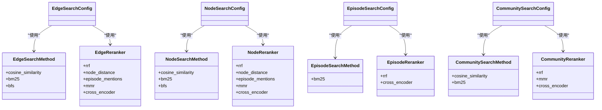

# 检索配置

<cite>
**本文档中引用的文件**  
- [search_config.py](file://graphiti_core/search/search_config.py)
- [search_filters.py](file://graphiti_core/search/search_filters.py)
- [search_config_recipes.py](file://graphiti_core/search/search_config_recipes.py)
- [search.py](file://graphiti_core/search/search.py)
- [search_utils.py](file://graphiti_core/search/search_utils.py)
</cite>

## 目录
1. [简介](#简介)
2. [核心配置类结构](#核心配置类结构)
3. [检索方法枚举类型](#检索方法枚举类型)
4. [过滤条件配置](#过滤条件配置)
5. [预定义配置配方](#预定义配置配方)
6. [Pydantic模型字段说明](#pydantic模型字段说明)
7. [配置示例](#配置示例)

## 简介
检索配置系统是Graphiti知识图谱的核心组件，用于定义和控制图谱中的信息检索行为。该系统通过分层的Pydantic模型结构，提供了对节点、边、社区和片段等不同类型实体的精细化检索控制。通过组合不同的检索方法和重排序策略，用户可以构建出适应不同场景的高效检索方案。

## 核心配置类结构

检索配置系统由多个嵌套的Pydantic模型组成，形成了一个层次化的配置结构。`SearchConfig`作为顶层配置类，包含了对四种实体类型（边、节点、片段、社区）的检索配置。每种实体类型都有其专用的配置类，如`EdgeSearchConfig`、`NodeSearchConfig`等，这些配置类定义了具体的检索参数和策略。

**Section sources**
- [search_config.py](file://graphiti_core/search/search_config.py#L112-L119)

## 检索方法枚举类型

系统定义了多种枚举类型来表示支持的检索方法和重排序策略。这些枚举类型为检索配置提供了类型安全的选项，确保配置的正确性和一致性。

**Diagram sources**
- [search_config.py](file://graphiti_core/search/search_config.py#L32-L78)

**Section sources**
- [search_config.py](file://graphiti_core/search/search_config.py#L32-L78)

## 过滤条件配置

`SearchFilters`类提供了对检索结果的多维度过滤能力，支持基于标签、类型和时间范围的精确过滤。通过`node_labels`和`edge_types`字段可以限制检索的实体范围，而时间相关的过滤字段（如`valid_at`、`invalid_at`等）则允许基于时间有效性的条件筛选。

**Diagram sources**
- [search_filters.py](file://graphiti_core/search/search_filters.py#L44-L56)

**Section sources**
- [search_filters.py](file://graphiti_core/search/search_filters.py#L44-L56)

## 预定义配置配方

系统提供了一系列预定义的配置配方，这些配方是经过优化的检索配置模板，可以直接使用或作为自定义配置的基础。配方通过组合不同的检索方法和重排序策略，针对特定的使用场景进行了优化。

**Diagram sources**
- [search_config_recipes.py](file://graphiti_core/search/search_config_recipes.py#L34-L224)

**Section sources**
- [search_config_recipes.py](file://graphiti_core/search/search_config_recipes.py#L34-L224)

## Pydantic模型字段说明

检索配置系统中的Pydantic模型包含多个关键字段，这些字段控制着检索行为的各个方面。每个配置类都包含`search_methods`字段来指定使用的检索方法，`reranker`字段来指定重排序策略，以及一系列参数字段来调整检索的详细行为。

| 配置类 | 字段 | 类型 | 默认值 | 说明 |
|-------|------|------|--------|------|
| EdgeSearchConfig | search_methods | list[EdgeSearchMethod] | - | 边检索使用的方法列表 |
| EdgeSearchConfig | reranker | EdgeReranker | rrf | 边检索结果的重排序策略 |
| EdgeSearchConfig | sim_min_score | float | 0.6 | 相似度检索的最小分数阈值 |
| EdgeSearchConfig | mmr_lambda | float | 0.5 | MMR重排序的λ参数 |
| EdgeSearchConfig | bfs_max_depth | int | 3 | BFS检索的最大深度 |
| NodeSearchConfig | search_methods | list[NodeSearchMethod] | - | 节点检索使用的方法列表 |
| NodeSearchConfig | reranker | NodeReranker | rrf | 节点检索结果的重排序策略 |
| NodeSearchConfig | sim_min_score | float | 0.6 | 相似度检索的最小分数阈值 |
| NodeSearchConfig | mmr_lambda | float | 0.5 | MMR重排序的λ参数 |
| NodeSearchConfig | bfs_max_depth | int | 3 | BFS检索的最大深度 |
| SearchConfig | limit | int | 10 | 每种实体类型返回的最大结果数 |
| SearchConfig | reranker_min_score | float | 0 | 重排序的最小分数阈值 |

**Section sources**
- [search_config.py](file://graphiti_core/search/search_config.py#L80-L119)

## 配置示例

以下示例展示了如何使用预定义的配置配方和自定义配置来执行检索操作。通过修改配置参数，可以灵活地调整检索行为以满足不同的需求。

**Diagram sources**
- [search_config_recipes.py](file://graphiti_core/search/search_config_recipes.py#L56-L78)
- [search_filters.py](file://graphiti_core/search/search_filters.py#L44-L56)

**Section sources**
- [quickstart_neo4j.py](file://examples/quickstart/quickstart_neo4j.py#L28-L208)