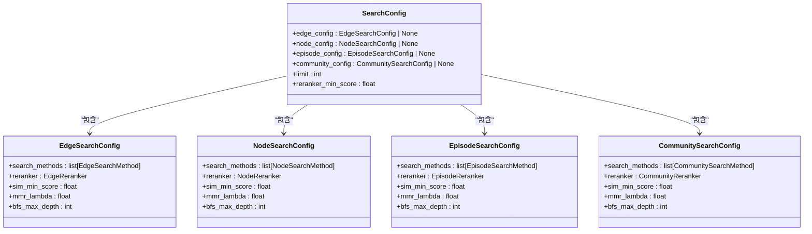
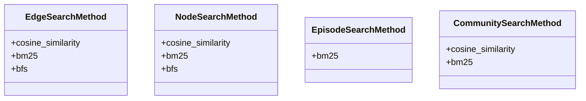
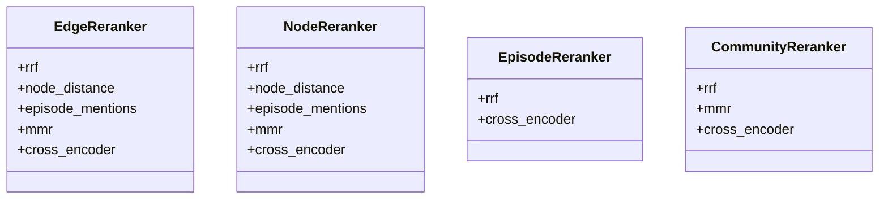
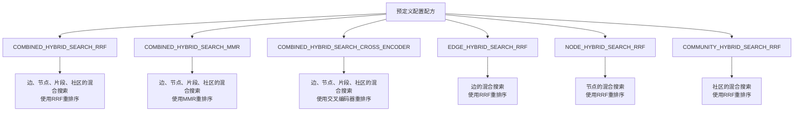
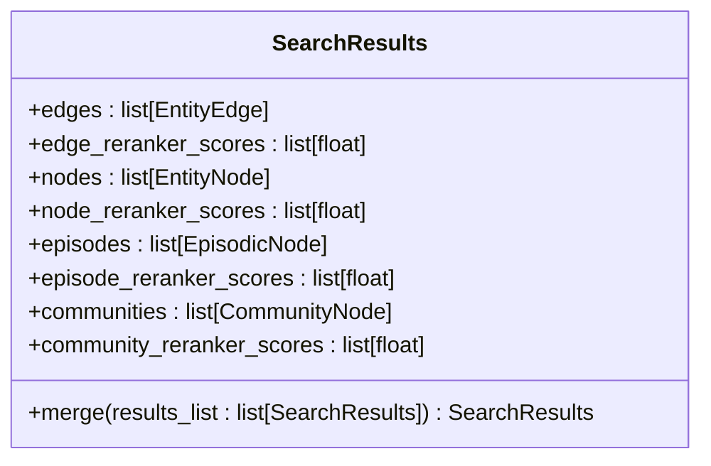
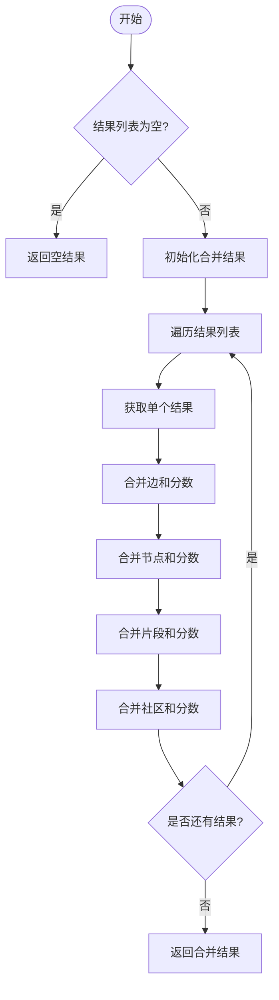
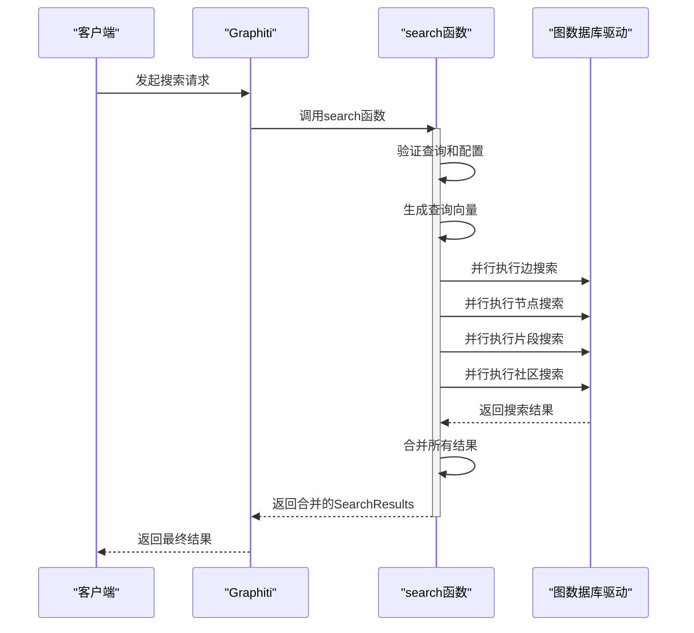
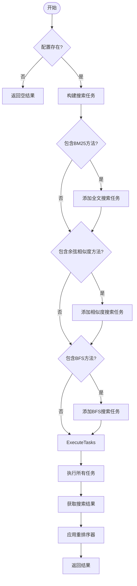
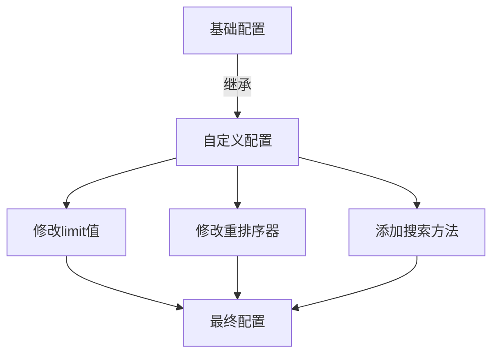

# 检索配置概述

<cite>
**本文档中引用的文件**  
- [search_config.py](file://graphiti_core/search/search_config.py)
- [search_config_recipes.py](file://graphiti_core/search/search_config_recipes.py)
- [search.py](file://graphiti_core/search/search.py)
- [graphiti.py](file://graphiti_core/graphiti.py)
- [search_utils.py](file://graphiti_core/search/search_utils.py)
</cite>

## 目录
1. [简介](#简介)
2. [SearchConfig类结构](#searchconfig类结构)
3. [核心配置字段详解](#核心配置字段详解)
4. [预定义配置配方](#预定义配置配方)
5. [检索结果合并机制](#检索结果合并机制)
6. [在Graphiti核心流程中的集成](#在graphiti核心流程中的集成)
7. [配置继承与覆盖](#配置继承与覆盖)
8. [实际应用示例](#实际应用示例)

## 简介
SearchConfig类是Graphiti检索系统的核心配置容器，负责协调节点、边、片段和社区的检索行为。该类通过结构化的配置参数，为不同类型的图元素提供灵活的搜索策略和排序机制。SearchConfig作为检索流程的控制中心，允许开发者根据具体应用场景定制搜索行为，包括选择搜索方法、配置重排序算法以及设置检索限制等参数。

**Section sources**
- [search_config.py](file://graphiti_core/search/search_config.py#L112-L119)

## SearchConfig类结构
SearchConfig类是一个基于Pydantic的配置模型，包含多个嵌套的配置类，用于控制不同图元素的检索行为。该类通过组合不同的搜索配置，实现了对图数据的精细化检索控制。



**Diagram sources**
- [search_config.py](file://graphiti_core/search/search_config.py#L80-L119)

**Section sources**
- [search_config.py](file://graphiti_core/search/search_config.py#L80-L119)

## 核心配置字段详解
SearchConfig类通过一系列字段来定义检索行为，每个字段都有明确的语义含义和默认值。

### 主要配置字段
| 字段 | 类型 | 默认值 | 语义含义 |
|------|------|--------|--------|
| edge_config | EdgeSearchConfig | None | 边的检索配置 |
| node_config | NodeSearchConfig | None | 节点的检索配置 |
| episode_config | EpisodeSearchConfig | None | 片段的检索配置 |
| community_config | CommunitySearchConfig | None | 社区的检索配置 |
| limit | int | 10 | 检索结果的最大数量 |
| reranker_min_score | float | 0 | 重排序器的最小分数阈值 |

### 搜索方法枚举
系统定义了多种搜索方法，用于不同类型的图元素：



**Diagram sources**
- [search_config.py](file://graphiti_core/search/search_config.py#L32-L51)

### 重排序器枚举
系统提供了多种重排序算法，用于优化检索结果的排序：



**Diagram sources**
- [search_config.py](file://graphiti_core/search/search_config.py#L53-L78)

**Section sources**
- [search_config.py](file://graphiti_core/search/search_config.py#L32-L78)

## 预定义配置配方
系统提供了一系列预定义的配置配方，这些配方是经过优化的SearchConfig实例，适用于常见的检索场景。

### 配方类型


**Diagram sources**
- [search_config_recipes.py](file://graphiti_core/search/search_config_recipes.py#L34-L223)

### 配方配置细节
| 配方名称 | 搜索方法 | 重排序器 | 适用场景 |
|---------|---------|---------|---------|
| COMBINED_HYBRID_SEARCH_RRF | BM25 + 余弦相似度 | RRF | 通用混合搜索 |
| COMBINED_HYBRID_SEARCH_MMR | BM25 + 余弦相似度 | MMR | 需要多样性结果的搜索 |
| COMBINED_HYBRID_SEARCH_CROSS_ENCODER | BM25 + 余弦相似度 + BFS | 交叉编码器 | 高精度语义搜索 |
| EDGE_HYBRID_SEARCH_RRF | BM25 + 余弦相似度 | RRF | 边的混合搜索 |
| NODE_HYBRID_SEARCH_RRF | BM25 + 余弦相似度 | RRF | 节点的混合搜索 |

**Section sources**
- [search_config_recipes.py](file://graphiti_core/search/search_config_recipes.py#L34-L223)

## 检索结果合并机制
SearchResults类提供了合并多个检索结果的功能，这对于分布式搜索或分阶段搜索场景非常重要。

### SearchResults类结构


**Diagram sources**
- [search_config.py](file://graphiti_core/search/search_config.py#L121-L160)

### 合并流程


**Diagram sources**
- [search_config.py](file://graphiti_core/search/search_config.py#L131-L159)

**Section sources**
- [search_config.py](file://graphiti_core/search/search_config.py#L121-L160)

## 在Graphiti核心流程中的集成
SearchConfig在Graphiti的核心检索流程中扮演着关键角色，它被传递给search函数以控制整个检索过程。

### 核心检索流程


**Diagram sources**
- [search.py](file://graphiti_core/search/search.py#L68-L183)
- [graphiti.py](file://graphiti_core/graphiti.py#L245-L277)

### 搜索方法执行逻辑


**Diagram sources**
- [search.py](file://graphiti_core/search/search.py#L186-L306)

**Section sources**
- [search.py](file://graphiti_core/search/search.py#L68-L306)

## 配置继承与覆盖
SearchConfig支持配置的继承和覆盖机制，允许在预定义配方的基础上进行定制化修改。

### 配置继承示例


**Diagram sources**
- [search_config.py](file://graphiti_core/search/search_config.py#L112-L119)
- [search_config_recipes.py](file://graphiti_core/search/search_config_recipes.py#L34-L223)

### 配置覆盖机制
系统通过Pydantic的model_copy方法实现配置的深拷贝和覆盖，确保原始配置配方不会被修改。

**Section sources**
- [search_config.py](file://graphiti_core/search/search_config.py#L112-L119)
- [search_config_recipes.py](file://graphiti_core/search/search_config_recipes.py#L34-L223)

## 实际应用示例
以下是在实际应用中使用SearchConfig的典型场景。

### 自定义搜索配置
```python
# 从预定义配方创建自定义配置
custom_config = NODE_HYBRID_SEARCH_RRF.model_copy(deep=True)
custom_config.limit = 5
custom_config.node_config.reranker = NodeReranker.mmr
```

### 在Graphiti中使用自定义配置
```python
# 使用自定义配置进行搜索
results = await graphiti._search(
    query='California Governor',
    config=custom_config,
)
```

**Section sources**
- [quickstart_neo4j.py](file://examples/quickstart/quickstart_neo4j.py#L28-L208)
- [search_config.py](file://graphiti_core/search/search_config.py#L112-L119)