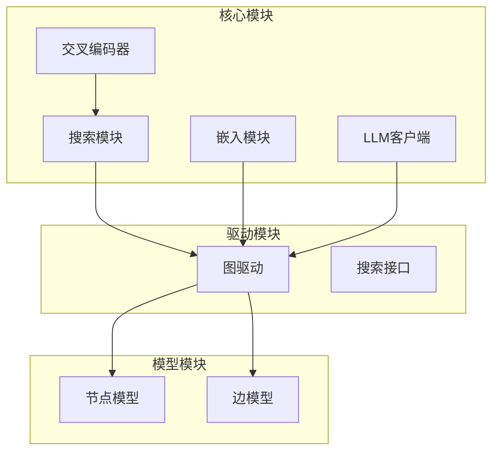
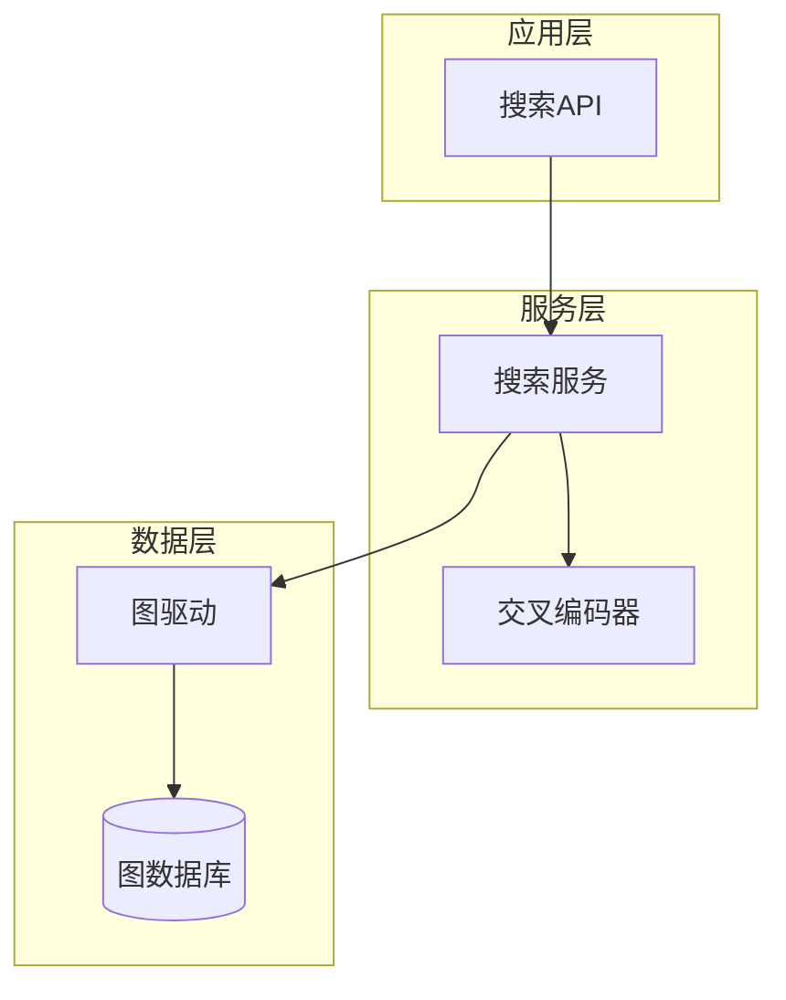
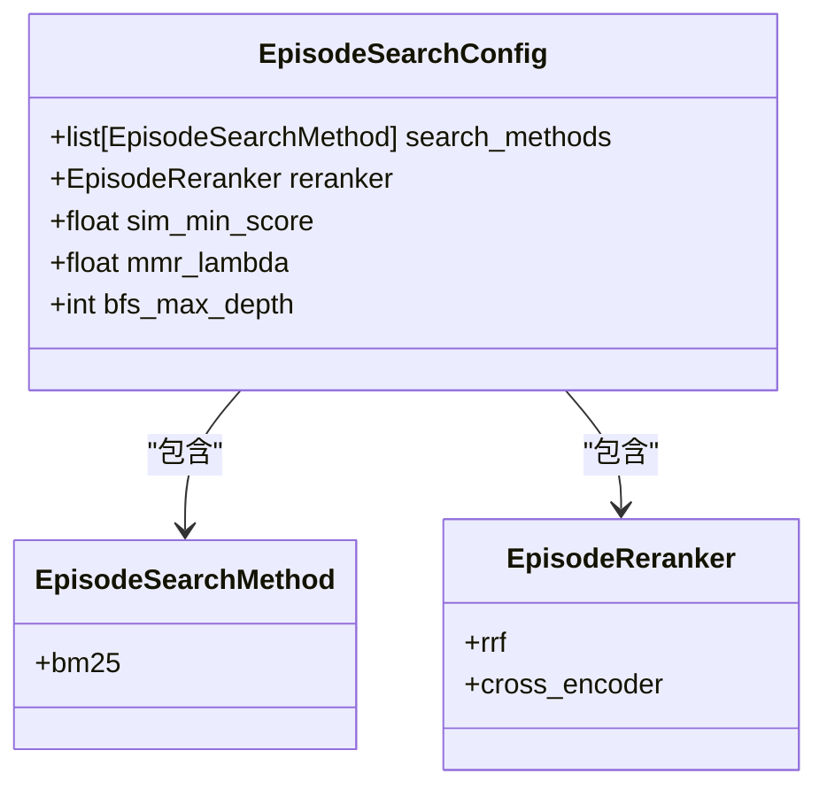
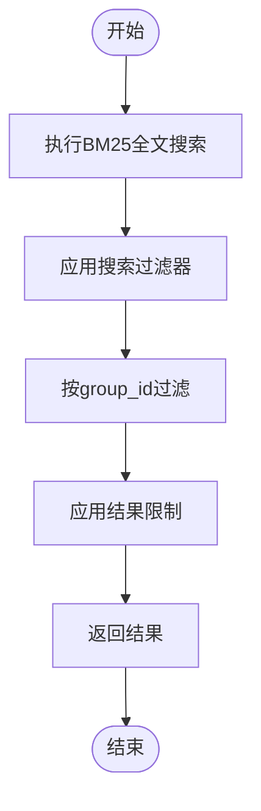
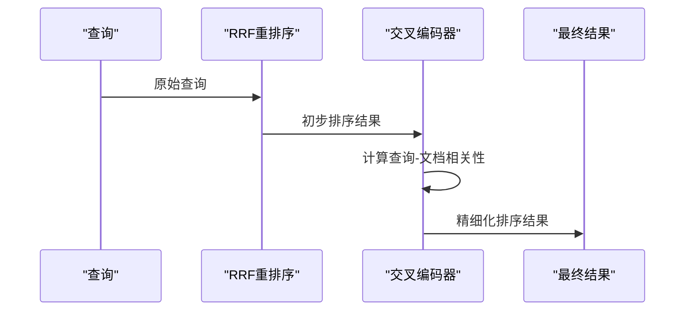
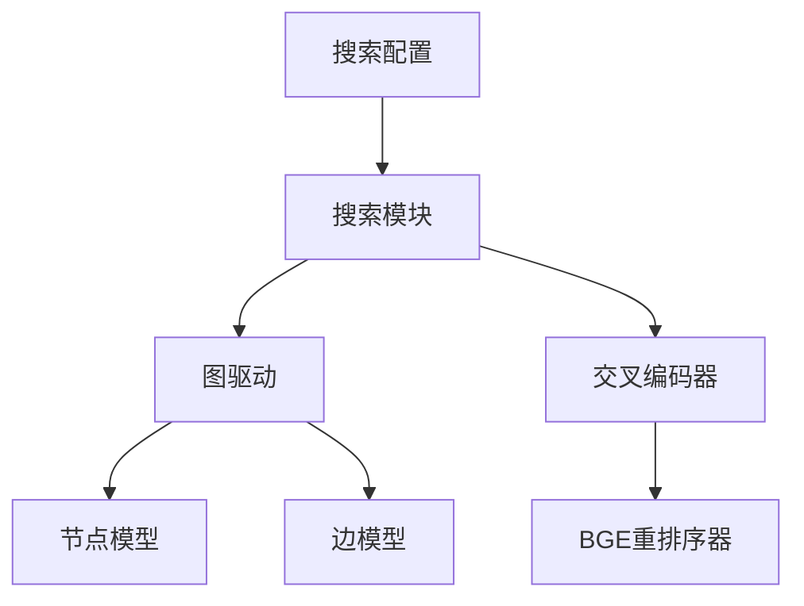

# 片段检索配置

<cite>
**本文档中引用的文件**
- [search_config.py](file://graphiti_core/search/search_config.py)
- [search_config_recipes.py](file://graphiti_core/search/search_config_recipes.py)
- [search.py](file://graphiti_core/search/search.py)
- [search_utils.py](file://graphiti_core/search/search_utils.py)
- [nodes.py](file://graphiti_core/nodes.py)
- [client.py](file://graphiti_core/cross_encoder/client.py)
- [bge_reranker_client.py](file://graphiti_core/cross_encoder/bge_reranker_client.py)
</cite>

## 目录
1. [简介](#简介)
2. [项目结构](#项目结构)
3. [核心组件](#核心组件)
4. [架构概述](#架构概述)
5. [详细组件分析](#详细组件分析)
6. [依赖分析](#依赖分析)
7. [性能考虑](#性能考虑)
8. [故障排除指南](#故障排除指南)
9. [结论](#结论)
10. [附录](#附录)（如有必要）

## 简介
本文档提供了关于EpisodicNode检索配置的权威指南，重点介绍EpisodeSearchConfig中的search_methods（仅限bm25）和reranker（rrf或cross_encoder）设置。文档解释了为何片段检索主要依赖全文匹配而非向量相似度，并说明了EpisodeReranker中交叉编码器重排序的应用场景，如对关键事件记录进行精细化排序。通过配置实例展示如何结合上下文相关性提升检索质量，并讨论其在时间序列数据查询中的作用。

## 项目结构
本项目采用模块化设计，主要分为核心功能模块和驱动模块。核心功能模块包括搜索、嵌入、LLM客户端等，驱动模块则负责与不同图数据库的交互。搜索配置和实现位于graphiti_core/search目录下，其中search_config.py定义了各种搜索方法和重排序器，search.py实现了具体的搜索逻辑。



**图源**
- [search_config.py](file://graphiti_core/search/search_config.py#L1-L161)
- [search.py](file://graphiti_core/search/search.py#L1-L520)

**节源**
- [search_config.py](file://graphiti_core/search/search_config.py#L1-L161)
- [search.py](file://graphiti_core/search/search.py#L1-L520)

## 核心组件
核心组件包括EpisodeSearchConfig、EpisodeReranker和EpisodicNode。EpisodeSearchConfig定义了片段检索的配置，包括搜索方法和重排序器。EpisodeReranker提供了rrf和cross_encoder两种重排序策略。EpisodicNode是存储时间序列事件的核心数据结构，包含内容、来源和时间戳等属性。

**节源**
- [search_config.py](file://graphiti_core/search/search_config.py#L96-L102)
- [nodes.py](file://graphiti_core/nodes.py#L295-L329)

## 架构概述
系统架构采用分层设计，从上到下分为应用层、服务层和数据层。应用层通过搜索API发起查询，服务层的搜索模块根据配置执行检索，数据层的图驱动与底层图数据库交互。交叉编码器作为独立服务提供精细化重排序能力。



**图源**
- [search.py](file://graphiti_core/search/search.py#L68-L183)
- [client.py](file://graphiti_core/cross_encoder/client.py#L17-L41)

## 详细组件分析

### EpisodeSearchConfig分析
EpisodeSearchConfig是片段检索的核心配置类，定义了搜索方法和重排序策略。其设计体现了对时间序列数据检索的特殊考虑。



**图源**
- [search_config.py](file://graphiti_core/search/search_config.py#L96-L102)
- [search_config.py](file://graphiti_core/search/search_config.py#L44-L46)
- [search_config.py](file://graphiti_core/search/search_config.py#L69-L72)

**节源**
- [search_config.py](file://graphiti_core/search/search_config.py#L96-L102)

### 全文检索与向量相似度对比
片段检索主要依赖BM25全文匹配而非向量相似度，这是由时间序列数据的特点决定的。全文匹配能更准确地定位特定事件记录，而向量相似度更适合语义相似性搜索。



**图源**
- [search_utils.py](file://graphiti_core/search/search_utils.py#L854-L938)
- [search.py](file://graphiti_core/search/search.py#L419-L465)

**节源**
- [search_utils.py](file://graphiti_core/search/search_utils.py#L854-L938)

### 交叉编码器重排序分析
交叉编码器重排序器用于对关键事件记录进行精细化排序，通过深度学习模型重新评估查询与文档的相关性。



**图源**
- [search.py](file://graphiti_core/search/search.py#L448-L462)
- [bge_reranker_client.py](file://graphiti_core/cross_encoder/bge_reranker_client.py#L34-L54)

**节源**
- [search.py](file://graphiti_core/search/search.py#L448-L462)

## 依赖分析
系统各组件之间存在明确的依赖关系。搜索模块依赖于图驱动进行数据访问，同时依赖于交叉编码器进行精细化重排序。配置模块为搜索模块提供检索策略。



**图源**
- [search.py](file://graphiti_core/search/search.py#L21-L44)
- [search_config.py](file://graphiti_core/search/search_config.py#L23-L27)

**节源**
- [search.py](file://graphiti_core/search/search.py#L21-L44)

## 性能考虑
片段检索的性能主要受全文搜索效率和重排序计算开销的影响。BM25搜索通常较快，而交叉编码器重排序由于需要深度学习推理，计算开销较大。建议在需要高精度排序的场景下使用交叉编码器，而在一般场景下使用RRF重排序以获得更好的性能。

## 故障排除指南
常见问题包括搜索结果不准确、重排序失败等。对于搜索结果不准确的问题，应检查查询语句和搜索配置；对于重排序失败的问题，应检查交叉编码器服务的可用性和网络连接。

**节源**
- [search.py](file://graphiti_core/search/search.py#L25-L26)
- [errors.py](file://graphiti_core/errors.py)

## 结论
EpisodicNode检索配置通过BM25全文搜索和灵活的重排序策略，为时间序列数据查询提供了高效准确的解决方案。RRF重排序适用于一般场景，而交叉编码器重排序则适用于需要高精度排序的关键事件分析。合理的配置选择能够显著提升检索质量和系统性能。

## 附录

### 配置实例
```python
# 使用RRF重排序的配置
episode_config_rrf = EpisodeSearchConfig(
    search_methods=[EpisodeSearchMethod.bm25],
    reranker=EpisodeReranker.rrf
)

# 使用交叉编码器重排序的配置
episode_config_cross = EpisodeSearchConfig(
    search_methods=[EpisodeSearchMethod.bm25],
    reranker=EpisodeReranker.cross_encoder
)
```

**节源**
- [search_config_recipes.py](file://graphiti_core/search/search_config_recipes.py#L43-L48)
- [search_config_recipes.py](file://graphiti_core/search/search_config_recipes.py#L98-L103)