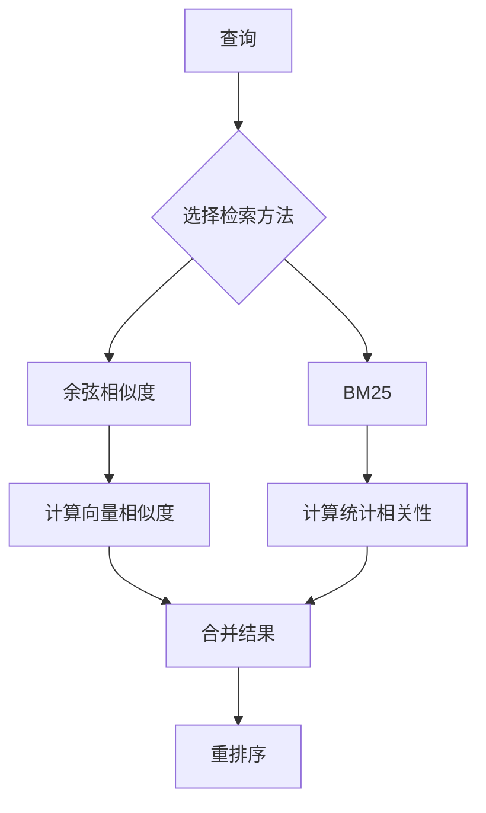
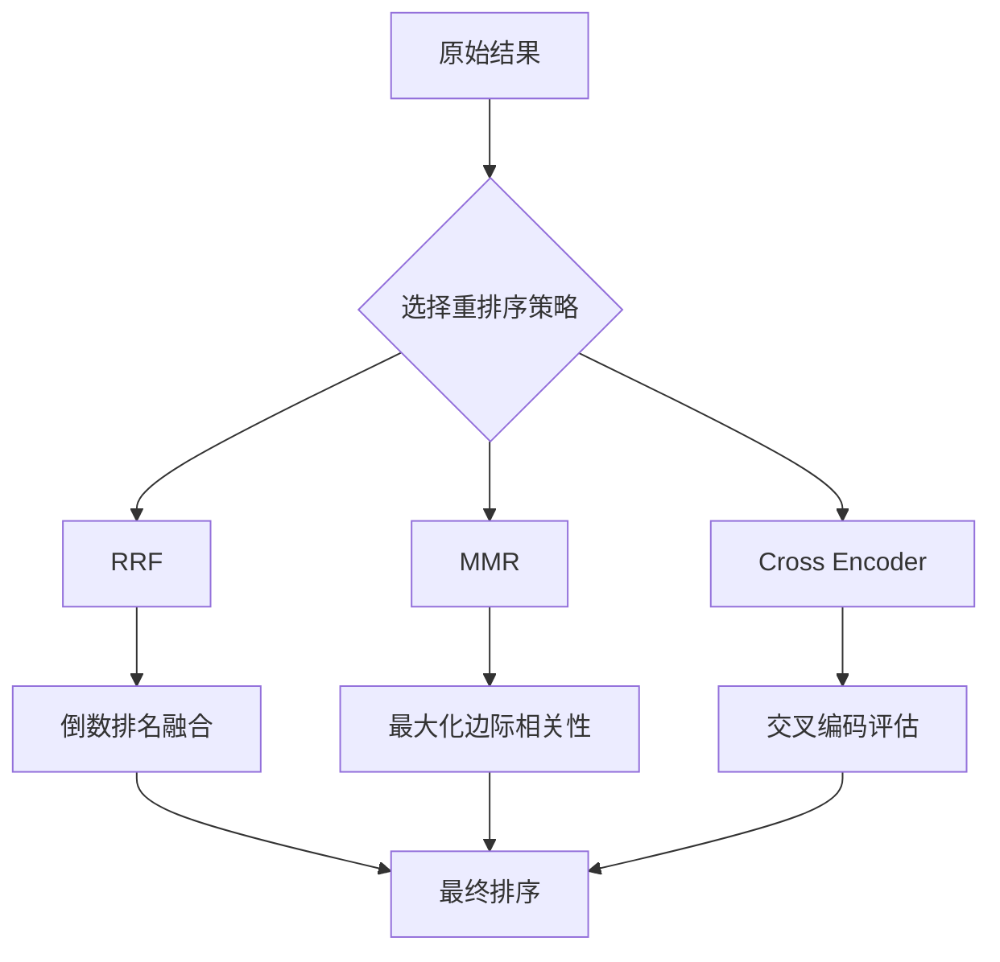
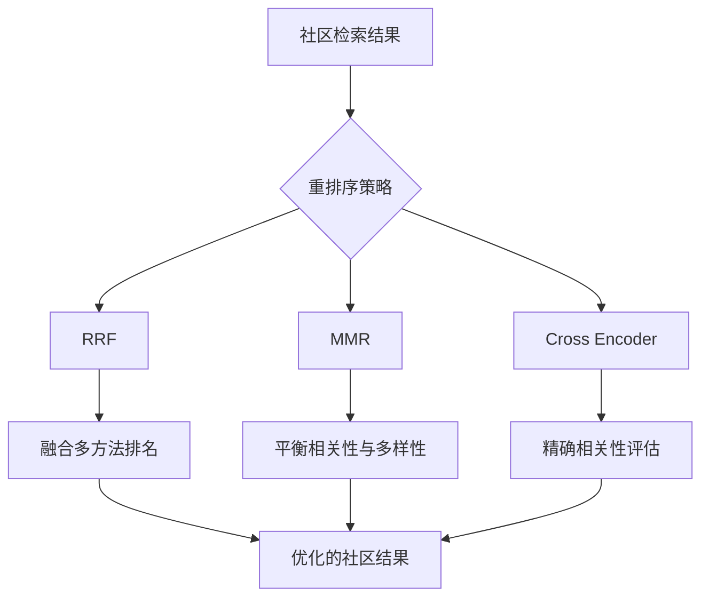

# 社区检索配置

<cite>
**本文档引用的文件**   
- [search_config.py](file://graphiti_core/search/search_config.py)
- [search_config_recipes.py](file://graphiti_core/search/search_config_recipes.py)
- [search.py](file://graphiti_core/search/search.py)
- [search_utils.py](file://graphiti_core/search/search_utils.py)
- [nodes.py](file://graphiti_core/nodes.py)
</cite>

## 目录
1. [简介](#简介)
2. [社区检索配置设计](#社区检索配置设计)
3. [检索方法](#检索方法)
4. [重排序策略](#重排序策略)
5. [社区节点聚合特性](#社区节点聚合特性)
6. [社区重排序器](#社区重排序器)
7. [配置案例](#配置案例)
8. [结论](#结论)

## 简介
本文档全面记录了CommunitySearchConfig的设计与用途，包括其支持的检索方法（cosine_similarity、bm25）和重排序策略（rrf、mmr、cross_encoder）。文档解释了社区节点在知识图谱中的聚合特性及其对检索策略的影响，说明了如何通过CommunityReranker平衡结果的相关性与多样性，特别是在处理大规模社区发现任务时的优化技巧。同时提供了配置案例，展示如何为高阶语义聚合查询定制搜索行为。

**Section sources**
- [search_config.py](file://graphiti_core/search/search_config.py#L1-L161)

## 社区检索配置设计
CommunitySearchConfig是Graphiti系统中用于配置社区节点检索行为的核心类。它继承自Pydantic的BaseModel，提供了类型安全和数据验证功能。该配置类允许用户定义社区检索的多种参数，包括检索方法、重排序策略、相似度最小分数、MMR lambda值和BFS最大深度。

社区检索配置的设计考虑了灵活性和性能平衡。通过支持多种检索方法的组合，系统能够适应不同的查询场景和数据特征。配置中的参数如sim_min_score和mmr_lambda允许用户根据具体需求调整检索的严格程度和多样性。

**Section sources**
- [search_config.py](file://graphiti_core/search/search_config.py#L104-L109)

## 检索方法
社区检索支持两种主要的检索方法：cosine_similarity和bm25。cosine_similarity方法基于向量空间模型，通过计算查询向量与社区节点名称嵌入向量之间的余弦相似度来评估相关性。这种方法特别适合处理语义相似性查询，能够捕捉到词汇之外的语义关联。

bm25方法是一种基于统计的全文检索算法，它考虑了词频、逆文档频率和字段长度等因素。在社区检索中，bm25用于对社区名称和摘要进行全文搜索，能够有效处理关键词匹配场景。两种方法的结合使用（混合搜索）可以同时利用语义和关键词匹配的优势，提高检索的全面性和准确性。



**Diagram sources **
- [search_config.py](file://graphiti_core/search/search_config.py#L48-L51)
- [search.py](file://graphiti_core/search/search.py#L468-L520)

## 重排序策略
社区检索支持三种重排序策略：rrf（Reciprocal Rank Fusion）、mmr（Maximal Marginal Relevance）和cross_encoder。rrf策略通过融合多个检索结果的排名来生成最终排序，它对每个结果的排名位置进行倒数加权，然后求和，这种方法简单有效，能够平衡不同检索方法的结果。

mmr策略旨在最大化结果的相关性与多样性。它通过考虑查询与文档的相关性以及文档之间的相似性来选择结果，公式为：MMR = λ * QuerySimilarity - (1-λ) * MaxDocumentSimilarity。其中λ参数（mmr_lambda）控制相关性与多样性的平衡。

cross_encoder策略使用交叉编码器模型对查询和候选社区进行联合编码，然后计算相关性分数。这种方法通常能提供最精确的相关性评估，但计算成本较高。



**Diagram sources **
- [search_config.py](file://graphiti_core/search/search_config.py#L74-L77)
- [search.py](file://graphiti_core/search/search.py#L468-L520)

## 社区节点聚合特性
社区节点在知识图谱中代表了实体节点的聚合，它们通过HAS_MEMBER关系与成员节点连接。这种聚合特性使得社区节点能够代表一组相关实体的共同特征和主题。在检索过程中，社区节点的聚合特性带来了两个重要影响：一是提高了检索的抽象层次，允许用户查询更高层次的概念；二是增强了结果的语义连贯性，因为同一社区内的节点通常具有相似的主题或功能。

社区节点的聚合还影响了检索的效率和效果。由于社区节点数量通常远少于实体节点，对社区的检索可以显著减少搜索空间，提高查询性能。同时，社区的语义聚合特性使得基于社区的检索能够更好地支持主题发现和概念探索等高级查询需求。

**Section sources**
- [nodes.py](file://graphiti_core/nodes.py#L591-L728)

## 社区重排序器
CommunityReranker是专门针对社区检索设计的重排序组件，它通过平衡结果的相关性与多样性来优化检索质量。在处理大规模社区发现任务时，CommunityReranker采用多种优化技巧来提高性能和效果。

对于rrf策略，系统通过并行执行多种检索方法，然后融合结果排名，确保了不同检索视角的平衡。对于mmr策略，系统通过预计算社区名称的嵌入向量，并在重排序时利用这些向量计算相似度，实现了高效的相关性与多样性平衡。对于cross_encoder策略，系统采用分层处理方法，先使用快速方法筛选候选集，再用cross_encoder进行精细排序，从而在保证质量的同时控制计算成本。



**Diagram sources **
- [search.py](file://graphiti_core/search/search.py#L497-L518)
- [search_utils.py](file://graphiti_core/search/search_utils.py#L1733-L1876)

## 配置案例
以下是一些社区检索配置的实用案例，展示了如何为不同场景定制搜索行为：

1. **高阶语义聚合查询**：使用混合搜索（cosine_similarity和bm25）结合cross_encoder重排序，适用于需要高精度语义理解的复杂查询。
```python
COMMUNITY_HYBRID_SEARCH_CROSS_ENCODER = SearchConfig(
    community_config=CommunitySearchConfig(
        search_methods=[CommunitySearchMethod.bm25, CommunitySearchMethod.cosine_similarity],
        reranker=CommunityReranker.cross_encoder,
    ),
    limit=3,
)
```

2. **主题探索查询**：使用混合搜索结合mmr重排序，适用于需要发现多样化主题的探索性查询。
```python
COMMUNITY_HYBRID_SEARCH_MMR = SearchConfig(
    community_config=CommunitySearchConfig(
        search_methods=[CommunitySearchMethod.bm25, CommunitySearchMethod.cosine_similarity],
        reranker=CommunityReranker.mmr,
    )
)
```

3. **快速关键词查询**：使用rrf重排序，适用于需要快速响应的简单关键词查询。
```python
COMMUNITY_HYBRID_SEARCH_RRF = SearchConfig(
    community_config=CommunitySearchConfig(
        search_methods=[CommunitySearchMethod.bm25, CommunitySearchMethod.cosine_similarity],
        reranker=CommunityReranker.rrf,
    )
)
```

**Section sources**
- [search_config_recipes.py](file://graphiti_core/search/search_config_recipes.py#L200-L223)

## 结论
CommunitySearchConfig提供了一个灵活而强大的框架，用于配置和优化社区节点的检索行为。通过支持多种检索方法和重排序策略的组合，系统能够适应从简单关键词匹配到复杂语义理解的各种查询需求。社区节点的聚合特性不仅提高了检索的抽象层次和语义连贯性，还为大规模知识图谱的高效查询提供了基础。通过合理配置CommunityReranker，用户可以在相关性与多样性之间找到最佳平衡，特别是在处理大规模社区发现任务时，能够实现性能与效果的最优组合。