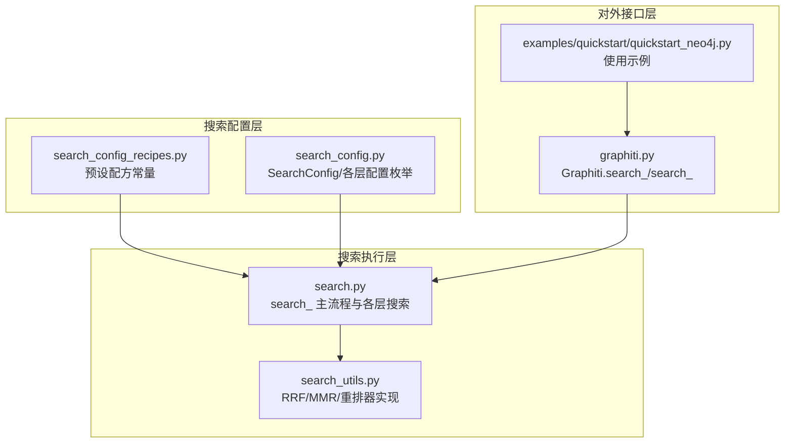
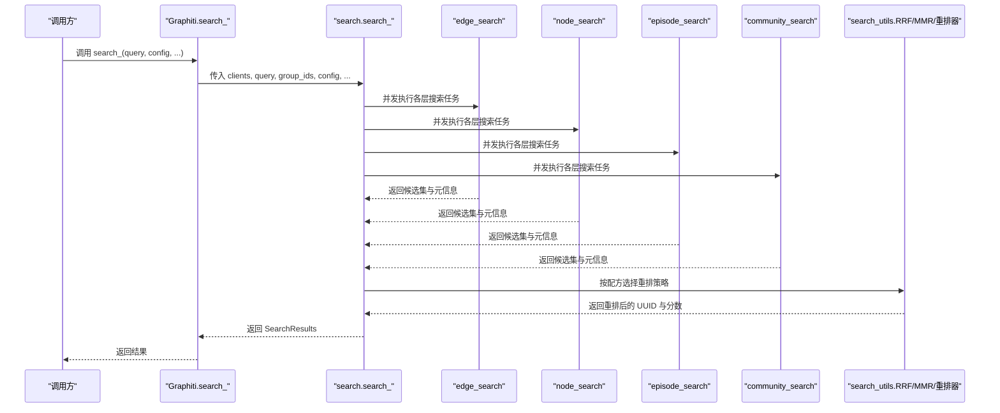
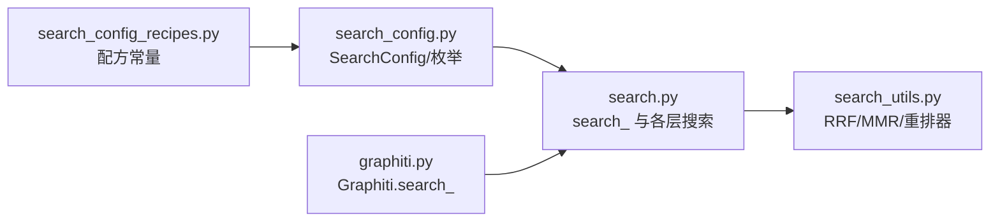

# 预设配置配方

<cite>
**本文档引用的文件**
- [search_config_recipes.py](file://graphiti_core/search/search_config_recipes.py)
- [search_config.py](file://graphiti_core/search/search_config.py)
- [search_utils.py](file://graphiti_core/search/search_utils.py)
- [search.py](file://graphiti_core/search/search.py)
- [graphiti.py](file://graphiti_core/graphiti.py)
- [quickstart_neo4j.py](file://examples/quickstart/quickstart_neo4j.py)
</cite>

## 目录
1. [简介](#简介)
2. [项目结构](#项目结构)
3. [核心组件](#核心组件)
4. [架构总览](#架构总览)
5. [详细组件分析](#详细组件分析)
6. [依赖关系分析](#依赖关系分析)
7. [性能考量](#性能考量)
8. [故障排查指南](#故障排查指南)
9. [结论](#结论)
10. [附录](#附录)

## 简介
本文件系统性梳理 graphiti_core.search 模块中的预设搜索配方，重点覆盖以下配方：
- 综合混合搜索配方：COMBINED_HYBRID_SEARCH_RRF、COMBINED_HYBRID_SEARCH_MMR、COMBINED_HYBRID_SEARCH_CROSS_ENCODER
- 边、节点、社区专用配方：EDGE_*、NODE_*、COMMUNITY_* 系列
并逐项解释其设计目标、适用场景、技术组合（如 RRF 快速混合检索、MMR 去重、Cross Encoder 高精度排序），给出使用示例与微调建议，并说明 limit 参数在不同配方中的差异化设置（例如社区检索限制为3）的合理性。

## 项目结构
与预设配方直接相关的代码位于 graphiti_core/search 目录，关键文件如下：
- search_config_recipes.py：定义所有预设配方常量
- search_config.py：定义 SearchConfig 及各层搜索配置枚举与字段
- search.py：实现 search_ 主流程，按配方执行多层搜索与重排
- search_utils.py：提供 RRF、MMR、节点距离重排、提及重排等重排器
- graphiti.py：对外暴露 search_ 方法，作为高级搜索入口
- examples/quickstart/quickstart_neo4j.py：示例演示如何直接引用与微调配方

图表来源
- [search_config_recipes.py](file://graphiti_core/search/search_config_recipes.py#L1-L224)
- [search_config.py](file://graphiti_core/search/search_config.py#L1-L161)
- [search.py](file://graphiti_core/search/search.py#L68-L520)
- [search_utils.py](file://graphiti_core/search/search_utils.py#L1600-L1996)
- [graphiti.py](file://graphiti_core/graphiti.py#L1050-L1154)
- [quickstart_neo4j.py](file://examples/quickstart/quickstart_neo4j.py#L190-L224)

章节来源
- [search_config_recipes.py](file://graphiti_core/search/search_config_recipes.py#L1-L224)
- [search_config.py](file://graphiti_core/search/search_config.py#L1-L161)
- [search.py](file://graphiti_core/search/search.py#L68-L520)
- [search_utils.py](file://graphiti_core/search/search_utils.py#L1600-L1996)
- [graphiti.py](file://graphiti_core/graphiti.py#L1050-L1154)
- [quickstart_neo4j.py](file://examples/quickstart/quickstart_neo4j.py#L190-L224)

## 核心组件
- 预设配方（search_config_recipes.py）
  - 综合混合配方：COMBINED_HYBRID_SEARCH_RRF、COMBINED_HYBRID_SEARCH_MMR、COMBINED_HYBRID_SEARCH_CROSS_ENCODER
  - 单层专用配方：EDGE_*、NODE_*、COMMUNITY_* 系列
- 配置模型（search_config.py）
  - SearchConfig：统一入口，包含各层配置与全局 limit、reranker_min_score
  - 各层 SearchConfig：Edge/Node/Episode/Community 的搜索方法与重排器枚举及参数
- 执行引擎（search.py）
  - search_：并发执行四类搜索，按配方选择重排策略
  - 各层搜索函数：edge_search/node_search/episode_search/community_search
- 重排器（search_utils.py）
  - RRF：快速融合多路检索结果
  - MMR：最大化边际相关性，抑制重复
  - 节点距离重排、提及重排等专用重排器
- 对外接口（graphiti.py）
  - Graphiti.search_：高级搜索入口，默认使用 COMBINED_HYBRID_SEARCH_CROSS_ENCODER

章节来源
- [search_config_recipes.py](file://graphiti_core/search/search_config_recipes.py#L1-L224)
- [search_config.py](file://graphiti_core/search/search_config.py#L1-L161)
- [search.py](file://graphiti_core/search/search.py#L68-L520)
- [search_utils.py](file://graphiti_core/search/search_utils.py#L1600-L1996)
- [graphiti.py](file://graphiti_core/graphiti.py#L1050-L1154)

## 架构总览
下图展示从 Graphiti.search_ 到具体搜索执行与重排的调用链，以及预设配方如何影响执行路径。

图表来源
- [graphiti.py](file://graphiti_core/graphiti.py#L1127-L1154)
- [search.py](file://graphiti_core/search/search.py#L68-L520)
- [search_utils.py](file://graphiti_core/search/search_utils.py#L1600-L1996)

## 详细组件分析

### 综合混合配方
- COMBINED_HYBRID_SEARCH_RRF
  - 设计目标：快速融合文本检索、向量相似与广度优先搜索，统一使用 RRF 进行融合重排
  - 技术组合：BM25 文本检索 + 余弦相似度 + BFS；重排器：RRF
  - 适用场景：通用检索，追求召回覆盖面与快速响应
  - 使用示例：可直接传入 Graphiti.search_ 或在示例中通过复制修改 limit
  - 章节来源
    - [search_config_recipes.py](file://graphiti_core/search/search_config_recipes.py#L33-L53)
    - [search.py](file://graphiti_core/search/search.py#L186-L307)

- COMBINED_HYBRID_SEARCH_MMR
  - 设计目标：在多源检索基础上，通过 MMR 去除冗余，提升多样性与代表性
  - 技术组合：BM25 + 余弦相似度；重排器：MMR（lambda 默认值见配置）
  - 适用场景：需要高质量、去重的检索结果
  - 使用示例：同上，可直接引用或复制后调整 limit
  - 章节来源
    - [search_config_recipes.py](file://graphiti_core/search/search_config_recipes.py#L55-L78)
    - [search_config.py](file://graphiti_core/search/search_config.py#L80-L110)
    - [search.py](file://graphiti_core/search/search.py#L309-L417)

- COMBINED_HYBRID_SEARCH_CROSS_ENCODER
  - 设计目标：以交叉编码器对候选进行高精度重排，提升语义匹配质量
  - 技术组合：BM25 + 余弦相似度 + BFS；重排器：Cross Encoder
  - 适用场景：对排序精度要求较高、可接受更高延迟的场景
  - 使用示例：Graphiti.search_ 默认即采用该配方
  - 章节来源
    - [search_config_recipes.py](file://graphiti_core/search/search_config_recipes.py#L80-L108)
    - [graphiti.py](file://graphiti_core/graphiti.py#L1127-L1154)
    - [search.py](file://graphiti_core/search/search.py#L419-L520)

### 边（Edge）专用配方
- EDGE_HYBRID_SEARCH_RRF
  - 设计目标：边级混合检索，快速融合多源结果
  - 技术组合：BM25 + 余弦相似度；重排器：RRF
  - 适用场景：边级检索，追求召回与速度平衡
  - 章节来源
    - [search_config_recipes.py](file://graphiti_core/search/search_config_recipes.py#L110-L116)
    - [search.py](file://graphiti_core/search/search.py#L186-L307)

- EDGE_HYBRID_SEARCH_MMR
  - 设计目标：边级去重，提升代表性
  - 技术组合：BM25 + 余弦相似度；重排器：MMR
  - 适用场景：需要高质量边集合
  - 章节来源
    - [search_config_recipes.py](file://graphiti_core/search/search_config_recipes.py#L118-L124)
    - [search.py](file://graphiti_core/search/search.py#L186-L307)

- EDGE_HYBRID_SEARCH_NODE_DISTANCE
  - 设计目标：基于中心节点的图距离重排，强调与中心节点的关联强度
  - 技术组合：BM25 + 余弦相似度；重排器：节点距离
  - 适用场景：围绕某个实体进行上下文扩展
  - 章节来源
    - [search_config_recipes.py](file://graphiti_core/search/search_config_recipes.py#L126-L133)
    - [search.py](file://graphiti_core/search/search.py#L276-L306)

- EDGE_HYBRID_SEARCH_EPISODE_MENTIONS
  - 设计目标：按提及次数重排，突出与更多剧集相关联的边
  - 技术组合：BM25 + 余弦相似度；重排器：提及次数
  - 适用场景：需要强调“被广泛提及”的事实
  - 章节来源
    - [search_config_recipes.py](file://graphiti_core/search/search_config_recipes.py#L134-L141)
    - [search.py](file://graphiti_core/search/search.py#L303-L306)

- EDGE_HYBRID_SEARCH_CROSS_ENCODER
  - 设计目标：边级高精度排序
  - 技术组合：BM25 + 余弦相似度 + BFS；重排器：Cross Encoder
  - 适用场景：对边级排序精度要求高
  - limit：默认 10
  - 章节来源
    - [search_config_recipes.py](file://graphiti_core/search/search_config_recipes.py#L142-L154)
    - [search.py](file://graphiti_core/search/search.py#L186-L307)

### 节点（Node）专用配方
- NODE_HYBRID_SEARCH_RRF
  - 设计目标：节点级混合检索与融合
  - 技术组合：BM25 + 余弦相似度；重排器：RRF
  - 适用场景：节点检索
  - 章节来源
    - [search_config_recipes.py](file://graphiti_core/search/search_config_recipes.py#L155-L161)
    - [search.py](file://graphiti_core/search/search.py#L309-L417)

- NODE_HYBRID_SEARCH_MMR
  - 设计目标：节点级去重
  - 技术组合：BM25 + 余弦相似度；重排器：MMR
  - 适用场景：高质量节点集合
  - 章节来源
    - [search_config_recipes.py](file://graphiti_core/search/search_config_recipes.py#L163-L169)
    - [search.py](file://graphiti_core/search/search.py#L309-L417)

- NODE_HYBRID_SEARCH_NODE_DISTANCE
  - 设计目标：基于中心节点的图距离重排
  - 技术组合：BM25 + 余弦相似度；重排器：节点距离
  - 适用场景：围绕中心节点的上下文扩展
  - 章节来源
    - [search_config_recipes.py](file://graphiti_core/search/search_config_recipes.py#L171-L177)
    - [search.py](file://graphiti_core/search/search.py#L404-L413)

- NODE_HYBRID_SEARCH_EPISODE_MENTIONS
  - 设计目标：按提及次数重排
  - 技术组合：BM25 + 余弦相似度；重排器：提及次数
  - 适用场景：强调“被广泛提及”的节点
  - 章节来源
    - [search_config_recipes.py](file://graphiti_core/search/search_config_recipes.py#L179-L185)
    - [search.py](file://graphiti_core/search/search.py#L401-L403)

- NODE_HYBRID_SEARCH_CROSS_ENCODER
  - 设计目标：节点级高精度排序
  - 技术组合：BM25 + 余弦相似度 + BFS；重排器：Cross Encoder
  - 适用场景：对节点排序精度要求高
  - limit：默认 10
  - 章节来源
    - [search_config_recipes.py](file://graphiti_core/search/search_config_recipes.py#L187-L199)
    - [search.py](file://graphiti_core/search/search.py#L309-L417)

### 社区（Community）专用配方
- COMMUNITY_HYBRID_SEARCH_RRF
  - 设计目标：社区级混合检索与融合
  - 技术组合：BM25 + 余弦相似度；重排器：RRF
  - 适用场景：社区检索
  - 章节来源
    - [search_config_recipes.py](file://graphiti_core/search/search_config_recipes.py#L200-L206)
    - [search.py](file://graphiti_core/search/search.py#L468-L520)

- COMMUNITY_HYBRID_SEARCH_MMR
  - 设计目标：社区级去重
  - 技术组合：BM25 + 余弦相似度；重排器：MMR
  - 适用场景：高质量社区集合
  - 章节来源
    - [search_config_recipes.py](file://graphiti_core/search/search_config_recipes.py#L208-L214)
    - [search.py](file://graphiti_core/search/search.py#L468-L520)

- COMMUNITY_HYBRID_SEARCH_CROSS_ENCODER
  - 设计目标：社区级高精度排序
  - 技术组合：BM25 + 余弦相似度；重排器：Cross Encoder
  - 适用场景：对社区排序精度要求高
  - limit：默认 3
  - 章节来源
    - [search_config_recipes.py](file://graphiti_core/search/search_config_recipes.py#L216-L224)
    - [search.py](file://graphiti_core/search/search.py#L468-L520)

### limit 参数的差异化设置与合理性
- 全局默认 limit：DEFAULT_SEARCH_LIMIT = 10（来自 search_config.py）
- 边/节点专用配方：默认 limit=10
- 社区专用配方：默认 limit=3
- 合理性说明：
  - 社区通常体量较大且层级更深，过多候选会显著增加重排成本与噪音，限制为较小值有助于控制开销与提升排序质量
  - 边/节点默认 10 在兼顾召回与性能之间取得平衡
  - 用户可通过复制配方后修改 limit 来适配业务需求

章节来源
- [search_config.py](file://graphiti_core/search/search_config.py#L29-L30)
- [search_config_recipes.py](file://graphiti_core/search/search_config_recipes.py#L142-L154)
- [search_config_recipes.py](file://graphiti_core/search/search_config_recipes.py#L187-L199)
- [search_config_recipes.py](file://graphiti_core/search/search_config_recipes.py#L216-L224)

### 使用示例与微调
- 直接引用
  - 示例：在 quickstart 中直接使用 NODE_HYBRID_SEARCH_RRF 并修改 limit
  - 章节来源
    - [quickstart_neo4j.py](file://examples/quickstart/quickstart_neo4j.py#L190-L224)

- 基于配方微调
  - 复制配方并调整 limit、重排器或搜索方法
  - 示例：将 NODE_HYBRID_SEARCH_RRF 复制到自定义配置，再将 limit 改为 5
  - 章节来源
    - [search_config_recipes.py](file://graphiti_core/search/search_config_recipes.py#L155-L161)
    - [quickstart_neo4j.py](file://examples/quickstart/quickstart_neo4j.py#L190-L224)

- 默认配方
  - Graphiti.search_ 默认使用 COMBINED_HYBRID_SEARCH_CROSS_ENCODER
  - 章节来源
    - [graphiti.py](file://graphiti_core/graphiti.py#L1127-L1154)

## 依赖关系分析
- 预设配方依赖 SearchConfig/各层配置枚举
- 执行层根据配置选择搜索方法与重排器
- 重排器依赖 search_utils 提供的算法实现
- 对外接口 Graphiti.search_ 将用户输入映射为标准 SearchConfig

图表来源
- [search_config_recipes.py](file://graphiti_core/search/search_config_recipes.py#L1-L224)
- [search_config.py](file://graphiti_core/search/search_config.py#L1-L161)
- [search.py](file://graphiti_core/search/search.py#L68-L520)
- [search_utils.py](file://graphiti_core/search/search_utils.py#L1600-L1996)
- [graphiti.py](file://graphiti_core/graphiti.py#L1050-L1154)

章节来源
- [search_config_recipes.py](file://graphiti_core/search/search_config_recipes.py#L1-L224)
- [search_config.py](file://graphiti_core/search/search_config.py#L1-L161)
- [search.py](file://graphiti_core/search/search.py#L68-L520)
- [search_utils.py](file://graphiti_core/search/search_utils.py#L1600-L1996)
- [graphiti.py](file://graphiti_core/graphiti.py#L1050-L1154)

## 性能考量
- 并发执行：search_ 内部对四类搜索并发执行，减少总体等待时间
- 重排成本：
  - RRF：线性融合，开销低，适合大规模候选
  - MMR：需计算候选间相似矩阵，复杂度较高，适合候选规模适中
  - Cross Encoder：依赖外部重排服务，延迟取决于网络与服务端负载
- limit 控制：通过限制候选数量降低重排与下游处理成本
- 搜索方法组合：BM25 + 余弦相似度 + BFS 的组合在召回与语义上互补，但也会增加候选规模，应结合 limit 使用

章节来源
- [search.py](file://graphiti_core/search/search.py#L118-L166)
- [search_utils.py](file://graphiti_core/search/search_utils.py#L1732-L1748)
- [search_utils.py](file://graphiti_core/search/search_utils.py#L1838-L1877)

## 故障排查指南
- 缺少中心节点导致的重排错误
  - 症状：使用节点距离重排时抛出异常
  - 原因：未提供 center_node_uuid
  - 处理：确保调用时传入 center_node_uuid
  - 章节来源
    - [search.py](file://graphiti_core/search/search.py#L277-L280)
    - [search.py](file://graphiti_core/search/search.py#L405-L407)

- Cross Encoder 重排失败
  - 症状：重排阶段报错或返回空
  - 原因：外部重排服务不可用或请求失败
  - 处理：检查客户端初始化与网络连通性，必要时切换为 RRF/ MMR
  - 章节来源
    - [search.py](file://graphiti_core/search/search.py#L269-L276)
    - [search.py](file://graphiti_core/search/search.py#L390-L400)
    - [search.py](file://graphiti_core/search/search.py#L448-L462)
    - [search.py](file://graphiti_core/search/search.py#L509-L516)

- 候选过少或为空
  - 症状：最终结果为空
  - 原因：查询过短、过滤条件过严、limit 设置过小
  - 处理：放宽过滤、增大 limit、确认搜索方法是否启用
  - 章节来源
    - [search.py](file://graphiti_core/search/search.py#L186-L307)
    - [search.py](file://graphiti_core/search/search.py#L309-L417)
    - [search.py](file://graphiti_core/search/search.py#L419-L520)

## 结论
- 预设配方覆盖了从快速融合到高精度排序的多种策略，适用于不同业务目标
- RRF 适合快速混合检索，MMR 适合去重与多样性，Cross Encoder 适合高精度排序
- limit 的差异化设置体现了对不同图层（尤其是社区）的性能与质量权衡
- 通过复制与微调配方，可在不改变核心逻辑的前提下灵活适配业务需求

## 附录
- 快速参考
  - 直接使用默认配方：Graphiti.search_（默认 COMBINED_HYBRID_SEARCH_CROSS_ENCODER）
  - 使用专用配方：导入对应常量并在 search_ 中传入
  - 微调 limit：复制配方后修改 limit 字段
- 相关实现路径
  - [search_config_recipes.py](file://graphiti_core/search/search_config_recipes.py#L1-L224)
  - [search_config.py](file://graphiti_core/search/search_config.py#L1-L161)
  - [search.py](file://graphiti_core/search/search.py#L68-L520)
  - [search_utils.py](file://graphiti_core/search/search_utils.py#L1600-L1996)
  - [graphiti.py](file://graphiti_core/graphiti.py#L1050-L1154)
  - [quickstart_neo4j.py](file://examples/quickstart/quickstart_neo4j.py#L190-L224)