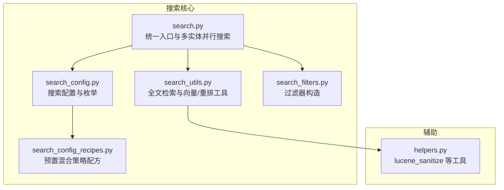
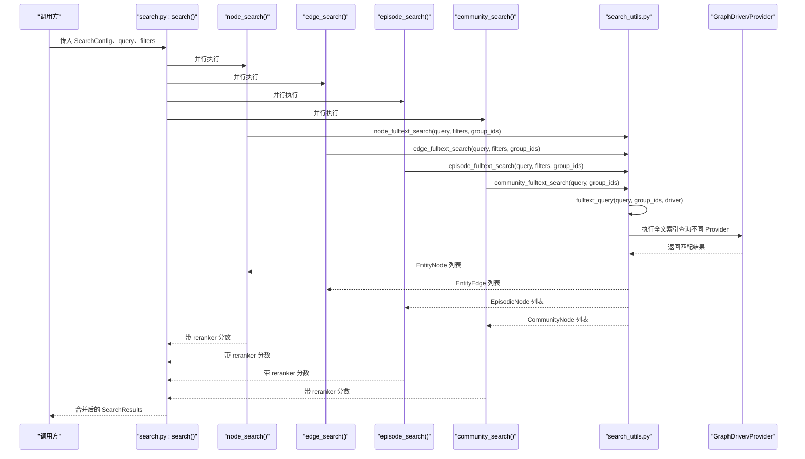
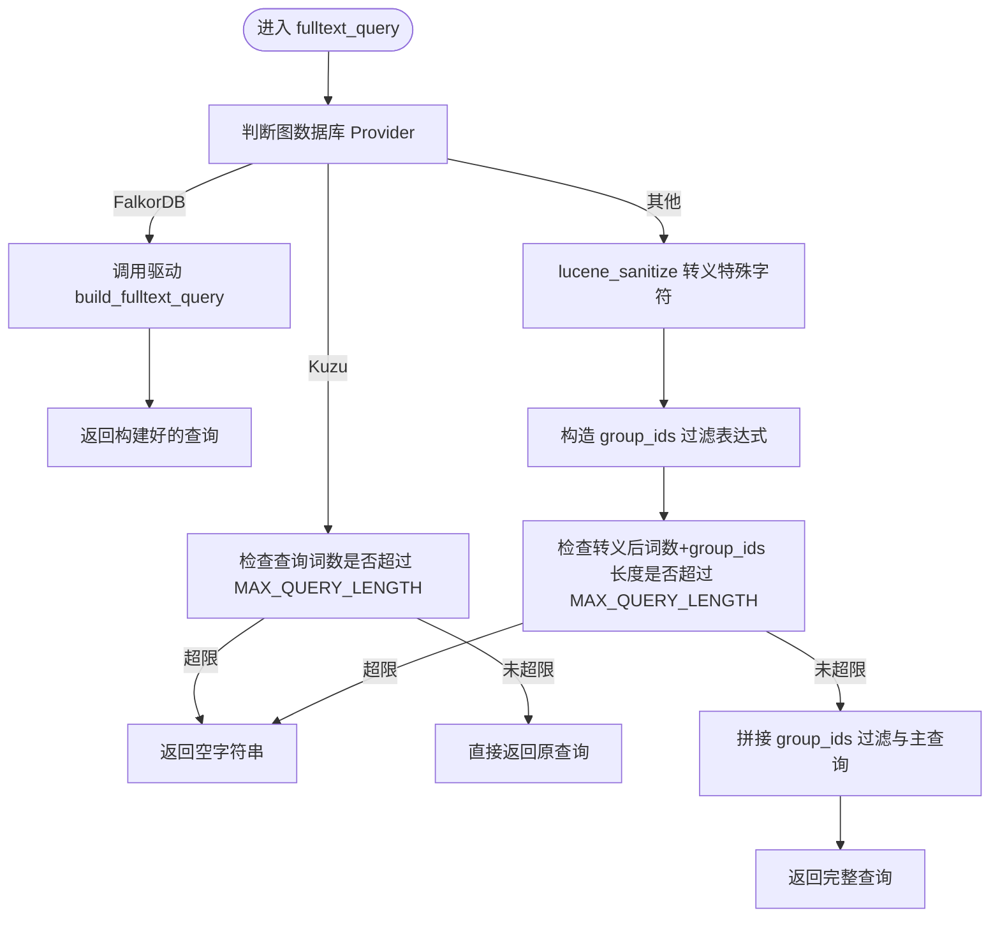
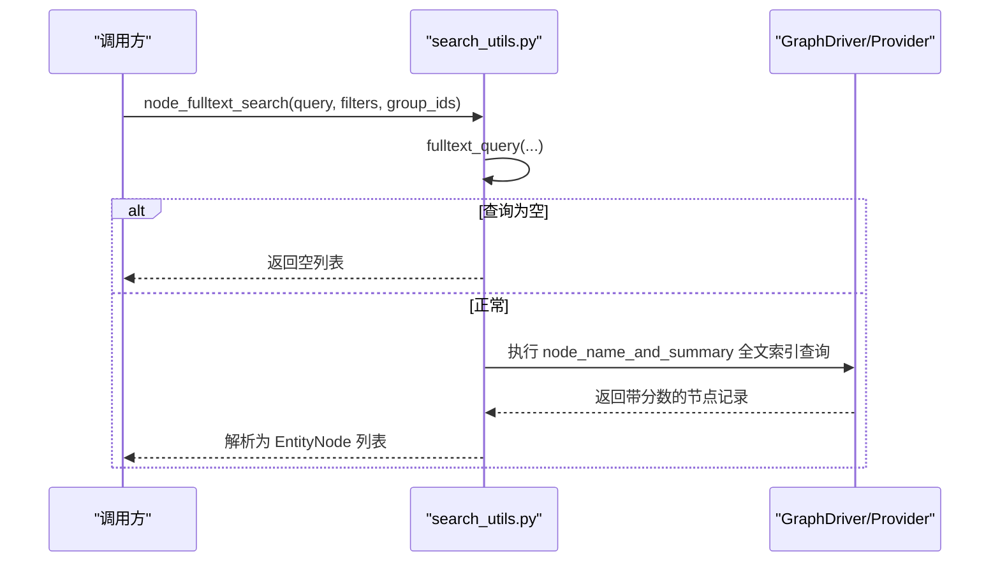
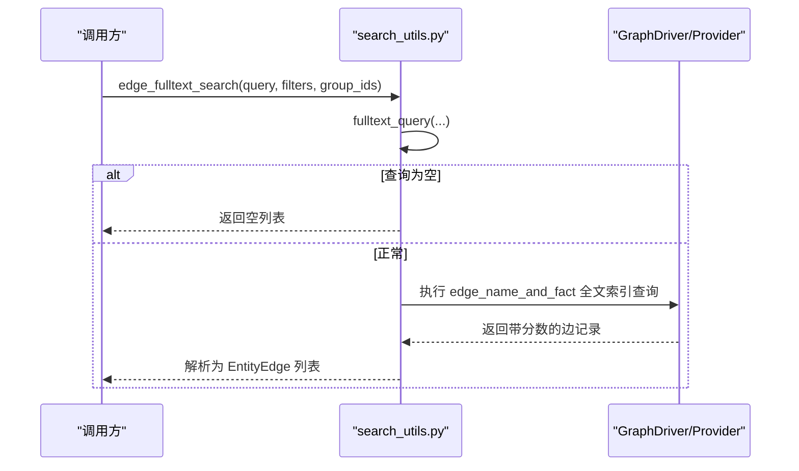
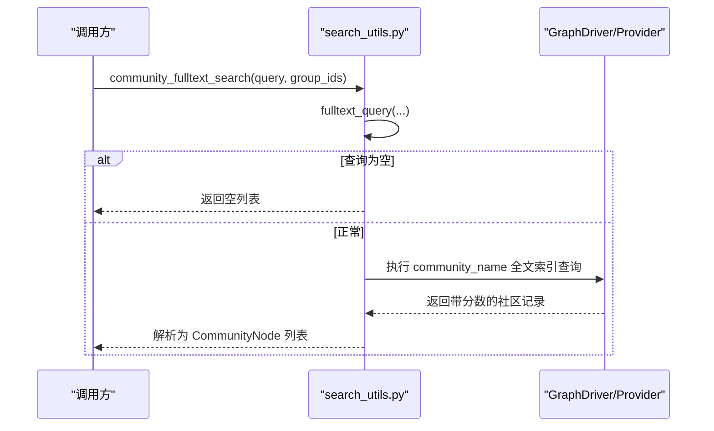
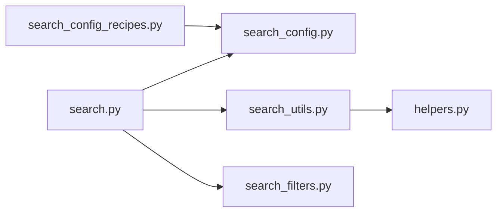

# 关键词搜索

<cite>
**本文引用的文件**
- [graphiti_core/search/search.py](file://graphiti_core/search/search.py)
- [graphiti_core/search/search_config.py](file://graphiti_core/search/search_config.py)
- [graphiti_core/search/search_utils.py](file://graphiti_core/search/search_utils.py)
- [graphiti_core/search/search_filters.py](file://graphiti_core/search/search_filters.py)
- [graphiti_core/search/search_config_recipes.py](file://graphiti_core/search/search_config_recipes.py)
- [graphiti_core/helpers.py](file://graphiti_core/helpers.py)
</cite>

## 目录
1. [简介](#简介)
2. [项目结构](#项目结构)
3. [核心组件](#核心组件)
4. [架构总览](#架构总览)
5. [详细组件分析](#详细组件分析)
6. [依赖关系分析](#依赖关系分析)
7. [性能考量](#性能考量)
8. [故障排查指南](#故障排查指南)
9. [结论](#结论)
10. [附录](#附录)

## 简介
本文件围绕关键词搜索与全文检索展开，重点解释基于 BM25 的全文检索机制在图数据库中的实现方式，涵盖以下关键点：
- fulltext_query 函数如何对查询进行 Lucene 语法转义与分组过滤；
- node_fulltext_search、edge_fulltext_search、community_fulltext_search 如何与图数据库的全文索引交互；
- SearchConfig 中 bm25 搜索方法的配置方式；
- MAX_QUERY_LENGTH 对查询长度的限制；
- 结合关键词搜索的混合检索策略示例（Recipe）；
- 在精确匹配与关键词定位上的优势，以及在处理语义变体方面的局限性。

## 项目结构
关键词搜索相关代码主要集中在 graphiti_core/search 目录下，配合 helpers 提供 Lucene 转义工具，driver 层负责与不同图数据库（Neo4j、Kuzu、FalkorDB、Amazon OpenSearch/AWS Neptune）的全文索引交互。

图表来源
- [graphiti_core/search/search.py](file://graphiti_core/search/search.py#L68-L184)
- [graphiti_core/search/search_config.py](file://graphiti_core/search/search_config.py#L32-L120)
- [graphiti_core/search/search_utils.py](file://graphiti_core/search/search_utils.py#L84-L111)
- [graphiti_core/search/search_filters.py](file://graphiti_core/search/search_filters.py#L44-L126)
- [graphiti_core/search/search_config_recipes.py](file://graphiti_core/search/search_config_recipes.py#L33-L108)
- [graphiti_core/helpers.py](file://graphiti_core/helpers.py#L62-L96)

章节来源
- [graphiti_core/search/search.py](file://graphiti_core/search/search.py#L68-L184)
- [graphiti_core/search/search_config.py](file://graphiti_core/search/search_config.py#L32-L120)
- [graphiti_core/search/search_utils.py](file://graphiti_core/search/search_utils.py#L84-L111)
- [graphiti_core/search/search_filters.py](file://graphiti_core/search/search_filters.py#L44-L126)
- [graphiti_core/search/search_config_recipes.py](file://graphiti_core/search/search_config_recipes.py#L33-L108)
- [graphiti_core/helpers.py](file://graphiti_core/helpers.py#L62-L96)

## 核心组件
- 全文检索入口与并行执行：search.py 提供 search、node_search、edge_search、episode_search、community_search 等异步入口，按配置并行执行多种搜索方法（bm25、cosine_similarity、bfs），并在完成后统一重排。
- 配置模型：search_config.py 定义了各实体类型的 SearchConfig、SearchResults、枚举类型（NodeSearchMethod、EdgeSearchMethod、EpisodeSearchMethod、CommunitySearchMethod、reranker 枚举）及默认参数。
- 查询构建与过滤：search_utils.py 的 fulltext_query 负责将用户查询转为 Lucene 语法安全的字符串，并根据 group_ids 构造分组过滤；node_fulltext_search、edge_fulltext_search、community_fulltext_search 将查询下发到不同图数据库的全文索引接口。
- 过滤器构造：search_filters.py 提供节点/边标签、时间范围等过滤条件的查询片段与参数映射。
- 预置混合策略：search_config_recipes.py 提供多种组合（RRF、MMR、Cross-encoder、BFS 等）的 SearchConfig 预设，便于快速启用混合检索。

章节来源
- [graphiti_core/search/search.py](file://graphiti_core/search/search.py#L68-L184)
- [graphiti_core/search/search_config.py](file://graphiti_core/search/search_config.py#L32-L120)
- [graphiti_core/search/search_utils.py](file://graphiti_core/search/search_utils.py#L84-L111)
- [graphiti_core/search/search_filters.py](file://graphiti_core/search/search_filters.py#L44-L126)
- [graphiti_core/search/search_config_recipes.py](file://graphiti_core/search/search_config_recipes.py#L33-L108)

## 架构总览
下面以序列图展示一次关键词搜索的整体流程，从高层配置到具体数据库调用。

图表来源
- [graphiti_core/search/search.py](file://graphiti_core/search/search.py#L68-L184)
- [graphiti_core/search/search_utils.py](file://graphiti_core/search/search_utils.py#L170-L283)
- [graphiti_core/search/search_utils.py](file://graphiti_core/search/search_utils.py#L556-L646)
- [graphiti_core/search/search_utils.py](file://graphiti_core/search/search_utils.py#L855-L938)
- [graphiti_core/search/search_utils.py](file://graphiti_core/search/search_utils.py#L941-L1019)

## 详细组件分析

### fulltext_query：Lucene 语法转义与分组过滤
- 功能要点
  - 对查询进行 Lucene 特殊字符转义，避免解析错误或注入风险。
  - 根据 group_ids 构造分组过滤子句，并与主查询合并。
  - 对查询长度进行限制（MAX_QUERY_LENGTH），超限则返回空查询，防止过长查询导致性能问题或驱动不支持。
  - 针对不同图数据库提供差异化处理：
    - Kuzu：仅接受简单查询，且对长度有严格限制。
    - FalkorDB：通过驱动层 build_fulltext_query 处理。
    - 其他驱动：使用 lucene_sanitize 后拼接 group_ids 过滤表达式。

- 关键实现位置
  - 转义与长度检查：[lucene_sanitize](file://graphiti_core/helpers.py#L62-L96)，[fulltext_query](file://graphiti_core/search/search_utils.py#L84-L111)
  - 长度上限常量：[MAX_QUERY_LENGTH](file://graphiti_core/search/search_utils.py#L63-L68)

- 流程图

图表来源
- [graphiti_core/search/search_utils.py](file://graphiti_core/search/search_utils.py#L84-L111)
- [graphiti_core/helpers.py](file://graphiti_core/helpers.py#L62-L96)

章节来源
- [graphiti_core/search/search_utils.py](file://graphiti_core/search/search_utils.py#L84-L111)
- [graphiti_core/helpers.py](file://graphiti_core/helpers.py#L62-L96)

### node_fulltext_search：节点关键词定位
- 功能要点
  - 使用 fulltext_query 构建查询；
  - 应用节点/边标签、时间范围等过滤条件；
  - 针对不同 Provider（Neo4j、Kuzu、Neptune、AOSS）采用不同的全文索引接口与返回字段；
  - 支持 group_ids 过滤；
  - 返回排序后的 EntityNode 列表。

- 关键实现位置
  - [node_fulltext_search](file://graphiti_core/search/search_utils.py#L556-L646)

- 时序图（节点 BM25）

图表来源
- [graphiti_core/search/search_utils.py](file://graphiti_core/search/search_utils.py#L556-L646)

章节来源
- [graphiti_core/search/search_utils.py](file://graphiti_core/search/search_utils.py#L556-L646)

### edge_fulltext_search：边关键词定位
- 功能要点
  - 对边的事实（fact）进行 BM25 全文检索；
  - 支持 group_ids 过滤；
  - 不同 Provider 的查询路径与返回字段略有差异；
  - 返回排序后的 EntityEdge 列表。

- 关键实现位置
  - [edge_fulltext_search](file://graphiti_core/search/search_utils.py#L170-L283)

- 时序图（边 BM25）

图表来源
- [graphiti_core/search/search_utils.py](file://graphiti_core/search/search_utils.py#L170-L283)

章节来源
- [graphiti_core/search/search_utils.py](file://graphiti_core/search/search_utils.py#L170-L283)

### community_fulltext_search：社区关键词定位
- 功能要点
  - 对社区名称进行 BM25 全文检索；
  - 支持 group_ids 过滤；
  - 返回排序后的 CommunityNode 列表。

- 关键实现位置
  - [community_fulltext_search](file://graphiti_core/search/search_utils.py#L941-L1019)

- 时序图（社区 BM25）

图表来源
- [graphiti_core/search/search_utils.py](file://graphiti_core/search/search_utils.py#L941-L1019)

章节来源
- [graphiti_core/search/search_utils.py](file://graphiti_core/search/search_utils.py#L941-L1019)

### episode_fulltext_search：剧集内容关键词定位
- 功能要点
  - 对剧集内容进行 BM25 全文检索；
  - 支持 group_ids 过滤；
  - 返回排序后的 EpisodicNode 列表。

- 关键实现位置
  - [episode_fulltext_search](file://graphiti_core/search/search_utils.py#L855-L938)

章节来源
- [graphiti_core/search/search_utils.py](file://graphiti_core/search/search_utils.py#L855-L938)

### SearchConfig 中 bm25 搜索方法的配置
- NodeSearchMethod.bm25、EdgeSearchMethod.bm25、EpisodeSearchMethod.bm25、CommunitySearchMethod.bm25
- 在各实体的 SearchConfig 中通过 search_methods 指定启用 BM25；
- 可与 cosine_similarity、bfs 组合使用，配合 reranker（如 rrf、mmr、cross_encoder、node_distance、episode_mentions）进行重排。

- 关键实现位置
  - [NodeSearchMethod/EdgeSearchMethod/EpisodeSearchMethod/CommunitySearchMethod](file://graphiti_core/search/search_config.py#L32-L51)
  - [NodeSearchConfig/EdgeSearchConfig/EpisodeSearchConfig/CommunitySearchConfig](file://graphiti_core/search/search_config.py#L80-L110)
  - [SearchConfig](file://graphiti_core/search/search_config.py#L112-L119)

章节来源
- [graphiti_core/search/search_config.py](file://graphiti_core/search/search_config.py#L32-L119)

### MAX_QUERY_LENGTH 对查询长度的限制
- 在 fulltext_query 中，对转义后的查询词数与 group_ids 长度进行联合检查，超过阈值则返回空查询，避免过长查询导致性能问题或驱动不支持。
- 该限制在不同 Provider 下可能有不同的行为（例如 Kuzu 的严格限制）。

- 关键实现位置
  - [MAX_QUERY_LENGTH](file://graphiti_core/search/search_utils.py#L63-L68)
  - [fulltext_query](file://graphiti_core/search/search_utils.py#L84-L111)

章节来源
- [graphiti_core/search/search_utils.py](file://graphiti_core/search/search_utils.py#L63-L111)

### 结合关键词搜索的混合检索策略示例（Recipe）
- 预置配方包含多种组合，便于快速启用混合检索：
  - RRF：对多路检索结果进行 reciprocal rank fusion 重排；
  - MMR：最大化边缘相关性重排；
  - Cross-encoder：使用交叉编码器对候选进行重排；
  - BFS：在无中心节点时自动扩展源节点集合后再进行 BFS 搜索。

- 关键实现位置
  - [search_config_recipes.py](file://graphiti_core/search/search_config_recipes.py#L33-L224)

章节来源
- [graphiti_core/search/search_config_recipes.py](file://graphiti_core/search/search_config_recipes.py#L33-L224)

### 优势与局限性
- 优势
  - 精确匹配与关键词定位：BM25 能够基于词频、短语匹配与布尔逻辑进行精确检索，适合关键词定位场景；
  - 性能可控：通过 MAX_QUERY_LENGTH 限制与 Provider 差异化处理，避免过长查询带来的性能问题；
  - 易于组合：可与向量相似度、BFS、重排器（RRF、MMR、Cross-encoder）组合，形成混合检索策略。
- 局限性
  - 语义变体处理：BM25 基于关键词匹配，难以直接捕捉语义近似或同义表达，需要向量嵌入或交叉编码器辅助；
  - 查询复杂度：复杂 Lucene 查询可能受 Provider 限制，需遵循转义与长度约束。

## 依赖关系分析
- 组件耦合
  - search.py 作为统一入口，依赖 search_config.py 的配置枚举与默认值；
  - search_utils.py 依赖 helpers.py 的 lucene_sanitize 与 driver 接口；
  - search_filters.py 为各搜索方法提供过滤器构造；
  - search_config_recipes.py 依赖 search_config.py 的配置类与枚举。

图表来源
- [graphiti_core/search/search.py](file://graphiti_core/search/search.py#L68-L184)
- [graphiti_core/search/search_config.py](file://graphiti_core/search/search_config.py#L32-L120)
- [graphiti_core/search/search_utils.py](file://graphiti_core/search/search_utils.py#L84-L111)
- [graphiti_core/search/search_filters.py](file://graphiti_core/search/search_filters.py#L44-L126)
- [graphiti_core/search/search_config_recipes.py](file://graphiti_core/search/search_config_recipes.py#L33-L108)
- [graphiti_core/helpers.py](file://graphiti_core/helpers.py#L62-L96)

章节来源
- [graphiti_core/search/search.py](file://graphiti_core/search/search.py#L68-L184)
- [graphiti_core/search/search_config.py](file://graphiti_core/search/search_config.py#L32-L120)
- [graphiti_core/search/search_utils.py](file://graphiti_core/search/search_utils.py#L84-L111)
- [graphiti_core/search/search_filters.py](file://graphiti_core/search/search_filters.py#L44-L126)
- [graphiti_core/search/search_config_recipes.py](file://graphiti_core/search/search_config_recipes.py#L33-L108)
- [graphiti_core/helpers.py](file://graphiti_core/helpers.py#L62-L96)

## 性能考量
- 查询长度控制：通过 MAX_QUERY_LENGTH 限制查询词数，避免过长查询导致性能下降或驱动不支持；
- 并行执行：search.py 使用 semaphore_gather 并行执行多路搜索，缩短整体延迟；
- 重排策略选择：RRF 适合多路检索融合，MMR 适合在向量空间中兼顾相关性与多样性，Cross-encoder 适合细粒度重排但成本较高；
- Provider 差异：不同图数据库的全文索引接口与返回字段存在差异，应根据实际 Provider 选择合适的查询路径与字段映射。

## 故障排查指南
- 查询为空
  - 检查 fulltext_query 是否因长度超限或转义后长度超限而返回空字符串；
  - 检查 group_ids 是否正确传入，以及过滤条件是否过于严格导致无结果。
- Provider 不支持复杂查询
  - Kuzu 对全文查询较为简单，建议减少复杂 Lucene 语法；
  - FalkorDB 由驱动层处理复杂查询，确认 build_fulltext_query 的参数正确。
- 结果质量不佳
  - 调整 reranker（RRF/交叉编码器/MMR）与最小分数阈值；
  - 结合向量相似度（cosine_similarity）与 BFS，提升召回与覆盖度。

章节来源
- [graphiti_core/search/search_utils.py](file://graphiti_core/search/search_utils.py#L84-L111)
- [graphiti_core/search/search.py](file://graphiti_core/search/search.py#L186-L269)

## 结论
本文系统梳理了基于 BM25 的关键词搜索在图数据库中的实现路径，包括查询转义与分组过滤、各实体的全文检索接口、配置模型与混合策略配方，以及性能与故障排查要点。BM25 在关键词定位与精确匹配方面具有显著优势，结合向量与重排策略可进一步提升整体检索效果。

## 附录
- 实际使用建议
  - 在需要精确关键词匹配的场景优先启用 bm25；
  - 通过 search_config_recipes 中的配方快速搭建混合检索；
  - 对长查询进行拆分或简化，确保不超过 MAX_QUERY_LENGTH；
  - 根据 Provider 差异选择合适的查询路径与字段映射。