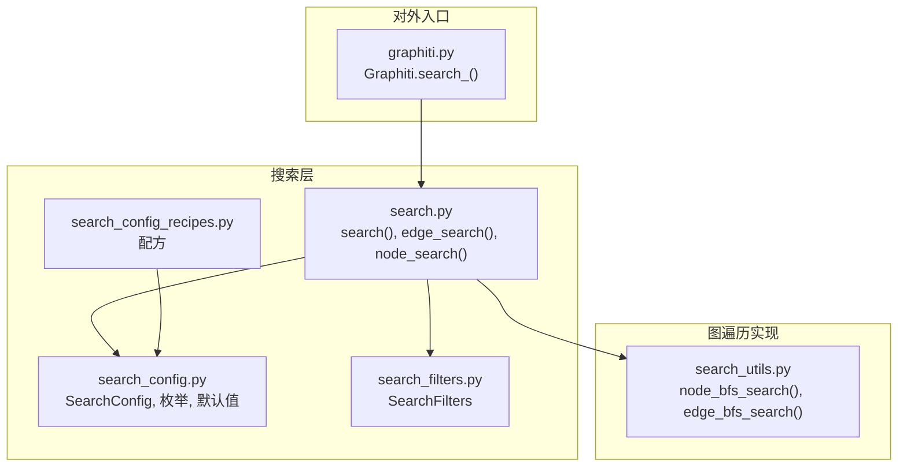
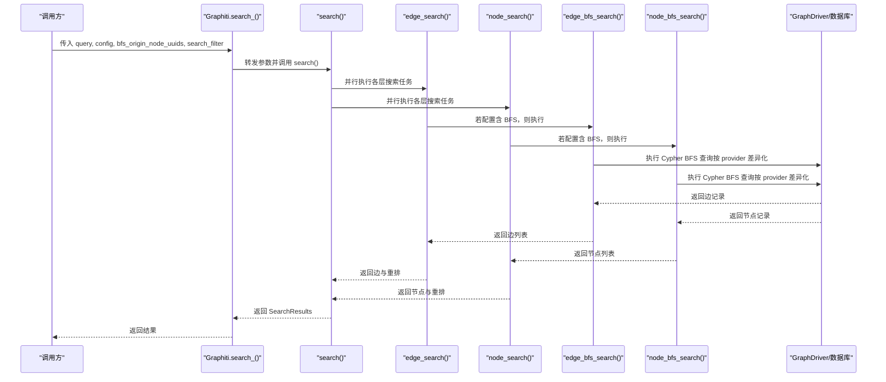
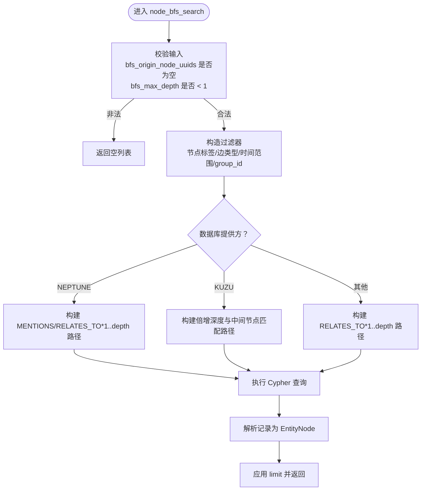
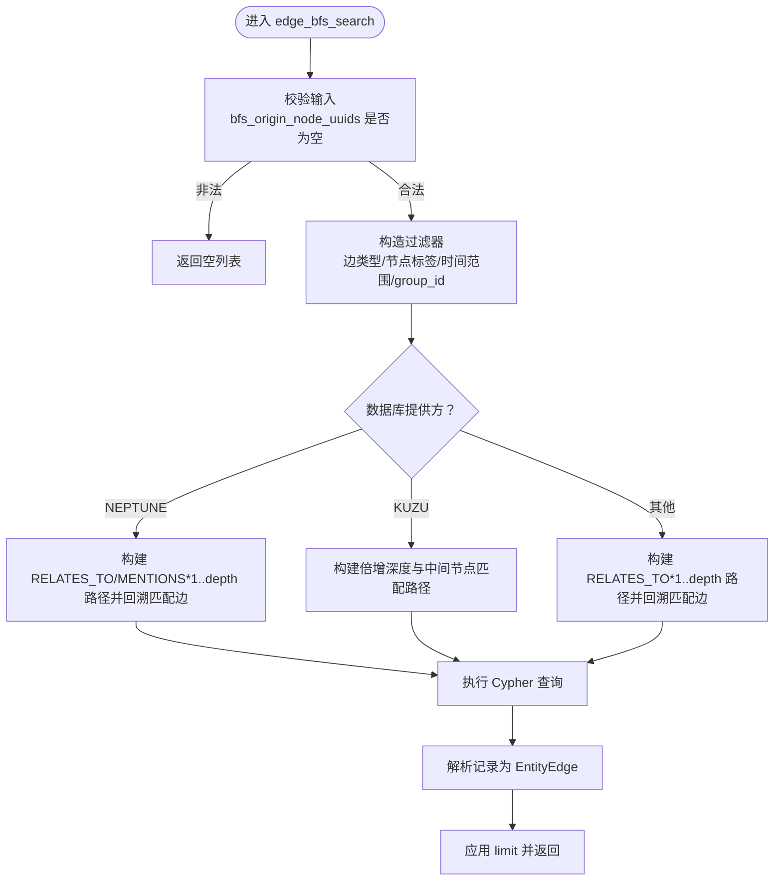
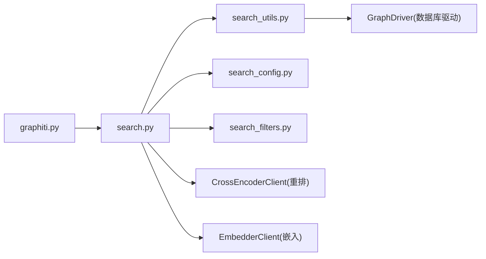

# 图遍历

<cite>
**本文引用的文件**
- [graphiti_core/search/search.py](file://graphiti_core/search/search.py)
- [graphiti_core/search/search_config.py](file://graphiti_core/search/search_config.py)
- [graphiti_core/search/search_config_recipes.py](file://graphiti_core/search/search_config_recipes.py)
- [graphiti_core/search/search_utils.py](file://graphiti_core/search/search_utils.py)
- [graphiti_core/search/search_filters.py](file://graphiti_core/search/search_filters.py)
- [graphiti_core/graphiti.py](file://graphiti_core/graphiti.py)
- [examples/quickstart/quickstart_neo4j.py](file://examples/quickstart/quickstart_neo4j.py)
</cite>

## 目录
1. [简介](#简介)
2. [项目结构](#项目结构)
3. [核心组件](#核心组件)
4. [架构总览](#架构总览)
5. [详细组件分析](#详细组件分析)
6. [依赖分析](#依赖分析)
7. [性能考量](#性能考量)
8. [故障排查指南](#故障排查指南)
9. [结论](#结论)
10. [附录](#附录)

## 简介
本文件围绕“基于广度优先搜索（BFS）的关系路径探索机制”展开，系统阐述 node_bfs_search 与 edge_bfs_search 的工作原理、SearchConfig 中 BFS 方法的配置方式、以及其在发现实体间间接关联、构建上下文子图方面的独特价值。文档同时提供实际使用路径示例，说明如何通过 Graphiti 的高级搜索接口 search_ 传入 bfs_origin_node_uuids 参数，结合 SearchConfig 配置，完成从指定起点出发、在限定深度内探索邻接节点与边的图遍历流程，并讨论深度过大时的性能影响与优化建议。

## 项目结构
与 BFS 图遍历直接相关的模块主要集中在 graphiti_core/search 子系统：
- search.py：对外搜索入口，协调多层搜索与重排，包含 edge_search、node_search、search 等方法；其中 edge_search/node_search 内部会根据 SearchConfig 配置调用对应 BFS 搜索。
- search_config.py：定义 SearchConfig、各层 SearchConfig（Node/Edge/Episode/Community）、枚举类型（如 EdgeSearchMethod.NodeSearchMethod）及默认参数。
- search_config_recipes.py：提供多种预设的 SearchConfig 组合配方，便于快速启用混合检索与 BFS。
- search_utils.py：包含 node_bfs_search、edge_bfs_search 的具体实现，以及全文检索、向量相似检索等辅助方法。
- search_filters.py：提供 SearchFilters，用于对节点标签、边类型、时间范围等进行过滤，BFS 查询会拼接这些过滤条件。
- graphiti.py：对外 API 入口，提供 search 与 search_ 方法，search_ 支持传入 bfs_origin_node_uuids、search_filter、group_ids 等参数，最终委托给 search 实现。

图表来源
- [graphiti_core/search/search.py](file://graphiti_core/search/search.py#L68-L184)
- [graphiti_core/search/search_config.py](file://graphiti_core/search/search_config.py#L32-L120)
- [graphiti_core/search/search_config_recipes.py](file://graphiti_core/search/search_config_recipes.py#L1-L224)
- [graphiti_core/search/search_utils.py](file://graphiti_core/search/search_utils.py#L433-L554)
- [graphiti_core/search/search_filters.py](file://graphiti_core/search/search_filters.py#L44-L252)
- [graphiti_core/graphiti.py](file://graphiti_core/graphiti.py#L1127-L1154)

章节来源
- [graphiti_core/search/search.py](file://graphiti_core/search/search.py#L68-L184)
- [graphiti_core/search/search_config.py](file://graphiti_core/search/search_config.py#L32-L120)
- [graphiti_core/search/search_config_recipes.py](file://graphiti_core/search/search_config_recipes.py#L1-L224)
- [graphiti_core/search/search_utils.py](file://graphiti_core/search/search_utils.py#L433-L554)
- [graphiti_core/search/search_filters.py](file://graphiti_core/search/search_filters.py#L44-L252)
- [graphiti_core/graphiti.py](file://graphiti_core/graphiti.py#L1127-L1154)

## 核心组件
- BFS 节点搜索：node_bfs_search
  - 输入：起始节点 UUID 列表、过滤器、最大深度、可选分组 ID、结果上限
  - 行为：从起点出发，沿 RELATES_TO/MENTIONS 关系按深度扩展，返回满足过滤条件的实体节点集合
  - 特性：支持不同图数据库提供方的 Cypher 差异化处理
- BFS 边搜索：edge_bfs_search
  - 输入：起始节点 UUID 列表、最大深度、过滤器、可选分组 ID、结果上限
  - 行为：从起点出发，沿 RELATES_TO/MENTIONS 关系按深度扩展，返回满足过滤条件的实体边集合
  - 特性：针对不同提供方（如 KUZU、NEPTUNE）采用不同的路径匹配策略
- SearchConfig 配置：
  - 各层 SearchConfig 均包含 search_methods、reranker、sim_min_score、mmr_lambda、bfs_max_depth 等字段
  - EdgeSearchConfig/NodeSearchConfig 的 bfs_max_depth 控制 BFS 探索的最大深度
- 搜索入口与组合：
  - search() 统一调度各层搜索与重排
  - edge_search()/node_search() 在配置包含 BFS 时，会执行 node_bfs_search/edge_bfs_search
  - 当未显式提供 bfs_origin_node_uuids 且 BFS 方法开启时，会自动从已有搜索结果中提取起点再执行一次 BFS

章节来源
- [graphiti_core/search/search_utils.py](file://graphiti_core/search/search_utils.py#L433-L554)
- [graphiti_core/search/search_utils.py](file://graphiti_core/search/search_utils.py#L767-L852)
- [graphiti_core/search/search_config.py](file://graphiti_core/search/search_config.py#L80-L110)
- [graphiti_core/search/search.py](file://graphiti_core/search/search.py#L186-L307)
- [graphiti_core/search/search.py](file://graphiti_core/search/search.py#L309-L417)

## 架构总览
下图展示从 Graphiti.search_ 到 BFS 搜索的端到端调用链路，包括 SearchConfig 解析、BFS 方法触发、过滤器拼接与数据库执行。

图表来源
- [graphiti_core/graphiti.py](file://graphiti_core/graphiti.py#L1127-L1154)
- [graphiti_core/search/search.py](file://graphiti_core/search/search.py#L68-L184)
- [graphiti_core/search/search.py](file://graphiti_core/search/search.py#L186-L307)
- [graphiti_core/search/search.py](file://graphiti_core/search/search.py#L309-L417)
- [graphiti_core/search/search_utils.py](file://graphiti_core/search/search_utils.py#L433-L554)
- [graphiti_core/search/search_utils.py](file://graphiti_core/search/search_utils.py#L767-L852)

## 详细组件分析

### BFS 节点搜索：node_bfs_search
- 函数签名与关键参数
  - 输入：driver、bfs_origin_node_uuids、search_filter、bfs_max_depth、group_ids、limit
  - 输出：EntityNode 列表
- 处理逻辑要点
  - 过滤器构造：将 SearchFilters 转换为 Cypher WHERE 条件，支持节点标签、边类型、时间范围等
  - 深度控制：bfs_max_depth 作为路径长度上限，不同提供方采用不同的路径表达方式
  - 分组过滤：group_ids 会同时约束起点与目标节点的 group_id
  - 提供方差异化：
    - NEPTUNE：使用 MENTIONS/RELATES_TO*1..depth 的关系路径
    - KUZU：由于存储模型差异，采用倍增深度与中间节点匹配策略
  - 结果去重与限制：返回 DISTINCT 记录并限制数量
- 复杂度与边界
  - 时间复杂度近似与分支因子 b 和深度 d 成指数增长 O(b^d)，受 limit 与过滤器约束
  - 空输入或深度不足时返回空集

图表来源
- [graphiti_core/search/search_utils.py](file://graphiti_core/search/search_utils.py#L767-L852)
- [graphiti_core/search/search_filters.py](file://graphiti_core/search/search_filters.py#L44-L252)

章节来源
- [graphiti_core/search/search_utils.py](file://graphiti_core/search/search_utils.py#L767-L852)
- [graphiti_core/search/search_filters.py](file://graphiti_core/search/search_filters.py#L44-L252)

### BFS 边搜索：edge_bfs_search
- 函数签名与关键参数
  - 输入：driver、bfs_origin_node_uuids、bfs_max_depth、search_filter、group_ids、limit
  - 输出：EntityEdge 列表
- 处理逻辑要点
  - 过滤器构造：与节点 BFS 类似，但额外考虑边类型与节点标签的双端约束
  - 提供方差异化：
    - NEPTUNE：先构建路径，再回溯匹配具体边
    - KUZU：因存储模型差异，采用两段路径拼接与中间节点匹配
  - 结果去重与限制：返回 DISTINCT 记录并限制数量
- 复杂度与边界
  - 与节点 BFS 类似，随深度呈指数增长，需合理设置 bfs_max_depth 与 limit

图表来源
- [graphiti_core/search/search_utils.py](file://graphiti_core/search/search_utils.py#L433-L554)
- [graphiti_core/search/search_filters.py](file://graphiti_core/search/search_filters.py#L44-L252)

章节来源
- [graphiti_core/search/search_utils.py](file://graphiti_core/search/search_utils.py#L433-L554)
- [graphiti_core/search/search_filters.py](file://graphiti_core/search/search_filters.py#L44-L252)

### SearchConfig 中 BFS 方法的配置
- 各层 SearchConfig 字段
  - search_methods：可包含 bfs、bm25、cosine_similarity 等
  - reranker：可选 rrf、mmr、cross_encoder、node_distance、episode_mentions 等
  - bfs_max_depth：控制 BFS 探索的最大深度，默认值来自常量
  - 其他：sim_min_score、mmr_lambda 等
- 配置示例与推荐
  - 可参考 recipes 中的 EDGE_HYBRID_SEARCH_CROSS_ENCODER/NODE_HYBRID_SEARCH_CROSS_ENCODER，它们均启用了 BFS 方法并使用交叉编码器重排
  - 也可使用 EDGE_HYBRID_SEARCH_RRF/NODE_HYBRID_SEARCH_RRF 等仅启用文本与向量检索的配方，按需添加 BFS

章节来源
- [graphiti_core/search/search_config.py](file://graphiti_core/search/search_config.py#L32-L120)
- [graphiti_core/search/search_config_recipes.py](file://graphiti_core/search/search_config_recipes.py#L80-L154)
- [graphiti_core/search/search_config_recipes.py](file://graphiti_core/search/search_config_recipes.py#L156-L198)

### 在未显式提供起点时的自动 BFS
- edge_search/node_search 在检测到配置包含 BFS 且未提供 bfs_origin_node_uuids 时，会先执行其他搜索方法获取候选结果，然后从候选结果中提取起点 UUID，再次调用 BFS 搜索以扩大上下文覆盖面
- 这种设计确保即使用户未明确指定起点，也能基于已有结果进行“从结果到上下文”的扩展

章节来源
- [graphiti_core/search/search.py](file://graphiti_core/search/search.py#L218-L250)
- [graphiti_core/search/search.py](file://graphiti_core/search/search.py#L342-L371)

### 实际使用示例（关系链查询）
以下示例展示了如何通过 Graphiti 的高级搜索接口 search_，传入 bfs_origin_node_uuids 与 SearchConfig，实现从指定起点出发的 BFS 探索，从而发现实体间的间接关联并构建上下文子图。

- 使用步骤
  - 准备 SearchConfig：选择包含 BFS 的配方（如 NODE_HYBRID_SEARCH_CROSS_ENCODER 或 EDGE_HYBRID_SEARCH_CROSS_ENCODER），或自定义 SearchConfig 并设置 bfs_max_depth
  - 准备起点：收集一组实体节点 UUID，作为 bfs_origin_node_uuids
  - 调用 search_：传入 query、config、bfs_origin_node_uuids、可选 search_filter、group_ids
  - 获取结果：SearchResults 包含 nodes、edges、communities、episodes 等，可用于后续推理或提示工程

- 示例参考
  - 快速开始示例展示了如何使用 NODE_HYBRID_SEARCH_RRF 进行节点搜索，可类比将配方替换为包含 BFS 的配方，并传入 bfs_origin_node_uuids 即可实现 BFS 探索

章节来源
- [graphiti_core/graphiti.py](file://graphiti_core/graphiti.py#L1127-L1154)
- [graphiti_core/search/search_config_recipes.py](file://graphiti_core/search/search_config_recipes.py#L156-L198)
- [examples/quickstart/quickstart_neo4j.py](file://examples/quickstart/quickstart_neo4j.py#L195-L209)

## 依赖分析
- 组件耦合
  - search.py 依赖 search_utils.py 中的 BFS 实现与各类检索方法
  - search_config.py 为所有搜索层提供统一的配置模型与默认值
  - search_filters.py 为 BFS 与全文/向量检索提供统一的过滤器构造能力
  - graphiti.py 将外部调用桥接到 search.py，暴露 search_ 接口并支持 bfs_origin_node_uuids
- 外部依赖
  - GraphDriver 提供不同数据库提供方的执行接口与 Cypher 差异化处理
  - CrossEncoderClient、EmbedderClient 用于重排与向量检索

图表来源
- [graphiti_core/graphiti.py](file://graphiti_core/graphiti.py#L1127-L1154)
- [graphiti_core/search/search.py](file://graphiti_core/search/search.py#L68-L184)
- [graphiti_core/search/search_utils.py](file://graphiti_core/search/search_utils.py#L433-L554)
- [graphiti_core/search/search_config.py](file://graphiti_core/search/search_config.py#L32-L120)
- [graphiti_core/search/search_filters.py](file://graphiti_core/search/search_filters.py#L44-L252)

章节来源
- [graphiti_core/graphiti.py](file://graphiti_core/graphiti.py#L1127-L1154)
- [graphiti_core/search/search.py](file://graphiti_core/search/search.py#L68-L184)
- [graphiti_core/search/search_utils.py](file://graphiti_core/search/search_utils.py#L433-L554)
- [graphiti_core/search/search_config.py](file://graphiti_core/search/search_config.py#L32-L120)
- [graphiti_core/search/search_filters.py](file://graphiti_core/search/search_filters.py#L44-L252)

## 性能考量
- BFS 复杂度
  - BFS 在无界图上随深度呈指数增长，节点与边的数量可能迅速膨胀
  - 建议合理设置 bfs_max_depth（默认值见常量），并在高深度场景下配合 group_ids 与 SearchFilters 缩小搜索空间
- 并行与限流
  - search.py 使用并发聚合执行多任务，有助于缩短整体延迟
  - 对于大规模图，建议在调用侧控制并发度，避免数据库压力过大
- 过滤器与索引
  - 使用 SearchFilters 精确限定节点标签、边类型、时间范围等，可显著减少扫描范围
  - 确保数据库已建立必要的索引与约束，以提升 Cypher 执行效率
- 结果限制
  - 通过 limit 与各层 reranker 的最小分数阈值（如 sim_min_score、reranker_min_score）控制输出规模

[本节为通用指导，不直接分析具体文件]

## 故障排查指南
- 常见问题
  - BFS 无结果：检查 bfs_origin_node_uuids 是否为空或不存在；确认 group_ids 与节点/边的 group_id 一致；核对 SearchFilters 是否过于严格导致过滤掉全部结果
  - 深度过大导致超时：降低 bfs_max_depth 或增加 limit；检查数据库性能与索引
  - 不同提供方行为差异：关注 KUZU/NEPTUNE 的路径表达差异，必要时调整查询策略
- 定位手段
  - 在 Graphiti.search_ 中传入更宽松的 SearchFilters 与更大的 bfs_max_depth 进行试探
  - 使用较小的 limit 与较浅的深度验证路径是否可达
  - 查看日志与返回的 SearchResults，确认 nodes/edges 数量与分布

章节来源
- [graphiti_core/search/search.py](file://graphiti_core/search/search.py#L186-L307)
- [graphiti_core/search/search.py](file://graphiti_core/search/search.py#L309-L417)
- [graphiti_core/search/search_utils.py](file://graphiti_core/search/search_utils.py#L433-L554)
- [graphiti_core/search/search_utils.py](file://graphiti_core/search/search_utils.py#L767-L852)

## 结论
基于 BFS 的关系路径探索为图检索提供了强大的“从起点到上下文”的能力，能够有效发现实体间的间接关联并构建上下文子图。通过 SearchConfig 的灵活配置与 Graphiti.search_ 的便捷接口，用户可以轻松地将 BFS 与其他检索方法（全文、向量、重排）组合使用，既保证召回质量，又兼顾可解释性与可控性。实践中应重视深度与过滤器的平衡，避免指数级膨胀带来的性能问题，并结合索引与限流策略保障稳定性。

[本节为总结性内容，不直接分析具体文件]

## 附录
- 关键实现路径参考
  - BFS 节点搜索：[node_bfs_search](file://graphiti_core/search/search_utils.py#L767-L852)
  - BFS 边搜索：[edge_bfs_search](file://graphiti_core/search/search_utils.py#L433-L554)
  - 搜索入口与组合：[search](file://graphiti_core/search/search.py#L68-L184)、[edge_search](file://graphiti_core/search/search.py#L186-L307)、[node_search](file://graphiti_core/search/search.py#L309-L417)
  - 配置模型与配方：[search_config](file://graphiti_core/search/search_config.py#L32-L120)、[search_config_recipes](file://graphiti_core/search/search_config_recipes.py#L80-L198)
  - 对外入口：[Graphiti.search_](file://graphiti_core/graphiti.py#L1127-L1154)
  - 示例参考：[quickstart_neo4j.py](file://examples/quickstart/quickstart_neo4j.py#L195-L209)