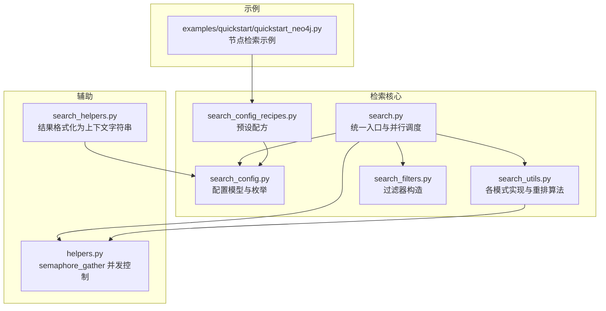
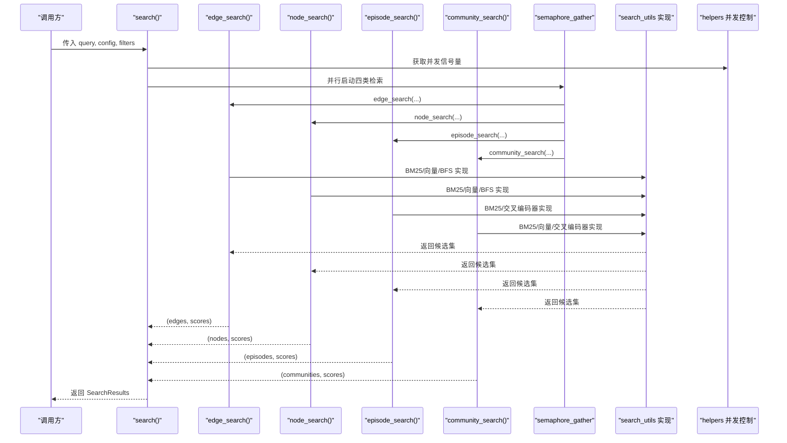
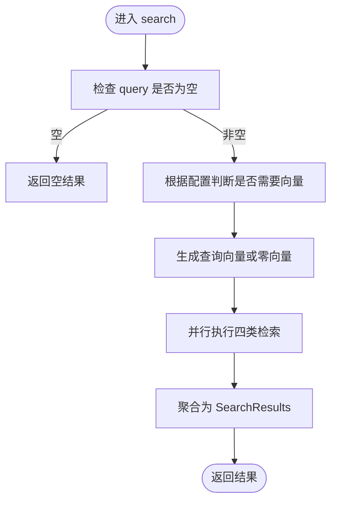
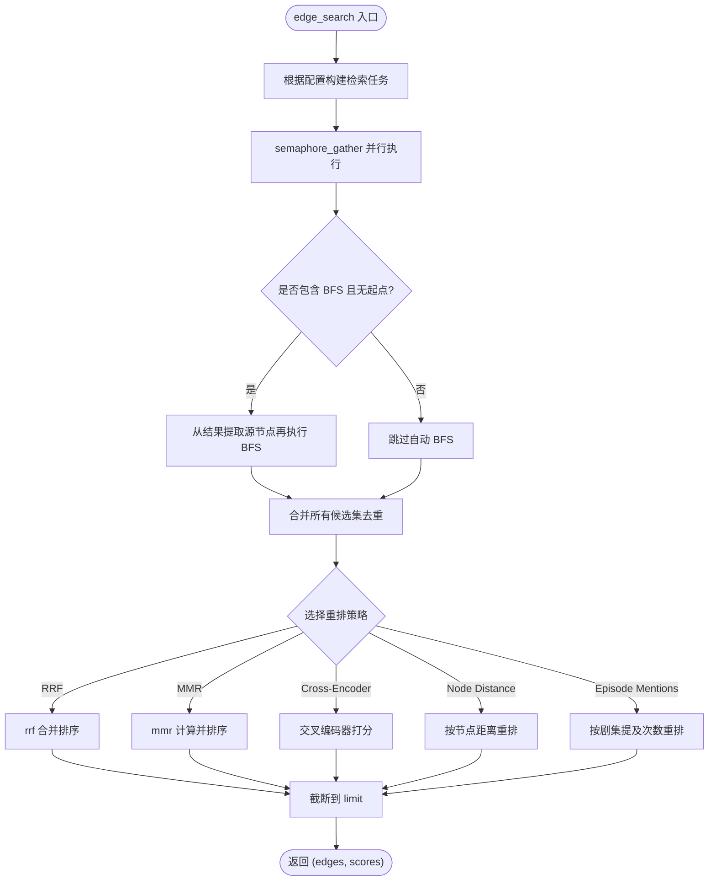
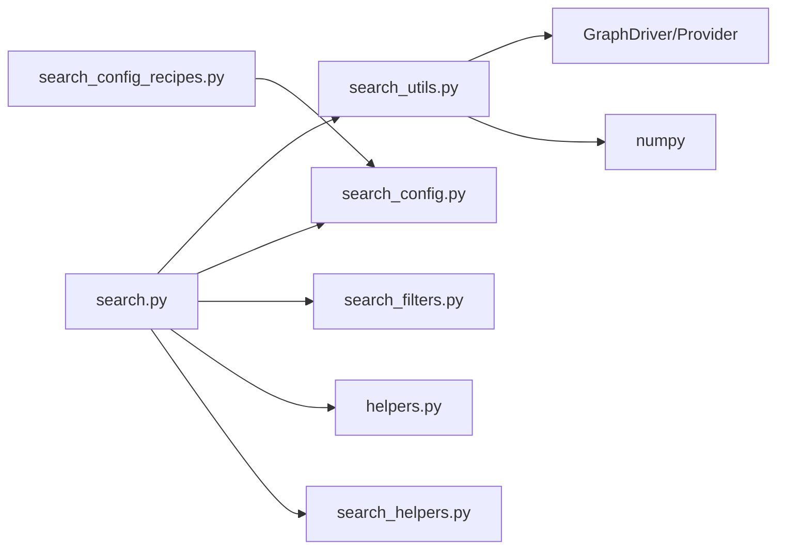

# 混合检索机制

<cite>
**本文引用的文件**
- [graphiti_core/search/search.py](file://graphiti_core/search/search.py)
- [graphiti_core/search/search_config.py](file://graphiti_core/search/search_config.py)
- [graphiti_core/search/search_config_recipes.py](file://graphiti_core/search/search_config_recipes.py)
- [graphiti_core/search/search_utils.py](file://graphiti_core/search/search_utils.py)
- [graphiti_core/search/search_filters.py](file://graphiti_core/search/search_filters.py)
- [graphiti_core/helpers.py](file://graphiti_core/helpers.py)
- [graphiti_core/search/search_helpers.py](file://graphiti_core/search/search_helpers.py)
- [examples/quickstart/quickstart_neo4j.py](file://examples/quickstart/quickstart_neo4j.py)
</cite>

## 目录
1. [简介](#简介)
2. [项目结构](#项目结构)
3. [核心组件](#核心组件)
4. [架构总览](#架构总览)
5. [详细组件分析](#详细组件分析)
6. [依赖关系分析](#依赖关系分析)
7. [性能考量](#性能考量)
8. [故障排查指南](#故障排查指南)
9. [结论](#结论)
10. [附录](#附录)

## 简介
本文件系统性阐述图数据库中的混合检索机制，围绕三种核心检索模式协同工作：语义搜索（向量余弦相似度）、关键词搜索（BM25/Lucene 全文检索）与图遍历（广度优先搜索 BFS）。文档重点说明：
- 如何通过 SearchConfig 配置不同检索方法的组合使用；
- 在 search 函数中如何并行执行多种检索任务并通过 semaphore_gather 进行结果聚合；
- 多策略联合查询的实际代码示例路径；
- 不同检索方法的适用场景、性能特征与最佳实践。

## 项目结构
检索相关代码主要集中在 graphiti_core/search 目录，配合 helpers 提供并发控制与工具函数，examples 展示典型用法。

图表来源
- [graphiti_core/search/search.py](file://graphiti_core/search/search.py#L68-L184)
- [graphiti_core/search/search_config.py](file://graphiti_core/search/search_config.py#L32-L161)
- [graphiti_core/search/search_config_recipes.py](file://graphiti_core/search/search_config_recipes.py#L33-L224)
- [graphiti_core/search/search_utils.py](file://graphiti_core/search/search_utils.py#L170-L554)
- [graphiti_core/search/search_filters.py](file://graphiti_core/search/search_filters.py#L44-L252)
- [graphiti_core/helpers.py](file://graphiti_core/helpers.py#L105-L117)
- [graphiti_core/search/search_helpers.py](file://graphiti_core/search/search_helpers.py#L27-L73)
- [examples/quickstart/quickstart_neo4j.py](file://examples/quickstart/quickstart_neo4j.py#L138-L200)

章节来源
- [graphiti_core/search/search.py](file://graphiti_core/search/search.py#L68-L184)
- [graphiti_core/search/search_config.py](file://graphiti_core/search/search_config.py#L32-L161)
- [graphiti_core/search/search_config_recipes.py](file://graphiti_core/search/search_config_recipes.py#L33-L224)
- [graphiti_core/search/search_utils.py](file://graphiti_core/search/search_utils.py#L170-L554)
- [graphiti_core/search/search_filters.py](file://graphiti_core/search/search_filters.py#L44-L252)
- [graphiti_core/helpers.py](file://graphiti_core/helpers.py#L105-L117)
- [graphiti_core/search/search_helpers.py](file://graphiti_core/search/search_helpers.py#L27-L73)
- [examples/quickstart/quickstart_neo4j.py](file://examples/quickstart/quickstart_neo4j.py#L138-L200)

## 核心组件
- 统一检索入口：search 函数负责并行调度边/节点/剧集/社区四类检索，并在完成后聚合为 SearchResults。
- 检索配置：SearchConfig 定义每类实体的检索方法集合、重排策略、阈值与深度等参数。
- 模式实现：search_utils 提供 BM25 全文检索、向量余弦相似度检索、BFS 图遍历等具体实现。
- 并发控制：helpers.semaphore_gather 使用信号量限制并发协程数量，避免资源争用。
- 结果重排：支持 RRF、MMR、交叉编码器重排、基于节点距离与剧集提及次数的重排。
- 过滤器：SearchFilters 支持标签、时间范围、类型等条件拼接为 Cypher 查询片段。
- 上下文格式化：search_helpers 将检索结果转为提示词可直接使用的上下文字符串。

章节来源
- [graphiti_core/search/search.py](file://graphiti_core/search/search.py#L68-L184)
- [graphiti_core/search/search_config.py](file://graphiti_core/search/search_config.py#L32-L161)
- [graphiti_core/search/search_utils.py](file://graphiti_core/search/search_utils.py#L170-L554)
- [graphiti_core/helpers.py](file://graphiti_core/helpers.py#L105-L117)
- [graphiti_core/search/search_helpers.py](file://graphiti_core/search/search_helpers.py#L27-L73)

## 架构总览
混合检索的整体流程如下：
- 输入 query 与 SearchConfig，按需生成查询向量；
- 并行执行各实体类型的检索任务（BM25、向量相似度、BFS）；
- 对每个实体类型的结果进行重排（RRF、MMR、交叉编码器、节点距离、剧集提及）；
- 聚合为统一的 SearchResults 返回。

图表来源
- [graphiti_core/search/search.py](file://graphiti_core/search/search.py#L68-L184)
- [graphiti_core/search/search_utils.py](file://graphiti_core/search/search_utils.py#L170-L554)
- [graphiti_core/helpers.py](file://graphiti_core/helpers.py#L105-L117)

## 详细组件分析

### 统一检索入口：search
- 功能要点
  - 根据配置决定是否需要向量；若需要则提前生成查询向量；
  - 并行执行四类检索：边、节点、剧集、社区；
  - 使用 semaphore_gather 控制并发上限；
  - 聚合为 SearchResults 返回。
- 关键路径
  - [search 函数定义](file://graphiti_core/search/search.py#L68-L184)
  - [semaphore_gather 并发控制](file://graphiti_core/helpers.py#L105-L117)

图表来源
- [graphiti_core/search/search.py](file://graphiti_core/search/search.py#L68-L184)
- [graphiti_core/helpers.py](file://graphiti_core/helpers.py#L105-L117)

章节来源
- [graphiti_core/search/search.py](file://graphiti_core/search/search.py#L68-L184)
- [graphiti_core/helpers.py](file://graphiti_core/helpers.py#L105-L117)

### 边检索：edge_search
- 检索方法
  - BM25 全文检索：edge_fulltext_search
  - 向量相似度：edge_similarity_search
  - BFS 图遍历：edge_bfs_search
- 并行策略
  - 若配置包含 BM25/向量/BFS，则构建对应任务并并行执行；
  - 若仅包含 BFS 且未指定起点，则自动从 BM25/向量结果提取源节点再做一次 BFS；
- 重排策略
  - RRF：reciprocal rank fusion
  - MMR：maximal marginal relevance
  - 交叉编码器重排：cross_encoder.rank
  - 基于节点距离重排：node_distance_reranker
  - 基于剧集提及次数重排：episode_mentions_reranker

图表来源
- [graphiti_core/search/search.py](file://graphiti_core/search/search.py#L186-L307)
- [graphiti_core/search/search_utils.py](file://graphiti_core/search/search_utils.py#L170-L554)
- [graphiti_core/search/search_utils.py](file://graphiti_core/search/search_utils.py#L1732-L1877)

章节来源
- [graphiti_core/search/search.py](file://graphiti_core/search/search.py#L186-L307)
- [graphiti_core/search/search_utils.py](file://graphiti_core/search/search_utils.py#L170-L554)
- [graphiti_core/search/search_utils.py](file://graphiti_core/search/search_utils.py#L1732-L1877)

### 节点检索：node_search
- 检索方法
  - BM25 全文检索：node_fulltext_search
  - 向量相似度：node_similarity_search
  - BFS 图遍历：node_bfs_search
- 并行策略与后处理
  - 与边检索一致，支持自动 BFS；
  - 支持 RRF、MMR、交叉编码器、节点距离、剧集提及等重排。
- 关键路径
  - [node_search 函数](file://graphiti_core/search/search.py#L309-L417)
  - [BM25/向量/BFS 实现](file://graphiti_core/search/search_utils.py#L556-L800)

章节来源
- [graphiti_core/search/search.py](file://graphiti_core/search/search.py#L309-L417)
- [graphiti_core/search/search_utils.py](file://graphiti_core/search/search_utils.py#L556-L800)

### 剧集检索：episode_search
- 检索方法
  - BM25 全文检索：episode_fulltext_search
- 重排策略
  - RRF 或交叉编码器重排（先 RRF 再交叉编码器）。

章节来源
- [graphiti_core/search/search.py](file://graphiti_core/search/search.py#L419-L466)
- [graphiti_core/search/search_utils.py](file://graphiti_core/search/search_utils.py#L170-L554)

### 社区检索：community_search
- 检索方法
  - BM25 全文检索：community_fulltext_search
  - 向量相似度：community_similarity_search
- 重排策略
  - RRF、MMR、交叉编码器。

章节来源
- [graphiti_core/search/search.py](file://graphiti_core/search/search.py#L468-L520)
- [graphiti_core/search/search_utils.py](file://graphiti_core/search/search_utils.py#L170-L554)

### 检索配置：SearchConfig 与配方
- 配置项
  - 每类实体的 search_methods（BM25、向量、BFS）
  - reranker（RRF、MMR、交叉编码器、节点距离、剧集提及）
  - sim_min_score、mmr_lambda、bfs_max_depth、limit、reranker_min_score
- 预设配方
  - 组合混合检索（RRF/交叉编码器/MMR）覆盖边/节点/社区/剧集
  - 单类混合检索（如 EDGE_HYBRID_SEARCH_*、NODE_HYBRID_SEARCH_*、COMMUNITY_HYBRID_SEARCH_*）

章节来源
- [graphiti_core/search/search_config.py](file://graphiti_core/search/search_config.py#L32-L161)
- [graphiti_core/search/search_config_recipes.py](file://graphiti_core/search/search_config_recipes.py#L33-L224)

### 过滤器：SearchFilters
- 支持节点标签、边类型、有效时间、失效时间、创建时间、过期时间、边 UUID 等过滤条件；
- 自动构造 Cypher 片段并注入参数，适配不同图数据库提供商。

章节来源
- [graphiti_core/search/search_filters.py](file://graphiti_core/search/search_filters.py#L44-L252)

### 结果格式化：search_results_to_context_string
- 将检索结果转换为提示词可用的上下文字符串，便于下游 LLM 使用。

章节来源
- [graphiti_core/search/search_helpers.py](file://graphiti_core/search/search_helpers.py#L27-L73)

## 依赖关系分析
- 检索入口依赖
  - search 依赖 semaphore_gather 控制并发；
  - 依赖 search_utils 的具体检索实现；
  - 依赖 search_config 的配置与枚举；
  - 依赖 search_filters 的过滤器构造；
  - 依赖 cross_encoder 与 embedder（当需要向量时）。
- 检索实现依赖
  - search_utils 依赖 driver 执行查询、provider 差异化处理；
  - 重排算法依赖 numpy、l2 归一化与时间统计。

图表来源
- [graphiti_core/search/search.py](file://graphiti_core/search/search.py#L68-L184)
- [graphiti_core/search/search_utils.py](file://graphiti_core/search/search_utils.py#L170-L554)
- [graphiti_core/search/search_config.py](file://graphiti_core/search/search_config.py#L32-L161)
- [graphiti_core/search/search_filters.py](file://graphiti_core/search/search_filters.py#L44-L252)
- [graphiti_core/helpers.py](file://graphiti_core/helpers.py#L105-L117)
- [graphiti_core/search/search_helpers.py](file://graphiti_core/search/search_helpers.py#L27-L73)
- [graphiti_core/search/search_config_recipes.py](file://graphiti_core/search/search_config_recipes.py#L33-L224)

## 性能考量
- 并发控制
  - 使用 semaphore_gather 限制最大并发数，避免数据库压力过大；
  - 可通过环境变量调整并发上限。
- 检索方法选择
  - BM25：适合关键词精确匹配与短文本召回，开销较低；
  - 向量相似度：语义近似召回，依赖嵌入质量与维度；
  - BFS：图结构扩展，深度越大成本越高，建议合理设置 bfs_max_depth。
- 重排策略
  - RRF：轻量、稳定，适合多路召回融合；
  - MMR：兼顾相关性与多样性，计算复杂度较高；
  - 交叉编码器：更精细的语义重排，但引入额外推理成本；
  - 节点距离/剧集提及：引入图结构信息，可能增加额外查询成本。
- 数据库差异
  - 不同 Provider（Neo4j/Kuzu/AWS Neptune/OpenSearch）在全文检索与向量相似度上存在语法与能力差异，search_utils 已做差异化处理。

章节来源
- [graphiti_core/helpers.py](file://graphiti_core/helpers.py#L105-L117)
- [graphiti_core/search/search_utils.py](file://graphiti_core/search/search_utils.py#L170-L554)
- [graphiti_core/search/search.py](file://graphiti_core/search/search.py#L68-L184)

## 故障排查指南
- 空查询
  - 当 query 为空时直接返回空结果，确认输入是否正确。
- 缺少中心节点
  - 使用节点距离重排时必须提供 center_node_uuid，否则会抛出错误。
- 并发过高
  - 调整环境变量以降低并发上限，缓解数据库压力。
- 全文检索无效
  - 检查查询长度与特殊字符转义，确保符合数据库全文检索要求。
- 向量相似度无结果
  - 检查嵌入维度与最小分数阈值，适当降低 sim_min_score 或提高阈值以观察效果。

章节来源
- [graphiti_core/search/search.py](file://graphiti_core/search/search.py#L85-L110)
- [graphiti_core/search/search.py](file://graphiti_core/search/search.py#L277-L280)
- [graphiti_core/helpers.py](file://graphiti_core/helpers.py#L105-L117)
- [graphiti_core/search/search_utils.py](file://graphiti_core/search/search_utils.py#L84-L110)

## 结论
该混合检索机制通过“BM25/向量/BFS”三路召回与“RRF/MMR/交叉编码器/节点距离/剧集提及”多策略重排，实现了高召回、高相关性的检索体验。SearchConfig 与配方提供了灵活的组合方式，semaphore_gather 则保障了在高并发下的稳定性。实践中应结合业务场景选择合适的检索方法与重排策略，并根据数据规模与硬件条件调整并发与阈值参数。

## 附录

### 多策略联合查询示例路径
- 示例：节点检索使用预设配方 NODE_HYBRID_SEARCH_RRF
  - [示例脚本路径](file://examples/quickstart/quickstart_neo4j.py#L138-L200)
- 示例：边检索默认混合（BM25 + 向量 + BFS），并支持交叉编码器重排
  - [配方定义路径](file://graphiti_core/search/search_config_recipes.py#L80-L108)

章节来源
- [examples/quickstart/quickstart_neo4j.py](file://examples/quickstart/quickstart_neo4j.py#L138-L200)
- [graphiti_core/search/search_config_recipes.py](file://graphiti_core/search/search_config_recipes.py#L80-L108)

### 适用场景与最佳实践
- BM25
  - 场景：关键词精确匹配、短文本召回；
  - 最佳实践：合理设置 group_ids 过滤、避免超长查询。
- 向量相似度
  - 场景：语义近似召回；
  - 最佳实践：提升嵌入质量、适度降低 sim_min_score。
- BFS
  - 场景：图结构扩展、邻域发现；
  - 最佳实践：限制 bfs_max_depth、结合已有候选集自动 BFS。
- 重排策略
  - RRF：通用融合，推荐默认；
  - MMR：追求多样性与相关性平衡；
  - 交叉编码器：对语义重排要求较高时使用；
  - 节点距离/剧集提及：强调图结构与上下文关联时使用。

章节来源
- [graphiti_core/search/search.py](file://graphiti_core/search/search.py#L186-L520)
- [graphiti_core/search/search_config.py](file://graphiti_core/search/search_config.py#L32-L161)
- [graphiti_core/search/search_utils.py](file://graphiti_core/search/search_utils.py#L1732-L1877)