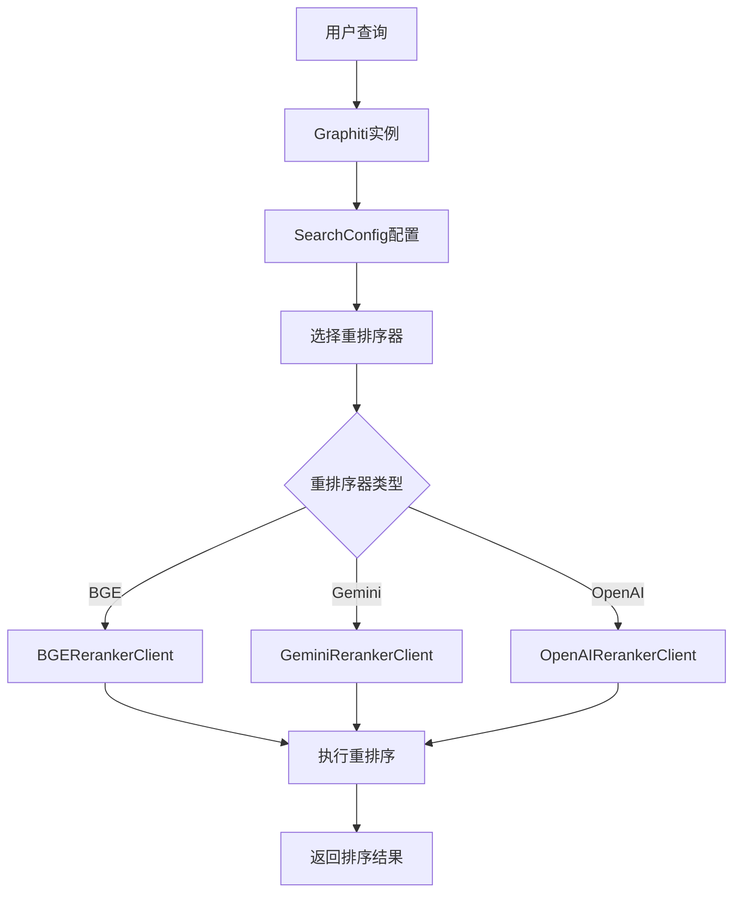
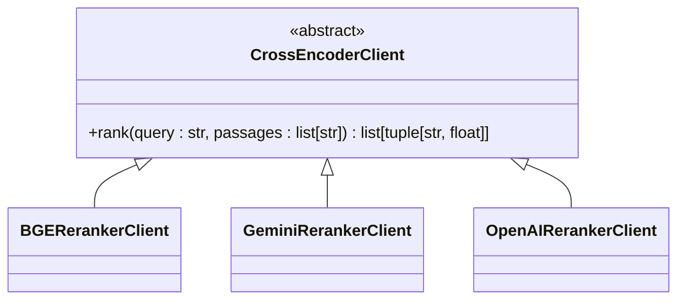
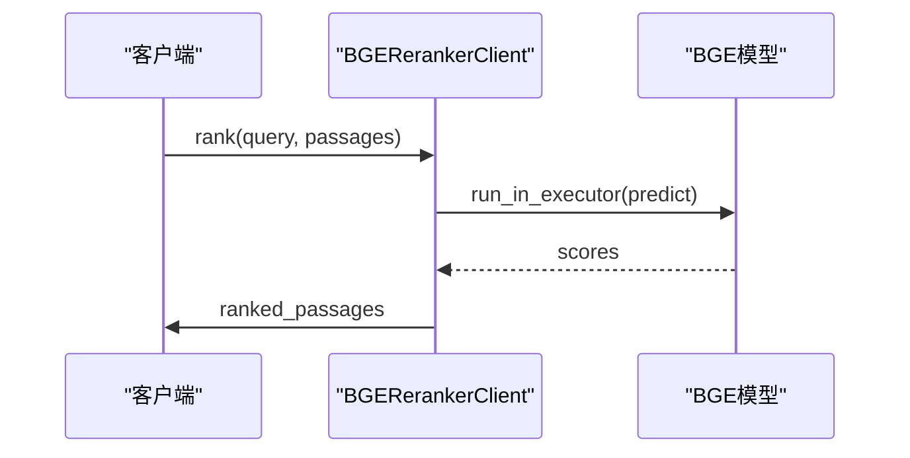
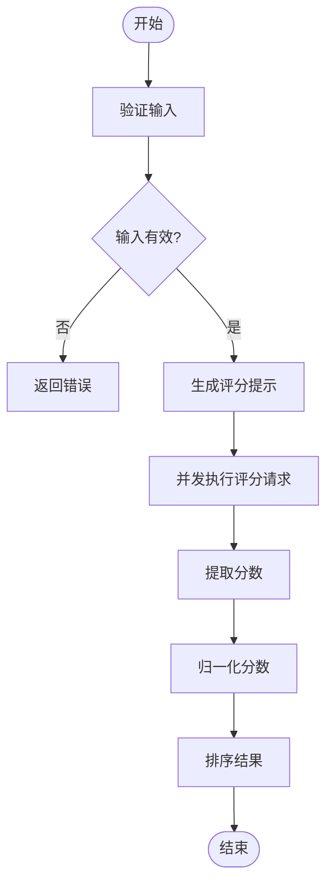
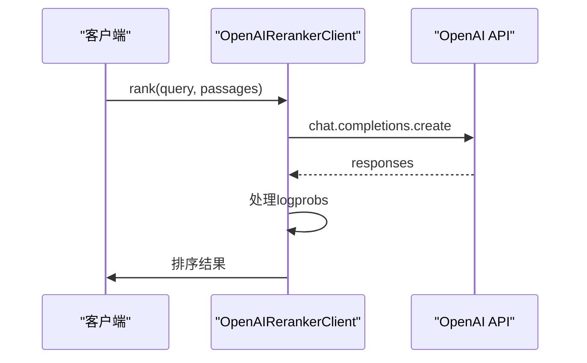
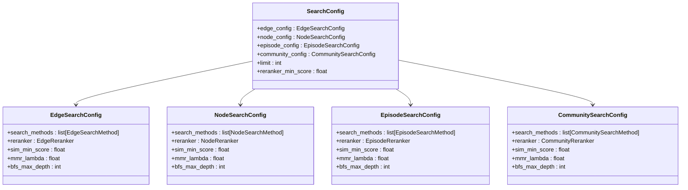
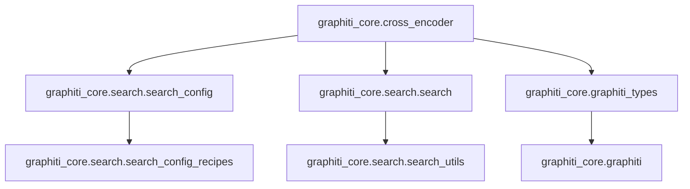

# 交叉编码器精排

<cite>
**本文档引用的文件**   
- [client.py](file://graphiti_core/cross_encoder/client.py)
- [bge_reranker_client.py](file://graphiti_core/cross_encoder/bge_reranker_client.py)
- [gemini_reranker_client.py](file://graphiti_core/cross_encoder/gemini_reranker_client.py)
- [openai_reranker_client.py](file://graphiti_core/cross_encoder/openai_reranker_client.py)
- [search_config.py](file://graphiti_core/search/search_config.py)
- [search.py](file://graphiti_core/search/search.py)
- [search_config_recipes.py](file://graphiti_core/search/search_config_recipes.py)
- [graphiti.py](file://graphiti_core/graphiti.py)
- [graphiti_types.py](file://graphiti_core/graphiti_types.py)
</cite>

## 目录
1. [简介](#简介)
2. [核心组件](#核心组件)
3. [架构概述](#架构概述)
4. [详细组件分析](#详细组件分析)
5. [依赖分析](#依赖分析)
6. [性能考量](#性能考量)
7. [故障排除指南](#故障排除指南)
8. [结论](#结论)

## 简介
交叉编码器重排序是一种高精度的重排序策略，用于提升搜索结果的准确性。该策略通过利用BGE、Gemini或OpenAI等交叉编码模型对候选结果进行精细化打分，从而显著提高最终排名的质量。本文档详细说明了如何在SearchConfig中启用此功能，以及其与graphiti_core.cross_encoder模块的集成方式、请求参数和性能开销。此外，还提供了具体的代码示例来展示配置流程，并讨论了在低延迟要求场景下的权衡以及与轻量级策略（如RRF）的对比。

## 核心组件

交叉编码器重排序的核心组件包括CrossEncoderClient抽象基类及其具体实现，如BGERerankerClient、GeminiRerankerClient和OpenAIRerankerClient。这些组件共同构成了一个灵活且可扩展的重排序框架。

**Section sources**
- [client.py](file://graphiti_core/cross_encoder/client.py#L1-L41)
- [bge_reranker_client.py](file://graphiti_core/cross_encoder/bge_reranker_client.py#L1-L55)
- [gemini_reranker_client.py](file://graphiti_core/cross_encoder/gemini_reranker_client.py#L1-L162)
- [openai_reranker_client.py](file://graphiti_core/cross_encoder/openai_reranker_client.py#L1-L124)

## 架构概述

交叉编码器重排序的架构涉及多个组件之间的协作，从查询处理到最终结果的生成。整个过程包括初始化、搜索配置、执行搜索和结果重排序等步骤。

**Diagram sources **
- [graphiti.py](file://graphiti_core/graphiti.py#L130-L329)
- [search_config.py](file://graphiti_core/search/search_config.py#L1-L161)
- [search.py](file://graphiti_core/search/search.py#L1-L520)

## 详细组件分析

### CrossEncoderClient 分析
CrossEncoderClient是所有交叉编码器客户端的抽象基类，定义了rank方法的接口，用于根据查询对段落进行排名。

**Diagram sources **
- [client.py](file://graphiti_core/cross_encoder/client.py#L20-L41)

#### BGERerankerClient 实现
BGERerankerClient使用sentence-transformers库中的BAAI/bge-reranker-v2-m3模型来进行重排序。它通过异步执行同步的predict方法来处理输入对。

**Diagram sources **
- [bge_reranker_client.py](file://graphiti_core/cross_encoder/bge_reranker_client.py#L34-L55)

#### GeminiRerankerClient 实现
GeminiRerankerClient利用Google的Gemini API进行直接相关性评分。每个段落都会被单独评分，然后归一化到[0,1]范围。

**Diagram sources **
- [gemini_reranker_client.py](file://graphiti_core/cross_encoder/gemini_reranker_client.py#L43-L162)

#### OpenAIRerankerClient 实现
OpenAIRerankerClient使用OpenAI API运行简单的布尔分类器提示，利用对数概率对段落进行排名。

**Diagram sources **
- [openai_reranker_client.py](file://graphiti_core/cross_encoder/openai_reranker_client.py#L34-L124)

### 搜索配置与集成
交叉编码器重排序通过SearchConfig中的reranker字段进行配置，支持多种搜索方法和重排序策略的组合。

**Diagram sources **
- [search_config.py](file://graphiti_core/search/search_config.py#L80-L119)

## 依赖分析

交叉编码器重排序功能依赖于多个核心模块，包括搜索配置、搜索执行和客户端管理。

**Diagram sources **
- [search_config.py](file://graphiti_core/search/search_config.py#L1-L161)
- [search.py](file://graphiti_core/search/search.py#L1-L520)
- [graphiti_types.py](file://graphiti_core/graphiti_types.py#L1-L34)

## 性能考量

交叉编码器重排序虽然能显著提升搜索结果的准确性，但也会带来较高的性能开销。特别是Gemini和OpenAI等基于API的重排序器，需要考虑网络延迟和API调用成本。相比之下，BGE等本地模型虽然减少了网络开销，但仍需消耗大量计算资源。在低延迟要求的场景下，建议使用轻量级策略如RRF作为替代方案。

## 故障排除指南

在使用交叉编码器重排序时，可能会遇到以下常见问题：
- **导入错误**：确保已安装必要的依赖包，如sentence-transformers或google-genai。
- **API限流**：对于Gemini和OpenAI等API，注意处理RateLimitError异常。
- **配置错误**：检查SearchConfig中的reranker配置是否正确。

**Section sources**
- [bge_reranker_client.py](file://graphiti_core/cross_encoder/bge_reranker_client.py#L23-L29)
- [gemini_reranker_client.py](file://graphiti_core/cross_encoder/gemini_reranker_client.py#L29-L36)
- [openai_reranker_client.py](file://graphiti_core/cross_encoder/openai_reranker_client.py#L21-L22)

## 结论

交叉编码器重排序是一种强大的高精度重排序策略，适用于对搜索结果质量有严格要求的场景。通过合理配置和选择合适的重排序器，可以在准确性和性能之间找到最佳平衡点。未来的工作可以进一步优化重排序算法，减少计算开销，同时探索更多先进的交叉编码模型。