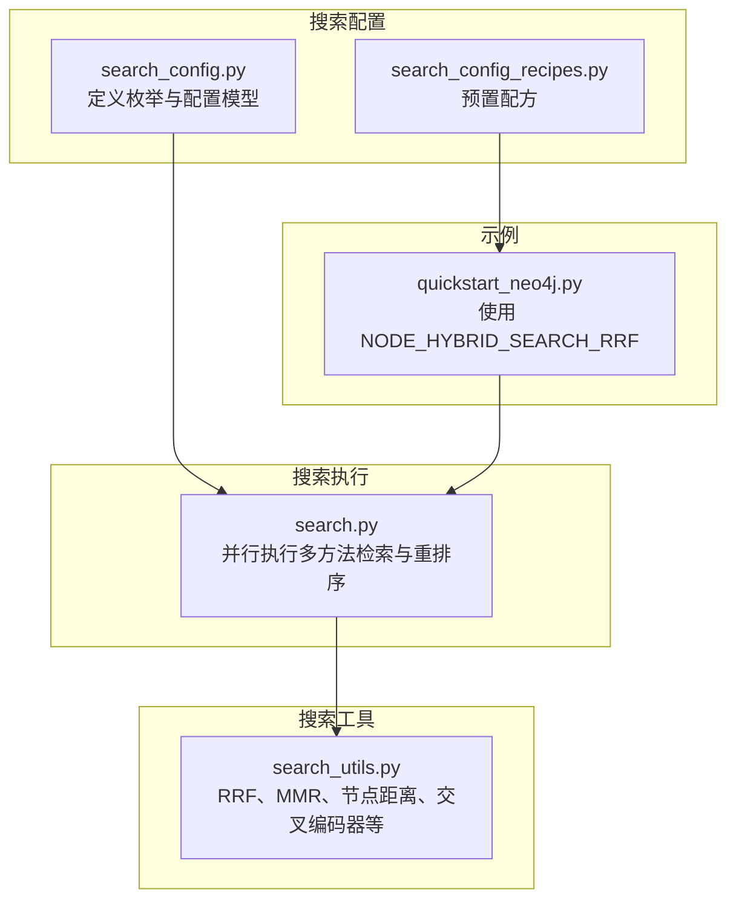
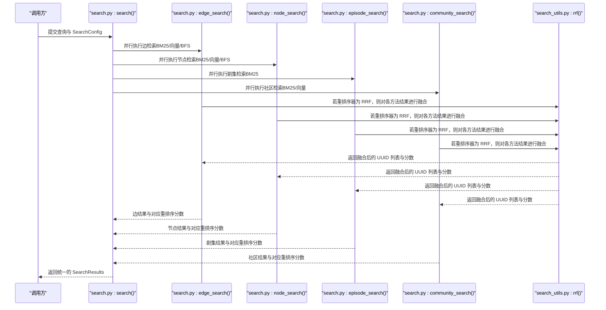
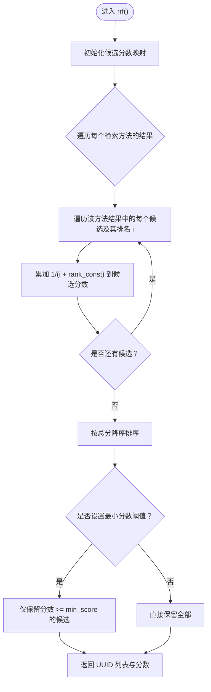
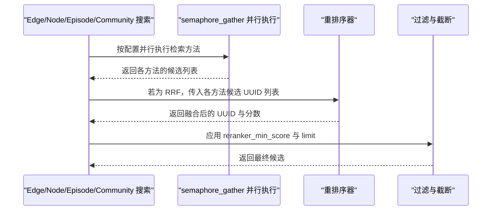
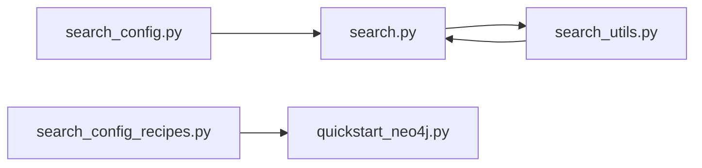

# 倒数排名融合 (RRF)

<cite>
**本文引用的文件**
- [search_config.py](file://graphiti_core/search/search_config.py)
- [search.py](file://graphiti_core/search/search.py)
- [search_utils.py](file://graphiti_core/search/search_utils.py)
- [search_config_recipes.py](file://graphiti_core/search/search_config_recipes.py)
- [quickstart_neo4j.py](file://examples/quickstart/quickstart_neo4j.py)
- [README.md](file://README.md)
</cite>

## 目录
1. [简介](#简介)
2. [项目结构](#项目结构)
3. [核心组件](#核心组件)
4. [架构总览](#架构总览)
5. [详细组件分析](#详细组件分析)
6. [依赖关系分析](#依赖关系分析)
7. [性能考量](#性能考量)
8. [故障排查指南](#故障排查指南)
9. [结论](#结论)
10. [附录](#附录)

## 简介
本文件系统性阐述倒数排名融合（Reciprocal Rank Fusion, RRF）在混合检索中的作用机制与工程实现，重点覆盖：
- RRF 如何将来自语义搜索、关键词搜索与图遍历等不同检索方法的结果进行融合，以提升整体相关性；
- 在 SearchConfig 中通过 NodeReranker、EdgeReranker 等枚举进行配置；
- 实际代码示例路径，展示如何启用与调整 RRF 参数；
- 数学原理、优势（无需归一化、鲁棒性强）以及在不同场景下的性能表现与适用性。

## 项目结构
围绕 RRF 的相关代码主要分布在以下模块：
- 搜索配置：定义节点/边/剧集/社区的检索方法与重排序器枚举，以及默认阈值与限制；
- 搜索执行：并行执行多种检索方法，按配置选择重排序策略（RRF、MMR、交叉编码器、节点距离等）；
- 搜索工具：包含 RRF 核心算法、MMR、节点距离重排序、交叉编码器调用等；
- 预置配方：提供开箱即用的混合检索配置（含 RRF）；
- 示例：快速开始示例展示了如何使用预置配方进行节点检索。

图表来源
- [search_config.py](file://graphiti_core/search/search_config.py#L53-L109)
- [search.py](file://graphiti_core/search/search.py#L68-L184)
- [search_utils.py](file://graphiti_core/search/search_utils.py#L1732-L1749)
- [search_config_recipes.py](file://graphiti_core/search/search_config_recipes.py#L33-L53)
- [quickstart_neo4j.py](file://examples/quickstart/quickstart_neo4j.py#L195-L209)

章节来源
- [search_config.py](file://graphiti_core/search/search_config.py#L53-L109)
- [search.py](file://graphiti_core/search/search.py#L68-L184)
- [search_utils.py](file://graphiti_core/search/search_utils.py#L1732-L1749)
- [search_config_recipes.py](file://graphiti_core/search/search_config_recipes.py#L33-L53)
- [quickstart_neo4j.py](file://examples/quickstart/quickstart_neo4j.py#L195-L209)

## 核心组件
- RRF 重排序器：对多个检索方法返回的候选列表进行融合，不依赖评分归一化，仅基于“倒数排名”的加权聚合；
- 检索方法与重排序器枚举：统一在配置中声明，支持 Node/Edge/Episode/Community 四类对象；
- 并行检索与重排序：根据配置并行执行 BM25、向量相似度、BFS 图遍历等方法，再按指定重排序器进行融合；
- 默认阈值与限制：包含最小相似度、MMR Lambda、最大搜索深度、默认返回数量等。

章节来源
- [search_config.py](file://graphiti_core/search/search_config.py#L53-L109)
- [search.py](file://graphiti_core/search/search.py#L186-L520)
- [search_utils.py](file://graphiti_core/search/search_utils.py#L1732-L1749)

## 架构总览
下图展示了混合检索与 RRF 融合的整体流程：查询进入后，按配置并行执行多种检索方法，随后根据重排序器（RRF 或其他）对候选进行融合与排序，最终输出统一的搜索结果对象。

图表来源
- [search.py](file://graphiti_core/search/search.py#L68-L184)
- [search.py](file://graphiti_core/search/search.py#L186-L520)
- [search_utils.py](file://graphiti_core/search/search_utils.py#L1732-L1749)

## 详细组件分析

### RRF 数学原理与实现
- 原理概述
  - 对每个候选对象，统计其在各检索方法结果列表中的排名；融合分数为所有方法对该对象排名贡献的倒数之和（常数通常取 60），最后按总分降序排序；
  - 该方法天然避免了不同检索方法评分尺度差异带来的影响，无需显式归一化；
  - 对噪声排名具有较强鲁棒性，因为单个方法的低质量排名会被其他方法拉回。
- 关键实现
  - 输入：多个检索方法返回的候选 UUID 列表；
  - 输出：融合后的 UUID 序列与对应分数；
  - 可选最小分数过滤：用于剔除低于阈值的候选，减少噪声输出。

图表来源
- [search_utils.py](file://graphiti_core/search/search_utils.py#L1732-L1749)

章节来源
- [search_utils.py](file://graphiti_core/search/search_utils.py#L1732-L1749)

### 检索配置与 RRF 启用方式
- 配置入口
  - SearchConfig：统一承载边、节点、剧集、社区的检索配置；
  - 各类 SearchConfig（Edge/Node/Episode/Community）均包含：
    - search_methods：可选 BM25、向量相似度、BFS；
    - reranker：可选 RRF、MMR、交叉编码器、节点距离、剧集提及次数等；
    - sim_min_score：向量相似度最小阈值；
    - mmr_lambda：MMR 的重要性系数；
    - bfs_max_depth：BFS 最大深度；
    - limit：默认返回数量；
    - reranker_min_score：重排序阶段的最小分数阈值。
- RRF 启用
  - 将 reranker 设置为 RRF 即可启用；
  - 可结合预置配方（如 NODE_HYBRID_SEARCH_RRF、EDGE_HYBRID_SEARCH_RRF、COMMUNITY_HYBRID_SEARCH_RRF）快速启用混合检索+RRF。

章节来源
- [search_config.py](file://graphiti_core/search/search_config.py#L53-L109)
- [search_config_recipes.py](file://graphiti_core/search/search_config_recipes.py#L33-L53)

### 搜索执行流程与 RRF 融合
- 并行检索
  - 按配置并行执行 BM25、向量相似度、BFS 等方法；
  - 对于节点/边/社区，若包含 BFS 且未指定起点，会自动从已有结果中提取起点再次执行 BFS；
  - 执行完成后，将各方法结果合并为候选集合。
- 重排序
  - 当 reranker 为 RRF 时，调用 rrf() 进行融合；
  - 其他重排序器（MMR、交叉编码器、节点距离、剧集提及次数）在相应分支中处理；
  - 最终截断到 limit，并应用 reranker_min_score 过滤。

图表来源
- [search.py](file://graphiti_core/search/search.py#L186-L520)
- [search_utils.py](file://graphiti_core/search/search_utils.py#L1732-L1749)

章节来源
- [search.py](file://graphiti_core/search/search.py#L186-L520)

### 示例：启用 RRF 的实际代码路径
- 使用预置配方进行节点检索（启用 RRF）
  - 示例路径：[quickstart_neo4j.py](file://examples/quickstart/quickstart_neo4j.py#L195-L209)
  - 步骤要点：
    - 复制预置配方 NODE_HYBRID_SEARCH_RRF；
    - 调整 limit；
    - 通过 _search 方法执行，内部按配置并行检索与 RRF 融合。

章节来源
- [quickstart_neo4j.py](file://examples/quickstart/quickstart_neo4j.py#L195-L209)

### RRF 的优势与适用性
- 优势
  - 不依赖评分归一化：RRF 仅使用排名信息，天然避免不同检索方法评分尺度差异；
  - 鲁棒性强：对个别方法的噪声排名不敏感，整体排序更稳定；
  - 易于扩展：新增检索方法只需将其结果列表加入融合即可。
- 适用场景
  - 多源检索（BM25、向量、BFS）融合，提升召回多样性与稳定性；
  - 对评分尺度不一致或难以归一化的场景尤为有效；
  - 作为默认重排序策略时，能显著降低人工调参成本。
- 局限性
  - 无法引入外部相关性信号（如交叉编码器的细粒度打分）；
  - 在极端稀疏或冷启动场景，可能不如基于语义的 MMR 或交叉编码器精细；
  - rank_const 与 reranker_min_score 需要结合业务数据经验进行调优。

章节来源
- [search_utils.py](file://graphiti_core/search/search_utils.py#L1732-L1749)
- [README.md](file://README.md#L100-L110)

## 依赖关系分析
- 组件耦合
  - search.py 依赖 search_config.py 的枚举与配置模型；
  - search.py 依赖 search_utils.py 的 rrf、MMR、节点距离、交叉编码器等重排序器；
  - search_config_recipes.py 依赖 search_config.py 的枚举与配置类；
  - 示例 quickstart_neo4j.py 依赖 search_config_recipes.py 的预置配方。
- 关键依赖链
  - SearchConfig → 检索配置 → 并行检索 → 重排序器 → 结果输出；
  - RRF 作为通用融合器，被 Node/Edge/Episode/Community 的搜索分支复用。

图表来源
- [search_config.py](file://graphiti_core/search/search_config.py#L53-L109)
- [search.py](file://graphiti_core/search/search.py#L68-L184)
- [search_utils.py](file://graphiti_core/search/search_utils.py#L1732-L1749)
- [search_config_recipes.py](file://graphiti_core/search/search_config_recipes.py#L33-L53)
- [quickstart_neo4j.py](file://examples/quickstart/quickstart_neo4j.py#L195-L209)

章节来源
- [search_config.py](file://graphiti_core/search/search_config.py#L53-L109)
- [search.py](file://graphiti_core/search/search.py#L68-L184)
- [search_utils.py](file://graphiti_core/search/search_utils.py#L1732-L1749)
- [search_config_recipes.py](file://graphiti_core/search/search_config_recipes.py#L33-L53)
- [quickstart_neo4j.py](file://examples/quickstart/quickstart_neo4j.py#L195-L209)

## 性能考量
- 并行执行
  - search.py 使用并发机制并行执行多种检索方法，显著降低端到端延迟；
  - RRF 本身为线性复杂度（对每个候选在各方法结果中计数一次），在合理 limit 下开销可控。
- 重排序阶段
  - RRF 的时间复杂度约为 O(N × M)，其中 N 为候选总数，M 为方法数量；
  - 可通过 reranker_min_score 与 limit 控制候选规模，平衡精度与性能。
- 与其他重排序器对比
  - MMR 需要计算相似度矩阵，复杂度更高，适合对语义相关性要求更高的场景；
  - 交叉编码器重排序器依赖外部模型，延迟与吞吐取决于外部服务。

章节来源
- [search.py](file://graphiti_core/search/search.py#L68-L184)
- [search_utils.py](file://graphiti_core/search/search_utils.py#L1838-L1876)

## 故障排查指南
- 常见问题
  - 查询为空：返回空结果；
  - 未配置检索方法：对应类型返回空；
  - RRF 无效果：确认各方法返回的候选列表非空，且 reranker 设为 RRF；
  - 节点距离重排序报错：当使用节点距离重排序但未提供中心节点时会抛出错误；
  - 交叉编码器重排序：需确保已配置交叉编码器客户端。
- 排查建议
  - 检查 SearchConfig 的 reranker 与 search_methods 是否符合预期；
  - 适当提高 reranker_min_score 以减少噪声；
  - 在高并发场景下关注外部服务（如交叉编码器）的可用性与延迟。

章节来源
- [search.py](file://graphiti_core/search/search.py#L85-L110)
- [search.py](file://graphiti_core/search/search.py#L277-L301)
- [search.py](file://graphiti_core/search/search.py#L405-L413)

## 结论
RRF 作为一种简单而强大的融合策略，在 Graphiti 的混合检索中扮演关键角色。它通过“倒数排名”聚合多源检索结果，天然规避评分尺度差异，具备良好的鲁棒性与易用性。结合预置配方与灵活的配置项，用户可在不牺牲性能的前提下获得稳定、可扩展的检索体验。对于需要细粒度相关性打分的场景，可考虑与交叉编码器或 MMR 等策略组合使用，以进一步提升召回质量。

## 附录
- 快速开始示例中使用 RRF 的参考路径
  - [quickstart_neo4j.py](file://examples/quickstart/quickstart_neo4j.py#L195-L209)
- 预置配方（RRF）
  - [search_config_recipes.py](file://graphiti_core/search/search_config_recipes.py#L33-L53)
- RRF 核心实现
  - [search_utils.py](file://graphiti_core/search/search_utils.py#L1732-L1749)